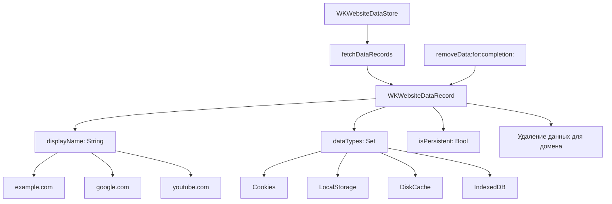

#WKWebsiteDataRecord #WebKit #iOS #Swift #DataPersistence #Cache #Cookies #LocalStorage #DomainData #DataManagement

---
**(запись данных веб-сайта / информация о хранимых данных домена)**

**WKWebsiteDataRecord** — это класс из фреймворка **[[WebKit]]**, который представляет собой **запись о данных**, хранящихся для конкретного веб-сайта (домена) в `WKWebsiteDataStore`. Он содержит информацию о том, какие типы данных (куки, localStorage, кэш и т.д.) хранятся для данного домена, и используется для **управления и очистки** этих данных.

**Ключевые особенности (важно в 2026):**
- Представляет данные для **одного домена** (например, `example.com`)
- Содержит информацию о **типах хранимых данных**
- Позволяет **выборочно удалять** данные для конкретного домена
- Используется вместе с [[WKWebsiteDataStore]] для управления хранилищем
- Доступен с **iOS 9**

---

### Основные свойства WKWebsiteDataRecord

| Свойство | Тип | Назначение |
|----------|-----|------------|
| `displayName` | `String` | Имя домена (например, "example.com") |
| `dataTypes` | `Set<String>` | Набор типов данных, хранящихся для этого домена |
| `isPersistent` | `Bool` | Является ли запись постоянной (из `.default()`) или временной (из `.nonPersistent()`) |

**Типы данных (WKWebsiteDataType)**:
```swift
// Доступные типы данных
WKWebsiteDataTypeCookies           // HTTP куки
WKWebsiteDataTypeDiskCache         // Дисковый кэш
WKWebsiteDataTypeMemoryCache       // Кэш в памяти
WKWebsiteDataTypeLocalStorage      // localStorage
WKWebsiteDataTypeSessionStorage    // sessionStorage
WKWebsiteDataTypeIndexedDB         // IndexedDB базы данных
WKWebsiteDataTypeWebSQL           // WebSQL базы данных
WKWebsiteDataTypeOfflineWebApplicationCache // Офлайн-кэш
```

---

### Схема взаимосвязей



---

### Примеры (от простого к сложному)

#### 1. Получение всех записей данных
```swift
import UIKit
import WebKit

class BasicDataRecordViewController: UIViewController {
    
    private let dataStore = WKWebsiteDataStore.default()
    
    override func viewDidLoad() {
        super.viewDidLoad()
        
        // 1. Получаем все типы данных
        let dataTypes = WKWebsiteDataStore.allWebsiteDataTypes()
        
        // 2. Запрашиваем записи
        dataStore.fetchDataRecords(ofTypes: dataTypes) { records in
            print("📊 Найдено записей: \(records.count)")
            
            for record in records {
                print("📁 Домен: \(record.displayName)")
                print("   Типы данных: \(record.dataTypes)")
                print("   Постоянное: \(record.isPersistent)")
                print("   ---")
            }
        }
    }
}
```

#### 2. Фильтрация записей по типам данных
```swift
class FilteredRecordsViewController: UIViewController {
    
    private let dataStore = WKWebsiteDataStore.default()
    
    override func viewDidLoad() {
        super.viewDidLoad()
        
        // 1. Получаем только записи с куками
        let cookieTypes: Set<String> = [WKWebsiteDataTypeCookies]
        dataStore.fetchDataRecords(ofTypes: cookieTypes) { records in
            print("🍪 Записи с куками: \(records.count)")
            for record in records {
                print("  \(record.displayName) имеет куки")
            }
        }
        
        // 2. Получаем записи с localStorage
        let storageTypes: Set<String> = [WKWebsiteDataTypeLocalStorage]
        dataStore.fetchDataRecords(ofTypes: storageTypes) { records in
            print("💾 Записи с localStorage: \(records.count)")
            for record in records {
                print("  \(record.displayName) имеет localStorage")
            }
        }
        
        // 3. Получаем записи с кэшем
        let cacheTypes: Set<String> = [WKWebsiteDataTypeDiskCache, WKWebsiteDataTypeMemoryCache]
        dataStore.fetchDataRecords(ofTypes: cacheTypes) { records in
            print("📦 Записи с кэшем: \(records.count)")
            for record in records {
                print("  \(record.displayName) имеет кэш")
            }
        }
        
        // 4. Получаем записи с IndexedDB
        let indexedDBTypes: Set<String> = [WKWebsiteDataTypeIndexedDB]
        dataStore.fetchDataRecords(ofTypes: indexedDBTypes) { records in
            print("🗄️ Записи с IndexedDB: \(records.count)")
            for record in records {
                print("  \(record.displayName) имеет IndexedDB")
            }
        }
    }
}
```

#### 3. Поиск записи для конкретного домена
```swift
class FindDomainRecordViewController: UIViewController {
    
    private let dataStore = WKWebsiteDataStore.default()
    
    override func viewDidLoad() {
        super.viewDidLoad()
        
        let targetDomain = "example.com"
        findRecord(for: targetDomain)
    }
    
    private func findRecord(for domain: String) {
        let dataTypes = WKWebsiteDataStore.allWebsiteDataTypes()
        
        dataStore.fetchDataRecords(ofTypes: dataTypes) { records in
            // 1. Ищем запись для нужного домена
            if let record = records.first(where: { $0.displayName == domain }) {
                print("✅ Найдена запись для \(domain):")
                print("  Типы данных: \(record.dataTypes)")
                print("  Постоянное: \(record.isPersistent)")
                
                // 2. Проверяем, какие данные хранятся
                self.checkDataTypes(record)
            } else {
                print("⚠️ Запись для \(domain) не найдена")
            }
        }
    }
    
    private func checkDataTypes(_ record: WKWebsiteDataRecord) {
        let types = record.dataTypes
        
        if types.contains(WKWebsiteDataTypeCookies) {
            print("  ✅ Есть куки")
        }
        if types.contains(WKWebsiteDataTypeLocalStorage) {
            print("  ✅ Есть localStorage")
        }
        if types.contains(WKWebsiteDataTypeDiskCache) {
            print("  ✅ Есть дисковый кэш")
        }
        if types.contains(WKWebsiteDataTypeIndexedDB) {
            print("  ✅ Есть IndexedDB")
        }
    }
}
```

#### 4. Удаление данных для конкретной записи
```swift
class DeleteRecordViewController: UIViewController {
    
    private let dataStore = WKWebsiteDataStore.default()
    
    @objc private func deleteDataForDomain(_ domain: String) {
        let dataTypes = WKWebsiteDataStore.allWebsiteDataTypes()
        
        // 1. Находим запись
        dataStore.fetchDataRecords(ofTypes: dataTypes) { [weak self] records in
            guard let self = self else { return }
            
            let recordsToDelete = records.filter { $0.displayName == domain }
            
            guard !recordsToDelete.isEmpty else {
                print("⚠️ Нет данных для \(domain)")
                return
            }
            
            // 2. Удаляем все типы данных для записи
            self.dataStore.removeData(ofTypes: dataTypes, 
                                       for: recordsToDelete) {
                print("✅ Удалены данные для \(domain)")
                
                // 3. Проверяем результат
                self.dataStore.fetchDataRecords(ofTypes: dataTypes) { remainingRecords in
                    let stillExists = remainingRecords.contains { $0.displayName == domain }
                    if stillExists {
                        print("⚠️ Данные для \(domain) всё ещё существуют")
                    } else {
                        print("✅ Данные для \(domain) полностью удалены")
                    }
                }
            }
        }
    }
}
```

#### 5. Выборочное удаление данных по типам для записи
```swift
class SelectiveDeleteViewController: UIViewController {
    
    private let dataStore = WKWebsiteDataStore.default()
    
    @objc private func deleteCookiesOnly(for domain: String) {
        let dataTypes = WKWebsiteDataStore.allWebsiteDataTypes()
        
        dataStore.fetchDataRecords(ofTypes: dataTypes) { [weak self] records in
            guard let self = self else { return }
            
            let recordsToDelete = records.filter { $0.displayName == domain }
            
            guard !recordsToDelete.isEmpty else {
                print("⚠️ Нет данных для \(domain)")
                return
            }
            
            // Удаляем ТОЛЬКО куки для этого домена
            let cookieTypes: Set<String> = [WKWebsiteDataTypeCookies]
            self.dataStore.removeData(ofTypes: cookieTypes, 
                                       for: recordsToDelete) {
                print("🍪 Удалены куки для \(domain)")
            }
        }
    }
    
    @objc private func deleteCacheOnly(for domain: String) {
        let dataTypes = WKWebsiteDataStore.allWebsiteDataTypes()
        
        dataStore.fetchDataRecords(ofTypes: dataTypes) { [weak self] records in
            guard let self = self else { return }
            
            let recordsToDelete = records.filter { $0.displayName == domain }
            
            guard !recordsToDelete.isEmpty else {
                print("⚠️ Нет данных для \(domain)")
                return
            }
            
            // Удаляем ТОЛЬКО кэш для этого домена
            let cacheTypes: Set<String> = [WKWebsiteDataTypeDiskCache, WKWebsiteDataTypeMemoryCache]
            self.dataStore.removeData(ofTypes: cacheTypes, 
                                       for: recordsToDelete) {
                print("📦 Удалён кэш для \(domain)")
            }
        }
    }
}
```

#### 6. Получение информации о всех доменах с данными
```swift
class DomainInfoViewController: UIViewController {
    
    private let dataStore = WKWebsiteDataStore.default()
    private var records: [WKWebsiteDataRecord] = []
    
    override func viewDidLoad() {
        super.viewDidLoad()
        loadDataRecords()
    }
    
    private func loadDataRecords() {
        let dataTypes = WKWebsiteDataStore.allWebsiteDataTypes()
        
        dataStore.fetchDataRecords(ofTypes: dataTypes) { [weak self] records in
            self?.records = records
            self?.displayDomainInfo()
        }
    }
    
    private func displayDomainInfo() {
        print("📊 Информация о доменах:")
        print("   Всего доменов: \(records.count)")
        print("")
        
        // Группируем по типам данных
        var domainsWithCookies: [String] = []
        var domainsWithStorage: [String] = []
        var domainsWithCache: [String] = []
        var domainsWithIndexedDB: [String] = []
        
        for record in records {
            let domain = record.displayName
            
            if record.dataTypes.contains(WKWebsiteDataTypeCookies) {
                domainsWithCookies.append(domain)
            }
            if record.dataTypes.contains(WKWebsiteDataTypeLocalStorage) ||
               record.dataTypes.contains(WKWebsiteDataTypeSessionStorage) {
                domainsWithStorage.append(domain)
            }
            if record.dataTypes.contains(WKWebsiteDataTypeDiskCache) ||
               record.dataTypes.contains(WKWebsiteDataTypeMemoryCache) {
                domainsWithCache.append(domain)
            }
            if record.dataTypes.contains(WKWebsiteDataTypeIndexedDB) {
                domainsWithIndexedDB.append(domain)
            }
        }
        
        print("🍪 Домены с куками: \(domainsWithCookies.count)")
        domainsWithCookies.forEach { print("   - \($0)") }
        
        print("\n💾 Домены с localStorage: \(domainsWithStorage.count)")
        domainsWithStorage.forEach { print("   - \($0)") }
        
        print("\n📦 Домены с кэшем: \(domainsWithCache.count)")
        domainsWithCache.forEach { print("   - \($0)") }
        
        print("\n🗄️ Домены с IndexedDB: \(domainsWithIndexedDB.count)")
        domainsWithIndexedDB.forEach { print("   - \($0)") }
    }
}
```

#### 7. Сравнение записей из постоянного и временного хранилищ
```swift
class CompareDataStoresViewController: UIViewController {
    
    override func viewDidLoad() {
        super.viewDidLoad()
        
        let defaultStore = WKWebsiteDataStore.default()
        let nonPersistentStore = WKWebsiteDataStore.nonPersistent()
        
        let dataTypes = WKWebsiteDataStore.allWebsiteDataTypes()
        
        // 1. Записи из постоянного хранилища
        defaultStore.fetchDataRecords(ofTypes: dataTypes) { defaultRecords in
            print("📁 Постоянное хранилище:")
            print("   Записей: \(defaultRecords.count)")
            for record in defaultRecords {
                print("   - \(record.displayName) [persistent: \(record.isPersistent)]")
            }
        }
        
        // 2. Записи из временного хранилища
        nonPersistentStore.fetchDataRecords(ofTypes: dataTypes) { nonPersistentRecords in
            print("\n📁 Временное хранилище:")
            print("   Записей: \(nonPersistentRecords.count)")
            for record in nonPersistentRecords {
                print("   - \(record.displayName) [persistent: \(record.isPersistent)]")
            }
        }
        
        // 3. Сравнение
        DispatchQueue.main.asyncAfter(deadline: .now() + 1) {
            // Временное хранилище обычно пустое или содержит меньше записей
            print("\n🔍 Обратите внимание: временное хранилище не сохраняет данные")
        }
    }
}
```

#### 8. Очистка данных для нескольких доменов
```swift
class BulkDeleteViewController: UIViewController {
    
    private let dataStore = WKWebsiteDataStore.default()
    
    @objc private func deleteMultipleDomains(_ domains: [String]) {
        let dataTypes = WKWebsiteDataStore.allWebsiteDataTypes()
        
        dataStore.fetchDataRecords(ofTypes: dataTypes) { [weak self] records in
            guard let self = self else { return }
            
            // 1. Находим записи для указанных доменов
            let recordsToDelete = records.filter { domains.contains($0.displayName) }
            
            guard !recordsToDelete.isEmpty else {
                print("⚠️ Нет данных для указанных доменов")
                return
            }
            
            print("🗑️ Будет удалено \(recordsToDelete.count) записей")
            
            // 2. Удаляем все данные для найденных записей
            self.dataStore.removeData(ofTypes: dataTypes, 
                                       for: recordsToDelete) {
                print("✅ Данные для \(recordsToDelete.count) доменов удалены")
                
                // 3. Проверяем результат
                self.dataStore.fetchDataRecords(ofTypes: dataTypes) { remainingRecords in
                    let remainingDomains = remainingRecords.map { $0.displayName }
                    let deletedDomains = domains.filter { !remainingDomains.contains($0) }
                    
                    print("✅ Удалены домены: \(deletedDomains.joined(separator: ", "))")
                }
            }
        }
    }
}
```

#### 9. Мониторинг изменений в хранилище
```swift
class DataStoreMonitor: NSObject {
    
    private let dataStore = WKWebsiteDataStore.default()
    private var previousRecords: [WKWebsiteDataRecord] = []
    
    override init() {
        super.init()
        startMonitoring()
    }
    
    func startMonitoring() {
        // Периодическая проверка изменений
        Timer.scheduledTimer(withTimeInterval: 5.0, repeats: true) { [weak self] _ in
            self?.checkForChanges()
        }
    }
    
    private func checkForChanges() {
        let dataTypes = WKWebsiteDataStore.allWebsiteDataTypes()
        
        dataStore.fetchDataRecords(ofTypes: dataTypes) { [weak self] currentRecords in
            guard let self = self else { return }
            
            // Сравниваем с предыдущим состоянием
            let previousDomains = Set(self.previousRecords.map { $0.displayName })
            let currentDomains = Set(currentRecords.map { $0.displayName })
            
            let addedDomains = currentDomains.subtracting(previousDomains)
            let removedDomains = previousDomains.subtracting(currentDomains)
            
            if !addedDomains.isEmpty {
                print("➕ Добавлены домены: \(addedDomains.joined(separator: ", "))")
            }
            
            if !removedDomains.isEmpty {
                print("➖ Удалены домены: \(removedDomains.joined(separator: ", "))")
            }
            
            // Обновляем состояние
            self.previousRecords = currentRecords
        }
    }
    
    func getCurrentRecords() -> [WKWebsiteDataRecord] {
        return previousRecords
    }
}

// Использование
class MonitoringViewController: UIViewController {
    
    private let monitor = DataStoreMonitor()
    
    override func viewDidLoad() {
        super.viewDidLoad()
        
        // Мониторинг запущен автоматически
        print("📊 Мониторинг хранилища запущен")
        
        // Можно получить текущие записи
        let records = monitor.getCurrentRecords()
        print("📁 Текущих записей: \(records.count)")
    }
}
```

#### 10. Полный менеджер с поддержкой WKWebsiteDataRecord
```swift
class WebsiteRecordManager {
    static let shared = WebsiteRecordManager()
    private let dataStore = WKWebsiteDataStore.default()
    
    private init() {}
    
    // MARK: - Получение записей
    
    func getAllRecords(completion: @escaping ([WKWebsiteDataRecord]) -> Void) {
        let types = WKWebsiteDataStore.allWebsiteDataTypes()
        dataStore.fetchDataRecords(ofTypes: types) { records in
            completion(records)
        }
    }
    
    func getRecords(withTypes types: Set<String>, 
                    completion: @escaping ([WKWebsiteDataRecord]) -> Void) {
        dataStore.fetchDataRecords(ofTypes: types) { records in
            completion(records)
        }
    }
    
    func getRecord(for domain: String, 
                   completion: @escaping (WKWebsiteDataRecord?) -> Void) {
        let types = WKWebsiteDataStore.allWebsiteDataTypes()
        dataStore.fetchDataRecords(ofTypes: types) { records in
            let record = records.first { $0.displayName == domain }
            completion(record)
        }
    }
    
    // MARK: - Анализ записей
    
    func getDomainsWithCookies(completion: @escaping ([String]) -> Void) {
        let types: Set<String> = [WKWebsiteDataTypeCookies]
        dataStore.fetchDataRecords(ofTypes: types) { records in
            let domains = records.map { $0.displayName }
            completion(domains)
        }
    }
    
    func getDomainsWithStorage(completion: @escaping ([String]) -> Void) {
        let types: Set<String> = [WKWebsiteDataTypeLocalStorage, WKWebsiteDataTypeSessionStorage]
        dataStore.fetchDataRecords(ofTypes: types) { records in
            let domains = records.map { $0.displayName }
            completion(domains)
        }
    }
    
    func getDomainsWithCache(completion: @escaping ([String]) -> Void) {
        let types: Set<String> = [WKWebsiteDataTypeDiskCache, WKWebsiteDataTypeMemoryCache]
        dataStore.fetchDataRecords(ofTypes: types) { records in
            let domains = records.map { $0.displayName }
            completion(domains)
        }
    }
    
    // MARK: - Удаление
    
    func deleteRecord(for domain: String, 
                      ofTypes types: Set<String>? = nil,
                      completion: @escaping (Bool) -> Void) {
        let dataTypes = types ?? WKWebsiteDataStore.allWebsiteDataTypes()
        
        dataStore.fetchDataRecords(ofTypes: dataTypes) { [weak self] records in
            guard let self = self else { return }
            
            let recordsToDelete = records.filter { $0.displayName == domain }
            
            guard !recordsToDelete.isEmpty else {
                completion(false)
                return
            }
            
            self.dataStore.removeData(ofTypes: dataTypes, for: recordsToDelete) {
                print("✅ Удалена запись для \(domain)")
                completion(true)
            }
        }
    }
    
    func deleteAllRecords(completion: @escaping () -> Void) {
        let types = WKWebsiteDataStore.allWebsiteDataTypes()
        let date = Date(timeIntervalSince1970: 0)
        
        dataStore.removeData(ofTypes: types, modifiedSince: date) {
            print("🗑️ Все записи удалены")
            completion()
        }
    }
    
    // MARK: - Информация
    
    func printRecordInfo(_ record: WKWebsiteDataRecord) {
        print("📁 Домен: \(record.displayName)")
        print("   Постоянное: \(record.isPersistent)")
        print("   Типы данных:")
        
        let types = record.dataTypes
        if types.contains(WKWebsiteDataTypeCookies) {
            print("     - Cookies")
        }
        if types.contains(WKWebsiteDataTypeDiskCache) {
            print("     - Disk Cache")
        }
        if types.contains(WKWebsiteDataTypeMemoryCache) {
            print("     - Memory Cache")
        }
        if types.contains(WKWebsiteDataTypeLocalStorage) {
            print("     - Local Storage")
        }
        if types.contains(WKWebsiteDataTypeSessionStorage) {
            print("     - Session Storage")
        }
        if types.contains(WKWebsiteDataTypeIndexedDB) {
            print("     - IndexedDB")
        }
        if types.contains(WKWebsiteDataTypeWebSQL) {
            print("     - WebSQL")
        }
        if types.contains(WKWebsiteDataTypeOfflineWebApplicationCache) {
            print("     - Offline Cache")
        }
    }
    
    func printAllRecords() {
        getAllRecords { records in
            print("📊 Всего записей: \(records.count)")
            for record in records {
                self.printRecordInfo(record)
                print("   ---")
            }
        }
    }
}

// Использование
class RecordManagerViewController: UIViewController {
    
    override func viewDidLoad() {
        super.viewDidLoad()
        
        let manager = WebsiteRecordManager.shared
        
        // 1. Выводим все записи
        manager.printAllRecords()
        
        // 2. Получаем домены с куками
        manager.getDomainsWithCookies { domains in
            print("🍪 Домены с куками: \(domains)")
        }
        
        // 3. Получаем информацию о конкретном домене
        manager.getRecord(for: "example.com") { record in
            if let record = record {
                manager.printRecordInfo(record)
            } else {
                print("⚠️ Запись не найдена")
            }
        }
    }
}
```

#### 11. Обработка ошибок при работе с записями
```swift
class ErrorHandlingRecordViewController: UIViewController {
    
    private let dataStore = WKWebsiteDataStore.default()
    
    @objc private func safeDeleteRecord(for domain: String) {
        let dataTypes = WKWebsiteDataStore.allWebsiteDataTypes()
        
        // 1. Проверяем существование записи
        dataStore.fetchDataRecords(ofTypes: dataTypes) { [weak self] records in
            guard let self = self else { return }
            
            let recordsToDelete = records.filter { $0.displayName == domain }
            
            if recordsToDelete.isEmpty {
                print("⚠️ Запись для \(domain) не найдена")
                self.showAlert(message: "Данные для \(domain) не найдены")
                return
            }
            
            // 2. Проверяем, является ли запись постоянной
            let persistentRecords = recordsToDelete.filter { $0.isPersistent }
            if persistentRecords.isEmpty {
                print("⚠️ Запись является временной (не сохраняется)")
            }
            
            // 3. Удаляем данные
            self.dataStore.removeData(ofTypes: dataTypes, for: recordsToDelete) {
                print("✅ Данные для \(domain) удалены")
                self.showAlert(message: "Данные для \(domain) успешно удалены")
                
                // 4. Проверяем результат
                self.dataStore.fetchDataRecords(ofTypes: dataTypes) { remainingRecords in
                    let stillExists = remainingRecords.contains { $0.displayName == domain }
                    if stillExists {
                        print("⚠️ Данные для \(domain) всё ещё существуют")
                    }
                }
            }
        }
    }
    
    private func showAlert(message: String) {
        let alert = UIAlertController(title: "Результат", 
                                      message: message, 
                                      preferredStyle: .alert)
        alert.addAction(UIAlertAction(title: "OK", style: .default))
        present(alert, animated: true)
    }
}
```

---

### Важные нюансы 2026 года

> [!warning]
> **Асинхронность:** Все методы получения и удаления записей работают асинхронно. Всегда используйте completion-блоки.
> 
> **Отсутствие размера:** `WKWebsiteDataRecord` не предоставляет информацию о размере данных. Для получения размера используйте другие методы.
> 
> **Удаление:** При удалении данных через `removeData(ofTypes:for:)` удаляются только указанные типы данных для записей.
> 
> **Дублирование:** Один домен может иметь несколько записей с разными типами данных.
> 
> **Временные записи:** Записи из `.nonPersistent()` хранятся только в памяти и не сохраняются после уничтожения webView.

---

### Лучшие практики 2026

1. **Всегда проверяйте существование записи** перед удалением
2. **Используйте фильтрацию** для получения только нужных типов данных
3. **Проверяйте `isPersistent`** для определения, сохраняются ли данные
4. **Обрабатывайте ошибки** при работе с асинхронными методами
5. **Используйте группировку** для анализа данных по типам
6. **Логируйте операции** для отладки
7. **Периодически проверяйте** состояние хранилища

---

### Связь с другими темами

- [[WKWebsiteDataStore]] — хранилище данных
- [[WKHTTPCookieStore]] — управление куками
- [[WKWebView]] — использование хранилища
- [[WKWebViewConfiguration]] — передача dataStore
- [[HTTPCookie]] — объекты кук
- [[WKPreferences]] — настройки webView