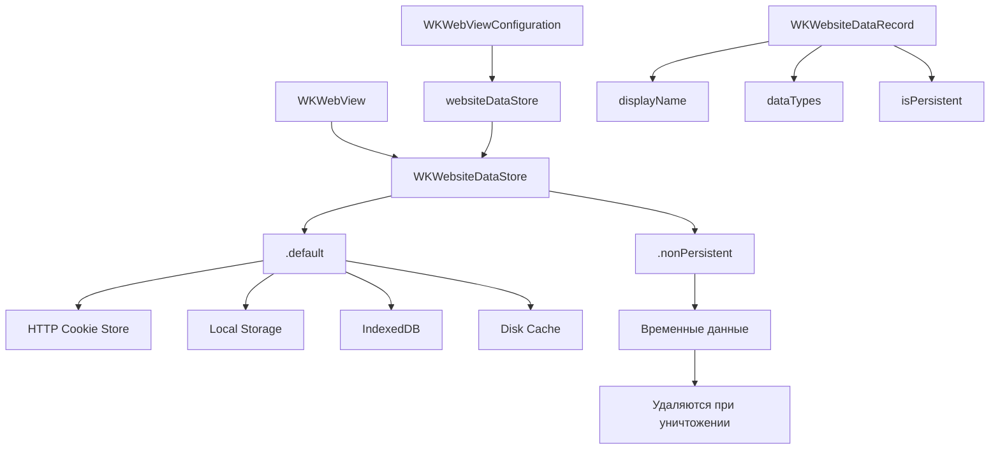

#WKWebsiteDataStore #WebKit #iOS #Swift #DataPersistence #Cache #Cookies #LocalStorage #SessionManagement #WebContent

---
**(хранилище данных веб-сайта / управление постоянными данными в [[WKWebView]])**

**WKWebsiteDataStore** — это класс из фреймворка **[[WebKit]]**, который управляет **постоянными и временными данными** для `WKWebView`: куки, кэш, локальное хранилище (`localStorage`), индексные базы данных (`IndexedDB`) и файлы кэша. Он позволяет изолировать, очищать и управлять данными веб-сайтов в вашем приложении.

**Ключевые особенности (важно в 2026):**
- Каждый `WKWebView` использует `WKWebsiteDataStore` для хранения данных
- Существует **два типа** хранилищ: **постоянное** (`.default()`) и **временное** (`.nonPersistent()`)
- Позволяет **очищать данные** для отдельных доменов или всех сайтов
- Управляет **куками** через `WKHTTPCookieStore`
- Доступен с **iOS 9**, но активно развивается в новых версиях

---

### Основные свойства и методы WKWebsiteDataStore

| Компонент | Тип | Назначение |
|-----------|-----|------------|
| `default()` | `WKWebsiteDataStore` | Основное постоянное хранилище (данные сохраняются между сессиями) |
| `nonPersistent()` | `WKWebsiteDataStore` | Временное хранилище (данные удаляются при уничтожении) |
| `httpCookieStore` | `WKHTTPCookieStore` | Хранилище HTTP-кук |
| `fetchDataRecords(ofTypes:completionHandler:)` | `[WKWebsiteDataRecord]` | Получение списка записей данных для доменов |
| `removeData(ofTypes:modifiedSince:completionHandler:)` | `()` | Удаление данных по типам и дате модификации |
| `removeData(ofTypes:for:completionHandler:)` | `()` | Удаление данных для конкретной записи |
| `isPersistent` | `Bool` | `true` для постоянного хранилища |

**Типы данных (WKWebsiteDataType)**:
- `WKWebsiteDataTypeCookies` — куки
- `WKWebsiteDataTypeDiskCache` — дисковый кэш
- `WKWebsiteDataTypeMemoryCache` — кэш в памяти
- `WKWebsiteDataTypeLocalStorage` — `localStorage`
- `WKWebsiteDataTypeSessionStorage` — `sessionStorage`
- `WKWebsiteDataTypeIndexedDB` — `IndexedDB` базы данных
- `WKWebsiteDataTypeWebSQL` — WebSQL базы данных
- `WKWebsiteDataTypeOfflineWebApplicationCache` — офлайн-кэш

---

### Схема взаимосвязей



---

### Примеры (от простого к сложному)

#### 1. Базовое использование (постоянное хранилище)
```swift
import UIKit
import WebKit

class BasicDataStoreViewController: UIViewController {
    
    private var webView: WKWebView!
    
    override func viewDidLoad() {
        super.viewDidLoad()
        
        // 1. Используем постоянное хранилище по умолчанию
        let dataStore = WKWebsiteDataStore.default()
        
        let config = WKWebViewConfiguration()
        config.websiteDataStore = dataStore
        
        webView = WKWebView(frame: view.bounds, configuration: config)
        view.addSubview(webView)
        
        // 2. Данные (куки, localStorage) будут сохраняться
        if let url = URL(string: "https://example.com") {
            webView.load(URLRequest(url: url))
        }
    }
}
```

#### 2. Временное хранилище (не сохраняет данные)
```swift
class NonPersistentDataStoreViewController: UIViewController {
    
    private var webView: WKWebView!
    
    override func viewDidLoad() {
        super.viewDidLoad()
        
        // 1. Используем временное хранилище (in-memory)
        let dataStore = WKWebsiteDataStore.nonPersistent()
        
        let config = WKWebViewConfiguration()
        config.websiteDataStore = dataStore
        
        webView = WKWebView(frame: view.bounds, configuration: config)
        view.addSubview(webView)
        
        // 2. Данные не сохраняются между сессиями
        // (куки, localStorage, кэш удаляются при уничтожении webView)
        if let url = URL(string: "https://example.com") {
            webView.load(URLRequest(url: url))
        }
    }
}
```

#### 3. Получение всех записей данных
```swift
class FetchDataRecordsViewController: UIViewController {
    
    override func viewDidLoad() {
        super.viewDidLoad()
        
        let dataStore = WKWebsiteDataStore.default()
        
        // 1. Получаем все типы данных
        let dataTypes = WKWebsiteDataStore.allWebsiteDataTypes()
        
        // 2. Запрашиваем записи
        dataStore.fetchDataRecords(ofTypes: dataTypes) { records in
            print("📊 Найдено записей: \(records.count)")
            
            for record in records {
                print("  📁 Домен: \(record.displayName)")
                print("     Типы данных: \(record.dataTypes)")
                print("     Постоянное: \(record.isPersistent)")
                print("     ---")
            }
        }
    }
}
```

#### 4. Очистка всех данных
```swift
class ClearAllDataViewController: UIViewController {
    
    private var webView: WKWebView!
    private let dataStore = WKWebsiteDataStore.default()
    
    override func viewDidLoad() {
        super.viewDidLoad()
        
        let config = WKWebViewConfiguration()
        config.websiteDataStore = dataStore
        
        webView = WKWebView(frame: view.bounds, configuration: config)
        view.addSubview(webView)
        
        if let url = URL(string: "https://example.com") {
            webView.load(URLRequest(url: url))
        }
        
        // Добавляем кнопку очистки
        setupClearButton()
    }
    
    private func setupClearButton() {
        let button = UIButton(type: .system)
        button.setTitle("🗑️ Очистить все данные", for: .normal)
        button.addTarget(self, action: #selector(clearAllData), for: .touchUpInside)
        // ... настройка layout
    }
    
    @objc private func clearAllData() {
        let dataTypes = WKWebsiteDataStore.allWebsiteDataTypes()
        let date = Date(timeIntervalSince1970: 0) // Удаляем все данные с начала времён
        
        dataStore.removeData(ofTypes: dataTypes, modifiedSince: date) {
            print("✅ Все веб-данные очищены")
            
            // Показываем уведомление
            let alert = UIAlertController(title: "Готово", 
                                          message: "Все данные очищены", 
                                          preferredStyle: .alert)
            alert.addAction(UIAlertAction(title: "OK", style: .default))
            self.present(alert, animated: true)
        }
    }
}
```

#### 5. Очистка данных для конкретного домена
```swift
class ClearDomainDataViewController: UIViewController {
    
    private let dataStore = WKWebsiteDataStore.default()
    private var webView: WKWebView!
    
    override func viewDidLoad() {
        super.viewDidLoad()
        
        let config = WKWebViewConfiguration()
        config.websiteDataStore = dataStore
        
        webView = WKWebView(frame: view.bounds, configuration: config)
        view.addSubview(webView)
        
        if let url = URL(string: "https://example.com") {
            webView.load(URLRequest(url: url))
        }
    }
    
    @objc private func clearDataForDomain() {
        let domain = "example.com"
        
        // 1. Получаем все записи
        let dataTypes = WKWebsiteDataStore.allWebsiteDataTypes()
        
        dataStore.fetchDataRecords(ofTypes: dataTypes) { [weak self] records in
            // 2. Находим записи для нужного домена
            let recordsToRemove = records.filter { $0.displayName.contains(domain) }
            
            guard !recordsToRemove.isEmpty else {
                print("⚠️ Нет данных для домена \(domain)")
                return
            }
            
            // 3. Удаляем найденные записи
            self?.dataStore.removeData(ofTypes: dataTypes, 
                                       for: recordsToRemove) {
                print("✅ Удалено \(recordsToRemove.count) записей для \(domain)")
            }
        }
    }
}
```

#### 6. Управление куками через [[WKHTTPCookieStore]]
```swift
class CookieManagementViewController: UIViewController {
    
    private var webView: WKWebView!
    private let dataStore = WKWebsiteDataStore.default()
    
    override func viewDidLoad() {
        super.viewDidLoad()
        
        let config = WKWebViewConfiguration()
        config.websiteDataStore = dataStore
        
        webView = WKWebView(frame: view.bounds, configuration: config)
        view.addSubview(webView)
        
        // Получаем доступ к хранилищу кук
        let cookieStore = dataStore.httpCookieStore
        
        // Добавляем куку
        let cookieProperties: [HTTPCookiePropertyKey: Any] = [
            .name: "myCookie",
            .value: "myValue",
            .domain: "example.com",
            .path: "/"
        ]
        
        if let cookie = HTTPCookie(properties: cookieProperties) {
            cookieStore.setCookie(cookie) { error in
                if let error = error {
                    print("❌ Ошибка установки куки: \(error)")
                } else {
                    print("✅ Кука установлена")
                }
            }
        }
        
        // Получаем все куки
        cookieStore.getAllCookies { cookies in
            print("🍪 Всего кук: \(cookies.count)")
            for cookie in cookies {
                print("  \(cookie.name) = \(cookie.value)")
            }
        }
    }
}
```

#### 7. Проверка постоянства хранилища
```swift
class PersistentCheckViewController: UIViewController {
    
    override func viewDidLoad() {
        super.viewDidLoad()
        
        let defaultStore = WKWebsiteDataStore.default()
        let nonPersistentStore = WKWebsiteDataStore.nonPersistent()
        
        print("📊 Информация о хранилищах:")
        print("  default().isPersistent = \(defaultStore.isPersistent)")
        print("  nonPersistent().isPersistent = \(nonPersistentStore.isPersistent)")
        
        // Использование в конфигурации
        let config1 = WKWebViewConfiguration()
        config1.websiteDataStore = defaultStore // Постоянное
        
        let config2 = WKWebViewConfiguration()
        config2.websiteDataStore = nonPersistentStore // Временное
        
        // WebView 1 сохранит данные
        let webView1 = WKWebView(frame: .zero, configuration: config1)
        
        // WebView 2 не сохранит данные
        let webView2 = WKWebView(frame: .zero, configuration: config2)
        
        print("✅ WebView1 использует постоянное хранилище")
        print("✅ WebView2 использует временное хранилище")
    }
}
```

#### 8. Фильтрация данных по типам
```swift
class DataTypeFilterViewController: UIViewController {
    
    private let dataStore = WKWebsiteDataStore.default()
    
    override func viewDidLoad() {
        super.viewDidLoad()
        
        // 1. Получаем только куки
        let cookieTypes: Set<String> = [WKWebsiteDataTypeCookies]
        dataStore.fetchDataRecords(ofTypes: cookieTypes) { records in
            print("🍪 Записи с куками: \(records.count)")
            for record in records {
                print("  \(record.displayName) имеет куки")
            }
        }
        
        // 2. Получаем только localStorage
        let storageTypes: Set<String> = [WKWebsiteDataTypeLocalStorage]
        dataStore.fetchDataRecords(ofTypes: storageTypes) { records in
            print("💾 Записи с localStorage: \(records.count)")
            for record in records {
                print("  \(record.displayName) имеет localStorage")
            }
        }
        
        // 3. Получаем только кэш
        let cacheTypes: Set<String> = [WKWebsiteDataTypeDiskCache, WKWebsiteDataTypeMemoryCache]
        dataStore.fetchDataRecords(ofTypes: cacheTypes) { records in
            print("📦 Записи с кэшем: \(records.count)")
            for record in records {
                print("  \(record.displayName) имеет кэш")
            }
        }
    }
}
```

#### 9. Очистка данных старше определённой даты
```swift
class ClearOldDataViewController: UIViewController {
    
    private let dataStore = WKWebsiteDataStore.default()
    
    @objc private func clearDataOlderThanOneDay() {
        // Удаляем данные, изменённые более суток назад
        let oneDayAgo = Date().addingTimeInterval(-86400)
        let dataTypes = WKWebsiteDataStore.allWebsiteDataTypes()
        
        dataStore.removeData(ofTypes: dataTypes, 
                             modifiedSince: oneDayAgo) {
            print("✅ Удалены данные старше 1 дня")
        }
    }
    
    @objc private func clearDataOlderThanOneWeek() {
        let oneWeekAgo = Date().addingTimeInterval(-604800)
        let dataTypes = WKWebsiteDataStore.allWebsiteDataTypes()
        
        dataStore.removeData(ofTypes: dataTypes, 
                             modifiedSince: oneWeekAgo) {
            print("✅ Удалены данные старше 1 недели")
        }
    }
}
```

#### 10. Полный менеджер хранилища
```swift
class WebsiteDataManager {
    static let shared = WebsiteDataManager()
    private let dataStore = WKWebsiteDataStore.default()
    
    private init() {}
    
    // MARK: - Получение информации
    
    func getDataRecords(completion: @escaping ([WKWebsiteDataRecord]) -> Void) {
        let types = WKWebsiteDataStore.allWebsiteDataTypes()
        dataStore.fetchDataRecords(ofTypes: types) { records in
            completion(records)
        }
    }
    
    func getDataSize(completion: @escaping (Int64) -> Void) {
        // Получаем размер данных в байтах
        getDataRecords { records in
            // WKWebsiteDataRecord не даёт прямого доступа к размеру
            // Используем косвенные методы
            completion(Int64(records.count * 1024)) // Примерная оценка
        }
    }
    
    // MARK: - Очистка данных
    
    func clearAllData(completion: @escaping () -> Void) {
        let types = WKWebsiteDataStore.allWebsiteDataTypes()
        let date = Date(timeIntervalSince1970: 0)
        
        dataStore.removeData(ofTypes: types, modifiedSince: date) {
            print("🗑️ Все данные очищены")
            completion()
        }
    }
    
    func clearDataForDomain(_ domain: String, completion: @escaping () -> Void) {
        let types = WKWebsiteDataStore.allWebsiteDataTypes()
        
        dataStore.fetchDataRecords(ofTypes: types) { [weak self] records in
            let recordsToRemove = records.filter { $0.displayName.contains(domain) }
            
            guard !recordsToRemove.isEmpty else {
                completion()
                return
            }
            
            self?.dataStore.removeData(ofTypes: types, for: recordsToRemove) {
                print("🗑️ Удалены данные для \(domain)")
                completion()
            }
        }
    }
    
    func clearCookies(completion: @escaping () -> Void) {
        let types: Set<String> = [WKWebsiteDataTypeCookies]
        let date = Date(timeIntervalSince1970: 0)
        
        dataStore.removeData(ofTypes: types, modifiedSince: date) {
            print("🍪 Куки очищены")
            completion()
        }
    }
    
    func clearCache(completion: @escaping () -> Void) {
        let types: Set<String> = [WKWebsiteDataTypeDiskCache, WKWebsiteDataTypeMemoryCache]
        let date = Date(timeIntervalSince1970: 0)
        
        dataStore.removeData(ofTypes: types, modifiedSince: date) {
            print("📦 Кэш очищен")
            completion()
        }
    }
    
    // MARK: - Управление cookie
    
    func getCookies(completion: @escaping ([HTTPCookie]) -> Void) {
        dataStore.httpCookieStore.getAllCookies { cookies in
            completion(cookies)
        }
    }
    
    func setCookie(_ cookie: HTTPCookie, completion: @escaping (Error?) -> Void) {
        dataStore.httpCookieStore.setCookie(cookie) { error in
            completion(error)
        }
    }
    
    func deleteCookie(_ cookie: HTTPCookie, completion: @escaping (Error?) -> Void) {
        dataStore.httpCookieStore.deleteCookie(cookie) { error in
            completion(error)
        }
    }
    
    // MARK: - Утилиты
    
    func printAllData() {
        getDataRecords { records in
            print("📊 Данные в хранилище:")
            print("  Всего записей: \(records.count)")
            
            for record in records {
                print("  📁 \(record.displayName)")
                print("     Типы: \(record.dataTypes)")
                print("     Постоянное: \(record.isPersistent)")
            }
        }
    }
}

// Использование
class DataManagerViewController: UIViewController {
    
    override func viewDidLoad() {
        super.viewDidLoad()
        
        let manager = WebsiteDataManager.shared
        
        // Выводим информацию
        manager.printAllData()
        
        // Получаем куки
        manager.getCookies { cookies in
            print("🍪 Кук: \(cookies.count)")
        }
        
        // Очищаем кэш
        manager.clearCache {
            print("✅ Кэш очищен")
        }
    }
}
```

#### 11. Изоляция данных между пользователями
```swift
class UserSessionManager {
    
    // Создаём отдельное хранилище для каждого пользователя
    func createDataStore(for userId: String) -> WKWebsiteDataStore {
        // Используем default для всех пользователей,
        // но с разными конфигурациями
        // WKWebsiteDataStore не поддерживает множественные инстансы
        // Используем nonPersistent для изоляции
        return WKWebsiteDataStore.nonPersistent()
    }
    
    func createWebView(for userId: String) -> WKWebView {
        let config = WKWebViewConfiguration()
        config.websiteDataStore = createDataStore(for: userId)
        return WKWebView(frame: .zero, configuration: config)
    }
}

// Использование в приложении
class MultiUserViewController: UIViewController {
    
    private var userWebViews: [String: WKWebView] = [:]
    
    override func viewDidLoad() {
        super.viewDidLoad()
        
        let sessionManager = UserSessionManager()
        
        // Создаём отдельные webView для разных пользователей
        let user1WebView = sessionManager.createWebView(for: "user1")
        let user2WebView = sessionManager.createWebView(for: "user2")
        
        userWebViews["user1"] = user1WebView
        userWebViews["user2"] = user2WebView
        
        // Загружаем разные страницы
        if let url1 = URL(string: "https://example.com/user1") {
            user1WebView.load(URLRequest(url: url1))
        }
        
        if let url2 = URL(string: "https://example.com/user2") {
            user2WebView.load(URLRequest(url: url2))
        }
        
        // Данные изолированы между webView
        // (используем nonPersistent для каждого)
    }
}
```

#### 12. Обработка ошибок при очистке данных
```swift
class ErrorHandlingDataStoreViewController: UIViewController {
    
    private let dataStore = WKWebsiteDataStore.default()
    
    @objc private func safeClearData() {
        let dataTypes = WKWebsiteDataStore.allWebsiteDataTypes()
        let date = Date(timeIntervalSince1970: 0)
        
        // 1. Проверяем наличие данных перед очисткой
        dataStore.fetchDataRecords(ofTypes: dataTypes) { [weak self] records in
            guard let self = self else { return }
            
            if records.isEmpty {
                print("⚠️ Нет данных для очистки")
                self.showAlert(message: "Нет данных для очистки")
                return
            }
            
            // 2. Очищаем данные с обработкой ошибок
            self.dataStore.removeData(ofTypes: dataTypes, modifiedSince: date) {
                // 3. Проверяем результат
                self.dataStore.fetchDataRecords(ofTypes: dataTypes) { remainingRecords in
                    if remainingRecords.isEmpty {
                        print("✅ Все данные успешно очищены")
                        self.showAlert(message: "Данные успешно очищены")
                    } else {
                        print("⚠️ Осталось \(remainingRecords.count) записей")
                        self.showAlert(message: "Частичная очистка: осталось \(remainingRecords.count) записей")
                    }
                }
            }
        }
    }
    
    private func showAlert(message: String) {
        let alert = UIAlertController(title: "Результат", 
                                      message: message, 
                                      preferredStyle: .alert)
        alert.addAction(UIAlertAction(title: "OK", style: .default))
        present(alert, animated: true)
    }
}
```

---

### Важные нюансы 2026 года

> [!warning]
> **Постоянство vs Временное:** `.default()` сохраняет данные между сессиями приложения. `.nonPersistent()` хранит данные только в памяти и теряет их при уничтожении `WKWebView`.
> 
> **Изоляция:** Каждый `WKWebView` может использовать своё собственное хранилище. Это полезно для изоляции пользовательских сессий.
> 
> **Асинхронность:** Все методы `WKWebsiteDataStore` работают асинхронно. Всегда используйте completion-блоки или замыкания.
> 
> **Куки и хранилище:** `WKHTTPCookieStore` связан с `WKWebsiteDataStore`. Изменения в одном отражаются в другом.
> 
> **Очистка данных:** При удалении данных для домена удаляются все типы данных, включая куки, localStorage и кэш.

---

### Лучшие практики 2026

1. **Используйте `.default()`** для обычных случаев, когда нужно сохранять данные
2. **Используйте `.nonPersistent()`** для приватных сессий (гостевой режим)
3. **Очищайте данные** при выходе пользователя из аккаунта
4. **Проверяйте наличие данных** перед очисткой
5. **Используйте `WKWebsiteDataStore`** для изоляции данных между пользователями
6. **Обрабатывайте ошибки** при работе с асинхронными методами
7. **Регулярно очищайте кэш** для оптимизации памяти

---

### Связь с другими темами

- [[WKHTTPCookieStore]] — управление куками
- [[WKWebViewConfiguration]] — передача dataStore
- [[WKWebView]] — использование dataStore
- [[WKWebsiteDataRecord]] — записи данных
- [[HTTPCookie]] — объекты кук
- [[WKPreferences]] — настройки webView