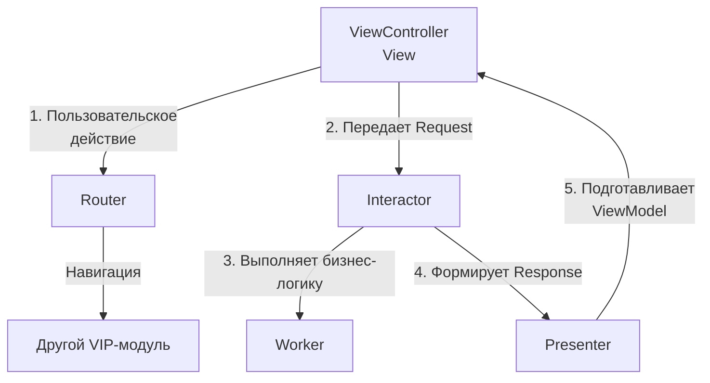
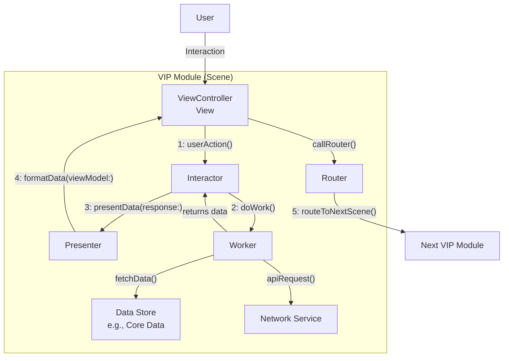

#ios #architecture #Swift 

**Чистая Архитектура (Clean Architecture) от Роберта Мартина, адаптированная Рэймондом Ло для [[iOS]]-разработки.** Ее часто называют **VIP-циклом** (View-Interactor-Presenter) или **VIPER без Router и Entity**. Основная цель — разделение ответственности, тестируемость и независимость от фреймворков (особенно [[UIKit]]).

---

### **1. Взаимодействие компонентов (VIP-цикл)**

Взаимодействие строится на строгом однонаправленном потоке данных по принципу **VIP-цикла**. Это замкнутый цикл, инициируемый ViewController'ом.



**Последовательность шагов:**

1.  **Пользовательское действие (User Action):** Пользователь взаимодействует с экраном (тап по кнопке, pull-to-refresh). ViewController **не обрабатывает логику**, а лишь создает **Request**-объект и передает его Interactor'у.
    *   *Пример:* `func didTapLoginButton(_ sender: UIButton) { interactor?.attemptLogin(request: Login.Request(username: name, password: pass)) }`

2.  **Запрос к Interactor (Request):** Interactor получает Request. Он является «боссом» бизнес-логики. Он решает, *что* нужно сделать, но не делает всё сам.

3.  **Работа с Workers (Business Logic):** Interactor поручает конкретную работу (сетевые запросы, работа с базой данных, вычисления) специальным сервис-объектам — **Workers**. Это делает Interactor тонким и легко тестируемым.
    *   *Пример:* `worker?.authUser(username: request.username, password: request.password) { result in ... }`

4.  **Формирование Response:** Получив результаты от Workers, Interactor создает сырые, неформатированные данные в виде **Response**-объекта и передает его Presenter'у.
    *   *Пример:* `presenter?.presentAuthResult(response: Login.Response(success: true, user: user, error: nil))`

5.  **Подготовка данных для отображения (Formatting):** Presenter получает Response. Его задача — преобразовать сырые данные из Response в готовые для отображения строки, значения флагов и т.д., упаковав их в **ViewModel**.
    *   *Это место для форматирования дат, конвертации чисел в строки, определения, показывать ли лоадер и т.д.*
    *   *Пример:* `let viewModel = Login.ViewModel(success: true, greeting: "Hello, \(user.name)!", errorMessage: nil)`

6.  **Обновление View (Update UI):** Presenter передает готовую ViewModel обратно ViewController'у. ViewController, выступающий в роли **View**, получает ее и **тупо** отображает, без какой-либо логики.
    *   *Пример:* `func displayAuthResult(viewModel: Login.ViewModel) { if viewModel.success { label.text = viewModel.greeting } else { showError(viewModel.errorMessage) } }`

7.  **Навигация (Routing):** Если требуется переход на другой экран, Interactor (после выполнения логики) может сообщить об этом Presenter'у или напрямую вызвать Router. Чаще же Router вызывается из ViewController'а на основе данных из ViewModel (например, при получении флага `shouldNavigateToHome` = true). Router отвечает за навигацию и передачу данных между модулями.

---

### **2. Схема архитектуры**



---

### **3. Термины и ключевые моменты**

#### **Ключевые компоненты:**
*   **View (ViewController):** Глупый объект, который только отображает UI и передает пользовательские действия дальше. **Не должен содержать бизнес-логику.**
*   **Interactor:** Содержит *бизнес-логику*, независимую от UI. Решает, *что* нужно сделать. Работает с моделями, а не с View-объектами.
*   **Presenter:** Содержит *логику представления*. Преобразует сырые данные из Interactor'а в готовые для отображения строки и значения. **Не импортирует UIKit.**
*   **Router:** Содержит *логику навигации* между экранами (модулями). Используется для assembly и routing.
*   **Worker:** Сервисный класс, который выполняет одну конкретную задачу (сетевой запрос, работа с БД). Interactor может использовать несколько разных Workers.
*   **Models:** Структуры, которые передаются между компонентами. Обычно определяются внутри enum в файле сцены (`enum Login`).
    *   **Request:** Передается от View к Interactor. Содержит сырые данные от пользователя.
    *   **Response:** Передается от Interactor к Presenter. Содержит сырые результаты бизнес-логики.
    *   **ViewModel:** Передается от Presenter к View. Содержит форматированные данные для отображения.

#### **Важные принципы:**
*   **Однонаправленный поток данных:** Данные всегда движутся по кругу: View -> Interactor -> Presenter -> View. Это делает поток данных предсказуемым и упрощает отладку.
*   **Протоколо-ориентированность:** Каждый компонент общается с другим строго через протоколы. Это обеспечивает слабую связанность и позволяет легко подменять реализации, например, для тестирования.
*   **Разделение ответственности:** Каждый компонент знает и делает только свою работу.
*   **Независимость от фреймворков:** Interactor и Presenter ничего не знают о UIKit. Это чистый Swift, что делает их невероятно легкими для модульного тестирования.

#### **Сильные стороны:**
*   **Высокая тестируемость:** Каждый компонент можно протестировать изолированно с помощью моков.
*   **Читаемость и поддерживаемость:** Код хорошо структурирован и разбит по логическим блокам.
*   **Масштабируемость:** Отлично подходит для больших проектов с большой командой.

#### **Слабые стороны:**
*   **Бойлерплейт:** Требует много кода для небольших экранов. Генерация шаблонов (через `vcgen` или другие инструменты) почти обязательна.
*   **Кривая обучения:** Поначалу сложно понять и правильно реализовать все компоненты и поток данных.
*   **Избыточность:** Для простых экранов (например, статичный "О нас") использование Clean Swift — это overengineering.

---

### **4. Пример структуры файлов в Xcode**

```
LoginModule/
├── LoginViewController.swift       // View
├── LoginInteractor.swift           // Interactor
├── LoginPresenter.swift            // Presenter
├── LoginRouter.swift               // Router
├── LoginModels.swift               // Models (Request, Response, ViewModel)
└── LoginWorker.swift               // Worker (может быть общим для нескольких модулей)
```

### **5. Важное от себя (Практические советы)**

*   **Используйте кодогенерацию.** Инструмент `vcgen` отличный, но устаревший. Ищите современные аналоги или сниппеты для создания заготовки модуля за 10 секунд.
*   **Не создавайте Workers для всего.** Часто достаточно одного общего `NetworkWorker` или `DatabaseWorker` на весь проект. Создавайте кастомного Worker'а только если задача действительно уникальна для этого Interactor'а.
*   **Router и Assembly.** Часто Router'у передают ссылку на Assembly/Builder, который создает следующий модуль. Это еще больше разделяет ответственность.
*   **Передача данных между модулями.** Делается через Router. Обычно данные передаются в виде простых [[Swift]]-типов или моделей, а не целиком объекты из Interactor'а.
*   **Не фанатейте.** Не пытайтесь запихнуть каждую кнопку в строгий цикл. Иногда простое `@IBAction`, которое вызывает метод роутера — это нормально. Архитектура должна служить вам, а не вы архитектуре.

---