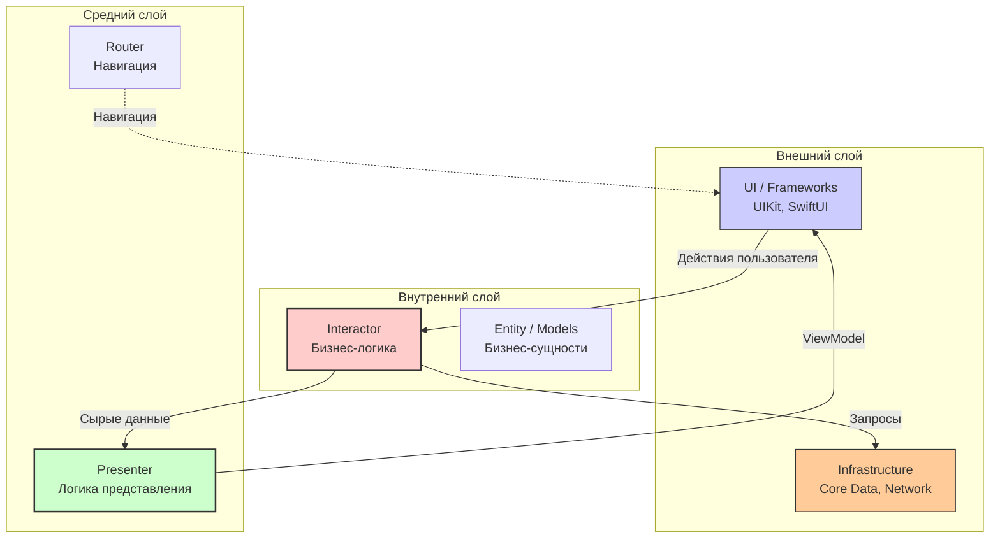
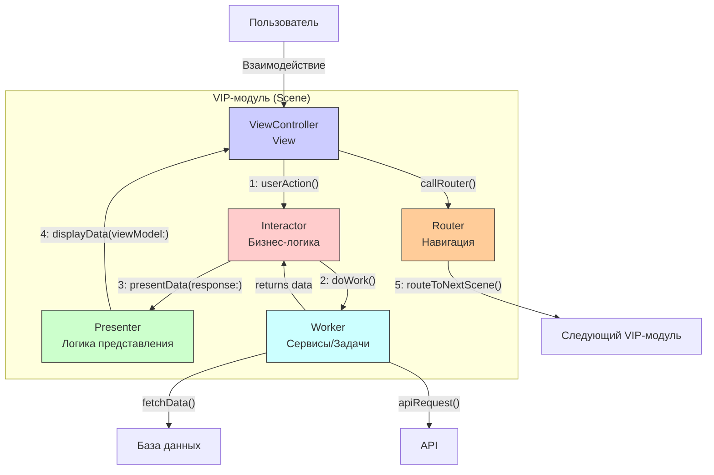

#architecture #clean-architecture #clean-swift #vip #ios #swift #unidirectional-flow #testing

---
## Clean Architecture / Clean Swift (VIP-цикл) в [[iOS]]-разработке

### Определение
**Чистая Архитектура (Clean Architecture)** — это философия проектирования программного обеспечения, предложенная Робертом Мартином (дядя Боб), которая направлена на создание систем, независимых от фреймворков, баз данных и пользовательского интерфейса . Основной принцип — разделение ответственности на слои с четкими границами, где внутренние слои (бизнес-логика) ничего не знают о внешних (UI, базы данных, сеть).

**Clean Swift** (также известный как **VIP-цикл**) — это адаптация Чистой Архитектуры для iOS-разработки, созданная Рэймондом Ло . Она упрощает оригинальную концепцию, фокусируясь на однонаправленном потоке данных между компонентами: **View → Interactor → Presenter → View**. Часто ее называют "[[VIPER Architecture|VIPER]] без Router и Entity", хотя на практике Router в ней присутствует, но с четкой ответственностью за навигацию .

### Зачем это знать iOS-разработчику?
1.  **Высокая тестируемость:** Бизнес-логика изолирована от [[UIKit]], что позволяет легко писать модульные тесты .
2.  **Масштабируемость:** Архитектура отлично подходит для больших проектов с множеством экранов и сложной логикой .
3.  **Поддерживаемость:** Четкое разделение ответственности делает код понятным и легким в поддержке даже для новых членов команды .
4.  **Независимость:** Interactor и Presenter не зависят от UIKit, что позволяет переиспользовать их в других окружениях (например, macOS) .
5.  **Предсказуемость:** Однонаправленный поток данных упрощает отладку и понимание того, как изменяется состояние .

---

### Основные принципы Clean Architecture



#### Правило зависимости (Dependency Rule)
Зависимости направлены **только внутрь**. Внешние слои могут зависеть от внутренних, но внутренние слои ничего не знают о внешних. Бизнес-логика (Interactor, Entity) не должна импортировать [[UIKit]], [[Core Data]] или другие внешние фреймворки .

---

### Компоненты Clean Swift (VIP-цикл)



#### 1. **View (ViewController)**
**Ответственность:** Отображение UI и передача пользовательских действий.
- **Не содержит бизнес-логику.**
- Получает форматированные данные от Presenter в виде **ViewModel** и просто отображает их.
- Передает действия пользователя Interactor'у в виде **Request**.

```swift
protocol LoginDisplayLogic: AnyObject {
    func displaySomething(viewModel: Login.Something.ViewModel)
}

class LoginViewController: UIViewController, LoginDisplayLogic {
    var interactor: LoginBusinessLogic?
    var router: (NSObjectProtocol & LoginRoutingLogic & LoginDataPassing)?
    
    // MARK: - Actions
    @IBAction func doSomething(_ sender: Any) {
        let request = Login.Something.Request()
        interactor?.doSomething(request: request)
    }
    
    // MARK: - Display
    func displaySomething(viewModel: Login.Something.ViewModel) {
        nameLabel.text = viewModel.name
        // Просто отображаем данные, без логики
    }
}
```

#### 2. **Interactor**
**Ответственность:** Бизнес-логика.
- Получает **Request** от View.
- Принимает решения, что делать с данными.
- Работает с **Worker'ами** для выполнения задач (сеть, база данных).
- Возвращает сырые **Response** Presenter'у.
- **Не знает о UIKit.**

```swift
protocol LoginBusinessLogic {
    func doSomething(request: Login.Something.Request)
}

class LoginInteractor: LoginBusinessLogic {
    var presenter: LoginPresentationLogic?
    var worker: LoginWorker?
    
    func doSomething(request: Login.Something.Request) {
        worker = LoginWorker()
        worker?.doSomeWork { [weak self] result in
            // Бизнес-логика
            let response = Login.Something.Response(result: result)
            self?.presenter?.presentSomething(response: response)
        }
    }
}
```

#### 3. **Presenter**
**Ответственность:** Логика представления (presentation logic).
- Получает сырой **Response** от Interactor.
- Преобразует (форматирует) данные в готовый для отображения **ViewModel**.
- **Не знает о [[UIKit]]** — работает только с [[Foundation]]/[[Swift]] типами.
- Передает ViewModel обратно во View.

```swift
protocol LoginPresentationLogic {
    func presentSomething(response: Login.Something.Response)
}

class LoginPresenter: LoginPresentationLogic {
    weak var viewController: LoginDisplayLogic?
    
    func presentSomething(response: Login.Something.Response) {
        // Форматирование данных для отображения
        let viewModel = Login.Something.ViewModel(
            name: response.result.name.uppercased(),
            date: DateFormatter.localizedString(from: response.result.date, dateStyle: .medium, timeStyle: .none)
        )
        viewController?.displaySomething(viewModel: viewModel)
    }
}
```

#### 4. **Router**
**Ответственность:** Навигация между модулями и передача данных.
- Содержит логику переходов (present, push, pop).
- Обычно также отвечает за сборку (assembly) модуля.
- Передает данные следующему модулю.

```swift
protocol LoginRoutingLogic {
    func routeToHome()
}

protocol LoginDataPassing {
    var dataStore: LoginDataStore? { get }
}

class LoginRouter: NSObject, LoginRoutingLogic, LoginDataPassing {
    weak var viewController: LoginViewController?
    var dataStore: LoginDataStore?
    
    func routeToHome() {
        let destinationVC = HomeViewController()
        if var destinationDS = destinationVC.router?.dataStore {
            passDataToHome(source: dataStore, destination: &destinationDS)
        }
        navigateToHome(source: viewController, destination: destinationVC)
    }
    
    private func navigateToHome(source: LoginViewController?, destination: UIViewController) {
        source?.navigationController?.pushViewController(destination, animated: true)
    }
    
    private func passDataToHome(source: LoginDataStore?, destination: inout HomeDataStore) {
        destination.user = source?.user
    }
}
```

#### 5. **Worker**
**Ответственность:** Выполнение конкретных задач (сеть, база данных, вычисления).
- Используется Interactor'ом для делегирования работы.
- Может быть переиспользован между разными модулями.
- Содержит инфраструктурный код.

```swift
class LoginWorker {
    func doSomeWork(completion: @escaping (Result) -> Void) {
        // Сетевой запрос, работа с БД и т.д.
        apiService.login(username: username, password: password) { result in
            completion(result)
        }
    }
}
```

#### 6. **Models**
**Ответственность:** Определение структур данных, передаваемых между компонентами.
- Обычно определяется внутри [[enum]] для каждого модуля.
- Содержит `Request`, `Response`, `ViewModel`.

```swift
enum Login {
    enum Something {
        struct Request {
            var username: String
            var password: String
        }
        
        struct Response {
            var user: User
            var error: Error?
        }
        
        struct ViewModel {
            var greeting: String
            var errorMessage: String?
        }
    }
}
```

---

### Пример: Полная реализация модуля логина

#### LoginModels.swift
```swift
import Foundation

enum Login {
    // MARK: - Login
    enum Login {
        struct Request {
            let username: String
            let password: String
        }
        
        struct Response {
            let success: Bool
            let user: User?
            let errorMessage: String?
        }
        
        struct ViewModel {
            let success: Bool
            let greeting: String?
            let errorMessage: String?
        }
    }
    
    // MARK: - User
    struct User {
        let id: String
        let name: String
        let email: String
    }
}
```

#### LoginViewController.swift
```swift
import UIKit

protocol LoginDisplayLogic: AnyObject {
    func displayLoginResult(viewModel: Login.Login.ViewModel)
}

class LoginViewController: UIViewController {
    @IBOutlet weak var usernameTextField: UITextField!
    @IBOutlet weak var passwordTextField: UITextField!
    @IBOutlet weak var loginButton: UIButton!
    @IBOutlet weak var activityIndicator: UIActivityIndicatorView!
    
    var interactor: LoginBusinessLogic?
    var router: (NSObjectProtocol & LoginRoutingLogic & LoginDataPassing)?
    
    override func viewDidLoad() {
        super.viewDidLoad()
        setupUI()
    }
    
    private func setupUI() {
        activityIndicator.isHidden = true
    }
    
    @IBAction func loginButtonTapped(_ sender: UIButton) {
        guard let username = usernameTextField.text, !username.isEmpty,
              let password = passwordTextField.text, !password.isEmpty else {
            showError("Заполните все поля")
            return
        }
        
        let request = Login.Login.Request(username: username, password: password)
        interactor?.login(request: request)
    }
    
    private func showError(_ message: String) {
        let alert = UIAlertController(title: "Ошибка", message: message, preferredStyle: .alert)
        alert.addAction(UIAlertAction(title: "OK", style: .default))
        present(alert, animated: true)
    }
}

// MARK: - LoginDisplayLogic
extension LoginViewController: LoginDisplayLogic {
    func displayLoginResult(viewModel: Login.Login.ViewModel) {
        activityIndicator.isHidden = true
        loginButton.isEnabled = true
        
        if viewModel.success, let greeting = viewModel.greeting {
            print("Успех: \(greeting)")
            router?.routeToHome()
        } else {
            showError(viewModel.errorMessage ?? "Неизвестная ошибка")
        }
    }
}
```

#### LoginInteractor.swift
```swift
import Foundation

protocol LoginBusinessLogic {
    func login(request: Login.Login.Request)
}

protocol LoginDataStore {
    var user: Login.User? { get set }
}

class LoginInteractor: LoginBusinessLogic, LoginDataStore {
    var presenter: LoginPresentationLogic?
    var worker: LoginWorker?
    var user: Login.User?
    
    func login(request: Login.Login.Request) {
        worker = LoginWorker()
        
        // Показываем лоадер
        presenter?.presentLoading()
        
        worker?.login(username: request.username, password: request.password) { [weak self] result in
            switch result {
            case .success(let user):
                self?.user = user
                let response = Login.Login.Response(success: true, user: user, errorMessage: nil)
                self?.presenter?.presentLoginResult(response: response)
                
            case .failure(let error):
                let response = Login.Login.Response(success: false, user: nil, errorMessage: error.localizedDescription)
                self?.presenter?.presentLoginResult(response: response)
            }
        }
    }
}
```

#### LoginPresenter.swift
```swift
import Foundation

protocol LoginPresentationLogic {
    func presentLoading()
    func presentLoginResult(response: Login.Login.Response)
}

class LoginPresenter: LoginPresentationLogic {
    weak var viewController: LoginDisplayLogic?
    
    func presentLoading() {
        let viewModel = Login.Login.ViewModel(success: false, greeting: nil, errorMessage: nil)
        viewController?.displayLoginResult(viewModel: viewModel) // можно добавить отдельный метод для лоадера
    }
    
    func presentLoginResult(response: Login.Login.Response) {
        let viewModel: Login.Login.ViewModel
        
        if response.success, let user = response.user {
            viewModel = Login.Login.ViewModel(
                success: true,
                greeting: "Добро пожаловать, \(user.name)!",
                errorMessage: nil
            )
        } else {
            viewModel = Login.Login.ViewModel(
                success: false,
                greeting: nil,
                errorMessage: response.errorMessage ?? "Ошибка входа"
            )
        }
        
        viewController?.displayLoginResult(viewModel: viewModel)
    }
}
```

#### LoginRouter.swift
```swift
import UIKit

protocol LoginRoutingLogic {
    func routeToHome()
}

protocol LoginDataPassing {
    var dataStore: LoginDataStore? { get }
}

class LoginRouter: NSObject, LoginRoutingLogic, LoginDataPassing {
    weak var viewController: LoginViewController?
    var dataStore: LoginDataStore?
    
    func routeToHome() {
        let destinationVC = HomeViewController()
        if var destinationDS = destinationVC.router?.dataStore {
            passDataToHome(source: dataStore, destination: &destinationDS)
        }
        navigateToHome(source: viewController, destination: destinationVC)
    }
    
    // MARK: - Navigation
    private func navigateToHome(source: LoginViewController?, destination: UIViewController) {
        source?.navigationController?.pushViewController(destination, animated: true)
    }
    
    // MARK: - Data Passing
    private func passDataToHome(source: LoginDataStore?, destination: inout HomeDataStore) {
        destination.user = source?.user
    }
}
```

#### LoginWorker.swift
```swift
import Foundation

class LoginWorker {
    private let apiService = APIService.shared
    
    func login(username: String, password: String, completion: @escaping (Result<Login.User, Error>) -> Void) {
        apiService.login(username: username, password: password) { result in
            switch result {
            case .success(let userDTO):
                let user = Login.User(id: userDTO.id, name: userDTO.name, email: userDTO.email)
                completion(.success(user))
            case .failure(let error):
                completion(.failure(error))
            }
        }
    }
}
```

#### LoginAssembly.swift (Builder)
```swift
import UIKit

enum LoginAssembly {
    static func build() -> LoginViewController {
        let viewController = LoginViewController()
        let interactor = LoginInteractor()
        let presenter = LoginPresenter()
        let router = LoginRouter()
        
        viewController.interactor = interactor
        viewController.router = router
        interactor.presenter = presenter
        presenter.viewController = viewController
        router.viewController = viewController
        router.dataStore = interactor
        
        return viewController
    }
}

// Использование:
// let loginVC = LoginAssembly.build()
// navigationController?.pushViewController(loginVC, animated: true)
```

---

### Clean Swift vs Другие архитектуры

| Характеристика                    | Clean Swift (VIP)                                         | [[VIPER Architecture\|VIPER]]                   | [[MVVM (Model-View-ViewModel) Architecture\|MVVM]] | [[MVC (Model-View-Controller) Architecture\|MVC]] |
| --------------------------------- | --------------------------------------------------------- | ----------------------------------------------- | -------------------------------------------------- | ------------------------------------------------- |
| **Количество компонентов**        | 5-6 (View, Interactor, Presenter, Router, Worker, Models) | 5 (View, Interactor, Presenter, Entity, Router) | 3 (View, ViewModel, Model)                         | 3 (View, Controller, Model)                       |
| **Тестируемость**                 | Очень высокая                                             | Очень высокая                                   | Высокая                                            | Низкая                                            |
| **Разделение ответственности**    | Очень высокое                                             | Очень высокое                                   | Среднее                                            | Низкое                                            |
| **Boilerplate код**               | Много                                                     | Много                                           | Средне                                             | Мало                                              |
| **Unidirectional Flow**           | Да                                                        | Да                                              | Нет (обычно)                                       | Нет                                               |
| **Независимость от UIKit**        | Interactor/Presenter - да                                 | Interactor/Presenter - да                       | ViewModel - да                                     | Нет                                               |
| **Кривая обучения**               | Высокая                                                   | Высокая                                         | Средняя                                            | Низкая                                            |
| **Подходит для больших проектов** | ✅                                                         | ✅                                               | ✅                                                  | ❌                                                 |

---

### Практические советы (от Raymond Law и сообщества)

#### 1. **Используйте кодогенерацию**
Бойлерплейт — главная боль Clean Swift. Используйте инструменты:
- **Generamba** — генератор модулей
- **SwiftGen** — для ресурсов
- **Шаблоны [[Xcode]]** — создайте свой шаблон VIP-модуля
- **Sourcery** — для генерации повторяющегося кода

#### 2. **Не создавайте Workers для всего**
Один общий `NetworkWorker`, `DatabaseWorker` или `KeychainWorker` часто достаточно. Создавайте специализированных Workers только для действительно уникальной логики.

#### 3. **Router и Assembly**
Router часто отвечает не только за навигацию, но и за создание следующего модуля. Это называется "composition root".

```swift
class LoginRouter: LoginRoutingLogic {
    func routeToHome() {
        let homeVC = HomeAssembly.build(with: dataStore?.user)
        viewController?.navigationController?.pushViewController(homeVC, animated: true)
    }
}
```

#### 4. **Передача данных между модулями**
Используйте протокол `DataPassing` и метод `passDataTo...`. Не передавайте целиком Interactor — только необходимые данные.

#### 5. **Не фанатейте**
Иногда для простых действий (например, закрытие экрана) можно вызвать роутер напрямую из View, минуя полный цикл. Архитектура должна служить вам, а не вы архитектуре.

```swift
// Иногда допустимо
@IBAction func closeButtonTapped(_ sender: UIButton) {
    router?.dismiss()
}
```

#### 6. **Тестирование**
Interactor и Presenter тестируются легко — они чистый Swift. Для тестирования Workers используйте моки сетевых сервисов и БД.

```swift
func testLoginSuccess() {
    // Given
    let sut = LoginInteractor()
    let presenterSpy = LoginPresenterSpy()
    sut.presenter = presenterSpy
    
    // When
    sut.login(request: Login.Login.Request(username: "test", password: "pass"))
    
    // Then
    XCTAssertTrue(presenterSpy.presentLoginResultCalled)
    XCTAssertEqual(presenterSpy.response?.success, true)
}
```

#### 7. **Структура проекта**
```
App/
├── Scenes/
│   ├── Login/
│   │   ├── LoginModels.swift
│   │   ├── LoginViewController.swift
│   │   ├── LoginInteractor.swift
│   │   ├── LoginPresenter.swift
│   │   ├── LoginRouter.swift
│   │   └── LoginWorker.swift
│   └── Home/
│       └── ...
├── Services/
│   ├── Network/
│   ├── Database/
│   └── Keychain/
└── Helpers/
    └── Extensions/
```

---

### Преимущества Clean Swift

1.  **Тестируемость:** Каждый компонент можно тестировать изолированно .
2.  **Поддерживаемость:** Код легко читать и изменять благодаря четкому разделению .
3.  **Масштабируемость:** Архитектура хорошо растет с проектом .
4.  **Независимость:** Бизнес-логика не привязана к UIKit, Core Data и т.д. .
5.  **Предсказуемость:** Однонаправленный поток упрощает отладку .
6.  **Слабая связанность:** Компоненты общаются через протоколы .

### Недостатки

1.  **Много бойлерплейта:** Для каждого экрана нужно создавать 5-6 файлов .
2.  **Кривая обучения:** Новичкам сложно освоить .
3.  **Избыточность для простых экранов:** Для статичных экранов это overengineering .
4.  **Сложность навигации:** Передача данных между модулями требует дополнительного кода .
5.  **Требует дисциплины:** Легко нарушить принципы, если не следить .

### Итог
**Clean Swift (VIP-цикл)** — это мощная, хорошо структурированная архитектура для iOS, идеально подходящая для больших проектов с высокой нагрузкой на бизнес-логику и требованиями к тестированию. Она требует больше кода на старте, но окупается при масштабировании и поддержке. Использование кодогенерации и четкое следование принципам Чистой Архитектуры делает разработку предсказуемой и эффективной .