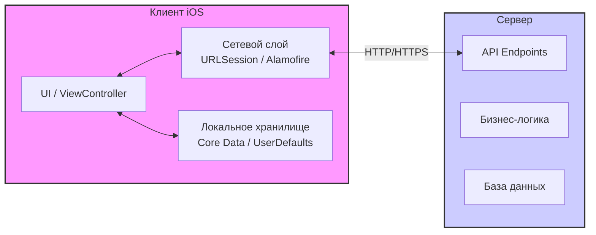

#architecture #client-server #networking #api #rest #http #ios #swift #backend

---
## Клиент-серверная архитектура (Client-Server Architecture)

### Определение
**Клиент-серверная архитектура** — это модель распределенной системы, в которой задачи и нагрузка по обработке данных разделены между поставщиками услуг (серверами) и их потребителями (клиентами). Клиенты отправляют запросы серверу, а сервер обрабатывает эти запросы и возвращает результат .

В контексте [[iOS]]-разработки мобильное приложение выступает в роли **клиента**. Оно работает на устройстве пользователя и взаимодействует с удаленными серверами через сеть (обычно интернет) для получения данных, синхронизации состояния, аутентификации и выполнения других операций, требующих централизованной обработки или хранения .

### Зачем это знать iOS-разработчику?
1.  **Практически любое приложение использует эту модель:** Социальные сети, мессенджеры, банковские приложения, онлайн-магазины — все они построены на клиент-серверном взаимодействии.
2.  **Проектирование сетевого слоя:** Понимание архитектуры необходимо для правильной организации кода, работы с [[API]], обработки ошибок и состояний загрузки.
3.  **Асинхронность:** Работа с сервером всегда асинхронна. Нужно уметь правильно обрабатывать ответы, не блокируя пользовательский интерфейс.
4.  **Безопасность:** Понимание модели помогает правильно реализовать хранение токенов, шифрование и защиту данных при передаче.
5.  **Оптимизация:** Знание принципов позволяет оптимизировать запросы, кэшировать данные и уменьшать нагрузку на сеть.

---

### Базовые компоненты архитектуры



#### 1. **Клиент (Client)**
В iOS — это приложение на устройстве пользователя. Отвечает за:
- Отображение пользовательского интерфейса.
- Взаимодействие с пользователем.
- Отправку запросов на сервер.
- Обработку и кэширование полученных данных.
- Локальное хранение данных (кэш, настройки, токены).

#### 2. **Сервер (Server)**
Удаленный компьютер или кластер, который:
- Принимает и обрабатывает запросы от клиентов.
- Выполняет бизнес-логику.
- Взаимодействует с базой данных.
- Возвращает результаты клиенту.
- Управляет аутентификацией и авторизацией.

#### 3. **Сеть (Network)**
Канал связи, по которому клиент и сервер обмениваются данными. Обычно используется протокол **[[HTTP]]/[[HTTPS]]** с различными форматами данных: [[JSON]], [[XML]], Protobuf, [[GraphQL]].

---

### Виды клиент-серверного взаимодействия

#### 1. **REST (Representational State Transfer)**
Самый распространенный архитектурный стиль для веб-сервисов. Основан на принципах:
- **Stateless:** Сервер не хранит состояние клиента между запросами. Каждый запрос содержит всю необходимую информацию.
- **Ресурсно-ориентированный:** Взаимодействие строится вокруг ресурсов (users, posts, comments), идентифицируемых через URL.
- **Использование HTTP методов:** [[GET-HTTP|GET]] (получение), [[POST-HTTP|POST]] (создание), [[PUT-HTTP|PUT]]/[[PATCH-HTTP|PATCH]] (обновление), [[DELETE-HTTP|DELETE]] (удаление).
- **Форматы данных:** Обычно JSON, реже XML.

**Пример REST API:**
```
GET    /api/users          # Получить список пользователей
GET    /api/users/123      # Получить пользователя с id 123
POST   /api/users          # Создать нового пользователя
PUT    /api/users/123      # Обновить пользователя 123
DELETE /api/users/123      # Удалить пользователя 123
```

#### 2. **GraphQL**
Язык запросов для API, разработанный Facebook. Позволяет клиенту запрашивать именно те данные, которые ему нужны, и ничего лишнего.

**Преимущества:**
- Один endpoint для всех запросов.
- Клиент сам определяет структуру ответа.
- Меньше перегрузок (over-fetching) и недогрузок (under-fetching).

```graphql
query {
  user(id: "123") {
    name
    email
    posts(limit: 5) {
      title
      createdAt
    }
  }
}
```

#### 3. **[[WebSocket]]**
Протокол для полно дуплексной (двунаправленной) связи в реальном времени. Используется для чатов, уведомлений, игр, где важна низкая задержка.

#### 4. **SOAP (Simple Object Access Protocol)**
Устаревший протокол, использующий XML для обмена структурированными сообщениями. Редко встречается в современных мобильных приложениях.

---

### Примеры реализации на [[Swift]]

#### Уровень 1: Базовая модель данных и сервис

```swift
import Foundation

// MARK: - Модель данных
struct User: Codable {
    let id: Int
    let name: String
    let email: String
    let avatarURL: String?
    
    enum CodingKeys: String, CodingKey {
        case id, name, email
        case avatarURL = "avatar_url"
    }
}

// MARK: - Ошибки API
enum APIError: Error {
    case invalidURL
    case noData
    case decodingError
    case networkError(Error)
    case serverError(statusCode: Int)
    case unauthorized
    case forbidden
    
    var localizedDescription: String {
        switch self {
        case .invalidURL:
            return "Неверный URL"
        case .noData:
            return "Нет данных от сервера"
        case .decodingError:
            return "Ошибка обработки данных"
        case .networkError(let error):
            return "Ошибка сети: \(error.localizedDescription)"
        case .serverError(let code):
            return "Ошибка сервера: \(code)"
        case .unauthorized:
            return "Требуется авторизация"
        case .forbidden:
            return "Доступ запрещен"
        }
    }
}

// MARK: - Базовый сервис
class APIService {
    static let shared = APIService()
    private let baseURL = "https://api.example.com/v1"
    private let session = URLSession.shared
    
    private func makeRequest<T: Decodable>(
        endpoint: String,
        method: String = "GET",
        body: Data? = nil,
        completion: @escaping (Result<T, APIError>) -> Void
    ) {
        guard let url = URL(string: baseURL + endpoint) else {
            completion(.failure(.invalidURL))
            return
        }
        
        var request = URLRequest(url: url)
        request.httpMethod = method
        request.httpBody = body
        request.setValue("application/json", forHTTPHeaderField: "Content-Type")
        
        // Добавляем токен авторизации, если есть
        if let token = AuthManager.shared.token {
            request.setValue("Bearer \(token)", forHTTPHeaderField: "Authorization")
        }
        
        let task = session.dataTask(with: request) { data, response, error in
            if let error = error {
                completion(.failure(.networkError(error)))
                return
            }
            
            guard let httpResponse = response as? HTTPURLResponse else {
                completion(.failure(.noData))
                return
            }
            
            switch httpResponse.statusCode {
            case 200...299:
                break
            case 401:
                completion(.failure(.unauthorized))
                return
            case 403:
                completion(.failure(.forbidden))
                return
            default:
                completion(.failure(.serverError(statusCode: httpResponse.statusCode)))
                return
            }
            
            guard let data = data else {
                completion(.failure(.noData))
                return
            }
            
            do {
                let decodedData = try JSONDecoder().decode(T.self, from: data)
                completion(.success(decodedData))
            } catch {
                print("Decoding error: \(error)")
                completion(.failure(.decodingError))
            }
        }
        
        task.resume()
    }
}

// MARK: - User Service
class UserService {
    static let shared = UserService()
    private let apiService = APIService.shared
    
    func fetchUsers(completion: @escaping (Result<[User], APIError>) -> Void) {
        apiService.makeRequest(endpoint: "/users", completion: completion)
    }
    
    func fetchUser(id: Int, completion: @escaping (Result<User, APIError>) -> Void) {
        apiService.makeRequest(endpoint: "/users/\(id)", completion: completion)
    }
    
    func createUser(name: String, email: String, completion: @escaping (Result<User, APIError>) -> Void) {
        let newUser = ["name": name, "email": email]
        guard let body = try? JSONSerialization.data(withJSONObject: newUser) else {
            completion(.failure(.decodingError))
            return
        }
        
        apiService.makeRequest(endpoint: "/users", method: "POST", body: body, completion: completion)
    }
}
```

#### Уровень 2: Использование в ViewController с обработкой состояний

```swift
import UIKit

class UsersViewController: UIViewController {
    
    @IBOutlet weak var tableView: UITableView!
    @IBOutlet weak var activityIndicator: UIActivityIndicatorView!
    @IBOutlet weak var errorLabel: UILabel!
    
    private var users: [User] = []
    private var isLoading = false
    private var currentTask: URLSessionTask?
    
    override func viewDidLoad() {
        super.viewDidLoad()
        setupUI()
        loadUsers()
    }
    
    private func setupUI() {
        tableView.isHidden = true
        errorLabel.isHidden = true
    }
    
    private func loadUsers() {
        guard !isLoading else { return }
        
        isLoading = true
        activityIndicator.startAnimating()
        tableView.isHidden = true
        errorLabel.isHidden = true
        
        currentTask?.cancel()
        
        UserService.shared.fetchUsers { [weak self] result in
            DispatchQueue.main.async {
                self?.handleResult(result)
            }
        }
    }
    
    private func handleResult(_ result: Result<[User], APIError>) {
        isLoading = false
        activityIndicator.stopAnimating()
        
        switch result {
        case .success(let users):
            self.users = users
            tableView.isHidden = false
            tableView.reloadData()
            
        case .failure(let error):
            errorLabel.text = error.localizedDescription
            errorLabel.isHidden = false
            tableView.isHidden = true
            
            // Обработка специфических ошибок
            switch error {
            case .unauthorized:
                showAuthScreen()
            case .serverError(let code):
                showRetryAlert(message: "Ошибка сервера (\(code)). Попробовать снова?")
            default:
                showRetryAlert(message: error.localizedDescription)
            }
        }
    }
    
    private func showAuthScreen() {
        // Переход на экран авторизации
        let authVC = AuthViewController()
        present(authVC, animated: true)
    }
    
    private func showRetryAlert(message: String) {
        let alert = UIAlertController(title: "Ошибка", message: message, preferredStyle: .alert)
        alert.addAction(UIAlertAction(title: "Отмена", style: .cancel))
        alert.addAction(UIAlertAction(title: "Повторить", style: .default) { [weak self] _ in
            self?.loadUsers()
        })
        present(alert, animated: true)
    }
    
    override func viewWillDisappear(_ animated: Bool) {
        super.viewWillDisappear(animated)
        currentTask?.cancel()
    }
}

extension UsersViewController: UITableViewDataSource {
    func tableView(_ tableView: UITableView, numberOfRowsInSection section: Int) -> Int {
        return users.count
    }
    
    func tableView(_ tableView: UITableView, cellForRowAt indexPath: IndexPath) -> UITableViewCell {
        let cell = tableView.dequeueReusableCell(withIdentifier: "UserCell", for: indexPath)
        let user = users[indexPath.row]
        
        cell.textLabel?.text = user.name
        cell.detailTextLabel?.text = user.email
        
        return cell
    }
}
```

#### Уровень 3: Использование [[async]]/[[await]] (современный подход)

```swift
import Foundation

// MARK: - APIService с async/await
class ModernAPIService {
    static let shared = ModernAPIService()
    private let baseURL = "https://api.example.com/v1"
    private let session = URLSession.shared
    
    func request<T: Decodable>(
        endpoint: String,
        method: String = "GET",
        body: Data? = nil
    ) async throws -> T {
        guard let url = URL(string: baseURL + endpoint) else {
            throw APIError.invalidURL
        }
        
        var request = URLRequest(url: url)
        request.httpMethod = method
        request.httpBody = body
        request.setValue("application/json", forHTTPHeaderField: "Content-Type")
        
        if let token = AuthManager.shared.token {
            request.setValue("Bearer \(token)", forHTTPHeaderField: "Authorization")
        }
        
        let (data, response) = try await session.data(for: request)
        
        guard let httpResponse = response as? HTTPURLResponse else {
            throw APIError.noData
        }
        
        switch httpResponse.statusCode {
        case 200...299:
            break
        case 401:
            throw APIError.unauthorized
        case 403:
            throw APIError.forbidden
        default:
            throw APIError.serverError(statusCode: httpResponse.statusCode)
        }
        
        do {
            return try JSONDecoder().decode(T.self, from: data)
        } catch {
            print("Decoding error: \(error)")
            throw APIError.decodingError
        }
    }
}

// MARK: - Modern ViewController с async/await
class ModernUsersViewController: UIViewController {
    
    @IBOutlet weak var tableView: UITableView!
    @IBOutlet weak var activityIndicator: UIActivityIndicatorView!
    
    private var users: [User] = []
    
    override func viewDidLoad() {
        super.viewDidLoad()
        loadUsers()
    }
    
    @IBAction func refreshTapped(_ sender: UIBarButtonItem) {
        loadUsers()
    }
    
    private func loadUsers() {
        Task {
            await fetchUsers()
        }
    }
    
    private func fetchUsers() async {
        activityIndicator.startAnimating()
        tableView.isHidden = true
        
        do {
            let fetchedUsers: [User] = try await ModernAPIService.shared.request(endpoint: "/users")
            self.users = fetchedUsers
            tableView.isHidden = false
            tableView.reloadData()
        } catch {
            handleError(error)
        }
        
        activityIndicator.stopAnimating()
    }
    
    private func handleError(_ error: Error) {
        let alert = UIAlertController(
            title: "Ошибка",
            message: (error as? APIError)?.localizedDescription ?? error.localizedDescription,
            preferredStyle: .alert
        )
        alert.addAction(UIAlertAction(title: "OK", style: .default))
        present(alert, animated: true)
    }
}

extension ModernUsersViewController: UITableViewDataSource {
    func tableView(_ tableView: UITableView, numberOfRowsInSection section: Int) -> Int {
        return users.count
    }
    
    func tableView(_ tableView: UITableView, cellForRowAt indexPath: IndexPath) -> UITableViewCell {
        let cell = tableView.dequeueReusableCell(withIdentifier: "UserCell", for: indexPath)
        let user = users[indexPath.row]
        
        cell.textLabel?.text = user.name
        cell.detailTextLabel?.text = user.email
        
        return cell
    }
}
```

#### Уровень 4: Менеджер токенов и интерцептор запросов

```swift
import Foundation

// MARK: - AuthManager для управления токенами
class AuthManager {
    static let shared = AuthManager()
    private let tokenKey = "authToken"
    private let refreshTokenKey = "refreshToken"
    
    private(set) var token: String? {
        get { UserDefaults.standard.string(forKey: tokenKey) }
        set { UserDefaults.standard.set(newValue, forKey: tokenKey) }
    }
    
    private(set) var refreshToken: String? {
        get { UserDefaults.standard.string(forKey: refreshTokenKey) }
        set { UserDefaults.standard.set(newValue, forKey: refreshTokenKey) }
    }
    
    var isAuthenticated: Bool { token != nil }
    
    func saveTokens(access: String, refresh: String) {
        token = access
        refreshToken = refresh
    }
    
    func clearTokens() {
        token = nil
        refreshToken = nil
    }
    
    func refreshAccessToken() async throws -> String {
        guard let refreshToken = refreshToken else {
            throw APIError.unauthorized
        }
        
        let service = ModernAPIService.shared
        let response: RefreshResponse = try await service.request(
            endpoint: "/auth/refresh",
            method: "POST",
            body: try JSONEncoder().encode(["refresh_token": refreshToken])
        )
        
        token = response.accessToken
        return response.accessToken
    }
}

// MARK: - TokenInterceptor для автоматического обновления токенов
class TokenInterceptor {
    private let authManager: AuthManager
    private var isRefreshing = false
    private var pendingRequests: [(String) -> Void] = []
    
    init(authManager: AuthManager) {
        self.authManager = authManager
    }
    
    func intercept<T: Decodable>(
        request: () async throws -> T
    ) async throws -> T {
        do {
            return try await request()
        } catch APIError.unauthorized {
            // Пытаемся обновить токен
            return try await handleUnauthorized(request: request)
        }
    }
    
    private func handleUnauthorized<T: Decodable>(
        request: () async throws -> T
    ) async throws -> T {
        // Если уже обновляем, ждем
        if isRefreshing {
            return try await withCheckedThrowingContinuation { continuation in
                pendingRequests.append { newToken in
                    Task {
                        do {
                            let result = try await request()
                            continuation.resume(returning: result)
                        } catch {
                            continuation.resume(throwing: error)
                        }
                    }
                }
            }
        }
        
        isRefreshing = true
        
        do {
            // Обновляем токен
            _ = try await authManager.refreshAccessToken()
            
            // Выполняем все ожидающие запросы
            for pendingRequest in pendingRequests {
                if let token = authManager.token {
                    pendingRequest(token)
                }
            }
            pendingRequests.removeAll()
            
            isRefreshing = false
            
            // Повторяем оригинальный запрос
            return try await request()
            
        } catch {
            isRefreshing = false
            pendingRequests.removeAll()
            authManager.clearTokens()
            throw APIError.unauthorized
        }
    }
}

// MARK: - Пример использования
class AuthenticatedAPIService {
    private let baseURL = "https://api.example.com/v1"
    private let session = URLSession.shared
    private let interceptor = TokenInterceptor(authManager: .shared)
    
    func request<T: Decodable>(
        endpoint: String,
        method: String = "GET",
        body: Data? = nil
    ) async throws -> T {
        return try await interceptor.intercept {
            var request = URLRequest(url: URL(string: baseURL + endpoint)!)
            request.httpMethod = method
            request.httpBody = body
            request.setValue("application/json", forHTTPHeaderField: "Content-Type")
            
            if let token = AuthManager.shared.token {
                request.setValue("Bearer \(token)", forHTTPHeaderField: "Authorization")
            }
            
            let (data, response) = try await session.data(for: request)
            
            guard let httpResponse = response as? HTTPURLResponse else {
                throw APIError.noData
            }
            
            switch httpResponse.statusCode {
            case 200...299:
                break
            case 401:
                throw APIError.unauthorized
            default:
                throw APIError.serverError(statusCode: httpResponse.statusCode)
            }
            
            return try JSONDecoder().decode(T.self, from: data)
        }
    }
}
```

#### Уровень 5: Паттерн Repository для абстракции источника данных

```swift
import Foundation
import Combine

// MARK: - Протокол репозитория
protocol UserRepositoryProtocol {
    func getUsers() async throws -> [User]
    func getUser(id: Int) async throws -> User
    func saveUsers(_ users: [User])
    func clearCache()
}

// MARK: - Remote Data Source (API)
class UserRemoteDataSource {
    private let apiService = ModernAPIService.shared
    
    func fetchUsers() async throws -> [User] {
        return try await apiService.request(endpoint: "/users")
    }
    
    func fetchUser(id: Int) async throws -> User {
        return try await apiService.request(endpoint: "/users/\(id)")
    }
}

// MARK: - Local Data Source (Кэш)
class UserLocalDataSource {
    private let cacheKey = "cached_users"
    private let userDefaults = UserDefaults.standard
    
    func getCachedUsers() -> [User]? {
        guard let data = userDefaults.data(forKey: cacheKey) else { return nil }
        return try? JSONDecoder().decode([User].self, from: data)
    }
    
    func cacheUsers(_ users: [User]) {
        if let data = try? JSONEncoder().encode(users) {
            userDefaults.set(data, forKey: cacheKey)
        }
    }
    
    func clearCache() {
        userDefaults.removeObject(forKey: cacheKey)
    }
}

// MARK: - Реализация репозитория
class UserRepository: UserRepositoryProtocol {
    private let remoteDataSource: UserRemoteDataSource
    private let localDataSource: UserLocalDataSource
    
    init(
        remoteDataSource: UserRemoteDataSource = UserRemoteDataSource(),
        localDataSource: UserLocalDataSource = UserLocalDataSource()
    ) {
        self.remoteDataSource = remoteDataSource
        self.localDataSource = localDataSource
    }
    
    func getUsers() async throws -> [User] {
        // Сначала пробуем получить из кэша
        if let cached = localDataSource.getCachedUsers() {
            return cached
        }
        
        // Если кэша нет, грузим с сервера
        do {
            let users = try await remoteDataSource.fetchUsers()
            localDataSource.cacheUsers(users)
            return users
        } catch {
            // Если сеть недоступна и есть кэш, возвращаем его
            if let cached = localDataSource.getCachedUsers() {
                return cached
            }
            throw error
        }
    }
    
    func getUser(id: Int) async throws -> User {
        // Сначала ищем в кэше
        if let cached = localDataSource.getCachedUsers()?.first(where: { $0.id == id }) {
            return cached
        }
        
        // Если нет, грузим с сервера
        return try await remoteDataSource.fetchUser(id: id)
    }
    
    func saveUsers(_ users: [User]) {
        localDataSource.cacheUsers(users)
    }
    
    func clearCache() {
        localDataSource.clearCache()
    }
}

// MARK: - Использование в ViewModel с Combine
class UsersViewModel: ObservableObject {
    @Published var users: [User] = []
    @Published var isLoading = false
    @Published var errorMessage: String?
    
    private let repository: UserRepositoryProtocol
    private var cancellables = Set<AnyCancellable>()
    
    init(repository: UserRepositoryProtocol = UserRepository()) {
        self.repository = repository
    }
    
    func loadUsers() {
        isLoading = true
        errorMessage = nil
        
        Task { @MainActor in
            do {
                users = try await repository.getUsers()
            } catch {
                errorMessage = error.localizedDescription
            }
            isLoading = false
        }
    }
    
    func refreshUsers() {
        clearCache()
        loadUsers()
    }
    
    private func clearCache() {
        repository.clearCache()
    }
}
```

---

### Паттерны работы с сетью

#### 1. **Repository Pattern**
Абстрагирует источник данных (API, база данных, кэш). Клиент (ViewModel/ViewController) не знает, откуда берутся данные — с сервера или из кэша.

#### 2. **Service Layer**
Выделяет сетевую логику в отдельные сервисы (`UserService`, `AuthService`), которые отвечают за конкретные области API.

#### 3. **Interceptor / Middleware**
Позволяет обрабатывать запросы и ответы глобально: добавлять заголовки, логировать, обрабатывать ошибки аутентификации.

#### 4. **Cancellable Tasks**
Важно отменять запросы при уходе с экрана или повторных запросах.

```swift
class SearchViewController: UIViewController {
    private var searchTask: Task<Void, Never>?
    
    @IBAction func searchTextChanged(_ sender: UITextField) {
        searchTask?.cancel()
        
        guard let query = sender.text, !query.isEmpty else { return }
        
        searchTask = Task {
            try? await Task.sleep(nanoseconds: 500_000_000) // debounce
            await performSearch(query: query)
        }
    }
    
    private func performSearch(query: String) async {
        // поиск
    }
}
```

---

### Обработка ошибок

| Код | Тип | Действие клиента |
|-----|-----|------------------|
| 400 | Bad Request | Показать ошибку валидации |
| 401 | Unauthorized | Обновить токен или показать экран логина |
| 403 | Forbidden | Показать сообщение о недостатке прав |
| 404 | Not Found | Показать "не найдено" |
| 500 | Internal Server Error | Повторить позже с экспоненциальной задержкой |
| -1009 | No Internet | Показать офлайн-режим, использовать кэш |

---

### Лучшие практики

1.  **Асинхронность:** Все сетевые запросы должны выполняться асинхронно, не блокируя главный поток.
2.  **Отмена запросов:** Отменяйте запросы при уходе с экрана или повторных попытках.
3.  **Обработка ошибок:** Показывайте понятные пользователю сообщения об ошибках.
4.  **Кэширование:** Используйте кэширование для улучшения производительности и офлайн-доступа.
5.  **Тайм-ауты:** Устанавливайте разумные тайм-ауты для запросов.
6.  **Логирование:** Логируйте запросы и ответы для отладки (но не в продакшне).
7.  **Типобезопасность:** Используйте Codable для безопасной работы с JSON.
8.  **Тестирование:** Пишите unit-тесты для сетевого слоя, используя моки.

### Итог
**Клиент-серверная архитектура** — основа большинства современных iOS-приложений. Понимание принципов REST, умение организовать сетевой слой, обрабатывать ошибки и управлять состоянием загрузки — ключевые навыки iOS-разработчика. Современные подходы с async/await, Combine и паттернами Repository позволяют создавать надежные, поддерживаемые и отзывчивые приложения.