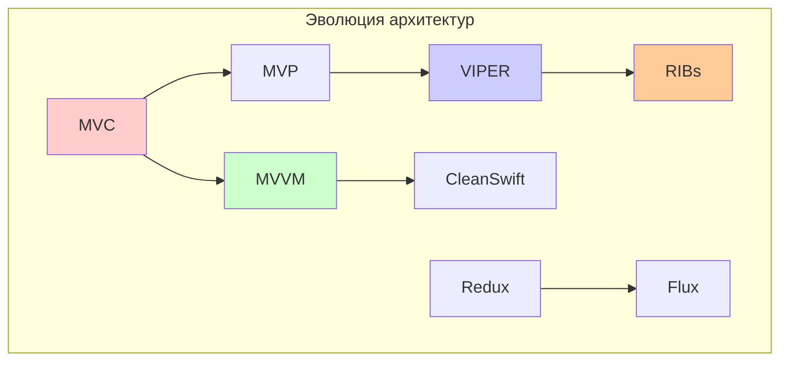
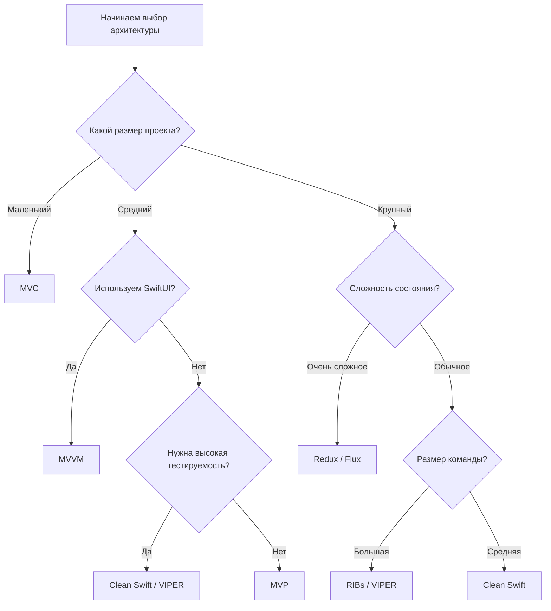
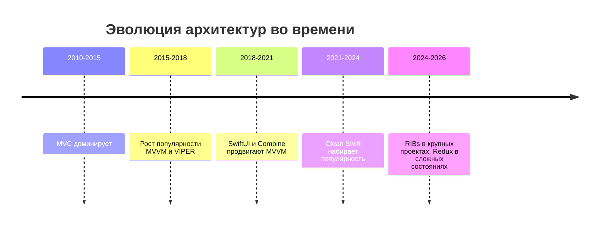

#architecture #ios #swift #mvc #mvp #mvvm #viper #clean-swift #ribs #redux #flux #design-patterns

---
## Сравнение архитектурных подходов в iOS-разработке

### Введение
Выбор правильной архитектуры — одно из ключевых решений при разработке iOS-приложения. Архитектура определяет, как код будет организован, как легко его будет тестировать, поддерживать и расширять. В этой статье мы подробно сравним основные архитектурные подходы, используемые в [[iOS]]-сообществе.



---

### 1. Сравнительная таблица

| Характеристика                    | [[MVC (Model-View-Controller) Architecture\|MVC]] | [[MVP (Model-View-Presenter) Architecture\|MVP]] | [[MVVM (Model-View-ViewModel) Architecture\|MVVM]] | [[VIPER Architecture\|VIPER]] | [[Clean Swift (VIP) Architecture\|Clean Swift]] | [[RIBs]]      | [[Redux Architecture\|Redux]] | [[Flux]] |
| --------------------------------- | ------------------------------------------------- | ------------------------------------------------ | -------------------------------------------------- | ----------------------------- | ----------------------------------------------- | ------------- | ----------------------------- | -------- |
| **Сложность**                     | Низкая                                            | Средняя                                          | Средняя                                            | Высокая                       | Высокая                                         | Очень высокая | Средняя                       | Средняя  |
| **Тестируемость**                 | Низкая                                            | Высокая                                          | Высокая                                            | Очень высокая                 | Очень высокая                                   | Высокая       | Высокая                       | Высокая  |
| **Разделение ответственности**    | Низкое                                            | Среднее                                          | Среднее                                            | Высокое                       | Высокое                                         | Очень высокое | Высокое                       | Высокое  |
| **Boilerplate код**               | Минимум                                           | Средне                                           | Средне                                             | Много                         | Много                                           | Очень много   | Средне                        | Средне   |
| **Порог вхождения**               | Низкий                                            | Средний                                          | Средний                                            | Высокий                       | Высокий                                         | Очень высокий | Средний                       | Средний  |
| **Подходит для малых проектов**   | ✅                                                 | ✅                                                | ✅                                                  | ❌                             | ❌                                               | ❌             | ❌                             | ❌        |
| **Подходит для средних проектов** | ❌                                                 | ✅                                                | ✅                                                  | ✅                             | ✅                                               | ❌             | ✅                             | ✅        |
| **Подходит для крупных проектов** | ❌                                                 | ❌                                                | ✅                                                  | ✅                             | ✅                                               | ✅             | ✅                             | ✅        |
| **Интеграция с [[SwiftUI]]**      | ❌                                                 | ❌                                                | ✅                                                  | ❌                             | ❌                                               | ❌             | ❌                             | ❌        |
| **Интеграция с Combine**          | ❌                                                 | ❌                                                | ✅                                                  | ❌                             | ❌                                               | ❌             | ✅                             | ✅        |
| **Поддержка [[UIKit]]**           | ✅                                                 | ✅                                                | ✅                                                  | ✅                             | ✅                                               | ✅             | ✅                             | ✅        |

---

### 2. Детальный разбор каждой архитектуры

#### 2.1 [[MVC (Model-View-Controller) Architecture|MVC]]

**Код:**
```swift
// Model
struct User {
    let name: String
    let email: String
}

// View (в сториборде или кодом)
class UserView: UIView {
    let nameLabel = UILabel()
    let emailLabel = UILabel()
}

// Controller
class UserViewController: UIViewController {
    @IBOutlet weak var nameLabel: UILabel!
    @IBOutlet weak var emailLabel: UILabel!
    
    var user: User?
    
    override func viewDidLoad() {
        super.viewDidLoad()
        loadUser()
    }
    
    func loadUser() {
        user = User(name: "John", email: "john@example.com")
        updateUI()
    }
    
    func updateUI() {
        nameLabel.text = user?.name
        emailLabel.text = user?.email
    }
}
```

**Проблема Massive ViewController:**
```swift
class MassiveViewController: UIViewController {
    // Смесь всего:
    // - Логика UI
    // - Бизнес-логика
    // - Сетевые запросы
    // - Работа с БД
    // - Навигация
    // - Обработка ошибок
}
```

#### 2.2 [[MVP (Model-View-Presenter) Architecture|MVP]]

```swift
// Model
struct User {
    let name: String
    let email: String
}

// View Protocol
protocol UserViewProtocol: AnyObject {
    func showName(_ name: String)
    func showEmail(_ email: String)
    func showLoading()
    func hideLoading()
    func showError(_ message: String)
}

// Presenter
class UserPresenter {
    weak var view: UserViewProtocol?
    private let userService: UserService
    
    init(userService: UserService) {
        self.userService = userService
    }
    
    func attachView(_ view: UserViewProtocol) {
        self.view = view
    }
    
    func loadUser(id: Int) {
        view?.showLoading()
        userService.fetchUser(id: id) { [weak self] result in
            self?.view?.hideLoading()
            switch result {
            case .success(let user):
                self?.view?.showName(user.name)
                self?.view?.showEmail(user.email)
            case .failure(let error):
                self?.view?.showError(error.localizedDescription)
            }
        }
    }
}

// View Controller
class UserViewController: UIViewController, UserViewProtocol {
    @IBOutlet weak var nameLabel: UILabel!
    @IBOutlet weak var emailLabel: UILabel!
    @IBOutlet weak var loadingIndicator: UIActivityIndicatorView!
    
    var presenter: UserPresenter!
    
    override func viewDidLoad() {
        super.viewDidLoad()
        presenter.loadUser(id: 1)
    }
    
    func showName(_ name: String) {
        nameLabel.text = name
    }
    
    func showEmail(_ email: String) {
        emailLabel.text = email
    }
    
    func showLoading() {
        loadingIndicator.startAnimating()
    }
    
    func hideLoading() {
        loadingIndicator.stopAnimating()
    }
    
    func showError(_ message: String) {
        let alert = UIAlertController(title: "Error", message: message, preferredStyle: .alert)
        alert.addAction(UIAlertAction(title: "OK", style: .default))
        present(alert, animated: true)
    }
}
```

#### 2.3 [[MVVM (Model-View-ViewModel) Architecture|MVVM]] с [[Combine]]

```swift
import Combine

// Model
struct User {
    let name: String
    let email: String
}

// ViewModel
class UserViewModel: ObservableObject {
    @Published var name: String = ""
    @Published var email: String = ""
    @Published var isLoading: Bool = false
    @Published var errorMessage: String?
    
    private let userService: UserService
    private var cancellables = Set<AnyCancellable>()
    
    init(userService: UserService) {
        self.userService = userService
    }
    
    func loadUser(id: Int) {
        isLoading = true
        errorMessage = nil
        
        userService.fetchUser(id: id)
            .receive(on: DispatchQueue.main)
            .sink { [weak self] completion in
                self?.isLoading = false
                if case .failure(let error) = completion {
                    self?.errorMessage = error.localizedDescription
                }
            } receiveValue: { [weak self] user in
                self?.name = user.name
                self?.email = user.email
            }
            .store(in: &cancellables)
    }
}

// SwiftUI View
struct UserView: View {
    @StateObject var viewModel: UserViewModel
    
    var body: some View {
        VStack {
            if viewModel.isLoading {
                ProgressView()
            } else {
                Text(viewModel.name)
                Text(viewModel.email)
            }
        }
        .onAppear {
            viewModel.loadUser(id: 1)
        }
        .alert(item: $viewModel.errorMessage) { error in
            Alert(title: Text("Error"), message: Text(error))
        }
    }
}

// UIKit ViewController с MVVM
class UserViewController: UIViewController {
    @IBOutlet weak var nameLabel: UILabel!
    @IBOutlet weak var emailLabel: UILabel!
    @IBOutlet weak var loadingIndicator: UIActivityIndicatorView!
    
    var viewModel: UserViewModel!
    private var cancellables = Set<AnyCancellable>()
    
    override func viewDidLoad() {
        super.viewDidLoad()
        bindViewModel()
        viewModel.loadUser(id: 1)
    }
    
    private func bindViewModel() {
        viewModel.$name
            .assign(to: \.text, on: nameLabel)
            .store(in: &cancellables)
        
        viewModel.$email
            .assign(to: \.text, on: emailLabel)
            .store(in: &cancellables)
        
        viewModel.$isLoading
            .sink { [weak self] isLoading in
                if isLoading {
                    self?.loadingIndicator.startAnimating()
                } else {
                    self?.loadingIndicator.stopAnimating()
                }
            }
            .store(in: &cancellables)
        
        viewModel.$errorMessage
            .compactMap { $0 }
            .sink { [weak self] error in
                self?.showError(error)
            }
            .store(in: &cancellables)
    }
}
```

#### 2.4 [[VIPER Architecture|VIPER]] (полная реализация)

```swift
// Entity (Model)
struct UserEntity {
    let id: Int
    let name: String
    let email: String
}

// Interactor - бизнес-логика
protocol UserInteractorProtocol {
    func fetchUser(id: Int)
}

class UserInteractor: UserInteractorProtocol {
    weak var presenter: UserPresenterProtocol?
    private let userService: UserService
    
    init(userService: UserService) {
        self.userService = userService
    }
    
    func fetchUser(id: Int) {
        userService.fetchUser(id: id) { [weak self] result in
            switch result {
            case .success(let user):
                self?.presenter?.userFetched(user)
            case .failure(let error):
                self?.presenter?.userFetchFailed(error)
            }
        }
    }
}

// Presenter
protocol UserPresenterProtocol: AnyObject {
    func viewDidLoad()
    func userFetched(_ user: UserEntity)
    func userFetchFailed(_ error: Error)
}

class UserPresenter: UserPresenterProtocol {
    weak var view: UserViewProtocol?
    var interactor: UserInteractorProtocol?
    var router: UserRouterProtocol?
    
    func viewDidLoad() {
        view?.showLoading()
        interactor?.fetchUser(id: 1)
    }
    
    func userFetched(_ user: UserEntity) {
        view?.hideLoading()
        view?.showUser(user)
    }
    
    func userFetchFailed(_ error: Error) {
        view?.hideLoading()
        view?.showError(error.localizedDescription)
    }
}

// View Protocol
protocol UserViewProtocol: AnyObject {
    func showLoading()
    func hideLoading()
    func showUser(_ user: UserEntity)
    func showError(_ message: String)
}

// View Controller
class UserViewController: UIViewController, UserViewProtocol {
    @IBOutlet weak var nameLabel: UILabel!
    @IBOutlet weak var emailLabel: UILabel!
    @IBOutlet weak var loadingIndicator: UIActivityIndicatorView!
    
    var presenter: UserPresenterProtocol?
    
    override func viewDidLoad() {
        super.viewDidLoad()
        presenter?.viewDidLoad()
    }
    
    func showLoading() {
        loadingIndicator.startAnimating()
    }
    
    func hideLoading() {
        loadingIndicator.stopAnimating()
    }
    
    func showUser(_ user: UserEntity) {
        nameLabel.text = user.name
        emailLabel.text = user.email
    }
    
    func showError(_ message: String) {
        let alert = UIAlertController(title: "Error", message: message, preferredStyle: .alert)
        alert.addAction(UIAlertAction(title: "OK", style: .default))
        present(alert, animated: true)
    }
}

// Router
protocol UserRouterProtocol {
    func navigateToEdit()
    func navigateBack()
}

class UserRouter: UserRouterProtocol {
    weak var viewController: UIViewController?
    
    static func createModule() -> UIViewController {
        let view = UserViewController()
        let interactor = UserInteractor(userService: UserService())
        let presenter = UserPresenter()
        let router = UserRouter()
        
        view.presenter = presenter
        presenter.view = view
        presenter.interactor = interactor
        presenter.router = router
        interactor.presenter = presenter
        router.viewController = view
        
        return view
    }
    
    func navigateToEdit() {
        let editVC = EditUserViewController()
        viewController?.navigationController?.pushViewController(editVC, animated: true)
    }
    
    func navigateBack() {
        viewController?.navigationController?.popViewController(animated: true)
    }
}
```

#### 2.5 [[Clean Swift (VIP) Architecture|CleanSwift]]

```swift
// Models
enum UserModels {
    struct Request {
        let userId: Int
    }
    
    struct Response {
        let user: UserEntity
    }
    
    struct ViewModel {
        let name: String
        let email: String
    }
}

// View Controller
protocol UserDisplayLogic: AnyObject {
    func displayUser(viewModel: UserModels.ViewModel)
    func displayError(message: String)
}

class UserViewController: UIViewController, UserDisplayLogic {
    @IBOutlet weak var nameLabel: UILabel!
    @IBOutlet weak var emailLabel: UILabel!
    
    var interactor: UserBusinessLogic?
    var router: (NSObjectProtocol & UserRoutingLogic & UserDataPassing)?
    
    override func viewDidLoad() {
        super.viewDidLoad()
        loadUser()
    }
    
    func loadUser() {
        let request = UserModels.Request(userId: 1)
        interactor?.fetchUser(request: request)
    }
    
    func displayUser(viewModel: UserModels.ViewModel) {
        nameLabel.text = viewModel.name
        emailLabel.text = viewModel.email
    }
    
    func displayError(message: String) {
        let alert = UIAlertController(title: "Error", message: message, preferredStyle: .alert)
        alert.addAction(UIAlertAction(title: "OK", style: .default))
        present(alert, animated: true)
    }
}

// Interactor
protocol UserBusinessLogic {
    func fetchUser(request: UserModels.Request)
}

class UserInteractor: UserBusinessLogic {
    var presenter: UserPresentationLogic?
    var worker: UserWorker?
    
    func fetchUser(request: UserModels.Request) {
        worker?.fetchUser(id: request.userId) { [weak self] result in
            switch result {
            case .success(let user):
                let response = UserModels.Response(user: user)
                self?.presenter?.presentUser(response: response)
            case .failure(let error):
                self?.presenter?.presentError(error: error)
            }
        }
    }
}

// Presenter
protocol UserPresentationLogic {
    func presentUser(response: UserModels.Response)
    func presentError(error: Error)
}

class UserPresenter: UserPresentationLogic {
    weak var viewController: UserDisplayLogic?
    
    func presentUser(response: UserModels.Response) {
        let viewModel = UserModels.ViewModel(
            name: response.user.name,
            email: response.user.email
        )
        viewController?.displayUser(viewModel: viewModel)
    }
    
    func presentError(error: Error) {
        viewController?.displayError(message: error.localizedDescription)
    }
}

// Worker
class UserWorker {
    func fetchUser(id: Int, completion: @escaping (Result<UserEntity, Error>) -> Void) {
        // сетевой запрос
    }
}

// Router
@objc protocol UserRoutingLogic {
    func routeToEdit()
}

protocol UserDataPassing {
    var dataStore: UserDataStore? { get }
}

class UserRouter: NSObject, UserRoutingLogic, UserDataPassing {
    weak var viewController: UserViewController?
    var dataStore: UserDataStore?
    
    func routeToEdit() {
        let editVC = EditUserViewController()
        // передача данных
        viewController?.navigationController?.pushViewController(editVC, animated: true)
    }
}
```

#### 2.6 [[RIBs]] (упрощенный пример)

```swift
// Router
protocol UserRouting: ViewableRouting {
    func routeToEdit()
    func routeToSettings()
}

final class UserRouter: ViewableRouter<UserInteractable, UserViewControllable>, UserRouting {
    func routeToEdit() {
        let editRouter = EditUserBuilder.build()
        attachChild(editRouter)
        viewController.present(editRouter.viewControllable)
    }
    
    func routeToSettings() {
        let settingsRouter = SettingsBuilder.build()
        attachChild(settingsRouter)
        viewController.push(settingsRouter.viewControllable)
    }
}

// Interactor
protocol UserInteractable: Interactable {
    var router: UserRouting? { get set }
    var listener: UserListener? { get set }
}

final class UserInteractor: PresentableInteractor<UserPresentable>, UserInteractable {
    weak var router: UserRouting?
    weak var listener: UserListener?
    
    override func didBecomeActive() {
        super.didBecomeActive()
        loadUser()
    }
    
    private func loadUser() {
        // загрузка данных
    }
}

// Builder
protocol UserBuildable: Buildable {
    func build(withListener listener: UserListener) -> UserRouting
}

final class UserBuilder: Builder<RootComponent>, UserBuildable {
    func build(withListener listener: UserListener) -> UserRouting {
        let component = UserComponent(dependency: dependency)
        let viewController = UserViewController()
        let interactor = UserInteractor(presenter: viewController)
        interactor.listener = listener
        let router = UserRouter(interactor: interactor, viewController: viewController)
        return router
    }
}
```

#### 2.7 [[Redux Architecture|REDUX]]

```swift
import Combine

// State
struct AppState {
    var users: [User] = []
    var isLoading: Bool = false
    var error: String?
}

// Actions
enum AppAction {
    case loadUsers
    case setUsers([User])
    case setLoading(Bool)
    case setError(String)
}

// Reducer
func appReducer(state: inout AppState, action: AppAction) {
    switch action {
    case .loadUsers:
        state.isLoading = true
        state.error = nil
    case .setUsers(let users):
        state.users = users
        state.isLoading = false
    case .setLoading(let isLoading):
        state.isLoading = isLoading
    case .setError(let error):
        state.error = error
        state.isLoading = false
    }
}

// Store
class Store<State, Action>: ObservableObject {
    @Published private(set) var state: State
    private let reducer: (inout State, Action) -> Void
    
    init(initialState: State, reducer: @escaping (inout State, Action) -> Void) {
        self.state = initialState
        self.reducer = reducer
    }
    
    func dispatch(_ action: Action) {
        reducer(&state, action)
    }
}

// Middleware (для side effects)
func usersMiddleware(service: UserService) -> Middleware<AppState, AppAction> {
    return { store, action in
        switch action {
        case .loadUsers:
            service.fetchUsers { result in
                switch result {
                case .success(let users):
                    store.dispatch(.setUsers(users))
                case .failure(let error):
                    store.dispatch(.setError(error.localizedDescription))
                }
            }
        default:
            break
        }
    }
}

// Использование в View
struct UsersListView: View {
    @StateObject var store: Store<AppState, AppAction>
    
    var body: some View {
        List(store.state.users, id: \.id) { user in
            Text(user.name)
        }
        .overlay {
            if store.state.isLoading {
                ProgressView()
            }
        }
        .alert(item: store.state.error) { error in
            Alert(title: Text("Error"), message: Text(error))
        }
        .onAppear {
            store.dispatch(.loadUsers)
        }
    }
}
```

---

### 3. Критерии выбора архитектуры

#### 3.1 По размеру проекта

| Размер проекта | Рекомендуемая архитектура | Почему |
|----------------|--------------------------|--------|
| **Маленький (1-2 экрана, прототип)** | MVC | Минимум overhead, быстрый старт |
| **Небольшой (до 10 экранов)** | MVP, MVVM | Хороший баланс структуры и простоты |
| **Средний (10-30 экранов)** | MVVM, Clean Swift | Нужна модульность и тестируемость |
| **Крупный (30+ экранов)** | VIPER, RIBs | Максимальная модульность, параллельная разработка |
| **С очень сложным состоянием** | Redux, Flux | Предсказуемое управление состоянием |

#### 3.2 По используемым фреймворкам

| Фреймворк                  | Рекомендуемая архитектура   |
| -------------------------- | --------------------------- |
| **[[UIKit]] + Storyboard** | MVC, MVP, VIPER             |
| **UIKit + кодом**          | MVVM, Clean Swift, VIPER    |
| **[[SwiftUI]]**            | MVVM (встроенная поддержка) |
| **[[Combine]] + SwiftUI**  | MVVM, Redux                 |
| **[[RxSwift]]**            | MVVM, Redux                 |

#### 3.3 По требованиям к тестированию

| Уровень тестирования | Архитектуры |
|---------------------|-------------|
| **Минимальное тестирование** | MVC |
| **UI-тесты** | Любая |
| **Юнит-тесты бизнес-логики** | MVP, MVVM, VIPER, Clean Swift |
| **Полное покрытие (unit + интеграционные)** | VIPER, Clean Swift, RIBs |

#### 3.4 По опыту команды

| Уровень команды | Рекомендуемые архитектуры |
|-----------------|--------------------------|
| **Junior разработчики** | MVC, MVVM |
| **Middle разработчики** | MVP, MVVM, Clean Swift |
| **Senior разработчики** | Все варианты |
| **Большая команда (10+ человек)** | VIPER, RIBs (для разделения ответственности) |

---

### 4. Диаграмма принятия решения



---

### 5. Производительность и накладные расходы

| Архитектура | Накладные расходы | Скорость разработки (начальная) | Скорость поддержки (долгосрочная) |
|-------------|------------------|----------------------------------|-----------------------------------|
| MVC | Очень низкие | Очень высокая | Низкая |
| MVP | Низкие | Высокая | Средняя |
| MVVM | Средние | Высокая | Высокая |
| VIPER | Высокие | Низкая | Очень высокий |
| Clean Swift | Высокие | Средняя | Очень высокая |
| RIBs | Очень высокие | Очень низкая | Высокая (для модульных систем) |
| Redux | Средние | Средняя | Высокая |

---

### 6. Примеры использования в реальных проектах

| Архитектура | Примеры приложений |
|------------|-------------------|
| MVC | Многие старые приложения, быстрые прототипы |
| MVP | Приложения с простой бизнес-логикой, где важна тестируемость |
| MVVM | Большинство современных приложений на SwiftUI, приложения с Combine |
| VIPER | Крупные банковские приложения, сложные корпоративные системы |
| Clean Swift | Проекты, где нужен баланс между структурой VIPER и простотой |
| RIBs | Uber, другие приложения с очень сложной навигацией |
| Redux | Приложения со сложным глобальным состоянием, кроссплатформенные проекты |

---

### 7. Тренды и будущее



**Современные тренды:**
1.  **SwiftUI + MVVM** становится стандартом для новых проектов.
2.  **Clean Swift** (VIP) набирает популярность как альтернатива VIPER с меньшим boilerplate.
3.  **RIBs** используется в крупных проектах с командой 20+ разработчиков.
4.  **Redux/Flux** возвращаются с ростом сложности состояния и популярности SwiftUI.
5.  **Комбинации подходов:** многие проекты используют MVVM для экранов и Redux для глобального состояния.

---

### 8. Рекомендации по выбору

#### Для нового проекта:
- **Если используете SwiftUI** → **MVVM** (это естественный выбор)
- **Если UIKit и команда 1-3 разработчика** → **MVVM** или **MVP**
- **Если UIKit и команда 3-7 разработчиков** → **Clean Swift** (хороший баланс)
- **Если UIKit и команда 7+ разработчиков** → **VIPER** или **RIBs**

#### Для существующего проекта:
- **MVC проект с "Massive ViewController"** → Постепенно рефакторить в **MVP** или **MVVM**
- **MVP проект** → Можно оставить или мигрировать в **MVVM**
- **VIPER проект** → Оставить, рефакторинг дорогой
- **Clean Swift проект** → Хорошая основа для роста

#### По сложности:
- **Простое приложение (до 10 экранов)** → MVC или MVP
- **Средней сложности (до 30 экранов)** → MVVM или Clean Swift
- **Сложное приложение (30+ экранов)** → VIPER или RIBs
- **Очень сложное состояние** → Redux + MVVM

---

### Итог

Выбор архитектуры — это компромисс между:
- **Скоростью разработки сейчас** (MVC побеждает)
- **Скоростью поддержки потом** (VIPER/RIBs побеждают)
- **Тестируемостью** (любая кроме MVC)
- **Размером команды** (для больших команд нужна жесткая структура)
- **Технологиями** (SwiftUI диктует MVVM)

**Золотое правило:** Начинайте с простого, усложняйте по мере роста. Лучшая архитектура — та, которую понимает ваша команда и которая решает ваши конкретные проблемы, а не та, которая "модная" или "правильная на бумаге".