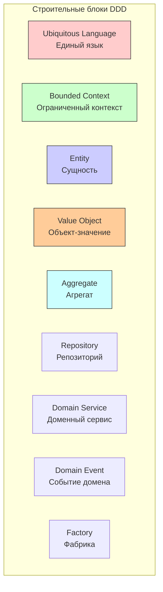

#ddd #architecture #domain-driven-design #swift #ios #clean-architecture #design-patterns #enterprise

---
## Domain-Driven Design (DDD) — Предметно-ориентированное проектирование

### Определение
**Domain-Driven Design (DDD)** — это подход к разработке сложного программного обеспечения, который ставит в центр внимания **предметную область (domain)** и ее логику . Основная идея заключается в создании программной модели, которая точно отражает реальные бизнес-процессы, правила и взаимодействия, при этом разработка ведется в тесном сотрудничестве с экспертами предметной области .

В контексте [[iOS]]-разработки DDD может показаться избыточным для простых приложений, но становится критически важным при создании сложных корпоративных систем, приложений с микросервисной архитектурой или когда бизнес-логика настолько сложна, что требует четкого структурирования.

### Зачем это знать iOS-разработчику?
1.  **Сложные приложения:** Для финансовых, медицинских, логистических приложений с запутанной бизнес-логикой.
2.  **Коммуникация с экспертами:** DDD требует общего языка (Ubiquitous Language), что улучшает взаимопонимание между разработчиками и бизнесом.
3.  **Модульность и масштабирование:** DDD поощряет разделение системы на ограниченные контексты (Bounded Contexts), что упрощает поддержку и развитие.
4.  **Тестирование:** Бизнес-логика изолирована от инфраструктуры, что делает ее легко тестируемой.
5.  **Интеграция с микросервисами:** Каждый ограниченный контекст может стать отдельным микросервисом.

---

### Основные принципы DDD



#### 1. **Ubiquitous Language (Единый язык)**
Все участники команды (разработчики, аналитики, заказчики) используют единый язык, отражающий домен. Термины в коде, документации и обсуждениях должны совпадать .

#### 2. **Bounded Context (Ограниченный контекст)**
Домен делится на контексты, каждый со своей моделью. Границы контекстов определяются организационной структурой и функциональностью. Между контекстами существуют четкие интерфейсы взаимодействия .

#### 3. **Entity (Сущность)**
Объект с уникальным идентификатором и изменяемым состоянием. Две сущности с разными идентификаторами считаются разными, даже если их атрибуты совпадают.

#### 4. **Value Object (Объект-значение)**
Неизменяемый объект, который определяется своими атрибутами, а не идентификатором. Два объекта-значения с одинаковыми атрибутами считаются равными.

#### 5. **Aggregate (Агрегат)**
Группа связанных объектов (сущностей и объектов-значений), которая рассматривается как единое целое для изменения данных. У агрегата есть корень (root) — единственная сущность, через которую происходит доступ к агрегату.

#### 6. **Repository (Репозиторий)**
Предоставляет интерфейс для получения и сохранения агрегатов, скрывая детали хранения (база данных, сеть).

#### 7. **Domain Service (Доменный сервис)**
Содержит бизнес-логику, которая не принадлежит естественно ни одной сущности или объекту-значению.

#### 8. **Domain Event (Событие домена)**
Фиксирует факт свершения важного события в домене, на которое могут реагировать другие части системы.

#### 9. **Factory (Фабрика)**
Инкапсулирует логику создания сложных объектов и агрегатов.

---

### Пример: Интернет-магазин на [[Swift]] с DDD

#### Уровень 0: Настройка модульности ([[SPM|Swift Package Manager]])

```
// Package.swift для модуля Domain
// swift-tools-version:5.9
import PackageDescription

let package = Package(
    name: "Domain",
    platforms: [.iOS(.v15)],
    products: [
        .library(name: "Domain", targets: ["Domain"]),
    ],
    dependencies: [],
    targets: [
        .target(name: "Domain"),
        .testTarget(name: "DomainTests", dependencies: ["Domain"]),
    ]
)
```

#### Уровень 1: Ubiquitous Language — Модели

```swift
// Модуль Domain/Sources/Domain/Models/

import Foundation

// MARK: - Value Objects
struct Money: Equatable {
    let amount: Decimal
    let currency: String
    
    static func + (lhs: Money, rhs: Money) throws -> Money {
        guard lhs.currency == rhs.currency else {
            throw DomainError.currencyMismatch
        }
        return Money(amount: lhs.amount + rhs.amount, currency: lhs.currency)
    }
    
    static func * (lhs: Money, rhs: Int) -> Money {
        return Money(amount: lhs.amount * Decimal(rhs), currency: lhs.currency)
    }
}

struct Address: Equatable {
    let street: String
    let city: String
    let postalCode: String
    let country: String
}

struct CustomerId: Equatable {
    let value: UUID
}

struct ProductId: Equatable {
    let value: UUID
}

struct OrderId: Equatable {
    let value: UUID
}

// MARK: - Entity
struct Customer {
    let id: CustomerId
    var name: String
    var email: String
    var shippingAddress: Address?
}

// MARK: - Entity
struct Product {
    let id: ProductId
    let name: String
    let price: Money
    let description: String
}

// MARK: - Value Object (Item in Order)
struct OrderItem: Equatable {
    let productId: ProductId
    let productName: String
    let quantity: Int
    let unitPrice: Money
    
    var totalPrice: Money {
        return unitPrice * quantity
    }
}

// MARK: - Aggregate Root
struct Order {
    let id: OrderId
    let customerId: CustomerId
    private(set) var items: [OrderItem]
    let shippingAddress: Address
    private(set) var status: OrderStatus
    let createdAt: Date
    private(set) var updatedAt: Date
    
    enum OrderStatus: String {
        case pending, paid, shipped, delivered, cancelled
    }
    
    var totalAmount: Money {
        guard let first = items.first else {
            return Money(amount: 0, currency: "USD")
        }
        return items.dropFirst().reduce(first.totalPrice) { result, item in
            (try? result + item.totalPrice) ?? result
        }
    }
    
    mutating func addItem(_ item: OrderItem) throws {
        guard status == .pending else {
            throw DomainError.orderNotModifiable
        }
        items.append(item)
        updatedAt = Date()
    }
    
    mutating func removeItem(productId: ProductId) throws {
        guard status == .pending else {
            throw DomainError.orderNotModifiable
        }
        items.removeAll { $0.productId == productId }
        updatedAt = Date()
    }
    
    mutating func markAsPaid() throws {
        guard status == .pending else {
            throw DomainError.invalidStatusTransition
        }
        status = .paid
        updatedAt = Date()
    }
    
    mutating func markAsShipped() throws {
        guard status == .paid else {
            throw DomainError.invalidStatusTransition
        }
        status = .shipped
        updatedAt = Date()
    }
}

// MARK: - Domain Events
enum DomainEvent {
    case orderPlaced(Order)
    case orderPaid(OrderId)
    case orderShipped(OrderId)
    case orderCancelled(OrderId)
}

// MARK: - Domain Errors
enum DomainError: Error {
    case orderNotModifiable
    case invalidStatusTransition
    case currencyMismatch
    case insufficientStock
    case customerNotFound
    case productNotFound
}
```

#### Уровень 2: Domain Services и Repositories

```swift
// Модуль Domain/Sources/Domain/Services/

import Foundation

// MARK: - Repository Protocols
protocol CustomerRepository {
    func find(by id: CustomerId) async throws -> Customer?
    func save(_ customer: Customer) async throws
}

protocol ProductRepository {
    func find(by id: ProductId) async throws -> Product?
    func findAll() async throws -> [Product]
}

protocol OrderRepository {
    func find(by id: OrderId) async throws -> Order?
    func findByCustomer(_ customerId: CustomerId) async throws -> [Order]
    func save(_ order: Order) async throws
    func delete(_ id: OrderId) async throws
}

// MARK: - Domain Service: Pricing
struct PricingService {
    func calculateDiscount(for order: Order, customer: Customer) -> Money {
        // Сложная логика скидок
        let subtotal = order.totalAmount
        
        if customer.isVIP {
            return Money(amount: subtotal.amount * 0.1, currency: subtotal.currency)
        }
        
        if order.items.count > 5 {
            return Money(amount: subtotal.amount * 0.05, currency: subtotal.currency)
        }
        
        return Money(amount: 0, currency: subtotal.currency)
    }
}

// MARK: - Domain Service: Inventory
struct InventoryService {
    func checkAvailability(productId: ProductId, quantity: Int) async throws -> Bool {
        // Проверка наличия на складе
        return true // stub
    }
    
    func reserveStock(productId: ProductId, quantity: Int) async throws {
        // Резервирование товара
    }
    
    func releaseStock(productId: ProductId, quantity: Int) async throws {
        // Освобождение резерва
    }
}

// MARK: - Domain Service: Order Processing
class OrderProcessingService {
    private let customerRepo: CustomerRepository
    private let productRepo: ProductRepository
    private let orderRepo: OrderRepository
    private let inventoryService: InventoryService
    private let pricingService: PricingService
    
    init(customerRepo: CustomerRepository,
         productRepo: ProductRepository,
         orderRepo: OrderRepository,
         inventoryService: InventoryService,
         pricingService: PricingService) {
        self.customerRepo = customerRepo
        self.productRepo = productRepo
        self.orderRepo = orderRepo
        self.inventoryService = inventoryService
        self.pricingService = pricingService
    }
    
    func createOrder(customerId: CustomerId,
                     items: [(productId: ProductId, quantity: Int)],
                     shippingAddress: Address) async throws -> Order {
        
        // 1. Найти клиента
        guard let customer = try await customerRepo.find(by: customerId) else {
            throw DomainError.customerNotFound
        }
        
        // 2. Проверить товары и собрать OrderItems
        var orderItems: [OrderItem] = []
        for item in items {
            guard let product = try await productRepo.find(by: item.productId) else {
                throw DomainError.productNotFound
            }
            
            guard try await inventoryService.checkAvailability(productId: item.productId,
                                                               quantity: item.quantity) else {
                throw DomainError.insufficientStock
            }
            
            let orderItem = OrderItem(productId: product.id,
                                       productName: product.name,
                                       quantity: item.quantity,
                                       unitPrice: product.price)
            orderItems.append(orderItem)
        }
        
        // 3. Создать заказ
        var order = Order(id: OrderId(value: UUID()),
                         customerId: customerId,
                         items: orderItems,
                         shippingAddress: shippingAddress,
                         status: .pending,
                         createdAt: Date(),
                         updatedAt: Date())
        
        // 4. Применить скидку (можно добавить как отдельный OrderItem)
        // ...
        
        // 5. Зарезервировать товары
        for item in items {
            try await inventoryService.reserveStock(productId: item.productId, quantity: item.quantity)
        }
        
        // 6. Сохранить заказ
        try await orderRepo.save(order)
        
        // 7. Опубликовать событие
        DomainEventPublisher.shared.publish(.orderPlaced(order))
        
        return order
    }
    
    func cancelOrder(orderId: OrderId) async throws {
        guard var order = try await orderRepo.find(by: orderId) else {
            return
        }
        
        // Бизнес-правило: можно отменить только pending или paid заказ
        guard order.status == .pending || order.status == .paid else {
            throw DomainError.invalidStatusTransition
        }
        
        // Освободить резервы
        for item in order.items {
            try await inventoryService.releaseStock(productId: item.productId,
                                                    quantity: item.quantity)
        }
        
        order.status = .cancelled
        order.updatedAt = Date()
        
        try await orderRepo.save(order)
        
        DomainEventPublisher.shared.publish(.orderCancelled(orderId))
    }
}

// MARK: - Domain Event Publisher
class DomainEventPublisher {
    static let shared = DomainEventPublisher()
    private var handlers: [(DomainEvent) -> Void] = []
    
    private init() {}
    
    func subscribe(_ handler: @escaping (DomainEvent) -> Void) {
        handlers.append(handler)
    }
    
    func publish(_ event: DomainEvent) {
        handlers.forEach { $0(event) }
    }
}
```

#### Уровень 3: Инфраструктура — Репозитории

```swift
// Модуль Infrastructure/Sources/Infrastructure/Repositories/

import Foundation
import CoreData
import Domain

// MARK: - Core Data Customer Repository
class CoreDataCustomerRepository: CustomerRepository {
    private let context: NSManagedObjectContext
    
    init(context: NSManagedObjectContext) {
        self.context = context
    }
    
    func find(by id: CustomerId) async throws -> Customer? {
        let request = NSFetchRequest<CustomerEntity>(entityName: "CustomerEntity")
        request.predicate = NSPredicate(format: "id == %@", id.value as CVarArg)
        request.fetchLimit = 1
        
        let results = try context.fetch(request)
        return results.first?.toDomain()
    }
    
    func save(_ customer: Customer) async throws {
        let request = NSFetchRequest<CustomerEntity>(entityName: "CustomerEntity")
        request.predicate = NSPredicate(format: "id == %@", customer.id.value as CVarArg)
        
        let results = try context.fetch(request)
        let entity = results.first ?? CustomerEntity(context: context)
        
        entity.id = customer.id.value
        entity.name = customer.name
        entity.email = customer.email
        entity.street = customer.shippingAddress?.street
        entity.city = customer.shippingAddress?.city
        entity.postalCode = customer.shippingAddress?.postalCode
        entity.country = customer.shippingAddress?.country
        
        try context.save()
    }
}

// MARK: - In-Memory Repository (для тестов)
class InMemoryOrderRepository: OrderRepository {
    private var orders: [OrderId: Order] = [:]
    private var lock = NSLock()
    
    func find(by id: OrderId) async throws -> Order? {
        lock.lock()
        defer { lock.unlock() }
        return orders[id]
    }
    
    func findByCustomer(_ customerId: CustomerId) async throws -> [Order] {
        lock.lock()
        defer { lock.unlock() }
        return orders.values.filter { $0.customerId == customerId }
    }
    
    func save(_ order: Order) async throws {
        lock.lock()
        defer { lock.unlock() }
        orders[order.id] = order
    }
    
    func delete(_ id: OrderId) async throws {
        lock.lock()
        defer { lock.unlock() }
        orders.removeValue(forKey: id)
    }
}
```

#### Уровень 4: Интеграция с [[SwiftUI]]

```swift
// Модуль Presentation/Sources/Presentation/ViewModels/

import Foundation
import Combine
import Domain
import SwiftUI

@MainActor
class OrderViewModel: ObservableObject {
    @Published var order: Order?
    @Published var isLoading = false
    @Published var errorMessage: String?
    
    private let orderService: OrderProcessingService
    private let orderRepo: OrderRepository
    private var cancellables = Set<AnyCancellable>()
    
    init(orderService: OrderProcessingService,
         orderRepo: OrderRepository) {
        self.orderService = orderService
        self.orderRepo = orderRepo
        
        DomainEventPublisher.shared.subscribe { [weak self] event in
            DispatchQueue.main.async {
                self?.handleDomainEvent(event)
            }
        }
    }
    
    func loadOrder(id: OrderId) async {
        isLoading = true
        defer { isLoading = false }
        
        do {
            order = try await orderRepo.find(by: id)
        } catch {
            errorMessage = error.localizedDescription
        }
    }
    
    func createOrder(customerId: CustomerId,
                     products: [(ProductId, Int)],
                     address: Address) async {
        isLoading = true
        defer { isLoading = false }
        
        do {
            order = try await orderService.createOrder(customerId: customerId,
                                                        items: products,
                                                        shippingAddress: address)
        } catch {
            errorMessage = error.localizedDescription
        }
    }
    
    func cancelOrder() async {
        guard let orderId = order?.id else { return }
        
        isLoading = true
        defer { isLoading = false }
        
        do {
            try await orderService.cancelOrder(orderId: orderId)
        } catch {
            errorMessage = error.localizedDescription
        }
    }
    
    private func handleDomainEvent(_ event: DomainEvent) {
        switch event {
        case .orderPlaced(let order):
            self.order = order
        case .orderCancelled(let orderId):
            if self.order?.id == orderId {
                self.order?.status = .cancelled
            }
        default:
            break
        }
    }
}

// MARK: - SwiftUI View
struct OrderView: View {
    @StateObject var viewModel: OrderViewModel
    let orderId: OrderId
    
    var body: some View {
        Group {
            if viewModel.isLoading {
                ProgressView()
            } else if let order = viewModel.order {
                OrderDetailView(order: order)
            } else if let error = viewModel.errorMessage {
                ErrorView(message: error) {
                    Task {
                        await viewModel.loadOrder(id: orderId)
                    }
                }
            }
        }
        .task {
            await viewModel.loadOrder(id: orderId)
        }
    }
}
```

#### Уровень 5: Factory для создания сложных объектов

```swift
// Модуль Domain/Sources/Domain/Factories/

import Foundation

struct OrderFactory {
    static func createEmptyOrder(for customerId: CustomerId,
                                  shippingAddress: Address) -> Order {
        return Order(id: OrderId(value: UUID()),
                    customerId: customerId,
                    items: [],
                    shippingAddress: shippingAddress,
                    status: .pending,
                    createdAt: Date(),
                    updatedAt: Date())
    }
    
    static func createGiftOrder(for customerId: CustomerId,
                                 product: Product,
                                 quantity: Int,
                                 recipientName: String,
                                 message: String) throws -> Order {
        // Специальная логика для подарочных заказов
        let giftItem = OrderItem(productId: product.id,
                                  productName: product.name,
                                  quantity: quantity,
                                  unitPrice: product.price)
        
        return Order(id: OrderId(value: UUID()),
                    customerId: customerId,
                    items: [giftItem],
                    shippingAddress: Address(
                        street: "Gift Address",
                        city: "Gift City",
                        postalCode: "00000",
                        country: "Gift Country"
                    ),
                    status: .pending,
                    createdAt: Date(),
                    updatedAt: Date())
    }
}
```

#### Уровень 6: Комплексный пример с несколькими bounded contexts

```swift
// Bounded Context: Order Management
namespace OrderContext {
    // Модели, репозитории, сервисы только для заказов
    struct Order { /* ... */ }
    class OrderService { /* ... */ }
}

// Bounded Context: Inventory
namespace InventoryContext {
    // Модели, репозитории, сервисы только для склада
    struct StockItem { /* ... */ }
    class InventoryService { /* ... */ }
}

// Bounded Context: Customer
namespace CustomerContext {
    // Модели, репозитории, сервисы только для клиентов
    struct Customer { /* ... */ }
    class CustomerService { /* ... */ }
}

// Антикоррупционный слой (Anti-Corruption Layer) между контекстами
class InventoryAntiCorruptionLayer {
    private let inventoryService: InventoryContext.InventoryService
    
    init(inventoryService: InventoryContext.InventoryService) {
        self.inventoryService = inventoryService
    }
    
    func reserveForOrder(productId: ProductId, quantity: Int) async throws {
        // Преобразование между моделями контекстов
        let stockItemId = StockItemId(productId)
        try await inventoryService.reserve(stockItemId, quantity)
    }
}
```

#### Уровень 7: Тестирование доменной логики

```swift
// Модуль DomainTests

import XCTest
@testable import Domain

final class OrderTests: XCTestCase {
    
    func testOrderTotalCalculation() throws {
        let product1 = Product(id: ProductId(value: UUID()),
                               name: "Test",
                               price: Money(amount: 10, currency: "USD"),
                               description: "")
        let product2 = Product(id: ProductId(value: UUID()),
                               name: "Test2",
                               price: Money(amount: 20, currency: "USD"),
                               description: "")
        
        let item1 = OrderItem(productId: product1.id,
                              productName: product1.name,
                              quantity: 2,
                              unitPrice: product1.price)
        let item2 = OrderItem(productId: product2.id,
                              productName: product2.name,
                              quantity: 1,
                              unitPrice: product2.price)
        
        var order = Order(id: OrderId(value: UUID()),
                         customerId: CustomerId(value: UUID()),
                         items: [item1, item2],
                         shippingAddress: Address(street: "Street", city: "City", postalCode: "123", country: "Country"),
                         status: .pending,
                         createdAt: Date(),
                         updatedAt: Date())
        
        XCTAssertEqual(order.totalAmount.amount, 40)
        XCTAssertEqual(order.totalAmount.currency, "USD")
    }
    
    func testOrderCannotBeModifiedAfterPayment() throws {
        var order = OrderFactory.createEmptyOrder(for: CustomerId(value: UUID()),
                                                   shippingAddress: Address(
                                                    street: "S",
                                                    city: "C",
                                                    postalCode: "1",
                                                    country: "C"))
        
        try order.markAsPaid()
        
        let item = OrderItem(productId: ProductId(value: UUID()),
                             productName: "Test",
                             quantity: 1,
                             unitPrice: Money(amount: 10, currency: "USD"))
        
        XCTAssertThrowsError(try order.addItem(item)) { error in
            XCTAssertEqual(error as? DomainError, DomainError.orderNotModifiable)
        }
    }
}
```

---

### DDD и другие архитектуры

| Архитектура                                                | Соотношение с DDD                                                           |
| ---------------------------------------------------------- | --------------------------------------------------------------------------- |
| **[[Clean Swift (VIP) Architecture\|Clean Architecture]]** | Идеально сочетается — DDD определяет доменный слой, Clean — всю архитектуру |
| **[[VIPER Architecture\|VIPER]]**                          | Можно использовать DDD в Interactor'ах                                      |
| **[[MVVM (Model-View-ViewModel) Architecture\|MVVM]]**     | ViewModel может использовать доменные сервисы и модели                      |
| **[[RIBs]]**                                               | Каждый RIB может быть bounded context'ом                                    |
| **[[Redux Architecture\|Redux]]**                          | Состояние и редьюсеры могут отражать доменные события                       |

---

### Инструменты и библиотеки для DDD в Swift

| Инструмент                                      | Назначение                                  |
| ----------------------------------------------- | ------------------------------------------- |
| **[[SPM\|Swift Package Manager]]**              | Модульность, разделение на bounded contexts |
| **[[Core Data]] / [[Realm]]**                   | Хранение агрегатов                          |
| **[[Combine]] / [[RxSwift]]**                   | Реактивная обработка событий                |
| **[[Swift Concurrency]] ([[async]]/[[await]])** | Асинхронные операции в сервисах             |
| **[[XCTest]]**                                  | Тестирование доменной логики                |
| **Sourcery**                                    | Генерация кода для репозиториев             |

---

### Преимущества DDD в iOS

1.  **Читаемость кода:** Бизнес-логика выражена так, как это понимают доменные эксперты .
2.  **Гибкость:** Легче адаптироваться к изменениям в бизнес-требованиях .
3.  **Тестируемость:** Логика, завязанная на агрегатах и сервисах, легко тестируется изолированно .
4.  **Модульность:** Bounded contexts можно разрабатывать независимо .
5.  **Коммуникация:** Единый язык улучшает взаимопонимание между разработчиками и бизнесом .
6.  **Долгосрочная поддержка:** Структурированный код проще поддерживать в больших проектах .

### Недостатки и сложности

1.  **Избыточность для простых приложений:** DDD добавляет сложность там, где она не нужна.
2.  **Порог вхождения:** Требует понимания концепций и обучения команды.
3.  **Необходимость экспертов:** Требует постоянного доступа к экспертам предметной области.
4.  **Инфраструктура:** Требует продуманной модульной архитектуры.
5.  **Время на проектирование:** На начальном этапе требуется больше времени на анализ.

### Итог
**Domain-Driven Design** — это мощный подход для разработки сложных iOS-приложений с богатой бизнес-логикой. Он требует тесного сотрудничества с экспертами, четкого разделения на bounded contexts и строгой организации кода. В сочетании с Clean Architecture, Swift Concurrency и модульностью через SPM, DDD позволяет создавать гибкие, тестируемые и поддерживаемые приложения, способные эволюционировать вместе с бизнесом.