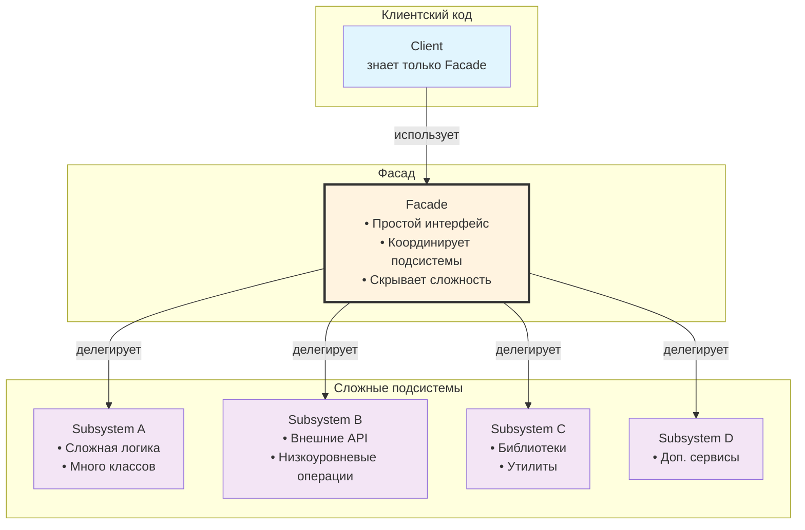

**Facade** (Фасад) — это **структурный паттерн проектирования**, который предоставляет **упрощённый унифицированный интерфейс** к сложной подсистеме классов, библиотеке или набору интерфейсов.

Главная идея:  
спрятать сложность внутренней реализации за простым, понятным и удобным фасадом.

### Когда использовать Facade (реальные ситуации 2025–2026)

| Ситуация в iOS-приложении                                                                      | Почему нужен Facade                                                       | Пример из реальной практики                                               |
| ---------------------------------------------------------------------------------------------- | ------------------------------------------------------------------------- | ------------------------------------------------------------------------- |
| Работа с несколькими сервисами одновременно (auth + network + storage + analytics)             | Клиентский код не должен знать про все детали интеграции                  | AuthService + NetworkService + [[Keychain]] + Analytics → один AuthFacade |
| Интеграция стороннего сложного SDK ([[MapKit]] + [[Core Location]] + Permissions + Geocoding)  | Хочется один метод `getCurrentCity()` вместо 50 строк кода                | LocationFacade                                                            |
| Работа с [[Core Data]] / [[Realm]] / [[SwiftData]] + маппинг моделей                           | Скрыть весь Core Data boilerplate и маппинг                               | DataRepository / PersistenceFacade                                        |
| Работа с [[AVFoundation]] (запись видео + обработка + экспорт + метаданные)                    | Один вызов `recordAndSaveVideo()` вместо цепочки из 10 шагов              | MediaCaptureFacade                                                        |
| Интеграция нескольких аналитических трекеров ([[Firebase]] + Amplitude + Mixpanel + AppsFlyer) | Один вызов `trackEvent("purchase")` — трекеры сами решают, куда отправить | AnalyticsFacade                                                           |
| Работа с Push-уведомлениями + [[Deep Link]]s + [[Universal Link]]s                             | Один метод `handle(url:)` или `handle(notification:)`                     | NavigationFacade / DeepLinkFacade                                         |
| Сложная бизнес-логика оплаты (Apple Pay + Stripe + In-App Purchases + подписки)                | Клиент вызывает `purchase(productId:)` — остальное скрыто                 | PaymentFacade                                                             |

### Классическая структура Facade



### Реальный пример Facade в iOS-приложении (2026 стиль)

**Задача**:  
Скрыть всю сложность авторизации (Sign in with Apple, email/password, refresh token, keychain, аналитика, onboarding).

```swift
// Целевой простой интерфейс, который хочет клиент
protocol AuthService {
    var isAuthenticated: Bool { get }
    func signInWithApple() async throws -> User
    func signInWithEmail(_ email: String, password: String) async throws -> User
    func signOut() async throws
    func refreshSession() async throws
}

// Сложная подсистема (много классов)
class AppleSignInManager     { ... }
class EmailAuthManager       { ... }
class TokenStorage           { ... } // Keychain + Secure Enclave
class SessionValidator       { ... }
class AnalyticsTracker       { ... }
class OnboardingCoordinator  { ... }

// Фасад — точка входа
final class AuthFacade: AuthService {
    
    private let appleManager     = AppleSignInManager()
    private let emailManager     = EmailAuthManager()
    private let tokenStorage     = TokenStorage()
    private let sessionValidator = SessionValidator()
    private let analytics        = AnalyticsTracker()
    private let onboarding       = OnboardingCoordinator()
    
    var isAuthenticated: Bool {
        sessionValidator.isValidSession && tokenStorage.hasValidToken
    }
    
    func signInWithApple() async throws -> User {
        let credential = try await appleManager.performSignIn()
        let user = try await sessionValidator.validateAndCreateUser(from: credential)
        
        try await tokenStorage.saveTokens(user.tokens)
        analytics.track(event: "sign_in_apple_success")
        onboarding.startIfNeeded(for: user)
        
        return user
    }
    
    func signInWithEmail(_ email: String, password: String) async throws -> User {
        let credential = try await emailManager.signIn(email: email, password: password)
        let user = try await sessionValidator.validateAndCreateUser(from: credential)
        
        try await tokenStorage.saveTokens(user.tokens)
        analytics.track(event: "sign_in_email_success")
        onboarding.startIfNeeded(for: user)
        
        return user
    }
    
    func signOut() async throws {
        try await tokenStorage.clearTokens()
        try await appleManager.revokeCurrentCredential()
        analytics.track(event: "sign_out")
        onboarding.reset()
    }
    
    func refreshSession() async throws {
        let newTokens = try await sessionValidator.refreshTokens()
        try await tokenStorage.saveTokens(newTokens)
        analytics.track(event: "session_refreshed")
    }
}

// Использование в приложении (очень чисто)
let authService: AuthService = AuthFacade()

if await authService.isAuthenticated {
    // показываем главный экран
} else {
    do {
        let user = try await authService.signInWithApple()
        // переход на главный экран
    } catch {
        // показать ошибку
    }
}
```

### Когда Facade становится слишком большим и перестаёт быть Facade

| Признак проблемы                    | Что делать вместо Facade                        |
| ----------------------------------- | ----------------------------------------------- |
| Facade содержит бизнес-логику       | Вынести в Interactor / UseCase / Service        |
| Facade знает слишком много деталей  | Разбить на несколько маленьких фасадов          |
| Facade начинает координировать flow | Использовать [[Coordinator]] / Router           |
| Facade содержит состояние           | Вынести состояние в отдельный Store / ViewModel |

### Лучшие практики Facade в Swift 2026

- **Держите Facade тонким** — только оркестрация и преобразование интерфейсов  
- **Используйте протокол** как целевой интерфейс — это позволяет легко заменить реализацию  
- **Избегайте** хранения состояния внутри Facade — состояние должно быть в ViewModel / Store  
- **Для асинхронных операций** — используйте [[async]]/[[await]] — это стандарт 2025–2026  
- **Для тестирования** — создавайте протокол и [[mock]]-адаптер — Facade легко тестируется  
- **В [[SwiftUI]]** — Facade часто оборачивается в `@ObservableObject` / `@StateObject`  
- **Документируйте** — пишите комментарий «AuthFacade — единая точка входа для всей авторизации (Apple, email, refresh, sign out)»

**Короткий итог 2026**:
> Facade — это **упрощённый интерфейс** к сложной подсистеме.  
> В 2026 году:  
> - используется для скрытия деталей интеграции SDK, legacy-кода, нескольких сервисов  
> - самый популярный вид — **один класс + протокол**  
> - держите его **тонким** — только координация, без бизнес-логики  
> - это **один из самых полезных** паттернов для создания чистой архитектуры в iOS-приложениях  
