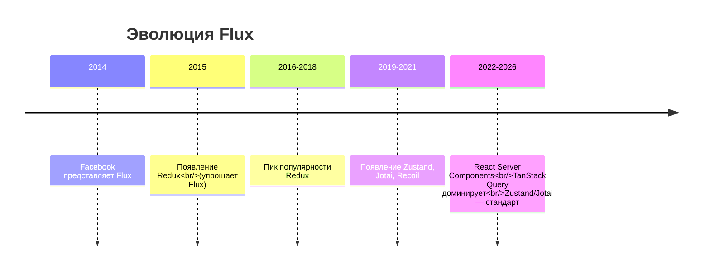
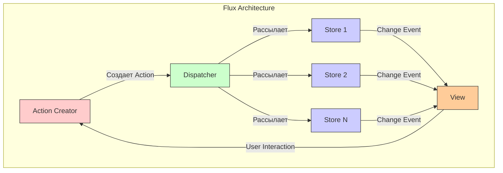

#flux #architecture #state-management #ios #swift #swiftui #combine #redux #unidirectional-data-flow

---
## Flux — Архитектура однонаправленного потока данных

### Определение
**Flux** — это архитектурный паттерн (не библиотека) для управления состоянием приложения, предложенный Facebook в 2014 году для React-приложений . Его ключевая особенность — **однонаправленный поток данных**, который делает изменения состояния предсказуемыми и отслеживаемыми. Flux решал проблему хаотичного обновления состояния в больших одностраничных приложениях (SPA) .

В 2026 году оригинальный Flux практически не используется, но его идеи лежат в основе всех современных решений для управления состоянием: [[Redux Architecture|Redux]], Zustand, Jotai, Recoil и даже архитектурных подходов в [[SwiftUI]] .

### Зачем это знать iOS-разработчику в 2026?
1.  **Понимание эволюции:** Flux — фундамент, на котором построены Redux, The Composable Architecture ([[TCA]]) и другие популярные в [[iOS]]-сообществе архитектуры .
2.  **Unidirectional Data Flow:** Концепция однонаправленного потока данных доказала свою эффективность и широко применяется в сложных iOS-приложениях .
3.  **Интеграция со SwiftUI:** [[SwiftUI]] по своей природе реактивен и отлично сочетается с Flux-подобными архитектурами .
4.  **Предсказуемость состояния:** Flux-подход решает проблему "spaghetti state", когда состояние обновляется из множества мест .
5.  **Отладка и тестирование:** Однонаправленный поток упрощает отладку (каждое действие логируется) и тестирование .

---

### Краткая история и эволюция



- **2014:** Facebook представляет Flux как паттерн для React.
- **2015:** Появляется **Redux**, который упрощает Flux (один store, нет dispatcher'а) и быстро набирает популярность .
- **2016-2018:** Flux практически вытесняется Redux в вебе.
- **2019-2021:** Появляются более легкие альтернативы: Zustand, Jotai, Recoil.
- **2022-2026:** Современный стандарт — комбинация React Query (для серверного состояния) и Zustand/Jotai (для клиентского). Flux-идеи сохраняются, но оригинальная реализация мертва .

---

### Основные принципы Flux



#### 1. **Action Creator**
Создает действия (actions) — простые объекты, описывающие событие (например, `{ type: 'ADD_TODO', payload: 'Купить молоко' }`). Действия содержат тип и опциональные данные .

#### 2. **Dispatcher (Диспетчер)**
Центральный узел, единственный в приложении. Получает все действия и рассылает их всем зарегистрированным store'ам. Обеспечивает порядок обработки действий .

#### 3. **Store (Хранилище)**
Содержит состояние и логику его обновления. Каждый store подписан на dispatcher и реагирует только на определенные действия. После изменения состояния store испускает событие `change`.

#### 4. **View (Представление)**
Подписывается на события store'ов и перерисовывается при изменении данных. В React это компоненты, в iOS — ViewController'ы или SwiftUI View. View также создают новые действия в ответ на действия пользователя .

### Ключевые особенности оригинального Flux

- **Однонаправленный поток данных:** Action → Dispatcher → Store → View → (новый Action) .
- **Множество store'ов:** Каждый store управляет своей частью состояния.
- **Единый dispatcher:** Обеспечивает последовательную обработку действий.
- **Нет встроенной работы с асинхронностью:** Побочные эффекты ([[API]]-запросы) обычно выносятся в Action Creators.

---

### Flux в iOS: Пример реализации на Swift

#### Уровень 0: Базовые компоненты Flux

```swift
import Foundation
import Combine

// MARK: - Action
struct Action<Payload> {
    let type: String
    let payload: Payload?
    
    init(type: String, payload: Payload? = nil) {
        self.type = type
        self.payload = payload
    }
}

// MARK: - Dispatcher (Singleton)
final class Dispatcher {
    static let shared = Dispatcher()
    
    private let actionSubject = PassthroughSubject<AnyAction, Never>()
    private var cancellables = Set<AnyCancellable>()
    
    private init() {}
    
    // Тип, стирающий конкретный тип Payload для передачи
    struct AnyAction {
        let type: String
        let payload: Any?
    }
    
    func dispatch<Payload>(_ action: Action<Payload>) {
        let anyAction = AnyAction(type: action.type, payload: action.payload)
        actionSubject.send(anyAction)
    }
    
    func register<Payload>(handler: @escaping (Action<Payload>) -> Void) -> AnyCancellable {
        actionSubject
            .compactMap { anyAction -> Action<Payload>? in
                guard let payload = anyAction.payload as? Payload else { return nil }
                return Action<Payload>(type: anyAction.type, payload: payload)
            }
            .sink(receiveValue: handler)
    }
}
```

#### Уровень 1: Store и Actions для Todo-приложения

```swift
import Foundation
import Combine

// MARK: - Actions
enum TodoAction {
    static let add = "ADD_TODO"
    static let toggle = "TOGGLE_TODO"
    static let remove = "REMOVE_TODO"
}

// MARK: - Models
struct TodoItem: Identifiable, Equatable {
    let id: UUID
    var title: String
    var isCompleted: Bool
}

// MARK: - Store
class TodoStore: ObservableObject {
    @Published var todos: [TodoItem] = []
    
    private var cancellables = Set<AnyCancellable>()
    
    init() {
        setupDispatcher()
    }
    
    private func setupDispatcher() {
        // Подписываемся на действия через Dispatcher
        Dispatcher.shared.register { [weak self] (action: Action<TodoItem>) in
            switch action.type {
            case TodoAction.add:
                self?.handleAdd(action.payload)
            default:
                break
            }
        }.store(in: &cancellables)
        
        Dispatcher.shared.register { [weak self] (action: Action<UUID>) in
            switch action.type {
            case TodoAction.toggle:
                self?.handleToggle(action.payload)
            case TodoAction.remove:
                self?.handleRemove(action.payload)
            default:
                break
            }
        }.store(in: &cancellables)
    }
    
    private func handleAdd(_ item: TodoItem?) {
        guard let item = item else { return }
        todos.append(item)
    }
    
    private func handleToggle(_ id: UUID?) {
        guard let id = id,
              let index = todos.firstIndex(where: { $0.id == id }) else { return }
        todos[index].isCompleted.toggle()
    }
    
    private func handleRemove(_ id: UUID?) {
        guard let id = id else { return }
        todos.removeAll { $0.id == id }
    }
}
```

#### Уровень 2: Action Creators

```swift
import Foundation

// MARK: - Action Creators
struct TodoActionCreator {
    private let dispatcher = Dispatcher.shared
    
    func addTodo(title: String) {
        let newTodo = TodoItem(id: UUID(), title: title, isCompleted: false)
        let action = Action<TodoItem>(type: TodoAction.add, payload: newTodo)
        dispatcher.dispatch(action)
    }
    
    func toggleTodo(id: UUID) {
        let action = Action<UUID>(type: TodoAction.toggle, payload: id)
        dispatcher.dispatch(action)
    }
    
    func removeTodo(id: UUID) {
        let action = Action<UUID>(type: TodoAction.remove, payload: id)
        dispatcher.dispatch(action)
    }
    
    // Асинхронный action creator (эмуляция загрузки)
    func loadSampleTodos() async {
        // Симуляция сетевого запроса
        try? await Task.sleep(nanoseconds: 1_000_000_000)
        
        let sampleTodos = [
            TodoItem(id: UUID(), title: "Купить молоко", isCompleted: false),
            TodoItem(id: UUID(), title: "Позвонить маме", isCompleted: true),
            TodoItem(id: UUID(), title: "Сделать зарядку", isCompleted: false)
        ]
        
        for todo in sampleTodos {
            let action = Action<TodoItem>(type: TodoAction.add, payload: todo)
            dispatcher.dispatch(action)
        }
    }
}
```

#### Уровень 3: SwiftUI View

```swift
import SwiftUI

struct TodoListView: View {
    @StateObject private var todoStore = TodoStore()
    private let actionCreator = TodoActionCreator()
    @State private var newTodoTitle = ""
    
    var body: some View {
        NavigationView {
            List {
                Section(header: Text("Новая задача")) {
                    HStack {
                        TextField("Введите задачу", text: $newTodoTitle)
                            .textFieldStyle(RoundedBorderTextFieldStyle())
                        
                        Button("Добавить") {
                            guard !newTodoTitle.isEmpty else { return }
                            actionCreator.addTodo(title: newTodoTitle)
                            newTodoTitle = ""
                        }
                    }
                }
                
                Section(header: Text("Задачи")) {
                    ForEach(todoStore.todos) { todo in
                        HStack {
                            Image(systemName: todo.isCompleted ? "checkmark.circle.fill" : "circle")
                                .foregroundColor(todo.isCompleted ? .green : .gray)
                                .onTapGesture {
                                    actionCreator.toggleTodo(id: todo.id)
                                }
                            
                            Text(todo.title)
                                .strikethrough(todo.isCompleted)
                            
                            Spacer()
                            
                            Button(action: {
                                actionCreator.removeTodo(id: todo.id)
                            }) {
                                Image(systemName: "trash")
                                    .foregroundColor(.red)
                            }
                        }
                    }
                }
            }
            .navigationTitle("Flux Todo")
            .toolbar {
                ToolbarItem(placement: .navigationBarTrailing) {
                    Button("Загрузить пример") {
                        Task {
                            await actionCreator.loadSampleTodos()
                        }
                    }
                }
            }
        }
    }
}
```

#### Уровень 4: Улучшенная реализация с [[Combine]] и типами

```swift
import Foundation
import Combine

// MARK: - Типизированный Dispatcher с поддержкой нескольких типов действий
protocol ActionType {}

struct DispatcherV2 {
    private let subject = PassthroughSubject<any ActionType, Never>()
    
    func dispatch(_ action: any ActionType) {
        subject.send(action)
    }
    
    func register<T: ActionType>(_ handler: @escaping (T) -> Void) -> AnyCancellable {
        subject
            .compactMap { $0 as? T }
            .sink(receiveValue: handler)
    }
}

// MARK: - Типизированные действия
struct TodoActions {
    struct Add: ActionType {
        let title: String
    }
    
    struct Toggle: ActionType {
        let id: UUID
    }
    
    struct Remove: ActionType {
        let id: UUID
    }
    
    struct LoadSample: ActionType {}
}

// MARK: - Store с обработкой типизированных действий
class BetterTodoStore: ObservableObject {
    @Published var todos: [TodoItem] = []
    
    private let dispatcher = DispatcherV2.shared
    private var cancellables = Set<AnyCancellable>()
    
    static let shared = BetterTodoStore()
    
    private init() {
        setupBindings()
    }
    
    private func setupBindings() {
        dispatcher.register { (action: TodoActions.Add) in
            let newTodo = TodoItem(id: UUID(), title: action.title, isCompleted: false)
            self.todos.append(newTodo)
        }.store(in: &cancellables)
        
        dispatcher.register { (action: TodoActions.Toggle) in
            guard let index = self.todos.firstIndex(where: { $0.id == action.id }) else { return }
            self.todos[index].isCompleted.toggle()
        }.store(in: &cancellables)
        
        dispatcher.register { (action: TodoActions.Remove) in
            self.todos.removeAll { $0.id == action.id }
        }.store(in: &cancellables)
        
        dispatcher.register { (action: TodoActions.LoadSample) in
            Task {
                await self.loadSampleTodos()
            }
        }.store(in: &cancellables)
    }
    
    private func loadSampleTodos() async {
        try? await Task.sleep(nanoseconds: 1_000_000_000)
        
        let samples = [
            ("Купить молоко", false),
            ("Позвонить маме", true),
            ("Сделать зарядку", false)
        ]
        
        await MainActor.run {
            for (title, completed) in samples {
                let todo = TodoItem(id: UUID(), title: title, isCompleted: completed)
                todos.append(todo)
            }
        }
    }
}
```

---

### Flux vs Redux vs Современные решения

| Характеристика | Flux | Redux | Zustand | TCA (The Composable Architecture) |
|----------------|------|-------|---------|-----------------------------------|
| **Store** | Множество | Один | Множество (можно один) | Один |
| **Dispatcher** | Есть | Нет (редьюсеры) | Нет | Нет |
| **Boilerplate** | Средний | Высокий | Низкий | Средний |
| **Async** | Нет встроенного | Middleware | Встроен в actions | Effect |
| **DevTools** | Нет | Отличные | Хорошие | Отличные |
| **SwiftUI интеграция** | Через ObservableObject | Через ObservableObject | @Observable | ViewStore |
| **Популярность в iOS (2026)** | Низкая | Средняя | Высокая | Высокая (особенно в крупных проектах) |

### Применимость Flux в iOS (2026)

#### Когда может пригодиться понимание Flux
- **Изучение Redux/TCA:** Flux — их концептуальная основа .
- **Проекты с очень сложным состоянием:** Flux-подход доказал свою эффективность .
- **Реактивные приложения:** Хорошо сочетается с Combine и SwiftUI .
- **Обучение команды:** Проще объяснить однонаправленный поток .

#### Когда НЕ стоит использовать оригинальный Flux
- **Новые проекты:** Используйте Zustand, TCA или Redux Toolkit .
- **Простые приложения:** Flux избыточен .
- **Команда не знакома с концепцией:** Есть более простые альтернативы .

### Современные альтернативы Flux для iOS

#### 1. **TCA (The Composable Architecture)**
```swift
import ComposableArchitecture

struct Todo: Equatable, Identifiable {
    let id: UUID
    var title: String
    var isCompleted: Bool
}

struct TodoReducer: Reducer {
    struct State: Equatable {
        var todos: IdentifiedArrayOf<Todo> = []
    }
    
    enum Action {
        case add(String)
        case toggle(id: UUID)
        case remove(id: UUID)
    }
    
    func reduce(into state: inout State, action: Action) -> Effect<Action> {
        switch action {
        case let .add(title):
            let todo = Todo(id: UUID(), title: title, isCompleted: false)
            state.todos.append(todo)
            return .none
            
        case let .toggle(id):
            state.todos[id: id]?.isCompleted.toggle()
            return .none
            
        case let .remove(id):
            state.todos.remove(id: id)
            return .none
        }
    }
}
```

#### 2. **Zustand (порт для SwiftUI)**
```swift
import ZustandSwiftUI

let useTodoStore = Store(
    initialState: TodoStoreState(todos: []),
    actions: { set, get in
        [
            "addTodo": { (title: String) in
                let newTodo = Todo(id: UUID(), title: title, isCompleted: false)
                set { $0.todos.append(newTodo) }
            },
            "toggleTodo": { (id: UUID) in
                set { state in
                    guard let index = state.todos.firstIndex(where: { $0.id == id }) else { return }
                    state.todos[index].isCompleted.toggle()
                }
            }
        ]
    }
)

struct TodoView: View {
    @StoreValue(useTodoStore, \.todos) var todos
    
    var body: some View {
        List(todos) { todo in
            Text(todo.title)
        }
    }
}
```

#### 3. **Redux Toolkit (RTK) + SwiftUI**
```swift
import ReduxKit

struct AppState {
    var todos: [Todo] = []
}

enum AppAction {
    case addTodo(Todo)
    case toggleTodo(UUID)
}

let reducer = Reducer<AppState, AppAction> { state, action in
    switch action {
    case let .addTodo(todo):
        state.todos.append(todo)
    case let .toggleTodo(id):
        guard let index = state.todos.firstIndex(where: { $0.id == id }) else { return }
        state.todos[index].isCompleted.toggle()
    }
    return state
}
```

---

### Преимущества Flux-подхода в iOS

1.  **Предсказуемость:** Состояние изменяется только в одном направлении, что упрощает отладку .
2.  **Тестируемость:** Каждое действие можно тестировать изолированно .
3.  **Отслеживаемость:** Можно логировать все действия и воспроизводить состояния .
4.  **Масштабируемость:** Подход хорошо работает для больших приложений .
5.  **Документированность:** Действия служат документацией того, что может происходить в приложении .

### Недостатки Flux

1.  **Boilerplate:** Оригинальный Flux требует много шаблонного кода .
2.  **Сложность для простых задач:** Для небольшого приложения может быть избыточен .
3.  **Кривая обучения:** Нужно время, чтобы привыкнуть к однонаправленному потоку .
4.  **Оригинальная реализация мертва:** Нет поддержки и развития .

### Итог
**Flux** — это исторически важный архитектурный паттерн, который заложил основы современного управления состоянием. Хотя оригинальный Flux не используется в 2026 году, его идеи живут в Redux, TCA, Zustand и других решениях. Для iOS-разработчика понимание Flux полезно как концептуальная база и как способ осознанного выбора между современными state management библиотеками .
