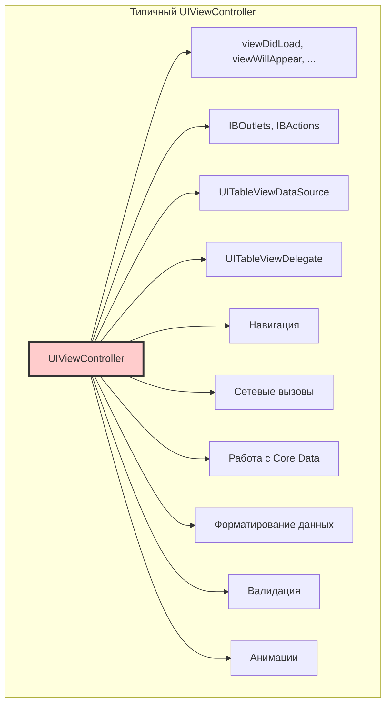

#architecture #mvc #ios #uikit #design-patterns #massive-view-controller #apple

---
### Определение
**MVC (Model-View-Controller)** — это архитектурный паттерн, разделяющий приложение на три взаимосвязанных компонента: **Model** (данные и бизнес-логика), **View** (пользовательский интерфейс) и **Controller** (посредник, управляющий потоком данных) . Это стандартный паттерн, рекомендованный Apple и лежащий в основе фреймворков [[UIKit]] и [[AppKit]].

В идеальной реализации MVC компоненты слабо связаны и имеют четкие обязанности. Однако в классической iOS-реализации (часто называемой **Cocoa MVC**) Controller неизбежно становится перегруженным, что привело к появлению термина **"Massive View Controller"** .

### Зачем это знать iOS-разработчику?
1.  **Фундамент:** MVC — это базовый паттерн, с которого начинают все [[iOS]]-разработчики .
2.  **Стандарт Apple:** UIKit спроектирован вокруг MVC, и понимание этого паттерна необходимо для эффективной работы .
3.  **Точка отсчета:** Понимание проблем MVC мотивирует изучать более сложные архитектуры ([[MVVM (Model-View-ViewModel) Architecture|MVVM]], [[VIPER Architecture|VIPER]], [[Clean Swift (VIP) Architecture|Clean Swift]]) .
4.  **Быстрый старт:** Для простых приложений и прототипов MVC остается самым быстрым способом разработки .
5.  **Поддержка легаси:** Множество существующих проектов написаны на MVC, и их нужно поддерживать .

---

### Компоненты MVC в iOS

```mermaid
graph TD
    subgraph "Model Layer"
        M[Model<br/>Данные, бизнес-логика]
    end

    subgraph "View Layer"
        V[View<br/>UIView, UIButton, UILabel]
    end

    subgraph "Controller Layer"
        C[Controller<br/>UIViewController]
        S[Services<br/>Network, Database]
    end

    U[User] -->|Тап, свайп, ввод| V
    V -->|@IBAction, делегат| C
    C -->|Обновляет| M
    C -->|Обновляет| V
    C -->|Использует| S
    M -.->|KVO, Notification, Delegate| C
    
    style C fill:#ffcccc,stroke:#333,stroke-width:2px
    style M fill:#ccffcc,stroke:#333
    style V fill:#ccccff,stroke:#333
```

#### 1. **Model (Модель)**
**Ответственность:** Представление данных и бизнес-логики приложения.
- **Не знает о View и Controller.**
- Содержит данные ([[struct]]s, [[class]]es) и логику их обработки.
- Уведомляет об изменениях через [[KVO]], [[NotificationCenter]] или [[delegate]] (но обычно этим занимается Controller).

```swift
// Модель
struct User {
    let id: Int
    let name: String
    let email: String
}

class UserModel {
    private(set) var users: [User] = []
    
    func fetchUsers(completion: @escaping () -> Void) {
        // Сетевой запрос
        NetworkService.shared.getUsers { [weak self] users in
            self?.users = users
            completion()
        }
    }
}
```

#### 2. **View (Представление)**
**Ответственность:** Визуальное отображение данных и обработка пользовательского ввода.
- **Максимально "глупая"** — отображает то, что ей скажут.
- Сообщает о действиях пользователя Controller'у (через target-action, delegate, gesture recognizers).
- Не содержит бизнес-логики и не обращается напрямую к Model.

```swift
// View (в сториборде или кодом)
class UserView: UIView {
    let tableView = UITableView()
    let activityIndicator = UIActivityIndicatorView()
    let errorLabel = UILabel()
    
    override init(frame: CGRect) {
        super.init(frame: frame)
        setupUI()
    }
    
    required init?(coder: NSCoder) {
        super.init(coder: coder)
        setupUI()
    }
    
    private func setupUI() {
        // Настройка subviews
    }
}
```

#### 3. **Controller (Контроллер)**
**Ответственность:** Посредник между Model и View.
- Управляет жизненным циклом View ([[viewDidLoad]], [[viewWillAppear]]).
- Обрабатывает пользовательские действия от View.
- Обновляет Model на основе действий пользователя.
- Обновляет View на основе изменений в Model.
- Работает с сервисами (сеть, БД).
- Управляет навигацией.

```swift
class UserViewController: UIViewController {
    // MARK: - IBOutlets
    @IBOutlet weak var tableView: UITableView!
    @IBOutlet weak var activityIndicator: UIActivityIndicatorView!
    
    // MARK: - Properties
    private let model = UserModel()
    private var users: [User] = []
    
    // MARK: - Lifecycle
    override func viewDidLoad() {
        super.viewDidLoad()
        setupTableView()
        loadUsers()
    }
    
    // MARK: - Setup
    private func setupTableView() {
        tableView.delegate = self
        tableView.dataSource = self
        tableView.register(UITableViewCell.self, forCellReuseIdentifier: "Cell")
    }
    
    // MARK: - Business Logic
    private func loadUsers() {
        activityIndicator.startAnimating()
        
        model.fetchUsers { [weak self] in
            self?.users = self?.model.users ?? []
            self?.activityIndicator.stopAnimating()
            self?.tableView.reloadData()
        }
    }
    
    // MARK: - Actions
    @IBAction func refreshButtonTapped(_ sender: UIBarButtonItem) {
        loadUsers()
    }
}

// MARK: - UITableViewDataSource
extension UserViewController: UITableViewDataSource {
    func tableView(_ tableView: UITableView, numberOfRowsInSection section: Int) -> Int {
        return users.count
    }
    
    func tableView(_ tableView: UITableView, cellForRowAt indexPath: IndexPath) -> UITableViewCell {
        let cell = tableView.dequeueReusableCell(withIdentifier: "Cell", for: indexPath)
        let user = users[indexPath.row]
        cell.textLabel?.text = user.name
        return cell
    }
}

// MARK: - UITableViewDelegate
extension UserViewController: UITableViewDelegate {
    func tableView(_ tableView: UITableView, didSelectRowAt indexPath: IndexPath) {
        tableView.deselectRow(at: indexPath, animated: true)
        let user = users[indexPath.row]
        showUserDetail(user)
    }
    
    private func showUserDetail(_ user: User) {
        let detailVC = UserDetailViewController()
        detailVC.user = user
        navigationController?.pushViewController(detailVC, animated: true)
    }
}
```

---

### Проблема "Massive View Controller"



#### Почему Controller становится "массивным"?

В классической реализации iOS на Controller ложится огромное количество ответственности:

1.  **Управление жизненным циклом:** [[viewDidLoad]], [[viewWillAppear]], [[viewDidAppear]] и т.д.
2.  **IBOutlets и IBActions:** Связи с UI-элементами.
3.  **DataSource и Delegate:** Реализация методов [[UITableViewDataSource]], [[UITableViewDelegate]], [[UICollectionViewDelegate]] и т.д.
4.  **Бизнес-логика:** Валидация, вычисления, обработка данных.
5.  **Сетевые вызовы:** Работа с [[API]], обработка ответов.
6.  **Работа с базой данных:** Сохранение, загрузка из [[Core Data]]/[[Realm]].
7.  **Навигация:** Переходы между экранами.
8.  **Форматирование данных:** Преобразование дат, чисел в строки для отображения.
9.  **Обработка ошибок:** Показ алертов.
10. **Анимации:** Управление анимациями UI.

#### Последствия:
- **Трудно читать:** Файлы становятся огромными (тысячи строк кода).
- **Трудно тестировать:** Бизнес-логика тесно связана с UIKit.
- **Трудно поддерживать:** Изменения в одном месте могут сломать другое.
- **Нарушение принципа единственной ответственности:** Controller делает всё.
- **Низкая переиспользуемость:** Код привязан к конкретному контроллеру.

---

### Пример: Простое приложение на MVC

#### Модель (User.swift)
```swift
import Foundation

struct User: Codable {
    let id: Int
    let name: String
    let email: String
}

class UserService {
    func fetchUsers(completion: @escaping (Result<[User], Error>) -> Void) {
        guard let url = URL(string: "https://jsonplaceholder.typicode.com/users") else {
            completion(.failure(NSError(domain: "Invalid URL", code: -1)))
            return
        }
        
        URLSession.shared.dataTask(with: url) { data, response, error in
            if let error = error {
                completion(.failure(error))
                return
            }
            
            guard let data = data else {
                completion(.failure(NSError(domain: "No data", code: -2)))
                return
            }
            
            do {
                let users = try JSONDecoder().decode([User].self, from: data)
                completion(.success(users))
            } catch {
                completion(.failure(error))
            }
        }.resume()
    }
}
```

#### View (в сториборде)
Просто таблица с ячейкой. Accessibility identifiers для тестов.

#### Controller (UserListViewController.swift)
```swift
import UIKit

class UserListViewController: UIViewController {
    
    // MARK: - IBOutlets
    @IBOutlet weak var tableView: UITableView!
    @IBOutlet weak var activityIndicator: UIActivityIndicatorView!
    @IBOutlet weak var errorLabel: UILabel!
    
    // MARK: - Properties
    private let userService = UserService()
    private var users: [User] = []
    
    // MARK: - Lifecycle
    override func viewDidLoad() {
        super.viewDidLoad()
        setupTableView()
        loadUsers()
    }
    
    // MARK: - Setup
    private func setupTableView() {
        tableView.delegate = self
        tableView.dataSource = self
        tableView.refreshControl = UIRefreshControl()
        tableView.refreshControl?.addTarget(self, action: #selector(refreshUsers), for: .valueChanged)
    }
    
    // MARK: - Data Loading
    private func loadUsers() {
        showLoading(true)
        errorLabel.isHidden = true
        
        userService.fetchUsers { [weak self] result in
            DispatchQueue.main.async {
                self?.handleResult(result)
            }
        }
    }
    
    private func handleResult(_ result: Result<[User], Error>) {
        showLoading(false)
        tableView.refreshControl?.endRefreshing()
        
        switch result {
        case .success(let users):
            self.users = users
            tableView.reloadData()
            
        case .failure(let error):
            errorLabel.text = "Ошибка: \(error.localizedDescription)"
            errorLabel.isHidden = false
        }
    }
    
    private func showLoading(_ loading: Bool) {
        if loading {
            activityIndicator.startAnimating()
        } else {
            activityIndicator.stopAnimating()
        }
    }
    
    // MARK: - Actions
    @objc private func refreshUsers() {
        loadUsers()
    }
    
    @IBAction func addButtonTapped(_ sender: UIBarButtonItem) {
        let alert = UIAlertController(title: "Новый пользователь", message: nil, preferredStyle: .alert)
        alert.addTextField { $0.placeholder = "Имя" }
        alert.addTextField { $0.placeholder = "Email" }
        
        alert.addAction(UIAlertAction(title: "Отмена", style: .cancel))
        alert.addAction(UIAlertAction(title: "Добавить", style: .default) { [weak self] _ in
            guard let name = alert.textFields?.first?.text,
                  let email = alert.textFields?.last?.text,
                  !name.isEmpty, !email.isEmpty else { return }
            
            self?.createUser(name: name, email: email)
        })
        
        present(alert, animated: true)
    }
    
    private func createUser(name: String, email: String) {
        // POST запрос на создание пользователя
        showLoading(true)
        
        // ... логика создания ...
    }
}

// MARK: - UITableViewDataSource
extension UserListViewController: UITableViewDataSource {
    func tableView(_ tableView: UITableView, numberOfRowsInSection section: Int) -> Int {
        return users.count
    }
    
    func tableView(_ tableView: UITableView, cellForRowAt indexPath: IndexPath) -> UITableViewCell {
        let cell = tableView.dequeueReusableCell(withIdentifier: "UserCell", for: indexPath)
        let user = users[indexPath.row]
        
        cell.textLabel?.text = user.name
        cell.detailTextLabel?.text = user.email
        
        return cell
    }
}

// MARK: - UITableViewDelegate
extension UserListViewController: UITableViewDelegate {
    func tableView(_ tableView: UITableView, didSelectRowAt indexPath: IndexPath) {
        tableView.deselectRow(at: indexPath, animated: true)
        
        let user = users[indexPath.row]
        performSegue(withIdentifier: "showDetail", sender: user)
    }
    
    override func prepare(for segue: UIStoryboardSegue, sender: Any?) {
        if segue.identifier == "showDetail",
           let detailVC = segue.destination as? UserDetailViewController,
           let user = sender as? User {
            detailVC.user = user
        }
    }
}
```

---

### Как бороться с Massive View Controller

#### 1. **Выносите DataSource и Delegate в отдельные классы**

```swift
// Отдельный класс для UITableViewDataSource
class UserTableViewDataSource: NSObject, UITableViewDataSource {
    private var users: [User] = []
    
    func updateUsers(_ users: [User]) {
        self.users = users
    }
    
    func tableView(_ tableView: UITableView, numberOfRowsInSection section: Int) -> Int {
        return users.count
    }
    
    func tableView(_ tableView: UITableView, cellForRowAt indexPath: IndexPath) -> UITableViewCell {
        let cell = tableView.dequeueReusableCell(withIdentifier: "UserCell", for: indexPath)
        let user = users[indexPath.row]
        cell.textLabel?.text = user.name
        return cell
    }
}

// В контроллере
class BetterUserViewController: UIViewController {
    @IBOutlet weak var tableView: UITableView!
    private let dataSource = UserTableViewDataSource()
    
    override func viewDidLoad() {
        super.viewDidLoad()
        tableView.dataSource = dataSource
        tableView.delegate = self // делегат может остаться для навигации
    }
}
```

#### 2. **Используйте Child ViewControllers**

```swift
class ProfileViewController: UIViewController {
    
    override func viewDidLoad() {
        super.viewDidLoad()
        
        // Добавляем дочерние контроллеры
        addHeaderViewController()
        addTabsViewController()
        addFooterViewController()
    }
    
    private func addHeaderViewController() {
        let headerVC = ProfileHeaderViewController()
        addChild(headerVC)
        view.addSubview(headerVC.view)
        headerVC.didMove(toParent: self)
    }
}
```

#### 3. **Выносите бизнес-логику в отдельные сервисы**

```swift
// Сервис аутентификации
class AuthService {
    func login(username: String, password: String, completion: @escaping (Result<User, Error>) -> Void) {
        // сетевая логика
    }
}

// В контроллере
class LoginViewController: UIViewController {
    private let authService = AuthService()
    
    @IBAction func loginTapped(_ sender: UIButton) {
        authService.login(username: usernameField.text!, password: passwordField.text!) { result in
            // только обновление UI
        }
    }
}
```

#### 4. **Используйте View Models (переход к MVVM)**

```swift
class UserViewModel {
    private let user: User
    
    init(user: User) {
        self.user = user
    }
    
    var displayName: String {
        return user.name.uppercased()
    }
    
    var displayEmail: String {
        return user.email.lowercased()
    }
}
```

#### 5. **Разделяйте контроллер на extension'ы**

```swift
// MARK: - Lifecycle
extension UserViewController {
    override func viewDidLoad() { }
    override func viewWillAppear(_ animated: Bool) { }
}

// MARK: - UITableViewDataSource
extension UserViewController: UITableViewDataSource { }

// MARK: - UITableViewDelegate
extension UserViewController: UITableViewDelegate { }

// MARK: - Network
extension UserViewController {
    func fetchUsers() { }
}

// MARK: - Navigation
extension UserViewController {
    func navigateToDetail(user: User) { }
}
```

#### 6. **Используйте Coordinator для навигации**

```swift
protocol Coordinator {
    func start()
}

class MainCoordinator: Coordinator {
    var navigationController: UINavigationController
    
    init(navigationController: UINavigationController) {
        self.navigationController = navigationController
    }
    
    func start() {
        let vc = UserViewController()
        vc.coordinator = self
        navigationController.pushViewController(vc, animated: false)
    }
    
    func showUserDetail(_ user: User) {
        let vc = UserDetailViewController()
        vc.user = user
        navigationController.pushViewController(vc, animated: true)
    }
}

// В контроллере
class UserViewController: UIViewController {
    weak var coordinator: MainCoordinator?
    
    func tableView(_ tableView: UITableView, didSelectRowAt indexPath: IndexPath) {
        coordinator?.showUserDetail(users[indexPath.row])
    }
}
```

---

### MVC vs Другие архитектуры

| Характеристика | MVC | MVP | MVVM | VIPER | Clean Swift |
|----------------|-----|-----|------|-------|-------------|
| **Сложность** | Низкая | Средняя | Средняя | Высокая | Высокая |
| **Тестируемость** | Низкая | Высокая | Высокая | Очень высокая | Очень высокая |
| **Разделение ответственности** | Низкое | Среднее | Среднее | Высокое | Высокое |
| **Boilerplate код** | Минимум | Средне | Средне | Много | Много |
| **Скорость разработки (малый проект)** | Очень высокая | Высокая | Высокая | Низкая | Низкая |
| **Скорость поддержки (большой проект)** | Низкая | Высокая | Высокая | Очень высокая | Очень высокая |
| **Кривая обучения** | Низкая | Средняя | Средняя | Высокая | Высокая |

---

### Преимущества MVC

1.  **Простота:** Легко понять и начать использовать .
2.  **Скорость разработки:** Для маленьких проектов — самый быстрый способ .
3.  **Стандарт Apple:** Вся документация и примеры от Apple используют MVC .
4.  **Низкий порог входа:** Не требует изучения дополнительных паттернов .
5.  **Интеграция с UIKit:** Плотная интеграция с фреймворком .

### Недостатки MVC

1.  **Massive View Controller:** Главная проблема .
2.  **Низкая тестируемость:** Бизнес-логика смешана с UIKit .
3.  **Нарушение SRP:** Контроллер берет на себя слишком много .
4.  **Плохая переиспользуемость** кода .
5.  **Сложность поддержки** больших проектов .

### Итог
**MVC** — это фундаментальный архитектурный паттерн в iOS-разработке. Он идеально подходит для простых приложений, прототипов и обучения. Однако для больших и сложных проектов его недостатки становятся критичными, и стоит рассмотреть переход на более структурированные архитектуры (MVVM, VIPER, Clean Swift). Понимание MVC — это отправная точка для любого iOS-разработчика, но важно осознавать его ограничения и уметь применять техники для борьбы с "Massive View Controller" .