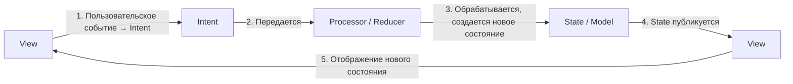
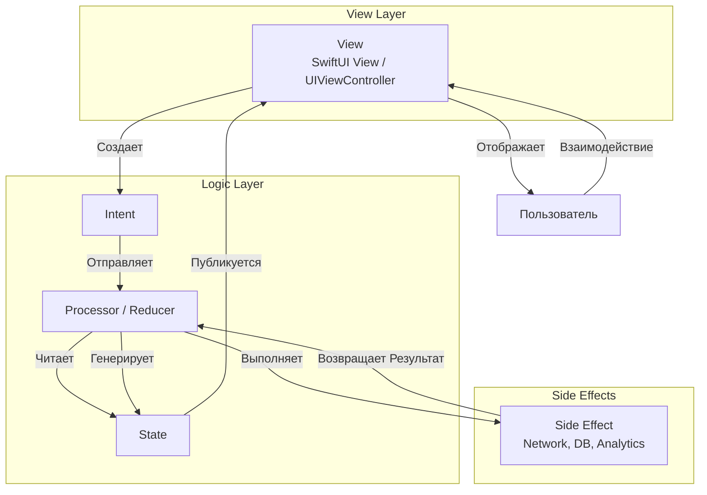

#ios #architecture #Swift 

**Архитектурный паттерн с однонаправленным потоком данных, основанный на циклической модели: Пользовательское намерение (Intent) -> Модель (State) -> Отображение (View).** Его ключевые принципы — **неизменяемое состояние (Immutable State)** и **реактивная обработка всех событий**. Идеально сочетается с [[SwiftUI]] и [[Combine]].

---

### **1. Взаимодействие компонентов (Unidirectional Data Flow)**

Поток данных в MVI строго однонаправлен и представляет собой бесконечный цикл. Это делает поведение приложения абсолютно предсказуемым и легко отлаживаемым.



**Последовательность шагов:**

1.  **Пользовательское событие (User Interaction):** Пользователь совершает действие (тап, swipe, ввод текста). View не обрабатывает его сама, а преобразует его в **Intent** (Намерение).
    *   *Пример:* Нажатие кнопки лайка -> `Intent.likePost(id: "123")`
    *   *Пример:* Ввод текста в поиск -> `Intent.searchQueryChanged("cats")`

2.  **Intent (Намерение):** Это не объект данных, а *описание намерения пользователя*. Intent — это команда, которая говорит системе, *что* пользователь хочет сделать.

3.  **Обработка (Processor):** Intent поступает в центральный обработчик (часто называемый **Reducer**, **Processor** или **Use Case**). Это единственное место, где происходит вся бизнес-логика. Обработчик:
    *   На основе **текущего State** и полученного **Intent**'а выполняет необходимые side-эффекты (сетевые запросы, сохранение в БД).
    *   Генерирует **новое, неизменяемое состояние (State)** на основе результата выполнения логики.

4.  **State (Состояние):** Единственный источник истины для всего экрана. Это неизменяемая структура ([[struct]]), которая описывает **всё**, что нужно для отображения View в данный момент.
    *   *Пример для экрана поиска:*
    ```swift
    struct SearchState {
        var query: String = ""
        var results: [SearchResult] = []
        var isLoading: Bool = false
        var errorMessage: String?
    }
    ```
    State не содержит логики, только данные.

5.  **Отображение (View):** View подписывается на поток изменений State. Как только публикуется новый State, View **полностью перестраивается** на его основе (или вычисляет diff для эффективного обновления).
    *   View становится функцией от состояния: `View = f(State)`. Это делает ее абсолютно "тупой" и предсказуемой.

---

### **2. Схема архитектуры**



---

### **3. Термины и ключевые моменты**

#### **Ключевые компоненты:**
*   **Model (State):** В контексте MVI под "Model" почти всегда подразумевается **State** — неизменяемый снимок состояния экрана.
*   **View:** Отвечает за два действия: 1) преобразование пользовательского ввода в Intent; 2) отображение текущего State. Не содержит абсолютно никакой бизнес-логики.
*   **Intent:** Представляет собой намерение пользователя или системы (например, push-нотификация). Это просто значение enum или структура с данными.
*   **Processor / Reducer:** Чистая функция (или класс), которая принимает `(currentState, Intent)` и возвращает `newState`. Может запускать асинхронные side-эффекты.
*   **Side Effect:** Любое взаимодействие с внешним миром: сетевые запросы, работа с БД, запись в файловую систему, аналитика. Они запускаются из Processor'а, но их результат преобразуется в новый Intent (например, `.searchSuccess(results: [Result])` или `.searchFailure(error: Error)`), который снова отправляется в Processor для обновления State.

#### **Важные принципы:**
*   **Однонаправленный поток данных (Unidirectional Data Flow):** Данные всегда движутся в одном направлении: `Intent -> Processor -> State -> View`. Это упрощает отслеживание изменений и отладку.
*   **Неизменяемое состояние (Immutable State):** State представлен неизменяемой структурой. Любое изменение — это создание новой копии State с обновленными значениями. Это предотвращает race conditions и делает изменения предсказуемыми.
*   **Единственный источник истины (Single Source of Truth):** Состояние всего экрана описано в одном месте — объекте State.
*   **Функция от состояния (View is a function of state):** View лишь отражает текущее состояние. Для одних и тех же входных данных (State) вывод (UI) всегда будет идентичным.

#### **Сильные стороны:**
*   **Высокая предсказуемость:** Поведение приложения детерминировано. Легко понять, почему интерфейс выглядит именно так — достаточно посмотреть на текущий State.
*   **Воспроизведение состояний:** Легко записать последовательность Intent'ов и воспроизвести её для отладки или тестирования.
*   **Потоковая природа:** Идеально сочетается с реактивными фреймворками (Combine, RxSwift).
*   **Чистота компонентов:** View и Processor легко тестируются изолированно.
*   **Идеален для SwiftUI:** SwiftUI спроектирован вокруг концепции состояния (`@State`, `ObservableObject`), что делает интеграцию с MVI очень естественной.

#### **Слабые стороны:**
*   **Кривая обучения:** Паттерн требует перестройки мышления, особенно для тех, кто привык к императивным подходам ([[MVC (Model-View-Controller) Architecture]], [[MVP (Model-View-Presenter) Architecture]]).
*   **Бойлерплейт:** Требуется создание множества структур (State, Intent), что может быть избыточно для простых экранов.
*   **Работа с большими состояниями:** Поскольку State описывает *весь* экран, структура может стать очень большой. Необходимо тщательно проектировать её и разбивать на под-состояния, если это нужно.

---

### **4. Пример структуры файлов в [[Xcode]]**

```
SearchFeature/
├── SearchView.swift                 // SwiftUI View
├── SearchState.swift                // State (struct)
├── SearchIntent.swift               // Intent (enum)
├── SearchProcessor.swift            // Processor (класс или функция)
└── SearchService.swift              // Сервис для side-эффектов
```

**Содержание файла `SearchIntent.swift`:**
```swift
enum SearchIntent {
    case searchQueryChanged(String)
    case searchButtonTapped
    case searchSuccess([Result])
    case searchFailure(Error)
    case retryTapped
}
```

---

### **5. Важное от себя (Практические советы)**

*   **Используйте `enum` для Intent:** Это самый чистый и безопасный способ описать все возможные намерения. Для каждого кейса можно ассоциировать значения с данными.
*   **Совмещайте с [[Combine]]/SwiftUI:** Реализация MVI становится элегантной и простой с помощью `CurrentValueSubject` или `@Published` для State и `sink`/`assign` для подписки во View.
*   **Обработка Side Effects:** Классическая проблема — как обрабатывать асинхронные операции. Распространенный подход:
    1.  Intent `searchButtonTapped` попадает в Processor.
    2.  Processor сначала emits State с `isLoading = true`.
    3.  Processor запускает асинхронный поиск через Service.
    4.  При успехе он конвертирует результат в новый Intent `.searchSuccess`.
    5.  Intent `.searchSuccess` снова попадает в Processor, который генерирует State с результатами и `isLoading = false`.
*   **Используйте "Reducer" функцию:** Часто Processor реализуют как чистую функцию-редьюсер. Это облегчает тестирование.
    ```swift
    func reduce(state: SearchState, intent: SearchIntent) -> SearchState {
        var newState = state
        switch intent {
            case .searchQueryChanged(let query):
                newState.query = query
            case .searchButtonTapped:
                newState.isLoading = true
                newState.errorMessage = nil
            // ... другие cases
        }
        return newState
    }
    ```
*   **Не бойтесь делить State:** Если экран очень сложный (например, экран профиля с множеством секций), можно разбить State на несколько внутренних структур.

---
