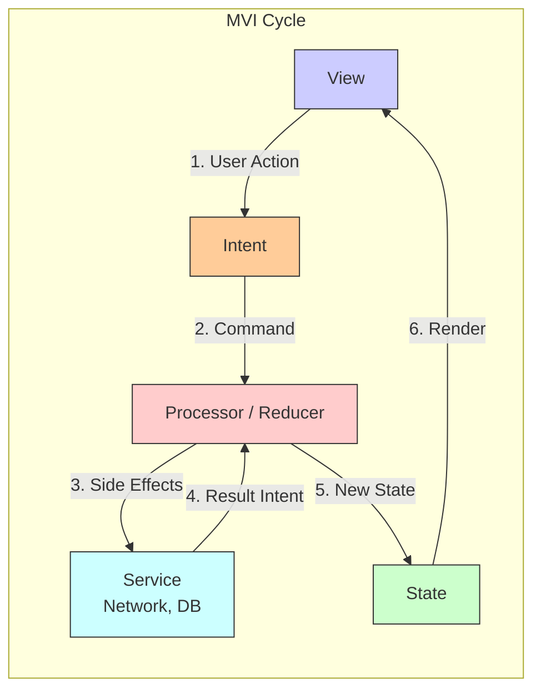

#architecture #mvi #unidirectional-flow #swiftui #combine #state-management #reactive 

---
### Определение
**MVI (Model-View-Intent)** — это архитектурный паттерн с **однонаправленным потоком данных**, основанный на циклической модели: пользовательское намерение (Intent) преобразуется в новое состояние (State), которое затем отображается во View . Ключевые принципы MVI — **неизменяемое состояние (Immutable State)** и **реактивная обработка всех событий** .

Паттерн был популяризирован в Android-сообществе, но благодаря своей реактивной природе и поддержке [[SwiftUI]] с [[Combine]], он стал отличным выбором и для [[iOS]]-разработки. MVI делает поведение приложения абсолютно предсказуемым и легко отлаживаемым, поскольку состояние экрана описывается одним объектом, а все изменения проходят через централизованный обработчик.

### Зачем это знать iOS-разработчику?
1.  **Предсказуемость:** Однонаправленный поток данных и единственный источник истины (State) делают поведение приложения детерминированным .
2.  **Тестируемость:** Каждый компонент (Reducer, State, View) легко тестируется изолированно .
3.  **Отладка:** Можно записывать последовательность Intent'ов и воспроизводить состояния для отладки .
4.  **Идеально для SwiftUI:** SwiftUI спроектирован вокруг концепции состояния, что делает MVI естественным выбором .
5.  **Реактивность:** Паттерн идеально сочетается с [[Combine]] и [[RxSwift]] .
6.  **Чистота:** View становится "глупой" функцией от состояния, а вся логика вынесена в Reducer .

---

### Основные принципы MVI



#### 1. **Model (State) — Неизменяемое состояние**
В MVI под "Model" понимается **State** — единственный источник истины для экрана. Это неизменяемая структура (обычно [[struct]]), которая описывает **все**, что нужно для отображения View в данный момент .

```swift
struct SearchState {
    var query: String = ""
    var results: [SearchResult] = []
    var isLoading: Bool = false
    var errorMessage: String?
}
```

#### 2. **View — Функция от состояния**
View подписывается на изменения State и полностью перестраивается при каждом обновлении. Она не содержит бизнес-логики и преобразует пользовательские действия в **Intent**.

```swift
struct SearchView: View {
    let state: SearchState
    let onIntent: (SearchIntent) -> Void
    
    var body: some View {
        // Отображение state и вызов onIntent при действиях пользователя
    }
}
```

#### 3. **Intent — Намерение пользователя**
Intent описывает действие пользователя или системы. Обычно реализуется как `enum` с ассоциированными значениями. Это не объект данных, а *команда*, которая говорит системе, *что* произошло .

```swift
enum SearchIntent {
    case searchQueryChanged(String)
    case searchButtonTapped
    case searchSuccess([SearchResult])
    case searchFailure(Error)
    case retryTapped
}
```

#### 4. **Processor / Reducer — Обработчик логики**
Processor получает текущее состояние и Intent, выполняет бизнес-логику и side-эффекты (сетевые запросы, работа с БД), и возвращает новое состояние. Часто реализуется как чистая функция-редьюсер .

```swift
func reduce(state: SearchState, intent: SearchIntent) -> SearchState {
    var newState = state
    
    switch intent {
    case .searchQueryChanged(let query):
        newState.query = query
        
    case .searchButtonTapped:
        newState.isLoading = true
        newState.errorMessage = nil
        // Запуск side-эффекта (будет отдельно)
        
    case .searchSuccess(let results):
        newState.results = results
        newState.isLoading = false
        
    case .searchFailure(let error):
        newState.errorMessage = error.localizedDescription
        newState.isLoading = false
        
    case .retryTapped:
        // Повторный запуск поиска
        newState.isLoading = true
        newState.errorMessage = nil
    }
    
    return newState
}
```

---

### Пример: Поисковый экран на MVI + [[SwiftUI]] + [[Combine]]

#### SearchState.swift
```swift
import Foundation

struct SearchState: Equatable {
    var query: String = ""
    var results: [String] = []
    var isLoading: Bool = false
    var errorMessage: String?
    
    var canSearch: Bool {
        !query.isEmpty && !isLoading
    }
    
    var isEmptyState: Bool {
        !isLoading && results.isEmpty && errorMessage == nil
    }
    
    var hasError: Bool {
        errorMessage != nil
    }
}
```

#### SearchIntent.swift
```swift
import Foundation

enum SearchIntent: Equatable {
    case searchQueryChanged(String)
    case searchQueryDebounced
    case searchButtonTapped
    case searchSuccess([String])
    case searchFailure(String)
    case retryTapped
    case clearResults
}
```

#### SearchService.swift (Side Effect)
```swift
import Foundation
import Combine

class SearchService {
    private let apiService = APIService.shared
    
    func search(query: String) -> AnyPublisher<[String], Error> {
        guard !query.isEmpty else {
            return Just([])
                .setFailureType(to: Error.self)
                .eraseToAnyPublisher()
        }
        
        return apiService.search(query: query)
            .delay(for: 0.5, scheduler: DispatchQueue.main) // Имитация задержки
            .eraseToAnyPublisher()
    }
}
```

#### SearchProcessor.swift
```swift
import Foundation
import Combine

class SearchProcessor: ObservableObject {
    @Published private(set) var state = SearchState()
    
    private let service: SearchService
    private var cancellables = Set<AnyCancellable>()
    private let searchSubject = PassthroughSubject<String, Never>()
    
    init(service: SearchService = SearchService()) {
        self.service = service
        setupSearchDebounce()
    }
    
    // MARK: - Public
    func dispatch(_ intent: SearchIntent) {
        // Используем редусер для синхронных изменений состояния
        let newState = reduce(state: state, intent: intent)
        
        // Применяем изменения к состоянию
        if newState != state {
            state = newState
        }
        
        // Обрабатываем side-эффекты
        handleSideEffects(intent)
    }
    
    // MARK: - Reducer (чистая функция)
    private func reduce(state: SearchState, intent: SearchIntent) -> SearchState {
        var newState = state
        
        switch intent {
        case .searchQueryChanged(let query):
            newState.query = query
            
        case .searchQueryDebounced:
            // Ничего не меняем, это триггер для поиска
            break
            
        case .searchButtonTapped, .retryTapped:
            newState.isLoading = true
            newState.errorMessage = nil
            newState.results = []
            
        case .searchSuccess(let results):
            newState.results = results
            newState.isLoading = false
            newState.errorMessage = nil
            
        case .searchFailure(let message):
            newState.errorMessage = message
            newState.isLoading = false
            newState.results = []
            
        case .clearResults:
            newState.results = []
            newState.errorMessage = nil
            newState.isLoading = false
        }
        
        return newState
    }
    
    // MARK: - Side Effects
    private func handleSideEffects(_ intent: SearchIntent) {
        switch intent {
        case .searchQueryChanged(let query):
            // Debounce для поиска при вводе
            searchSubject.send(query)
            
        case .searchQueryDebounced:
            performSearch(query: state.query)
            
        case .searchButtonTapped:
            performSearch(query: state.query)
            
        case .retryTapped:
            performSearch(query: state.query)
            
        default:
            break
        }
    }
    
    private func setupSearchDebounce() {
        searchSubject
            .debounce(for: .milliseconds(500), scheduler: DispatchQueue.main)
            .removeDuplicates()
            .filter { !$0.isEmpty }
            .sink { [weak self] query in
                self?.dispatch(.searchQueryDebounced)
            }
            .store(in: &cancellables)
    }
    
    private func performSearch(query: String) {
        guard !query.isEmpty else {
            dispatch(.clearResults)
            return
        }
        
        service.search(query: query)
            .sink { [weak self] completion in
                if case .failure(let error) = completion {
                    self?.dispatch(.searchFailure(error.localizedDescription))
                }
            } receiveValue: { [weak self] results in
                self?.dispatch(.searchSuccess(results))
            }
            .store(in: &cancellables)
    }
}
```

#### SearchView.swift
```swift
import SwiftUI

struct SearchView: View {
    @StateObject private var processor = SearchProcessor()
    
    var body: some View {
        VStack {
            // Поисковая строка
            HStack {
                Image(systemName: "magnifyingglass")
                    .foregroundColor(.gray)
                
                TextField("Поиск...", text: Binding(
                    get: { processor.state.query },
                    set: { processor.dispatch(.searchQueryChanged($0)) }
                ))
                .textFieldStyle(RoundedBorderTextFieldStyle())
                
                if processor.state.isLoading {
                    ProgressView()
                        .progressViewStyle(CircularProgressViewStyle())
                }
                
                if !processor.state.query.isEmpty {
                    Button(action: {
                        processor.dispatch(.searchQueryChanged(""))
                    }) {
                        Image(systemName: "xmark.circle.fill")
                            .foregroundColor(.gray)
                    }
                }
            }
            .padding()
            
            // Кнопка поиска
            Button("Искать") {
                processor.dispatch(.searchButtonTapped)
            }
            .disabled(!processor.state.canSearch)
            .padding(.bottom)
            
            // Контент
            if processor.state.isLoading {
                Spacer()
                ProgressView("Загрузка...")
                Spacer()
            } else if processor.state.hasError {
                Spacer()
                VStack {
                    Image(systemName: "exclamationmark.triangle")
                        .font(.largeTitle)
                        .foregroundColor(.orange)
                    
                    Text(processor.state.errorMessage ?? "Ошибка")
                        .multilineTextAlignment(.center)
                        .padding()
                    
                    Button("Повторить") {
                        processor.dispatch(.retryTapped)
                    }
                    .buttonStyle(.borderedProminent)
                }
                Spacer()
            } else if processor.state.isEmptyState {
                Spacer()
                VStack {
                    Image(systemName: "magnifyingglass")
                        .font(.largeTitle)
                        .foregroundColor(.gray)
                    
                    Text("Введите запрос для поиска")
                        .foregroundColor(.gray)
                }
                Spacer()
            } else {
                List(processor.state.results, id: \.self) { result in
                    Text(result)
                }
            }
        }
        .navigationTitle("MVI Search")
    }
}
```

---

### Расширенный пример: Экран профиля с MVI

#### ProfileState.swift
```swift
import Foundation

struct ProfileState: Equatable {
    // Данные
    var user: User?
    var posts: [Post] = []
    var followers: Int = 0
    var following: Int = 0
    
    // UI состояния
    var isLoadingUser: Bool = false
    var isLoadingPosts: Bool = false
    var isRefreshing: Bool = false
    
    // Ошибки
    var userError: String?
    var postsError: String?
    
    // Флаги UI
    var isFollowed: Bool = false
    var isCurrentUser: Bool = false
    
    // Computed properties
    var isLoading: Bool {
        isLoadingUser || isLoadingPosts || isRefreshing
    }
    
    var hasUserError: Bool {
        userError != nil
    }
    
    var hasPostsError: Bool {
        postsError != nil
    }
    
    var canLoadMore: Bool {
        !isLoadingPosts && posts.count < 100
    }
}
```

#### ProfileIntent.swift
```swift
import Foundation

enum ProfileIntent {
    // Загрузка данных
    case loadProfile(userId: String)
    case loadProfileSuccess(User)
    case loadProfileFailure(String)
    
    case loadPosts(userId: String)
    case loadPostsSuccess([Post])
    case loadPostsFailure(String)
    case loadMorePosts
    
    // Действия пользователя
    case refresh
    case followTapped
    case followSuccess
    case followFailure(String)
    
    case postTapped(Post)
    case settingsTapped
    
    // Системные события
    case viewAppeared
    case viewDisappeared
    case retryTapped
}
```

#### ProfileProcessor.swift
```swift
import Foundation
import Combine

class ProfileProcessor: ObservableObject {
    @Published private(set) var state = ProfileState()
    
    private let profileService: ProfileService
    private let userId: String
    private var cancellables = Set<AnyCancellable>()
    private var currentPage = 1
    
    init(userId: String, service: ProfileService = ProfileService()) {
        self.userId = userId
        self.profileService = service
    }
    
    // MARK: - Public
    func dispatch(_ intent: ProfileIntent) {
        let newState = reduce(state: state, intent: intent)
        
        if newState != state {
            state = newState
        }
        
        handleSideEffects(intent)
    }
    
    // MARK: - Reducer
    private func reduce(state: ProfileState, intent: ProfileIntent) -> ProfileState {
        var newState = state
        
        switch intent {
        // Загрузка профиля
        case .loadProfile:
            newState.isLoadingUser = true
            newState.userError = nil
            
        case .loadProfileSuccess(let user):
            newState.user = user
            newState.isLoadingUser = false
            newState.isFollowed = user.isFollowed ?? false
            
        case .loadProfileFailure(let error):
            newState.userError = error
            newState.isLoadingUser = false
            
        // Загрузка постов
        case .loadPosts:
            newState.isLoadingPosts = true
            newState.postsError = nil
            
        case .loadPostsSuccess(let posts):
            newState.posts = posts
            newState.isLoadingPosts = false
            
        case .loadMorePosts:
            newState.isLoadingPosts = true
            
        // Действия пользователя
        case .refresh:
            newState.isRefreshing = true
            newState.postsError = nil
            newState.userError = nil
            currentPage = 1
            
        case .followTapped:
            newState.isFollowed.toggle()
            
        case .followSuccess:
            // Ничего не меняем, уже изменили в followTapped
            break
            
        case .followFailure:
            // Откатываем изменение
            newState.isFollowed.toggle()
            
        default:
            break
        }
        
        return newState
    }
    
    // MARK: - Side Effects
    private func handleSideEffects(_ intent: ProfileIntent) {
        switch intent {
        case .viewAppeared:
            dispatch(.loadProfile(userId: userId))
            dispatch(.loadPosts(userId: userId))
            
        case .loadProfile(let userId):
            profileService.fetchProfile(userId: userId)
                .sink { [weak self] completion in
                    if case .failure(let error) = completion {
                        self?.dispatch(.loadProfileFailure(error.localizedDescription))
                    }
                } receiveValue: { [weak self] user in
                    self?.dispatch(.loadProfileSuccess(user))
                }
                .store(in: &cancellables)
                
        case .loadPosts(let userId):
            profileService.fetchPosts(userId: userId, page: currentPage)
                .sink { [weak self] completion in
                    if case .failure(let error) = completion {
                        self?.dispatch(.loadPostsFailure(error.localizedDescription))
                    }
                } receiveValue: { [weak self] posts in
                    self?.dispatch(.loadPostsSuccess(posts))
                }
                .store(in: &cancellables)
                
        case .refresh:
            currentPage = 1
            dispatch(.loadProfile(userId: userId))
            dispatch(.loadPosts(userId: userId))
            
        case .loadMorePosts:
            currentPage += 1
            dispatch(.loadPosts(userId: userId))
            
        case .followTapped:
            profileService.followUser(userId: userId)
                .sink { [weak self] completion in
                    if case .failure(let error) = completion {
                        self?.dispatch(.followFailure(error.localizedDescription))
                    } else {
                        self?.dispatch(.followSuccess)
                    }
                } receiveValue: { _ in }
                .store(in: &cancellables)
                
        default:
            break
        }
    }
}
```

#### ProfileView.swift
```swift
import SwiftUI

struct ProfileView: View {
    @StateObject private var processor: ProfileProcessor
    
    init(userId: String) {
        _processor = StateObject(wrappedValue: ProfileProcessor(userId: userId))
    }
    
    var body: some View {
        ScrollView {
            VStack(spacing: 20) {
                if processor.state.isLoading && processor.state.user == nil {
                    ProgressView()
                        .scaleEffect(1.5)
                        .padding()
                } else if processor.state.hasUserError {
                    ErrorView(
                        message: processor.state.userError ?? "Ошибка загрузки",
                        onRetry: { processor.dispatch(.retryTapped) }
                    )
                } else if let user = processor.state.user {
                    profileHeader(user: user)
                    statsView
                    actionButtons
                    postsGrid
                }
            }
        }
        .refreshable {
            processor.dispatch(.refresh)
        }
        .onAppear {
            processor.dispatch(.viewAppeared)
        }
    }
    
    private func profileHeader(user: User) -> some View {
        VStack {
            AsyncImage(url: URL(string: user.avatarURL)) { image in
                image.resizable()
            } placeholder: {
                Circle().fill(Color.gray)
            }
            .frame(width: 100, height: 100)
            .clipShape(Circle())
            
            Text(user.name)
                .font(.title)
                .bold()
            
            Text(user.bio ?? "")
                .font(.body)
                .multilineTextAlignment(.center)
                .padding(.horizontal)
        }
    }
    
    private var statsView: some View {
        HStack(spacing: 40) {
            StatItem(value: processor.state.posts.count, title: "Посты")
            StatItem(value: processor.state.followers, title: "Подписчики")
            StatItem(value: processor.state.following, title: "Подписки")
        }
    }
    
    private var actionButtons: some View {
        HStack(spacing: 20) {
            if !processor.state.isCurrentUser {
                Button(processor.state.isFollowed ? "Отписаться" : "Подписаться") {
                    processor.dispatch(.followTapped)
                }
                .buttonStyle(.borderedProminent)
            }
            
            Button("Настройки") {
                processor.dispatch(.settingsTapped)
            }
            .buttonStyle(.bordered)
        }
    }
    
    private var postsGrid: some View {
        LazyVGrid(columns: [GridItem(.flexible()), GridItem(.flexible()), GridItem(.flexible())]) {
            ForEach(processor.state.posts) { post in
                PostThumbnail(post: post)
                    .onTapGesture {
                        processor.dispatch(.postTapped(post))
                    }
            }
            
            if processor.state.canLoadMore {
                ProgressView()
                    .onAppear {
                        processor.dispatch(.loadMorePosts)
                    }
            }
        }
    }
}

struct StatItem: View {
    let value: Int
    let title: String
    
    var body: some View {
        VStack {
            Text("\(value)")
                .font(.title2)
                .bold()
            Text(title)
                .font(.caption)
                .foregroundColor(.gray)
        }
    }
}
```

---

### MVI vs Другие архитектуры

| Характеристика                   | MVI           | [[MVVM (Model-View-ViewModel) Architecture\|MVVM]] | [[VIPER Architecture\|VIPER]] | [[Redux Architecture\|Redux]] |
| -------------------------------- | ------------- | -------------------------------------------------- | ----------------------------- | ----------------------------- |
| **Unidirectional Flow**          | ✅             | ❌ (обычно)                                         | ✅                             | ✅                             |
| **Immutable State**              | ✅             | ❌                                                  | ❌                             | ✅                             |
| **Единственный источник истины** | ✅             | ❌ (может быть несколько)                           | ✅                             | ✅                             |
| **Тестируемость**                | Очень высокая | Высокая                                            | Очень высокая                 | Очень высокая                 |
| **Boilerplate**                  | Средний       | Средний                                            | Много                         | Средний                       |
| **SwiftUI интеграция**           | Идеальная     | Идеальная                                          | Сложная                       | Хорошая                       |
| **Кривая обучения**              | Высокая       | Средняя                                            | Очень высокая                 | Средняя                       |
| **Работа с side-effects**        | Встроенная    | Через сервисы                                      | Interactor                    | Middleware                    |
| **Отладка**                      | Очень легкая  | Средняя                                            | Легкая                        | Очень легкая                  |

---

### Преимущества MVI

1.  **Предсказуемость:** Состояние экрана всегда описано в одном месте, изменения проходят через центральный обработчик .
2.  **Тестируемость:** Reducer — чистая функция, которую легко тестировать. Side-эффекты изолированы в сервисах .
3.  **Воспроизводимость:** Можно записывать последовательность Intent'ов и воспроизводить состояния для отладки .
4.  **Совместимость со SwiftUI:** SwiftUI идеально подходит для рендеринга на основе состояния .
5.  **Реактивность:** Естественная интеграция с Combine .
6.  **Чистота:** View становится "глупой", а вся логика вынесена .

### Недостатки MVI

1.  **Кривая обучения:** Требует перестройки мышления, особенно для разработчиков, привыкших к императивному подходу .
2.  **Бойлерплейт:** Для каждого экрана нужно создавать State, Intent, Reducer .
3.  **Размер State:** State может стать очень большим для сложных экранов .
4.  **Управление подписками:** Нужно аккуратно управлять Combine-подписками .
5.  **Избыточность для простых экранов:** Для статичных экранов MVI может быть overkill .

---

### Практические советы

#### 1. **Используйте enum для Intent**
Это самый безопасный и выразительный способ описания всех возможных действий.

```swift
enum ProfileIntent {
    case load
    case refresh
    case follow
    case unfollow
    case like(Post)
    case share(Post)
}
```

#### 2. **State должен быть Equatable**
Это позволяет оптимизировать обновления View и избегать лишних перерисовок.

```swift
struct SearchState: Equatable {
    // ...
}
```

#### 3. **Разделяйте синхронные изменения и side-эффекты**
Reducer обрабатывает только синхронные изменения, а side-эффекты запускаются отдельно.

#### 4. **Используйте Processor как ObservableObject**
Это позволяет SwiftUI автоматически обновляться при изменениях State.

#### 5. **Для сложных экранов разбивайте State на подсостояния**

```swift
struct ProfileState {
    var header: HeaderState
    var posts: PostsState
    var stats: StatsState
}

struct HeaderState {
    var user: User?
    var isLoading: Bool
    var error: String?
}
```

#### 6. **Debounce для поиска**
Используйте `debounce` для поисковых запросов, чтобы не дергать сервер на каждую букву.

#### 7. **Тестируйте редусеры**
```swift
func testSearchSuccess() {
    let processor = SearchProcessor()
    let initialState = processor.state
    
    processor.dispatch(.searchSuccess(["Result 1", "Result 2"]))
    
    XCTAssertEqual(processor.state.results.count, 2)
    XCTAssertFalse(processor.state.isLoading)
}
```

### Итог
**MVI** — это мощный архитектурный паттерн, который делает управление состоянием предсказуемым и прозрачным. Он идеально подходит для сложных реактивных интерфейсов на SwiftUI и Combine, обеспечивая высокую тестируемость и отлаживаемость. Несмотря на более высокий порог вхождения и некоторый бойлерплейт, MVI окупается в больших проектах с интенсивным пользовательским взаимодействием и сложной логикой .