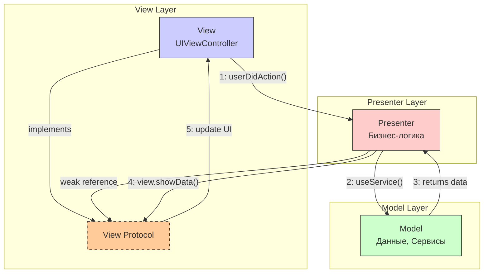

#architecture #mvp #ios #uikit #design-patterns #presenter #testing

---
### Определение
**MVP (Model-View-Presenter)** — это архитектурный паттерн, являющийся эволюцией классического [[MVC (Model-View-Controller) Architecture|MVC]]. Его ключевая цель — решить проблему **"Massive View Controller"** путем вынесения всей логики обновления интерфейса в отдельный класс — **Presenter** . View становится пассивным и делегирует все действия Presenter'у, который управляет состоянием и реагирует на пользовательские события .

В отличие от MVC, где Controller напрямую манипулирует и View, и Model, в MVP:
- **View** — пассивна, только отображает данные и передает события.
- **Presenter** — содержит всю логику представления, форматирует данные и управляет View через протокол.
- **Model** — данные и бизнес-логика (как и в MVC).

### Зачем это знать [[iOS]]-разработчику?
1.  **Решение проблемы Massive View Controller:** MVP позволяет разгрузить ViewController, вынеся логику в Presenter .
2.  **Высокая тестируемость:** Presenter — это чистый Swift-класс без зависимости от [[UIKit]], что делает его идеальным для юнит-тестирования .
3.  **Четкое разделение ответственности:** Каждый компонент знает только свою задачу .
4.  **Отличная база для рефакторинга:** MVP — хороший первый шаг при переходе от MVC к более сложным архитектурам .
5.  **Естественная интеграция с UIKit:** В отличие от реактивных подходов, MVP использует императивный стиль, близкий к UIKit .

---

### Компоненты MVP



#### 1. **Model (Модель)**
**Ответственность:** Данные и бизнес-логика низкого уровня.
- Структуры данных (User, Product).
- Сервисы для работы с сетью, базой данных, [[Keychain]].
- **Не знает о существовании View и Presenter.**

```swift
struct User {
    let id: Int
    let name: String
    let email: String
}

protocol AuthServiceProtocol {
    func login(username: String, password: String, completion: @escaping (Result<User, Error>) -> Void)
}

class AuthService: AuthServiceProtocol {
    func login(username: String, password: String, completion: @escaping (Result<User, Error>) -> Void) {
        // Сетевой запрос
    }
}
```

#### 2. **View (Представление)**
**Ответственность:** Отображение UI и передача пользовательских событий.
- **Пассивна и "глупа"** — не содержит бизнес-логики.
- Реализует протокол View, определенный Presenter'ом.
- Держит **слабую ссылку** на Presenter.
- В iOS это обычно [[UIViewController]].

```swift
protocol LoginViewProtocol: AnyObject {
    func showLoading()
    func hideLoading()
    func showError(_ message: String)
    func showSuccess(message: String)
}

class LoginViewController: UIViewController, LoginViewProtocol {
    @IBOutlet weak var usernameTextField: UITextField!
    @IBOutlet weak var passwordTextField: UITextField!
    @IBOutlet weak var loginButton: UIButton!
    @IBOutlet weak var activityIndicator: UIActivityIndicatorView!
    @IBOutlet weak var errorLabel: UILabel!
    
    var presenter: LoginPresenterProtocol!
    
    override func viewDidLoad() {
        super.viewDidLoad()
        presenter.viewDidLoad()
    }
    
    @IBAction func loginButtonTapped(_ sender: UIButton) {
        presenter.loginButtonTapped(
            username: usernameTextField.text,
            password: passwordTextField.text
        )
    }
    
    // MARK: - LoginViewProtocol
    func showLoading() {
        activityIndicator.startAnimating()
        loginButton.isEnabled = false
    }
    
    func hideLoading() {
        activityIndicator.stopAnimating()
        loginButton.isEnabled = true
    }
    
    func showError(_ message: String) {
        errorLabel.text = message
        errorLabel.isHidden = false
    }
    
    func showSuccess(message: String) {
        let alert = UIAlertController(title: "Успех", message: message, preferredStyle: .alert)
        alert.addAction(UIAlertAction(title: "OK", style: .default))
        present(alert, animated: true)
    }
}
```

#### 3. **Presenter (Презентер)**
**Ответственность:** Вся логика представления.
- Получает события от View.
- Работает с Model (сервисами).
- Форматирует данные для отображения.
- Управляет View через протокол.
- **Не импортирует [[UIKit]]** — чистый [[Swift]].
- Держит **слабую ссылку** на View.

```swift
protocol LoginPresenterProtocol: AnyObject {
    func viewDidLoad()
    func loginButtonTapped(username: String?, password: String?)
}

class LoginPresenter: LoginPresenterProtocol {
    weak var view: LoginViewProtocol?
    private let authService: AuthServiceProtocol
    
    init(view: LoginViewProtocol, authService: AuthServiceProtocol) {
        self.view = view
        self.authService = authService
    }
    
    func viewDidLoad() {
        // Инициализация, если нужно
    }
    
    func loginButtonTapped(username: String?, password: String?) {
        guard let username = username, !username.isEmpty,
              let password = password, !password.isEmpty else {
            view?.showError("Заполните все поля")
            return
        }
        
        view?.showLoading()
        
        authService.login(username: username, password: password) { [weak self] result in
            DispatchQueue.main.async {
                self?.view?.hideLoading()
                
                switch result {
                case .success(let user):
                    self?.view?.showSuccess(message: "Добро пожаловать, \(user.name)!")
                case .failure(let error):
                    self?.view?.showError(error.localizedDescription)
                }
            }
        }
    }
}
```

#### 4. **View Protocol**
**Ответственность:** Контракт между Presenter и View.
- Определяет методы для обновления UI.
- Обеспечивает слабую связность.
- Позволяет легко тестировать Presenter с Mock-View.

---

### Пример: Полный модуль логина на MVP

#### LoginViewProtocol.swift
```swift
import Foundation

protocol LoginViewProtocol: AnyObject {
    func showLoading()
    func hideLoading()
    func showError(_ message: String)
    func showSuccess(message: String)
    func clearForm()
}
```

#### LoginPresenter.swift
```swift
import Foundation

protocol LoginPresenterProtocol: AnyObject {
    func viewDidLoad()
    func loginButtonTapped(username: String?, password: String?)
    func forgotPasswordTapped()
    func registerTapped()
}

class LoginPresenter: LoginPresenterProtocol {
    weak var view: LoginViewProtocol?
    private let authService: AuthServiceProtocol
    private let validator: ValidatorProtocol
    
    init(view: LoginViewProtocol, 
         authService: AuthServiceProtocol,
         validator: ValidatorProtocol) {
        self.view = view
        self.authService = authService
        self.validator = validator
    }
    
    func viewDidLoad() {
        // Проверка, был ли пользователь уже залогинен
        if authService.isUserLoggedIn {
            view?.showSuccess(message: "Вы уже авторизованы")
        }
    }
    
    func loginButtonTapped(username: String?, password: String?) {
        guard let username = username, let password = password else {
            view?.showError("Заполните все поля")
            return
        }
        
        // Валидация
        guard validator.isValidEmail(username) else {
            view?.showError("Неверный формат email")
            return
        }
        
        guard validator.isValidPassword(password) else {
            view?.showError("Пароль должен быть не менее 6 символов")
            return
        }
        
        view?.showLoading()
        
        authService.login(username: username, password: password) { [weak self] result in
            DispatchQueue.main.async {
                self?.view?.hideLoading()
                
                switch result {
                case .success(let user):
                    self?.handleLoginSuccess(user)
                case .failure(let error):
                    self?.view?.showError(error.localizedDescription)
                }
            }
        }
    }
    
    func forgotPasswordTapped() {
        // Навигация на экран восстановления пароля
        // (обычно через Router/Coordinator)
    }
    
    func registerTapped() {
        // Навигация на экран регистрации
    }
    
    private func handleLoginSuccess(_ user: User) {
        view?.clearForm()
        view?.showSuccess(message: "Добро пожаловать, \(user.name)!")
        // Здесь можно вызвать роутер для перехода на главный экран
    }
}
```

#### LoginViewController.swift
```swift
import UIKit

class LoginViewController: UIViewController {
    // MARK: - IBOutlets
    @IBOutlet weak var usernameTextField: UITextField!
    @IBOutlet weak var passwordTextField: UITextField!
    @IBOutlet weak var loginButton: UIButton!
    @IBOutlet weak var activityIndicator: UIActivityIndicatorView!
    @IBOutlet weak var errorLabel: UILabel!
    @IBOutlet weak var forgotPasswordButton: UIButton!
    @IBOutlet weak var registerButton: UIButton!
    
    // MARK: - Properties
    var presenter: LoginPresenterProtocol!
    
    // MARK: - Lifecycle
    override func viewDidLoad() {
        super.viewDidLoad()
        setupUI()
        presenter.viewDidLoad()
    }
    
    private func setupUI() {
        activityIndicator.isHidden = true
        errorLabel.isHidden = true
    }
    
    // MARK: - IBActions
    @IBAction func loginButtonTapped(_ sender: UIButton) {
        presenter.loginButtonTapped(
            username: usernameTextField.text,
            password: passwordTextField.text
        )
    }
    
    @IBAction func forgotPasswordTapped(_ sender: UIButton) {
        presenter.forgotPasswordTapped()
    }
    
    @IBAction func registerTapped(_ sender: UIButton) {
        presenter.registerTapped()
    }
}

// MARK: - LoginViewProtocol
extension LoginViewController: LoginViewProtocol {
    func showLoading() {
        activityIndicator.isHidden = false
        activityIndicator.startAnimating()
        loginButton.isEnabled = false
        errorLabel.isHidden = true
    }
    
    func hideLoading() {
        activityIndicator.isHidden = true
        activityIndicator.stopAnimating()
        loginButton.isEnabled = true
    }
    
    func showError(_ message: String) {
        errorLabel.text = message
        errorLabel.isHidden = false
    }
    
    func showSuccess(message: String) {
        let alert = UIAlertController(title: "Успех", message: message, preferredStyle: .alert)
        alert.addAction(UIAlertAction(title: "OK", style: .default))
        present(alert, animated: true)
    }
    
    func clearForm() {
        usernameTextField.text = ""
        passwordTextField.text = ""
    }
}
```

#### LoginAssembly.swift
```swift
import UIKit

enum LoginAssembly {
    static func build() -> UIViewController {
        let viewController = LoginViewController()
        let authService = AuthService()
        let validator = Validator()
        let presenter = LoginPresenter(view: viewController, 
                                       authService: authService,
                                       validator: validator)
        viewController.presenter = presenter
        return viewController
    }
}

// Использование:
// let loginVC = LoginAssembly.build()
// navigationController?.pushViewController(loginVC, animated: true)
```

#### Тестирование Presenter
```swift
import XCTest
@testable import MyApp

class MockLoginView: LoginViewProtocol {
    var showLoadingCalled = false
    var hideLoadingCalled = false
    var showErrorCalled = false
    var showSuccessCalled = false
    var lastErrorMessage: String?
    var lastSuccessMessage: String?
    
    func showLoading() { showLoadingCalled = true }
    func hideLoading() { hideLoadingCalled = true }
    func showError(_ message: String) { 
        showErrorCalled = true
        lastErrorMessage = message
    }
    func showSuccess(message: String) { 
        showSuccessCalled = true
        lastSuccessMessage = message
    }
    func clearForm() { }
}

class MockAuthService: AuthServiceProtocol {
    var shouldSucceed = true
    var loginCalled = false
    var lastUsername: String?
    var lastPassword: String?
    
    func login(username: String, password: String, completion: @escaping (Result<User, Error>) -> Void) {
        loginCalled = true
        lastUsername = username
        lastPassword = password
        
        if shouldSucceed {
            let user = User(id: 1, name: "Test User", email: username)
            completion(.success(user))
        } else {
            let error = NSError(domain: "test", code: -1, userInfo: [NSLocalizedDescriptionKey: "Auth failed"])
            completion(.failure(error))
        }
    }
}

class LoginPresenterTests: XCTestCase {
    func testLoginSuccess() {
        // Given
        let mockView = MockLoginView()
        let mockAuth = MockAuthService()
        let presenter = LoginPresenter(view: mockView, authService: mockAuth, validator: Validator())
        
        // When
        presenter.loginButtonTapped(username: "test@example.com", password: "password123")
        
        // Then
        XCTAssertTrue(mockView.showLoadingCalled)
        XCTAssertTrue(mockAuth.loginCalled)
        XCTAssertEqual(mockAuth.lastUsername, "test@example.com")
        // Проверка асинхронного результата (нужно использовать expectations)
    }
}
```

---

### MVP с Router/Coordinator для навигации

#### LoginRouter.swift
```swift
import UIKit

protocol LoginRouterProtocol {
    func navigateToHome()
    func navigateToForgotPassword()
    func navigateToRegister()
}

class LoginRouter: LoginRouterProtocol {
    weak var viewController: UIViewController?
    
    static func createModule() -> UIViewController {
        let view = LoginViewController()
        let router = LoginRouter()
        let presenter = LoginPresenter(view: view, router: router)
        
        view.presenter = presenter
        router.viewController = view
        
        return view
    }
    
    func navigateToHome() {
        let homeVC = HomeViewController()
        viewController?.navigationController?.pushViewController(homeVC, animated: true)
    }
    
    func navigateToForgotPassword() {
        let forgotVC = ForgotPasswordViewController()
        viewController?.present(forgotVC, animated: true)
    }
    
    func navigateToRegister() {
        let registerVC = RegisterViewController()
        viewController?.navigationController?.pushViewController(registerVC, animated: true)
    }
}

// Обновленный Presenter
protocol LoginPresenterProtocol {
    init(view: LoginViewProtocol, router: LoginRouterProtocol)
    func loginButtonTapped(username: String?, password: String?)
    func forgotPasswordTapped()
    func registerTapped()
}

class LoginPresenter: LoginPresenterProtocol {
    weak var view: LoginViewProtocol?
    let router: LoginRouterProtocol
    // ... остальные зависимости
    
    init(view: LoginViewProtocol, router: LoginRouterProtocol) {
        self.view = view
        self.router = router
    }
    
    func forgotPasswordTapped() {
        router.navigateToForgotPassword()
    }
    
    private func handleLoginSuccess(_ user: User) {
        view?.showSuccess(message: "Добро пожаловать!")
        router.navigateToHome()
    }
}
```

---

### MVP vs MVC vs MVVM

| Характеристика                     | [[MVC (Model-View-Controller) Architecture\|MVC]] | MVP                      | [[MVVM (Model-View-ViewModel) Architecture\|MVVM]] |
| ---------------------------------- | ------------------------------------------------- | ------------------------ | -------------------------------------------------- |
| **View**                           | Активна (содержит логику)                         | Пассивна (только UI)     | Пассивна (с binding)                               |
| **Controller/Presenter/ViewModel** | Controller (связан с UIKit)                       | Presenter (чистый Swift) | ViewModel (чистый Swift)                           |
| **Связь с View**                   | Прямая (IBOutlets)                                | Через протокол           | Через binding ([[Combine]]/Rx)                     |
| **Тестируемость**                  | Низкая                                            | Высокая                  | Высокая                                            |
| **Бойлерплейт**                    | Минимум                                           | Средний (протоколы)      | Средний (binding)                                  |
| **Сложность**                      | Низкая                                            | Средняя                  | Средняя                                            |
| **UIKit зависимость**              | Controller зависит                                | Presenter не зависит     | ViewModel не зависит                               |
| **Реактивность**                   | Нет                                               | Нет                      | Да (опционально)                                   |
| **Refactoring из MVC**             | -                                                 | Легко                    | Сложнее                                            |

---

### Преимущества MVP

1.  **Решение проблемы Massive View Controller:** ViewController становится тонким и содержит только UI-код .
2.  **Высокая тестируемость:** Presenter — чистый Swift, легко покрывается юнит-тестами .
3.  **Четкое разделение ответственности:** Каждый компонент знает свою роль .
4.  **Слабая связность через протоколы:** Позволяет легко заменять реализации .
5.  **Отличная база для рефакторинга:** MVP — идеальный первый шаг при переходе от MVC .
6.  **Естественная интеграция с UIKit:** Не требует реактивных фреймворков .

### Недостатки MVP

1.  **Бойлерплейт:** Нужно создавать протоколы для каждого экрана и реализовывать все методы .
2.  **Риск создания "Massive Presenter":** Если не следить, вся логика переедет из ViewController в Presenter .
3.  **Ручное управление обновлениями:** В отличие от MVVM, нет автоматического binding .
4.  **Сложность навигации:** Требуется дополнительный компонент (Router/Coordinator) .
5.  **Много кода для простых экранов:** Для статичных экранов MVP может быть избыточен .

---

### Практические советы

#### 1. **Всегда держите ссылку на View как [[weak]]**
Чтобы избежать циклов сильных ссылок, Presenter должен хранить ссылку на View только как слабую.

```swift
class Presenter {
    weak var view: ViewProtocol?
}
```

#### 2. **Используйте инъекцию зависимостей**
Передавайте все зависимости (сервисы, валидаторы, роутеры) через инициализатор. Это упрощает тестирование.

```swift
init(view: ViewProtocol, 
     authService: AuthServiceProtocol, 
     validator: ValidatorProtocol,
     router: RouterProtocol)
```

#### 3. **Не забывайте про главный поток**
Все обновления UI должны происходить на главном потоке. При возврате из асинхронных операций используйте `DispatchQueue.main.async`.

```swift
authService.login(...) { [weak self] result in
    DispatchQueue.main.async {
        self?.view?.hideLoading()
        // обновление UI
    }
}
```

#### 4. **Дробите большие презентеры**
Если Presenter становится слишком большим, разбейте его на несколько меньших по функциональности или вынесите часть логики в отдельные сервисы.

#### 5. **Используйте Router для навигации**
Вынесите логику навигации в отдельный класс (Router/[[Coordinator]]). Это сделает Presenter еще чище и тестируемее.

#### 6. **Создавайте базовые протоколы**
Для общих методов (showLoading, showError) можно создать базовый протокол и наследовать от него конкретные.

```swift
protocol BaseViewProtocol: AnyObject {
    func showLoading()
    func hideLoading()
    func showError(_ message: String)
}

protocol LoginViewProtocol: BaseViewProtocol {
    func showLoginSuccess(user: User)
}
```

#### 7. **Тестируйте презентеры с Mock-объектами**
Используйте mock-реализации View и сервисов для изолированного тестирования логики.

### Итог
**MVP** — это надежный и проверенный архитектурный паттерн, который эффективно решает проблему Massive View Controller и делает код тестируемым и поддерживаемым. Он особенно хорош для UIKit-проектов, где не хочется внедрять реактивные фреймворки. MVP служит отличным мостом между простым MVC и более сложными архитектурами (MVVM, VIPER, Clean Swift), позволяя постепенно улучшать структуру проекта .