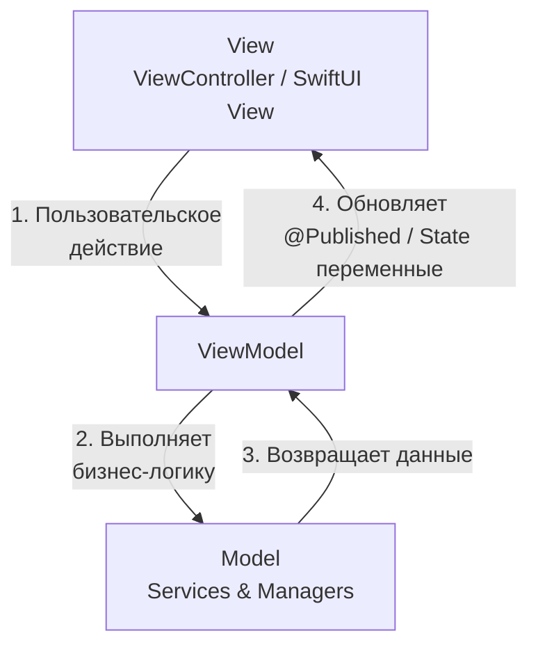
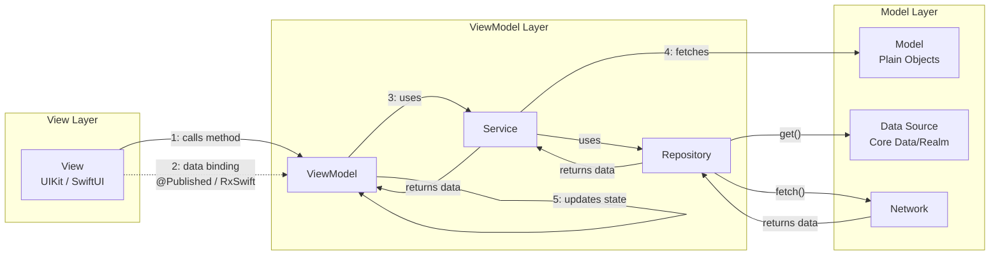

#ios #architecture #Swift 

**Паттерн представления данных, который отделяет логику интерфейса (View) от бизнес-логики и данных (Model) через посредника — ViewModel.** Ключевая концепция — **привязка данных (data binding)**, которая автоматически обновляет View при изменении состояния в ViewModel.

---

### **1. Взаимодействие компонентов**

В отличие от [[Clean Swift (VIP) Architecture]], поток данных в MVVM не циклический, а скорее **древовидный** с центром в ViewModel. Современная реализация heavily relies на реактивное программирование ([[Combine]], [[RxSwift]]) для привязки данных.



**Последовательность шагов:**

1.  **Пользовательское действие (User Action):** Пользователь взаимодействует с View (тап по кнопке в [[UIKit]] или Button в [[SwiftUI]]). View **не обрабатывает логику**, а просто вызывает метод или изменяет свойство у своей ViewModel.
    *   *Пример (UIKit):* `@objc func didTapLoginButton() { viewModel.attemptLogin() }`
    *   *Пример (SwiftUI):* `Button("Login", action: viewModel.attemptLogin)`

2.  **Обработка в ViewModel (Business Logic):** ViewModel получает событие. Она содержит всю логику подготовки данных для View. ViewModel может использовать различные **сервисы** (NetworkService, DatabaseService) для выполнения своей работы (сетевые запросы, кеширование).
    *   *Пример:* `func attemptLogin() { authService.login(username: username, password: password) { ... } }`

3.  **Обновление состояния (State Change):** По завершении работы ViewModel обновляет свои свойства, которые помечены как **"публикуемые"** (например, `@Published` в Combine или `BehaviorRelay` в RxSwift). Эти свойства хранят состояние View (текст лейбла, скрыта ли кнопка, массив данных для таблицы и т.д.).

4.  **Привязка данных (Data Binding - Магия MVVM):** Механизм привязки **автоматически** оповещает View об изменении этих "публикуемых" свойств. View (через подписку) получает новые данные и **реактивно** обновляет UI.
    *   *Как это выглядит:*
        *   **SwiftUI:** Использует `@ObservedObject` или `@StateObject` для привязки к ViewModel. Обновление происходит автоматически системой.
        *   **UIKit:** Реализуется вручную через замыкания (closures), делегаты (delegates) или, что чаще, через фреймворки **Combine** (с `@Published` и `sink`) или **RxSwift** (с `bind`). ViewController подписывается на изменения свойств ViewModel и обновляет UI в обработчике.

---

### **2. Схема архитектуры**



---

### **3. Термины и ключевые моменты**

#### **Ключевые компоненты:**
*   **Model:** Представляет собой данные и бизнес-логику приложения. Это простые структуры или классы (User, Product), а также сервисы, менеджеры и репозитории, которые работают с этими данными.
*   **View (Представление):** Отвечает за отображение пользовательского интерфейса и обработку пользовательского ввода. **Не содержит бизнес-логики.** В [[iOS]] это ViewController (в UIKit) или View (в SwiftUI).
*   **ViewModel (Модель Представления):** Посредник между View и Model. Ее главная задача — готовить данные из Model в удобном для отображения на View виде. Она не импортирует UIKit, что делает ее легко тестируемой. Содержит **состояние (state)** View.

#### **Важные принципы:**
*   **Привязка данных (Data Binding):** Краеугольный камень MVVM. Обеспечивает автоматическую синхронизацию между View и ViewModel. Избавляет View от необходимости вручную обновлять себя, уменьшая amount of boilerplate code.
*   **Разделение ответственности:** View только показывает данные и передает действия. ViewModel только преобразует данные и содержит логику. Model только хранит данные и бизнес-правила.
*   **Наблюдаемая ViewModel (Observable):** ViewModel должна каким-то образом уведомлять View о своих изменениях. В современном стеке это реализуется через реактивные фреймворки.

#### **Способы привязки в UIKit:**
1.  **Combine:** Нативный фреймворк от Apple. ViewModel использует `@Published` свойства, а ViewController подписывается на них через `sink` или `assign`.
2.  **RxSwift / ReactiveSwift:** Сторонние реактивные фреймворки. Очень мощные, но добавляют dependency.
3.  **Замыкания ([[Closure]]) / Делегаты ([[Swift/Теория/Swift/Standart Library/Delegate]]):** Более простой, ручной способ. ViewModel может иметь свойство-замыкание `var onUpdate: (() -> Void)?`, которое View вызывает для подписки, а ViewModel вызывает при изменениях.

#### **Сильные стороны:**
*   **Отличная тестируемость ViewModel:** Поскольку ViewModel не зависит от UIKit, ее легко протестировать модульными тестами.
*   **Снижение связанности:** View ничего не знает о Model, и наоборот.
*   **Естественная совместимость со SwiftUI:** SwiftUI идеально построен для парадигмы MVVM с его `@ObservedObject` и `@StateObject`.
*   **Меньше бойлерплейта, чем в Clean Swift:** Особенно со SwiftUI.

#### **Слабые стороны:**
*   **Простые задачи могут казаться сложными:** Для простых экранов настройка привязки может показаться избыточной.
*   **Риск "раздувания" ViewModel:** Если не следить, вся логика может мигрировать в ViewModel, превращая ее в "God Object".
*   **Кривая обучения:** Для эффективной работы необходимо понимание реактивного программирования.

---

### **4. Пример структуры файлов в [[Xcode]]**

```
LoginFeature/
├── LoginViewController.swift       // View (UIKit)
├── LoginViewModel.swift            // ViewModel
├── LoginModels.swift               // Model (структуры Data, Request, Response)
└── Services/
    ├── AuthService.swift           // Сервис, используемый ViewModel
    └── NetworkService.swift        // Общий сервис
```

### **5. Важное от себя (Практические советы)**

*   **"Тонкая" ViewModel vs "Толстая" ViewModel:** Стремитесь к "тонкой" View. Логика должна быть в ViewModel, но не вся. Сложную бизнес-логику лучше выносить в отдельные сервисы и Use Cases, которые потом использует ViewModel. Это предотвращает ее разбухание.
*   **Именование свойств во ViewModel:** Имена свойств должны отражать **состояние**, а не то, как они будут использоваться. Вместо `var showErrorLabel: Bool` лучше `var errorMessage: String?`. View сама решит, что лейбл скрыт, если `errorMessage == nil`.
*   **Используйте Coordinator Pattern для навигации:** ViewModel не должна знать о навигации. Чтобы сохранить ее независимость от UIKit, вынесите логику переходов в **[[Coordinator]]** или **Router**. ViewModel может сообщить о необходимости перехода через замыкание или делегат, а Coordinator уже выполнит его.
*   **Начните с Combine:** Если ваш таргет iOS 13+, однозначно начинайте осваивать **[[Combine]]** для привязки данных. Это нативный и мощный инструмент.
*   **Не делайте сильные ссылки из ViewModel на View:** View держит сильную ссылку на ViewModel (как `@ObservedObject` или просто свойство). ViewModel должна держать ссылку на View только как `weak` делегат или через замыкания, чтобы избежать цикла retain cycle.

---

