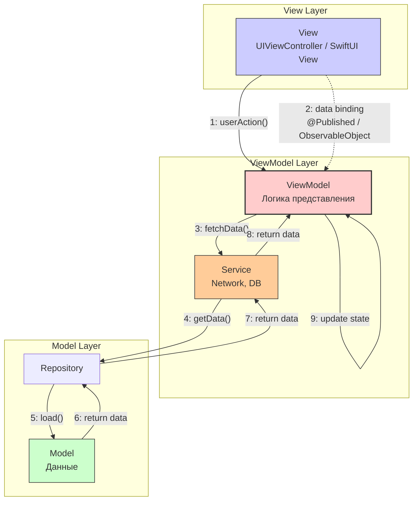

#architecture #mvvm #ios #swiftui #combine #uikit #reactive #data-binding

---
### Определение
**MVVM (Model-View-ViewModel)** — это архитектурный паттерн, который отделяет логику интерфейса (View) от бизнес-логики и данных (Model) через посредника — **ViewModel** . Ключевая концепция MVVM — **привязка данных (data binding)**, которая автоматически обновляет View при изменении состояния в ViewModel .

MVVM был разработан Microsoft в 2005 году и стал популярен в [[iOS]]-разработке с появлением реактивных фреймворков (ReactiveCocoa, [[RxSwift]]) и особенно после выхода [[SwiftUI]] и [[Combine]], которые сделали его "родным" для экосистемы Apple.

### Зачем это знать iOS-разработчику?
1.  **Стандарт для SwiftUI:** SwiftUI спроектирован вокруг принципов MVVM, и это де-факто стандартная архитектура для новых проектов .
2.  **Тестируемость:** ViewModel не зависит от UIKit, что делает ее идеальной для юнит-тестов .
3.  **Реактивность:** MVVM отлично сочетается с Combine и RxSwift, обеспечивая декларативное обновление UI .
4.  **Разделение ответственности:** Каждый компонент четко отделен и выполняет свою задачу .
5.  **Меньше бойлерплейта:** По сравнению с [[VIPER Architecture|VIPER]] или [[Clean Swift (VIP) Architecture|Clean Swift]], MVVM требует меньше кода .

---

### Компоненты MVVM



#### 1. **Model (Модель)**
**Ответственность:** Данные и бизнес-логика низкого уровня.
- Структуры данных (User, Product).
- Сервисы для работы с сетью, базой данных.
- Репозитории для доступа к данным.
- **Не знает о существовании View и ViewModel.**

```swift
struct User: Codable {
    let id: Int
    let name: String
    let email: String
}

protocol UserRepositoryProtocol {
    func fetchUser(id: Int) async throws -> User
    func saveUser(_ user: User) async throws
}

class UserRepository: UserRepositoryProtocol {
    private let apiService: APIService
    private let databaseService: DatabaseService
    
    func fetchUser(id: Int) async throws -> User {
        // Сначала пробуем из кэша
        if let cached = try? await databaseService.getUser(id: id) {
            return cached
        }
        // Иначе с сервера
        let user = try await apiService.fetchUser(id: id)
        try? await databaseService.saveUser(user)
        return user
    }
}
```

#### 2. **View (Представление)**
**Ответственность:** Отображение UI и передача пользовательских событий.
- **Не содержит бизнес-логики.**
- Подписывается на изменения ViewModel через data binding.
- В UIKit — это [[UIViewController]], в SwiftUI — `View`.
- Держит сильную ссылку на ViewModel.

```swift
// UIKit + Combine
class UserViewController: UIViewController {
    @IBOutlet weak var nameLabel: UILabel!
    @IBOutlet weak var emailLabel: UILabel!
    @IBOutlet weak var activityIndicator: UIActivityIndicatorView!
    
    var viewModel: UserViewModel!
    private var cancellables = Set<AnyCancellable>()
    
    override func viewDidLoad() {
        super.viewDidLoad()
        bindViewModel()
        viewModel.viewDidLoad()
    }
    
    private func bindViewModel() {
        viewModel.$user
            .receive(on: DispatchQueue.main)
            .sink { [weak self] user in
                self?.nameLabel.text = user?.name
                self?.emailLabel.text = user?.email
            }
            .store(in: &cancellables)
        
        viewModel.$isLoading
            .receive(on: DispatchQueue.main)
            .sink { [weak self] isLoading in
                if isLoading {
                    self?.activityIndicator.startAnimating()
                } else {
                    self?.activityIndicator.stopAnimating()
                }
            }
            .store(in: &cancellables)
    }
}

// SwiftUI
struct UserView: View {
    @StateObject var viewModel: UserViewModel
    
    var body: some View {
        VStack {
            if viewModel.isLoading {
                ProgressView()
            } else {
                Text(viewModel.user?.name ?? "")
                Text(viewModel.user?.email ?? "")
            }
        }
        .onAppear {
            viewModel.viewDidLoad()
        }
    }
}
```

#### 3. **ViewModel (Модель представления)**
**Ответственность:** Подготовка данных для View и логика представления.
- Содержит **состояние (state)** View.
- Форматирует данные из Model для отображения.
- Управляет навигацией через координаторы.
- **Не импортирует UIKit** — чистый Swift.
- Использует реактивные свойства (`@Published`, `CurrentValueSubject`) для привязки.

```swift
import Foundation
import Combine

class UserViewModel: ObservableObject {
    // MARK: - Published Properties (State)
    @Published var user: User?
    @Published var isLoading = false
    @Published var errorMessage: String?
    
    // MARK: - Dependencies
    private let userRepository: UserRepositoryProtocol
    private let coordinator: AppCoordinator
    private var cancellables = Set<AnyCancellable>()
    
    init(userRepository: UserRepositoryProtocol, coordinator: AppCoordinator) {
        self.userRepository = userRepository
        self.coordinator = coordinator
    }
    
    // MARK: - Public Methods
    func viewDidLoad() {
        loadUser(id: 1)
    }
    
    func loadUser(id: Int) {
        isLoading = true
        errorMessage = nil
        
        Task { @MainActor in
            do {
                let user = try await userRepository.fetchUser(id: id)
                self.user = user
                self.isLoading = false
            } catch {
                self.errorMessage = error.localizedDescription
                self.isLoading = false
            }
        }
    }
    
    func editButtonTapped() {
        coordinator.navigateToEdit(user: user)
    }
    
    // MARK: - Computed Properties for Display
    var displayName: String {
        user?.name.uppercased() ?? ""
    }
    
    var formattedEmail: String {
        user?.email.lowercased() ?? ""
    }
}
```

---

### Примеры реализации

#### Уровень 1: UIKit + Combine (поисковый экран)

**SearchModels.swift**
```swift
import Foundation

struct SearchResult: Identifiable, Codable {
    let id: Int
    let title: String
    let description: String
}
```

**SearchViewModel.swift**
```swift
import Foundation
import Combine

class SearchViewModel: ObservableObject {
    // MARK: - Input (от View)
    @Published var searchQuery = ""
    
    // MARK: - Output (для View)
    @Published var results: [SearchResult] = []
    @Published var isLoading = false
    @Published var errorMessage: String?
    
    private let searchService: SearchServiceProtocol
    private var cancellables = Set<AnyCancellable>()
    
    init(searchService: SearchServiceProtocol) {
        self.searchService = searchService
        
        // Реактивный поиск с debounce
        $searchQuery
            .debounce(for: .milliseconds(500), scheduler: DispatchQueue.main)
            .removeDuplicates()
            .filter { !$0.isEmpty }
            .sink { [weak self] query in
                self?.performSearch(query: query)
            }
            .store(in: &cancellables)
    }
    
    private func performSearch(query: String) {
        isLoading = true
        errorMessage = nil
        
        searchService.search(query: query)
            .receive(on: DispatchQueue.main)
            .sink { [weak self] completion in
                self?.isLoading = false
                if case .failure(let error) = completion {
                    self?.errorMessage = error.localizedDescription
                }
            } receiveValue: { [weak self] results in
                self?.results = results
            }
            .store(in: &cancellables)
    }
    
    func clearSearch() {
        searchQuery = ""
        results = []
    }
}
```

**SearchViewController.swift**
```swift
import UIKit
import Combine

class SearchViewController: UIViewController {
    @IBOutlet weak var searchBar: UISearchBar!
    @IBOutlet weak var tableView: UITableView!
    @IBOutlet weak var activityIndicator: UIActivityIndicatorView!
    @IBOutlet weak var errorLabel: UILabel!
    
    var viewModel: SearchViewModel!
    private var cancellables = Set<AnyCancellable>()
    
    override func viewDidLoad() {
        super.viewDidLoad()
        setupTableView()
        bindViewModel()
    }
    
    private func setupTableView() {
        tableView.dataSource = self
        tableView.delegate = self
        tableView.register(UITableViewCell.self, forCellReuseIdentifier: "Cell")
    }
    
    private func bindViewModel() {
        // Двустороннее связывание searchBar и searchQuery
        searchBar.textDidChangePublisher
            .assign(to: \.searchQuery, on: viewModel)
            .store(in: &cancellables)
        
        // Подписка на результаты
        viewModel.$results
            .receive(on: DispatchQueue.main)
            .sink { [weak self] _ in
                self?.tableView.reloadData()
            }
            .store(in: &cancellables)
        
        viewModel.$isLoading
            .receive(on: DispatchQueue.main)
            .sink { [weak self] isLoading in
                if isLoading {
                    self?.activityIndicator.startAnimating()
                    self?.tableView.isHidden = true
                    self?.errorLabel.isHidden = true
                } else {
                    self?.activityIndicator.stopAnimating()
                }
            }
            .store(in: &cancellables)
        
        viewModel.$errorMessage
            .receive(on: DispatchQueue.main)
            .compactMap { $0 }
            .sink { [weak self] message in
                self?.errorLabel.text = message
                self?.errorLabel.isHidden = false
                self?.tableView.isHidden = true
            }
            .store(in: &cancellables)
    }
}

extension SearchViewController: UITableViewDataSource {
    func tableView(_ tableView: UITableView, numberOfRowsInSection section: Int) -> Int {
        return viewModel.results.count
    }
    
    func tableView(_ tableView: UITableView, cellForRowAt indexPath: IndexPath) -> UITableViewCell {
        let cell = tableView.dequeueReusableCell(withIdentifier: "Cell", for: indexPath)
        let result = viewModel.results[indexPath.row]
        cell.textLabel?.text = result.title
        cell.detailTextLabel?.text = result.description
        return cell
    }
}

// Расширение для получения Publisher из UISearchBar
extension UISearchBar {
    var textDidChangePublisher: AnyPublisher<String, Never> {
        NotificationCenter.default.publisher(for: UISearchBar.textDidChangeNotification, object: self)
            .compactMap { ($0.object as? UISearchBar)?.text }
            .eraseToAnyPublisher()
    }
}
```

#### Уровень 2: SwiftUI + Combine (экран профиля)

**ProfileView.swift**
```swift
import SwiftUI

struct ProfileView: View {
    @StateObject private var viewModel: ProfileViewModel
    
    init(userId: Int) {
        _viewModel = StateObject(wrappedValue: ProfileViewModel(userId: userId))
    }
    
    var body: some View {
        VStack(spacing: 20) {
            if viewModel.isLoading {
                ProgressView()
                    .scaleEffect(1.5)
            } else if let error = viewModel.errorMessage {
                ErrorView(message: error) {
                    viewModel.loadProfile()
                }
            } else {
                profileHeader
                statsSection
                actionButtons
                postsList
            }
        }
        .navigationTitle("Профиль")
        .onAppear {
            viewModel.loadProfile()
        }
        .refreshable {
            await viewModel.refresh()
        }
    }
    
    private var profileHeader: some View {
        VStack {
            AsyncImage(url: viewModel.avatarURL) { image in
                image.resizable()
            } placeholder: {
                Circle().fill(Color.gray)
            }
            .frame(width: 100, height: 100)
            .clipShape(Circle())
            
            Text(viewModel.displayName)
                .font(.title)
                .bold()
            
            Text(viewModel.bio)
                .font(.body)
                .foregroundColor(.gray)
        }
    }
    
    private var statsSection: some View {
        HStack(spacing: 40) {
            StatItem(value: viewModel.postsCount, title: "Посты")
            StatItem(value: viewModel.followersCount, title: "Подписчики")
            StatItem(value: viewModel.followingCount, title: "Подписки")
        }
    }
    
    private var actionButtons: some View {
        HStack(spacing: 20) {
            Button(viewModel.isFollowed ? "Отписаться" : "Подписаться") {
                viewModel.toggleFollow()
            }
            .buttonStyle(.borderedProminent)
            
            Button("Написать") {
                viewModel.sendMessageTapped()
            }
            .buttonStyle(.bordered)
        }
    }
    
    private var postsList: some View {
        List(viewModel.posts) { post in
            PostRow(post: post)
                .onTapGesture {
                    viewModel.postTapped(post)
                }
        }
    }
}

struct StatItem: View {
    let value: Int
    let title: String
    
    var body: some View {
        VStack {
            Text("\(value)")
                .font(.title2)
                .bold()
            Text(title)
                .font(.caption)
                .foregroundColor(.gray)
        }
    }
}
```

**ProfileViewModel.swift**
```swift
import Foundation
import Combine
import SwiftUI

@MainActor
class ProfileViewModel: ObservableObject {
    // MARK: - Published State
    @Published private(set) var profile: Profile?
    @Published private(set) var posts: [Post] = []
    @Published private(set) var isLoading = false
    @Published private(set) var isRefreshing = false
    @Published var errorMessage: String?
    @Published var isFollowed = false
    
    // MARK: - Dependencies
    private let userId: Int
    private let profileService: ProfileServiceProtocol
    private let coordinator: AppCoordinator
    
    init(userId: Int,
         profileService: ProfileServiceProtocol = ProfileService(),
         coordinator: AppCoordinator) {
        self.userId = userId
        self.profileService = profileService
        self.coordinator = coordinator
    }
    
    // MARK: - Computed Properties for View
    var displayName: String {
        profile?.name ?? ""
    }
    
    var avatarURL: URL? {
        profile?.avatarURL.flatMap { URL(string: $0) }
    }
    
    var bio: String {
        profile?.bio ?? "Нет информации"
    }
    
    var postsCount: Int {
        profile?.postsCount ?? 0
    }
    
    var followersCount: Int {
        profile?.followersCount ?? 0
    }
    
    var followingCount: Int {
        profile?.followingCount ?? 0
    }
    
    // MARK: - Public Methods
    func loadProfile() {
        guard !isLoading else { return }
        
        isLoading = true
        errorMessage = nil
        
        Task {
            do {
                async let profileTask = profileService.fetchProfile(userId: userId)
                async let postsTask = profileService.fetchPosts(userId: userId)
                
                let (profile, posts) = try await (profileTask, postsTask)
                
                self.profile = profile
                self.posts = posts
                self.isFollowed = profile.isFollowed
                self.isLoading = false
                
            } catch {
                self.errorMessage = error.localizedDescription
                self.isLoading = false
            }
        }
    }
    
    func refresh() async {
        isRefreshing = true
        
        do {
            async let profileTask = profileService.fetchProfile(userId: userId)
            async let postsTask = profileService.fetchPosts(userId: userId)
            
            let (profile, posts) = try await (profileTask, postsTask)
            
            self.profile = profile
            self.posts = posts
            self.isFollowed = profile.isFollowed
            
        } catch {
            self.errorMessage = error.localizedDescription
        }
        
        isRefreshing = false
    }
    
    func toggleFollow() {
        // Оптимистичное обновление UI
        isFollowed.toggle()
        
        Task {
            do {
                try await profileService.toggleFollow(userId: userId)
            } catch {
                // Откат при ошибке
                isFollowed.toggle()
                errorMessage = error.localizedDescription
            }
        }
    }
    
    func postTapped(_ post: Post) {
        coordinator.showPostDetail(post)
    }
    
    func sendMessageTapped() {
        coordinator.showChat(with: userId)
    }
}
```

#### Уровень 3: MVVM с Coordinator и Dependency Injection

**AppCoordinator.swift**
```swift
import UIKit
import SwiftUI

protocol Coordinator {
    func start()
}

class AppCoordinator: ObservableObject {
    private let navigationController: UINavigationController
    
    init(navigationController: UINavigationController) {
        self.navigationController = navigationController
    }
    
    func showLogin() {
        let viewModel = LoginViewModel(coordinator: self)
        let loginView = LoginView(viewModel: viewModel)
        let hostingController = UIHostingController(rootView: loginView)
        navigationController.pushViewController(hostingController, animated: true)
    }
    
    func showProfile(userId: Int) {
        let viewModel = ProfileViewModel(userId: userId, coordinator: self)
        let profileView = ProfileView(viewModel: viewModel)
        let hostingController = UIHostingController(rootView: profileView)
        navigationController.pushViewController(hostingController, animated: true)
    }
    
    func showPostDetail(_ post: Post) {
        let viewModel = PostDetailViewModel(post: post, coordinator: self)
        let detailView = PostDetailView(viewModel: viewModel)
        let hostingController = UIHostingController(rootView: detailView)
        navigationController.pushViewController(hostingController, animated: true)
    }
    
    func showChat(with userId: Int) {
        let chatView = ChatView(userId: userId)
        let hostingController = UIHostingController(rootView: chatView)
        navigationController.pushViewController(hostingController, animated: true)
    }
    
    func goBack() {
        navigationController.popViewController(animated: true)
    }
}
```

**Dependency Injection Container**
```swift
class DIContainer {
    private let coordinator: AppCoordinator
    
    init(navigationController: UINavigationController) {
        self.coordinator = AppCoordinator(navigationController: navigationController)
    }
    
    func makeLoginViewModel() -> LoginViewModel {
        LoginViewModel(coordinator: coordinator)
    }
    
    func makeProfileViewModel(userId: Int) -> ProfileViewModel {
        ProfileViewModel(userId: userId, coordinator: coordinator)
    }
    
    func makePostDetailViewModel(post: Post) -> PostDetailViewModel {
        PostDetailViewModel(post: post, coordinator: coordinator)
    }
}
```

---

### MVVM vs Другие архитектуры

| Характеристика | MVC | MVP | MVVM | VIPER | Clean Swift |
|----------------|-----|-----|------|-------|-------------|
| **View** | Активна | Пассивна (протокол) | Пассивна (binding) | Пассивна | Пассивна |
| **Связь View с логикой** | Прямая | Протокол | Data binding | Протоколы | Протоколы |
| **Тестируемость** | Низкая | Высокая | Высокая | Очень высокая | Очень высокая |
| **Зависимость от UIKit** | Controller зависит | Presenter не зависит | ViewModel не зависит | Interactor не зависит | Interactor не зависит |
| **Бойлерплейт** | Минимум | Средний | Средний | Много | Много |
| **Реактивность** | Нет | Нет | Да (Combine/Rx) | Нет | Нет |
| **SwiftUI интеграция** | Плохая | Плохая | Идеальная | Плохая | Плохая |
| **Кривая обучения** | Низкая | Средняя | Средняя | Высокая | Высокая |

---

### Преимущества MVVM

1.  **Тестируемость:** ViewModel — чистый Swift-класс, легко покрывается юнит-тестами .
2.  **Разделение ответственности:** Четкое разделение между UI и логикой .
3.  **Реактивность:** Data binding автоматически обновляет UI при изменении состояния .
4.  **SwiftUI compatibility:** MVVM — естественный выбор для SwiftUI .
5.  **Меньше кода:** По сравнению с VIPER или Clean Swift, MVVM требует меньше бойлерплейта .
6.  **Масштабируемость:** Хорошо работает для проектов любого размера .

### Недостатки MVVM

1.  **Сложность привязки:** В UIKit требует реактивных фреймворков или ручной подписки .
2.  **Риск "раздувания" ViewModel:** Может стать слишком большой, если не выносить логику в сервисы .
3.  **Кривая обучения:** Понимание реактивного программирования требует времени .
4.  **Управление памятью:** Нужно аккуратно управлять подписками, чтобы избежать утечек .
5.  **Отладка:** При сложных связках может быть сложно отследить поток данных .

---

### Практические советы

#### 1. **Именование свойств во ViewModel**
Имена должны отражать **состояние**, а не UI-элементы.

```swift
// Плохо
@Published var showErrorLabel: Bool = false
@Published var errorLabelText: String = ""

// Хорошо
@Published var errorMessage: String? // nil = скрыто
```

#### 2. **Используйте Coordinator для навигации**
ViewModel не должна знать о навигации. Используйте координатор для переходов.

```swift
class ViewModel {
    private let coordinator: Coordinator
    
    func itemTapped(_ item: Item) {
        coordinator.showDetail(item)
    }
}
```

#### 3. **Управляйте подписками**
В UIKit с Combine всегда храните `Set<AnyCancellable>` и очищайте его при необходимости.

#### 4. **Выносите сложную логику в сервисы**
Если ViewModel становится слишком большой, выносите логику в отдельные сервисы.

#### 5. **Используйте Input/Output паттерн для ясности**

```swift
protocol ViewModelType {
    associatedtype Input
    associatedtype Output
    
    func transform(input: Input) -> Output
}

class SearchViewModel: ViewModelType {
    struct Input {
        let searchQuery: AnyPublisher<String, Never>
        let searchTapped: AnyPublisher<Void, Never>
    }
    
    struct Output {
        let results: AnyPublisher<[Result], Never>
        let isLoading: AnyPublisher<Bool, Never>
    }
    
    func transform(input: Input) -> Output {
        // Логика трансформации
    }
}
```

#### 6. **Не забывайте про MainActor**
В SwiftUI методы, обновляющие UI, должны быть на главном потоке. Используйте `@MainActor` для ViewModel.

```swift
@MainActor
class ViewModel: ObservableObject {
    // Все @Published и методы, их меняющие, будут на главном потоке
}
```

#### 7. **Используйте weak self в замыканиях**
В Combine и замыканиях всегда используйте `[weak self]` для предотвращения утечек.

### Итог
**MVVM** — это современный, мощный и гибкий архитектурный паттерн, который стал стандартом для SwiftUI и отлично работает с UIKit + Combine. Он обеспечивает чистоту кода, тестируемость и реактивность, делая разработку iOS-приложений более предсказуемой и приятной. Несмотря на некоторую сложность в освоении, MVVM окупается в проектах любого масштаба .