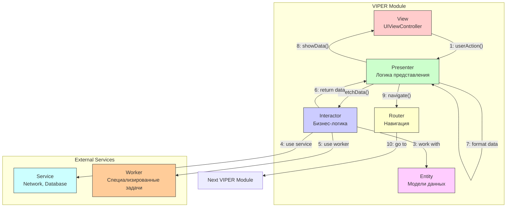

#architecture #viper #ios #clean-architecture #modular #testing #design-patterns

---
### Определение
**VIPER** — это архитектурный паттерн для построения сложных, масштабируемых и легко тестируемых iOS-приложений. Акроним VIPER расшифровывается как **View, Interactor, Presenter, Entity, Router** . Каждый компонент имеет четко определенную зону ответственности, что следует принципам Чистой Архитектуры ([[Clean Swift (VIP) Architecture|Clean Architecture]]) и обеспечивает максимальное разделение обязанностей .

VIPER был популяризирован компанией Mutual Mobile и стал стандартом для крупных проектов, где важна модульность, возможность параллельной разработки и высокая тестируемость. В отличие от [[MVC (Model-View-Controller) Architecture|MVC]] или [[MVVM (Model-View-ViewModel) Architecture|MVVM]], VIPER требует строгой дисциплины, но окупается на больших кодовых базах.

### Зачем это знать iOS-разработчику?
1.  **Масштабируемость:** VIPER идеально подходит для больших проектов с десятками экранов .
2.  **Тестируемость:** Каждый компонент можно тестировать изолированно .
3.  **Разделение ответственности:** Четкие границы между слоями упрощают поддержку .
4.  **Параллельная разработка:** Модули независимы, разные разработчики могут работать над разными экранами .
5.  **Чистота кода:** VIPER заставляет писать код, следующий принципам [[SOLID]] .

---

### Компоненты VIPER



#### 1. **View (Представление)**
**Ответственность:** Отображение UI и передача пользовательских событий.
- **Пассивный компонент** — только отображает то, что говорит Presenter.
- Реализует протокол `ViewInput`, который определяет методы для обновления UI.
- Никакой бизнес-логики.

```swift
import UIKit

protocol UserProfileViewInput: AnyObject {
    func displayUser(name: String, email: String)
    func displayLoading()
    func hideLoading()
    func displayError(_ message: String)
}

class UserProfileViewController: UIViewController, UserProfileViewInput {
    @IBOutlet weak var nameLabel: UILabel!
    @IBOutlet weak var emailLabel: UILabel!
    @IBOutlet weak var activityIndicator: UIActivityIndicatorView!
    
    var presenter: UserProfilePresenterInput?
    
    override func viewDidLoad() {
        super.viewDidLoad()
        presenter?.viewDidLoad()
    }
    
    @IBAction func settingsButtonTapped(_ sender: UIBarButtonItem) {
        presenter?.settingsButtonTapped()
    }
    
    // MARK: - UserProfileViewInput
    func displayUser(name: String, email: String) {
        nameLabel.text = name
        emailLabel.text = email
    }
    
    func displayLoading() {
        activityIndicator.startAnimating()
    }
    
    func hideLoading() {
        activityIndicator.stopAnimating()
    }
    
    func displayError(_ message: String) {
        let alert = UIAlertController(title: "Ошибка", message: message, preferredStyle: .alert)
        alert.addAction(UIAlertAction(title: "OK", style: .default))
        present(alert, animated: true)
    }
}
```

#### 2. **Interactor (Интерактор)**
**Ответственность:** Бизнес-логика и работа с данными.
- Получает запросы от Presenter.
- Работает с Entity и внешними сервисами.
- Реализует протокол `InteractorInput`.
- Уведомляет Presenter через протокол `InteractorOutput`.

```swift
import Foundation

protocol UserProfileInteractorInput {
    func loadUser(id: String)
}

protocol UserProfileInteractorOutput: AnyObject {
    func didLoadUser(_ user: UserEntity)
    func didFailToLoadUser(_ error: Error)
}

class UserProfileInteractor: UserProfileInteractorInput {
    weak var output: UserProfileInteractorOutput?
    private let userService: UserServiceProtocol
    private let storageService: StorageServiceProtocol
    
    init(userService: UserServiceProtocol, storageService: StorageServiceProtocol) {
        self.userService = userService
        self.storageService = storageService
    }
    
    func loadUser(id: String) {
        // Сначала пробуем из кэша
        if let cached = storageService.getUser(id: id) {
            output?.didLoadUser(cached)
            return
        }
        
        // Иначе с сервера
        userService.fetchUser(id: id) { [weak self] result in
            switch result {
            case .success(let user):
                self?.storageService.saveUser(user)
                self?.output?.didLoadUser(user)
            case .failure(let error):
                self?.output?.didFailToLoadUser(error)
            }
        }
    }
}
```

#### 3. **Presenter (Презентер)**
**Ответственность:** Логика представления и координация.
- Получает события от View.
- Запрашивает данные у Interactor.
- Форматирует данные для отображения.
- Управляет навигацией через Router.
- **Не знает о [[UIKit]]** — работает только с [[Foundation]].

```swift
import Foundation

protocol UserProfilePresenterInput {
    func viewDidLoad()
    func settingsButtonTapped()
}

protocol UserProfilePresenterOutput: AnyObject {
    func displayUser(name: String, email: String)
    func displayLoading()
    func hideLoading()
    func displayError(_ message: String)
}

class UserProfilePresenter: UserProfilePresenterInput {
    weak var view: UserProfilePresenterOutput?
    var interactor: UserProfileInteractorInput?
    var router: UserProfileRouterInput?
    
    private let userId: String
    
    init(userId: String) {
        self.userId = userId
    }
    
    func viewDidLoad() {
        view?.displayLoading()
        interactor?.loadUser(id: userId)
    }
    
    func settingsButtonTapped() {
        router?.navigateToSettings()
    }
}

// MARK: - InteractorOutput
extension UserProfilePresenter: UserProfileInteractorOutput {
    func didLoadUser(_ user: UserEntity) {
        view?.hideLoading()
        
        // Форматирование данных для отображения
        let fullName = "\(user.firstName) \(user.lastName)".trimmingCharacters(in: .whitespaces)
        view?.displayUser(name: fullName, email: user.email)
    }
    
    func didFailToLoadUser(_ error: Error) {
        view?.hideLoading()
        view?.displayError(error.localizedDescription)
    }
}
```

#### 4. **Entity (Сущность)**
**Ответственность:** Модели данных.
- Простые структуры или классы, представляющие бизнес-данные.
- Не содержат логики.
- Используются Interactor'ом.

```swift
import Foundation

struct UserEntity {
    let id: String
    let firstName: String
    let lastName: String
    let email: String
    let avatarURL: URL?
    let registrationDate: Date
}

struct PostEntity {
    let id: String
    let userId: String
    let title: String
    let content: String
    let createdAt: Date
}
```

#### 5. **Router (Роутер)**
**Ответственность:** Навигация и сборка модулей.
- Содержит логику переходов.
- Знает, как создать следующий VIPER-модуль.
- Обычно содержит статический метод `createModule`.

```swift
import UIKit

protocol UserProfileRouterInput {
    func navigateToSettings()
    func navigateToEditProfile()
}

class UserProfileRouter: UserProfileRouterInput {
    weak var viewController: UIViewController?
    
    static func createModule(userId: String) -> UIViewController {
        let view = UserProfileViewController()
        let interactor = UserProfileInteractor(
            userService: UserService(),
            storageService: StorageService()
        )
        let presenter = UserProfilePresenter(userId: userId)
        let router = UserProfileRouter()
        
        view.presenter = presenter
        presenter.view = view
        presenter.interactor = interactor
        presenter.router = router
        interactor.output = presenter
        router.viewController = view
        
        return view
    }
    
    func navigateToSettings() {
        let settingsVC = SettingsViewController()
        viewController?.navigationController?.pushViewController(settingsVC, animated: true)
    }
    
    func navigateToEditProfile() {
        let editVC = EditProfileViewController()
        viewController?.navigationController?.pushViewController(editVC, animated: true)
    }
}
```

---

### Полный пример: Модуль профиля пользователя

#### UserProfileContracts.swift (Протоколы)
```swift
import Foundation

// MARK: - View
protocol UserProfileViewInput: AnyObject {
    func displayUser(name: String, email: String, postsCount: String)
    func displayLoading()
    func hideLoading()
    func displayError(_ message: String)
}

protocol UserProfileViewOutput {
    func viewDidLoad()
    func refreshData()
    func didSelectPost(_ postId: String)
    func settingsButtonTapped()
}

// MARK: - Interactor
protocol UserProfileInteractorInput {
    func fetchUserData()
    func fetchUserPosts()
}

protocol UserProfileInteractorOutput: AnyObject {
    func didFetchUser(_ user: UserEntity)
    func didFetchPosts(_ posts: [PostEntity])
    func didFailWithError(_ error: Error)
}

// MARK: - Router
protocol UserProfileRouterInput {
    func navigateToSettings()
    func navigateToPostDetail(_ postId: String)
    func navigateToEditProfile()
}
```

#### UserProfileInteractor.swift
```swift
import Foundation

class UserProfileInteractor: UserProfileInteractorInput {
    weak var output: UserProfileInteractorOutput?
    
    private let userId: String
    private let userService: UserServiceProtocol
    private let postService: PostServiceProtocol
    private let storageService: StorageServiceProtocol
    
    init(userId: String,
         userService: UserServiceProtocol,
         postService: PostServiceProtocol,
         storageService: StorageServiceProtocol) {
        self.userId = userId
        self.userService = userService
        self.postService = postService
        self.storageService = storageService
    }
    
    func fetchUserData() {
        // Пытаемся получить из кэша
        if let cachedUser = storageService.getUser(id: userId) {
            output?.didFetchUser(cachedUser)
        }
        
        // Обновляем с сервера
        userService.fetchUser(id: userId) { [weak self] result in
            switch result {
            case .success(let user):
                self?.storageService.saveUser(user)
                self?.output?.didFetchUser(user)
            case .failure(let error):
                self?.output?.didFailWithError(error)
            }
        }
    }
    
    func fetchUserPosts() {
        postService.fetchPosts(userId: userId) { [weak self] result in
            switch result {
            case .success(let posts):
                self?.output?.didFetchPosts(posts)
            case .failure(let error):
                self?.output?.didFailWithError(error)
            }
        }
    }
}
```

#### UserProfilePresenter.swift
```swift
import Foundation

class UserProfilePresenter: UserProfileViewOutput, UserProfileInteractorOutput {
    weak var view: UserProfileViewInput?
    var interactor: UserProfileInteractorInput?
    var router: UserProfileRouterInput?
    
    private var user: UserEntity?
    private var posts: [PostEntity] = []
    
    func viewDidLoad() {
        view?.displayLoading()
        interactor?.fetchUserData()
        interactor?.fetchUserPosts()
    }
    
    func refreshData() {
        interactor?.fetchUserData()
        interactor?.fetchUserPosts()
    }
    
    func didSelectPost(_ postId: String) {
        router?.navigateToPostDetail(postId)
    }
    
    func settingsButtonTapped() {
        router?.navigateToSettings()
    }
    
    // MARK: - Interactor Output
    func didFetchUser(_ user: UserEntity) {
        self.user = user
        updateView()
    }
    
    func didFetchPosts(_ posts: [PostEntity]) {
        self.posts = posts
        updateView()
    }
    
    func didFailWithError(_ error: Error) {
        view?.hideLoading()
        view?.displayError(error.localizedDescription)
    }
    
    private func updateView() {
        guard let user = user else { return }
        
        let name = "\(user.firstName) \(user.lastName)".trimmingCharacters(in: .whitespaces)
        let postsCount = "\(posts.count) публикаций"
        
        view?.displayUser(name: name, email: user.email, postsCount: postsCount)
        view?.hideLoading()
    }
}
```

#### UserProfileViewController.swift
```swift
import UIKit

class UserProfileViewController: UIViewController {
    @IBOutlet weak var nameLabel: UILabel!
    @IBOutlet weak var emailLabel: UILabel!
    @IBOutlet weak var postsCountLabel: UILabel!
    @IBOutlet weak var tableView: UITableView!
    @IBOutlet weak var activityIndicator: UIActivityIndicatorView!
    
    var presenter: UserProfileViewOutput?
    private var posts: [PostEntity] = []
    
    override func viewDidLoad() {
        super.viewDidLoad()
        setupTableView()
        presenter?.viewDidLoad()
    }
    
    private func setupTableView() {
        tableView.dataSource = self
        tableView.delegate = self
    }
    
    @IBAction func refreshButtonTapped(_ sender: UIBarButtonItem) {
        presenter?.refreshData()
    }
    
    @IBAction func settingsButtonTapped(_ sender: UIBarButtonItem) {
        presenter?.settingsButtonTapped()
    }
}

extension UserProfileViewController: UserProfileViewInput {
    func displayUser(name: String, email: String, postsCount: String) {
        nameLabel.text = name
        emailLabel.text = email
        postsCountLabel.text = postsCount
    }
    
    func displayLoading() {
        activityIndicator.startAnimating()
        tableView.isHidden = true
    }
    
    func hideLoading() {
        activityIndicator.stopAnimating()
        tableView.isHidden = false
    }
    
    func displayError(_ message: String) {
        let alert = UIAlertController(title: "Ошибка", message: message, preferredStyle: .alert)
        alert.addAction(UIAlertAction(title: "OK", style: .default))
        present(alert, animated: true)
    }
}

extension UserProfileViewController: UITableViewDataSource {
    func tableView(_ tableView: UITableView, numberOfRowsInSection section: Int) -> Int {
        return posts.count
    }
    
    func tableView(_ tableView: UITableView, cellForRowAt indexPath: IndexPath) -> UITableViewCell {
        let cell = tableView.dequeueReusableCell(withIdentifier: "PostCell", for: indexPath)
        let post = posts[indexPath.row]
        cell.textLabel?.text = post.title
        cell.detailTextLabel?.text = post.createdAt.formatted()
        return cell
    }
}

extension UserProfileViewController: UITableViewDelegate {
    func tableView(_ tableView: UITableView, didSelectRowAt indexPath: IndexPath) {
        tableView.deselectRow(at: indexPath, animated: true)
        let post = posts[indexPath.row]
        presenter?.didSelectPost(post.id)
    }
}
```

#### UserProfileRouter.swift
```swift
import UIKit

class UserProfileRouter: UserProfileRouterInput {
    weak var viewController: UIViewController?
    
    static func createModule(userId: String) -> UIViewController {
        let view = UserProfileViewController()
        let interactor = UserProfileInteractor(
            userId: userId,
            userService: UserService(),
            postService: PostService(),
            storageService: StorageService()
        )
        let presenter = UserProfilePresenter()
        let router = UserProfileRouter()
        
        view.presenter = presenter
        presenter.view = view
        presenter.interactor = interactor
        presenter.router = router
        interactor.output = presenter
        router.viewController = view
        
        return view
    }
    
    func navigateToSettings() {
        let settingsVC = SettingsViewController()
        viewController?.navigationController?.pushViewController(settingsVC, animated: true)
    }
    
    func navigateToPostDetail(_ postId: String) {
        let postDetailVC = PostDetailRouter.createModule(postId: postId)
        viewController?.navigationController?.pushViewController(postDetailVC, animated: true)
    }
    
    func navigateToEditProfile() {
        let editProfileVC = EditProfileRouter.createModule()
        viewController?.navigationController?.pushViewController(editProfileVC, animated: true)
    }
}
```

---

### VIPER vs Другие архитектуры

| Характеристика                    | [[MVC (Model-View-Controller) Architecture\|MVC]] | [[MVP (Model-View-Presenter) Architecture\|MVP]] | [[MVVM (Model-View-ViewModel) Architecture\|MVVM]] | VIPER                           | [[Clean Swift (VIP) Architecture\|Clean Swift]] |
| --------------------------------- | ------------------------------------------------- | ------------------------------------------------ | -------------------------------------------------- | ------------------------------- | ----------------------------------------------- |
| **Количество компонентов**        | 3                                                 | 3                                                | 3                                                  | 5                               | 5                                               |
| **Тестируемость**                 | Низкая                                            | Высокая                                          | Высокая                                            | Очень высокая                   | Очень высокая                                   |
| **Разделение ответственности**    | Низкое                                            | Среднее                                          | Среднее                                            | Очень высокое                   | Очень высокое                                   |
| **Бойлерплейт**                   | Минимум                                           | Средний                                          | Средний                                            | Очень много                     | Много                                           |
| **Независимость от UIKit**        | Controller зависит                                | Presenter не зависит                             | ViewModel не зависит                               | Interactor/Presenter не зависят | Interactor/Presenter не зависят                 |
| **Сложность**                     | Низкая                                            | Средняя                                          | Средняя                                            | Очень высокая                   | Высокая                                         |
| **Модульность**                   | Низкая                                            | Средняя                                          | Средняя                                            | Очень высокая                   | Высокая                                         |
| **Подходит для крупных проектов** | ❌                                                 | ✅                                                | ✅                                                  | ✅                               | ✅                                               |

---

### Преимущества VIPER

1.  **Максимальная тестируемость:** Каждый компонент можно тестировать изолированно с помощью моков .
2.  **Четкое разделение ответственности:** Каждый компонент делает только свою работу .
3.  **Модульность:** Каждый экран — независимый модуль, который можно разрабатывать параллельно .
4.  **Независимость от UIKit:** Бизнес-логика полностью изолирована от фреймворков .
5.  **Масштабируемость:** Идеально для больших проектов с десятками экранов .
6.  **Следование SOLID:** VIPER естественным образом реализует принципы SOLID .

### Недостатки VIPER

1.  **Высокий порог входа:** Сложно освоить, требует дисциплины от всей команды .
2.  **Много бойлерплейта:** Для каждого экрана нужно создавать множество файлов и протоколов .
3.  **Избыточность для простых экранов:** Для статичных экранов VIPER — overkill .
4.  **Сложность навигации:** Передача данных между модулями требует дополнительной работы .
5.  **Замедление разработки:** На начальном этапе разработка идет медленнее из-за бойлерплейта .

---

### Практические советы

#### 1. **Используйте Configurator/Assembly**
Вынесите логику сборки модуля в отдельный класс или функцию. Это упростит тестирование и поддержку.

```swift
class UserProfileConfigurator {
    static func configure(view: UserProfileViewController, userId: String) {
        let interactor = UserProfileInteractor(userId: userId)
        let presenter = UserProfilePresenter()
        let router = UserProfileRouter()
        
        view.presenter = presenter
        presenter.view = view
        presenter.interactor = interactor
        presenter.router = router
        interactor.output = presenter
        router.viewController = view
    }
}
```

#### 2. **Управляйте ссылками правильно**
- View → Presenter: сильная
- Presenter → View: слабая ([[weak]])
- Presenter → Interactor: сильная
- Interactor → Presenter: слабая (weak)
- Presenter → Router: сильная
- Router → ViewController: слабая (weak)

#### 3. **Используйте кодогенерацию**
Для ускорения разработки используйте генераторы кода (Generamba, Sourcery) для создания шаблонов VIPER-модулей.

#### 4. **Не создавайте Workers для всего**
Используйте общие сервисы (NetworkService, DatabaseService) и создавайте специализированные Workers только для сложной логики.

#### 5. **Передача данных между модулями**
Через Router и DataStore протоколы. Например:

```swift
protocol UserProfileDataStore {
    var userId: String { get }
}

protocol UserProfilePassing {
    var dataStore: UserProfileDataStore? { get }
}

class UserProfileRouter: UserProfilePassing {
    var dataStore: UserProfileDataStore?
    
    func navigateToEdit() {
        let destination = EditProfileRouter.createModule()
        destination.userId = dataStore?.userId
        viewController?.pushViewController(destination, animated: true)
    }
}
```

#### 6. **Тестирование**
```swift
class UserProfilePresenterTests: XCTestCase {
    func testDidLoadUser_ShouldFormatDataCorrectly() {
        // Given
        let view = MockUserProfileView()
        let presenter = UserProfilePresenter()
        presenter.view = view
        
        // When
        presenter.didFetchUser(UserEntity(id: "1", firstName: "John", lastName: "Doe", email: "john@example.com"))
        
        // Then
        XCTAssertEqual(view.displayedName, "John Doe")
        XCTAssertEqual(view.displayedEmail, "john@example.com")
    }
}
```

#### 7. **Не фанатейте**
Иногда для простых действий (например, показать alert) можно отступить от строгих правил. Главное — осознанность и консистентность.

### Итог
**VIPER** — это мощная, но сложная архитектура, идеально подходящая для крупных проектов с богатой бизнес-логикой и требованиями к тестируемости. Она требует дисциплины, понимания принципов Clean Architecture и готовности писать много бойлерплейтного кода. Однако для больших команд и долгоживущих проектов VIPER окупается за счет четкой структуры, модульности и возможности параллельной разработки .