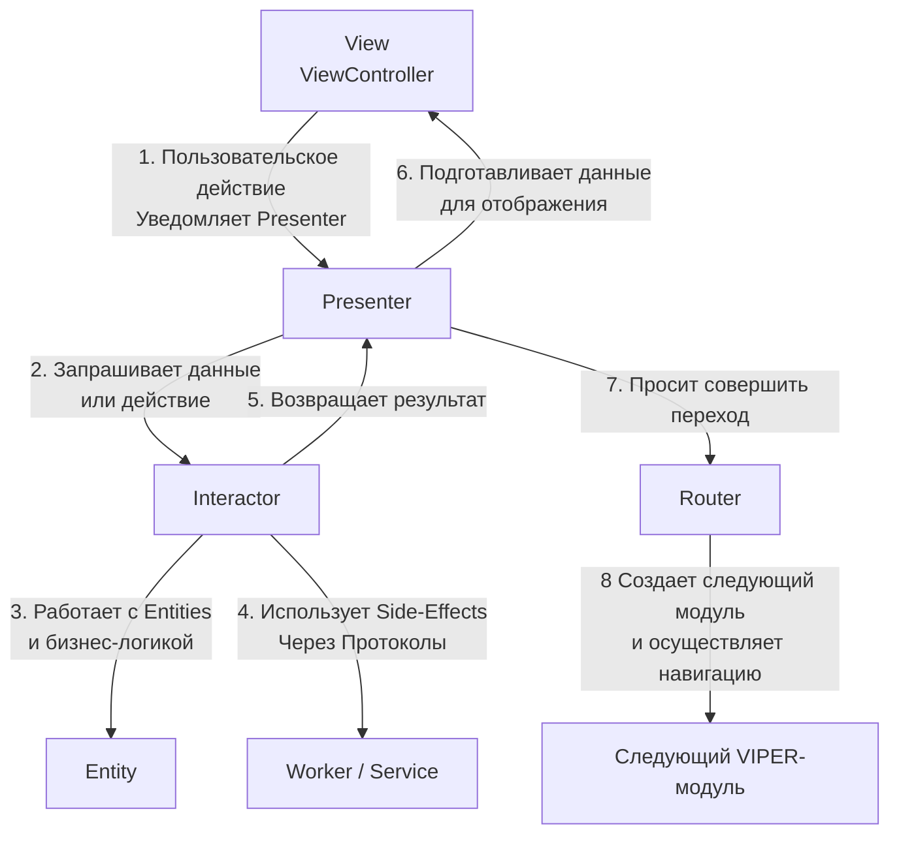
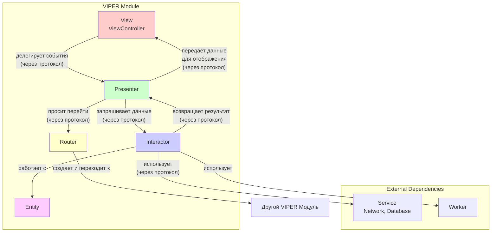

**VIPER — это акроним, где каждая буква обозначает отдельный компонент с четко определенной зоной ответственности: View, Interactor, Presenter, Entity, Router.** Это архитектура для построения сложных, масштабируемых и легко тестируемых приложений, следующая принципам Чистой Архитектуры ([[Clean Swift (VIP) Architecture|Clean Architecture]]).

---

### **1. Взаимодействие компонентов**

Взаимодействие в VIPER строго регламентировано. Данные передаются по цепочке, и каждый компонент общается только со своим "соседом", что обеспечивает очень низкую связанность.



**Последовательность шагов:**

1.  **Пользовательское действие (User Action):** Пользователь взаимодействует с интерфейсом. **View** (ViewController) фиксирует это действие и немедленно передает его **Presenter**'у, не занимаясь обработкой.
    *   *Пример:* `didSelectRowAt(:)` -> `presenter.didSelectUser(userId: "123")`

2.  **Запрос к Interactor (Request):** **Presenter** получает событие от View. Его задача — решить, *какую бизнес-логику* нужно выполнить. Он формирует запрос и обращается к **Interactor**'у.
    *   *Пример:* `interactor.fetchUserDetails(for: userId)`

3.  **Выполнение бизнес-логики (Business Logic):** **Interactor** — это "двигатель" модуля. Он содержит всю чистую бизнес-логику, независимую от UI. Он работает с простыми **Entity** (моделями данных) и для выполнения сложных задач (сеть, БД) использует **Workers** или **Services** через протоколы.
    *   *Пример:* `userService.fetchUser(by: id) { ... }`

4.  **Возврат результата (Response):** Interactor получает сырые данные (Entity) от сервисов, при необходимости как-то их обрабатывает и возвращает результат обратно **Presenter**'у.
    *   *Пример:* `presenter.didFetchUser(.success(user))`

5.  **Подготовка данных для отображения (Formatting):** **Presenter** получает сырые данные от Interactor'а. Его главная задача — преобразовать эти данные в форму, пригодную для отображения на **View**. Он *не должен* содержать бизнес-логику, только логику представления.
    *   *Пример:* Преобразование `Date` в строку "Сегодня", определение, показывать ли кнопку.
    *   *Пример:* `view.showUser(name: "\(user.firstName) \(user.lastName)", registrationDate: formattedDate)`

6.  **Отображение данных (UI Update):** **View** (ViewController) получает от Presenter'а готовые к отображению строки, флаги и другие простые значения и **тупо** отрисовывает их, без какой-либо логики.

7.  **Навигация (Routing):** Если требуется переход на другой экран, **Presenter** (на основе полученных данных или логики) обращается к **Router**'у. **Router** содержит всю логику навигации и сборки следующих модулей. Он знает, как создать следующий VIPER-модуль и как осуществить переход (показать push, modal и т.д.).

---

### **2. Схема архитектуры**



---

### **3. Термины и ключевые моменты**

#### **Ключевые компоненты:**
*   **View (Представление):** Пассивный компонент, отвечающий только за отображение UI элементов и передачу пользовательских действий Presenter'у. Реализует протокол `ViewInput` (или `ViewProtocol`).
*   **Interactor (Интерактор):** "Слой бизнес-логики". Отвечает за получение данных из сетевых запросов, баз данных и т.д. Работает с **Entity**. Не знает о существовании Presenter'а, общается с ним через протокол `InteractorOutput`.
*   **Presenter (Презентер):** "Слой логики представления". Получает пользовательские действия от View, запрашивает данные у Interactor'а, готовит их для отображения и передает обратно View. Также управляет роутером для навигации. Является центральным "хабом" модуля.
*   **Entity (Сущность):** Простые модели данных (структуры или классы), которые использует Interactor. Это не модели представления, а бизнес-модели (например, `User`, `Product`).
*   **Router (Роутер / Навигатор):** Отвечает за навигацию между модулями VIPER. Содержит логику сборки (Assembly) следующих модулей и knows how to present them.

#### **Важные принципы:**
*   **Разделение ответственности (Single Responsibility):** Каждый компонент делает только свою работу. Это главное преимущество VIPER.
*   **Протоколо-ориентированность (Dependency Inversion):** Все компоненты общаются строго через протоколы. Это обеспечивает слабую связность и позволяет легко подменять реализации для тестирования (например, MockInteractor).
*   **Независимость от фреймворков:** Interactor, Presenter, Entity, Router ничего не знают о UIKit. Это чистый Swift, что делает их идеально тестируемыми.
*   **Модульность:** Каждый экран (или функциональный блок) — это независимый VIPER-модуль. Это позволяет легко переиспользовать модули и работать над ними разным разработчикам.

#### **Сильные стороны:**
*   **Высокая тестируемость:** Бизнес-логика (Interactor) и логика представления (Presenter) полностью изолированы от [[UIKit]] и легко покрываются unit-тестами.
*   **Масштабируемость:** Идеально подходит для больших проектов с большой командой. Позволяет легко распределять задачи по разработке модулей между разными людьми.
*   **Читаемость и поддерживаемость:** Код хорошо структурирован. В большом модуле легко найти, где что находится.
*   **Чистота кода:** Жесткое разделение заставляет держать код в порядке.

#### **Слабые стороны:**
*   **Высокий порог входа:** Очень сложная для понимания архитектура. Требует времени и дисциплины от команды.
*   **Большой бойлерплейт:** Требуется создание множества файлов и протоколов даже для простых экранов. Без кодогенерации разработка замедляется.
*   **Over-engineering:** Для маленьких проектов или простых экранов использование VIPER является избыточным и неоправданно усложняет разработку.

---

### **4. Пример структуры файлов в [[Xcode]]**

```
UserProfileModule/
├── UserProfile/
│   ├── UserProfileViewController.swift       // View
│   ├── UserProfilePresenter.swift            // Presenter
│   ├── UserProfileInteractor.swift           // Interactor
│   ├── UserProfileRouter.swift               // Router
│   ├── UserProfileEntities.swift             // Entity
│   ├── UserProfileContracts.swift            // Protocols
│   └── UserProfileConfigurator.swift         // Assembler
├── Services/
│   └── UserService.swift                     // External Service
└── Workers/
    └── UserProfileWorker.swift               // Worker
```

**Содержание файла `UserProfileContracts.swift`:**
```swift
// MARK: - View Protocol
protocol UserProfileViewInput: AnyObject {
    func showUser(_ user: UserViewModel)
    func showError(_ message: String)
}

// MARK: - Interactor Protocols
protocol UserProfileInteractorInput {
    func fetchUserData(for id: String)
}

protocol UserProfileInteractorOutput: AnyObject {
    func didFetchUser(_ user: UserEntity)
    func didFetchUserFailed(_ error: Error)
}

// MARK: - Router Protocol
protocol UserProfileRouterInput {
    func navigateToSettings()
}
```

---

### **5. Важное от себя (Практические советы)**

*   **Используйте Configurator/Assembler:** Вынесите логику сборки VIPER-модуля в отдельный класс `Configurator`. Это избавит ViewController от необходимости знать о всех зависимостях.
    *   `UserProfileConfigurator.configure(with: viewController)`
*   **Слабые ссылки везде, где нужно:** Presenter должен иметь сильную ссылку на Interactor, но **слабую ([[weak]])** ссылку на View и Router. Interactor должен иметь **слабую** ссылку на своего output (Presenter). Это предотвращает циклы удержания.
*   **Не создавайте Workers для всего:** Часто достаточно использовать общие сервисы (например, `NetworkService`, `CoreDataService`), которые передаются в Interactor через dependency injection. Worker — это для очень специфичной логики, присущей только этому модулю.
*   **Передача данных между модулями:** Эту ответственность несет Router. Часто данные передаются в виде простых [[Swift]]-типов или Entity-объектов. Router следующего модуля передает их в Configurator, который "прокачивает" данные до нужного компонента (обычно Interactor'а).
*   **Не бойтесь отступать от правил:** Иногда для простого действия (например, показать alert) нет смысла гонять запрос через всю цепочку. В таких случаях допустимо, чтобы Presenter напрямую просил View показать alert, если это чисто UI-действие без логики.

---

