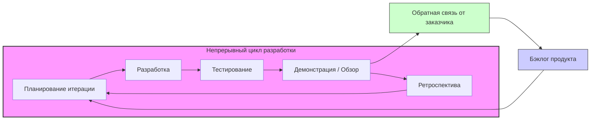

#agile #project-management #software-development #scrum #kanban #xp #lean #manifesto

---
## Agile (Гибкая методология разработки)

### Определение
**Agile (гибкая методология разработки)** — это обобщающий термин для совокупности подходов и практик в разработке программного обеспечения, которые основаны на ценностях и принципах, изложенных в **Манифесте Agile разработки программного обеспечения (Agile Manifesto)** . Манифест был создан в 2001 году группой из 17 практикующих разработчиков, которые искали альтернативу тяжеловесным, документо-ориентированным методологиям, таким как Waterfall .

Agile — это не конкретный фреймворк (как [[Методология Scrum|Scrum]]) или метод (как [[Методология Kanban|Kanban]]), а скорее философия или набор убеждений о том, как правильно разрабатывать программное обеспечение. Она ставит во главу угла людей, их взаимодействие, работающий продукт, сотрудничество с заказчиком и готовность к изменениям.

### Зачем это знать [[iOS]]-разработчику?
Подавляющее большинство современных IT-компаний, разрабатывающих мобильные приложения, используют Agile-подход. Понимание его принципов критически важно для:

1.  **Эффективной работы в команде:** Agile определяет, как команда взаимодействует, планирует работу и реагирует на изменения.
2.  **Понимания процессов:** Знание Agile помогает ориентироваться в таких фреймворках, как Scrum и Kanban, которые широко применяются в iOS-разработке.
3.  **Карьерного роста:** Работодатели ожидают от разработчиков понимания гибких методологий и умения работать в кросс-функциональных командах.
4.  **Улучшения качества продукта:** Практики Agile (непрерывная интеграция, тестирование) напрямую влияют на качество кода и приложения.
5.  **Адаптации к изменениям:** Рынок мобильных приложений меняется очень быстро, и Agile позволяет командам быстро реагировать на новые требования пользователей или изменения в API.

---

### Манифест Agile: 4 ценности

Манифест Agile провозглашает четыре основные ценности:

1.  **Люди и взаимодействие** важнее процессов и инструментов.
    -   *Смысл:* Как бы хороши ни были инструменты, успех проекта определяют люди, их общение и сотрудничество.

2.  **Работающий продукт** важнее исчерпывающей документации.
    -   *Смысл:* Документация нужна, но главная цель — создать программное обеспечение, которое решает задачи пользователя. Работающий код — лучший измеритель прогресса.

3.  **Сотрудничество с заказчиком** важнее согласования условий контракта.
    -   *Смысл:* Контракт важен, но гораздо ценнее постоянный диалог с заказчиком, который помогает уточнять требования и корректировать курс.

4.  **Готовность к изменениям** важнее следования первоначальному плану.
    -   *Смысл:* В разработке ПО изменения неизбежны. Agile-команды не боятся их, а адаптируются, даже на поздних этапах проекта .

### 12 принципов Agile

Ценности раскрываются в 12 принципах, которые лежат в основе любого Agile-подхода:

1.  Наивысшим приоритетом является удовлетворение клиента за счет регулярной и ранней поставки ценного программного обеспечения.
2.  Изменение требований приветствуется даже на поздних этапах разработки. Agile-процессы позволяют использовать изменения для обеспечения заказчику конкурентного преимущества.
3.  Работающий продукт следует выпускать как можно чаще, с периодичностью от пары недель до пары месяцев.
4.  На протяжении всего проекта разработчики и представители бизнеса должны **ежедневно работать вместе**.
5.  Над проектом должны работать мотивированные профессионалы. Им нужно создать условия, обеспечить поддержку и полностью довериться им.
6.  **Непосредственное общение** (лицом к лицу) — самый эффективный и действенный способ обмена информацией с командой и внутри нее.
7.  **Работающий продукт** — основной показатель прогресса.
8.  Инвесторы, разработчики и пользователи должны иметь возможность **поддерживать постоянный ритм** бесконечно. Agile помогает наладить устойчивый процесс разработки.
9.  Постоянное внимание к техническому совершенству и качеству проектирования повышает гибкость проекта.
10. **Простота** — искусство минимизации лишней работы — крайне необходима.
11. Самые лучшие требования, архитектурные и технические решения рождаются у **самоорганизующихся команд**.
12. Команда должна систематически анализировать возможные способы улучшения эффективности и соответственно корректировать стиль своей работы .

---

### Схема работы Agile (Итеративный цикл)

В отличие от линейной модели Waterfall, Agile работает итеративно и инкрементально.

1.  **Бэклог продукта:** Владелец продукта ведет приоритизированный список требований (пользовательских историй, задач).
2.  **Планирование итерации:** Команда выбирает из бэклога задачи, которые сможет реализовать за одну итерацию (спринт), обычно 1-4 недели.
3.  **Разработка и тестирование:** Команда работает над задачами. Применяются практики: парное программирование, TDD, непрерывная интеграция. Ежедневные встречи (стендапы) помогают синхронизироваться.
4.  **Демонстрация:** В конце итерации команда показывает работающий инкремент продукта заказчику и получает обратную связь.
5.  **Ретроспектива:** Команда анализирует свою работу и ищет способы улучшить процесс в следующей итерации.
6.  **Цикл повторяется.**

---

### Основные Agile-фреймворки и методы

Agile — это зонтичный термин. На практике используются конкретные фреймворки:

1.  **Scrum:** Самый популярный фреймворк. Использует фиксированные спринты, четкие роли (Product Owner, Scrum Master, разработчики) и события (планирование, ежедневный скрам, обзор, ретроспектива) .
2.  **Kanban:** Метод, фокусирующийся на визуализации потока работы, ограничении работы в процессе (WIP) и управлении временем цикла. Не требует спринтов .
3.  **Extreme Programming (XP):** Метод, делающий упор на инженерные практики: парное программирование, разработка через тестирование (TDD), непрерывная интеграция, частые релизы .
4.  **Lean Development:** Адаптация принципов бережливого производства (Toyota) к разработке ПО. Фокус на устранении потерь, усилении обучения и принятии решений как можно позже .
5.  **Feature-Driven Development (FDD):** Фокусируется на проектировании и создании функций (features) короткими итерациями.

---

### Преимущества Agile для iOS-разработки

1.  **Быстрый выход на рынок (Time-to-Market):** Возможность выпускать минимально жизнеспособный продукт (MVP) и быстро наращивать функциональность .
2.  **Адаптивность к изменениям:** Apple часто обновляет [[iOS]], [[API]] и правила App Store. Agile-команда может легко адаптировать план разработки под новые требования .
3.  **Улучшение качества:** Практики непрерывной интеграции и тестирования, заложенные в Agile, помогают поддерживать высокое качество кода .
4.  **Прозрачность и вовлеченность заказчика:** Заказчик видит работающий продукт каждые 1-4 недели и может корректировать требования, что снижает риск создания невостребованного функционала .
5.  **Мотивация команды:** Самоорганизующиеся команды, которым доверяют, обычно более мотивированы и продуктивны .
6.  **Снижение рисков:** Раннее выявление проблем и постоянная обратная связь снижают риски провала проекта .

### Недостатки и вызовы Agile

1.  **Сложность внедрения в крупных организациях:** Agile требует культурных изменений, которые сложно реализовать в крупных, иерархических компаниях .
2.  **Требования к команде:** Agile требует высокой дисциплины, самоорганизации и ответственности от команды. Не все разработчики к этому готовы .
3.  **Риск выгорания:** Постоянный темп работы, особенно в конце спринта, может привести к выгоранию .
4.  **Недостаток документации:** В погоне за "работающим продуктом" команды иногда пренебрегают документацией, что затрудняет поддержку проекта в будущем .
5.  **Сложность для распределенных команд:** Принцип "непосредственного общения" сложно реализовать, если команда разбросана по разным часовым поясам .
6.  **Отсутствие четкого долгосрочного плана:** Для некоторых проектов (с жесткими сроками и бюджетом) это может быть проблемой .

---

### Agile vs Waterfall

| Характеристика | Agile | Waterfall |
|---|---|---|
| **Подход** | Итеративный, инкрементальный | Линейный, последовательный |
| **Требования** | Могут меняться на протяжении проекта | Фиксируются в начале |
| **Обратная связь** | После каждой итерации | В конце проекта |
| **Документация** | Минимально необходимая | Исчерпывающая |
| **Команда** | Кросс-функциональная, самоорганизующаяся | Роли строго разделены по фазам |
| **Риски** | Снижаются благодаря итерациям | Высокие, проблемы обнаруживаются поздно |
| **Когда применять** | Проекты с высокой неопределенностью, стартапы, продукты с быстро меняющимися требованиями | Проекты с четкими, неизменными требованиями (например, госзаказы, системы реального времени) |

### Agile в iOS: Пример использования

Представим команду, разрабатывающую приложение для доставки еды.

1.  **Бэклог продукта:** В бэклоге есть задачи: "Авторизация через телефон", "Каталог ресторанов", "Корзина", "Оформление заказа", "Отслеживание курьера".
2.  **Итерация (2 недели):** На планировании команда (PO, разработчики, дизайнеры, тестировщики) берет в спринт задачи: "Авторизация через телефон" и "Каталог ресторанов".
3.  **Ежедневный скрам:** Каждый день команда собирается на 15 минут. iOS-разработчик говорит: "Вчера я закончил верстку экрана авторизации, сегодня буду интегрировать API для отправки SMS. Меня блокирует отсутствие SSL-сертификата для тестового сервера". Scrum-мастер записывает проблему и помогает ее решить.
4.  **Разработка и тестирование:** Разработчики пишут код, применяя [[TDD]]. Каждый коммит проходит через [[CI]]/[[CD]], собирается и тестируется. В конце первой недели у команды уже есть прототип авторизации.
5.  **Демонстрация:** В конце спринта команда показывает заказчику работающий прототип, где можно войти по SMS и увидеть список ресторанов. Заказчик говорит: "Отлично! А можно еще добавить фильтр по кухне в каталог?"
6.  **Ретроспектива:** Команда обсуждает, что проблема с SSL задержала работу, и договаривается в будущем проверять наличие всех сертификатов до начала спринта.
7.  **Следующий спринт:** В новый спринт берется задача "Корзина" и новая задача "Фильтр по кухне" (добавленная по обратной связи).

### Итог
**Agile** — это не просто набор правил, а философия разработки, ставящая во главу угла людей, работающий продукт и готовность к изменениям. Для iOS-разработчика понимание Agile необходимо для эффективной работы в современной команде, быстрой адаптации к изменениям платформы и рынка и создания качественных продуктов, действительно нужных пользователям. Agile реализуется через конкретные фреймворки (Scrum, Kanban), которые предоставляют практические инструменты для воплощения его принципов в жизнь.