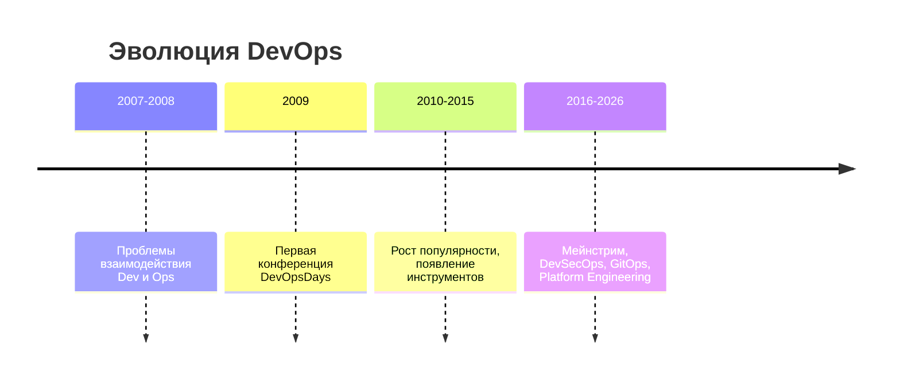
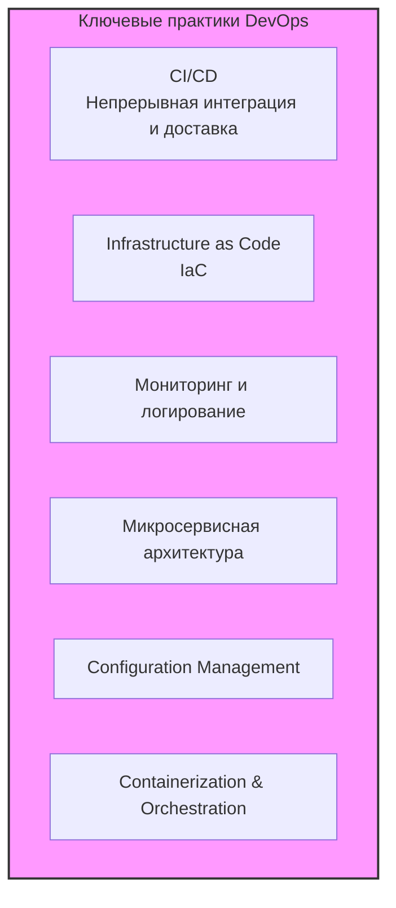
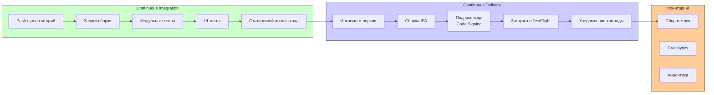

#devops #ci-cd #automation #infrastructure #development #operations #ios-devops #fastlane

---
### Определение
**DevOps** — это набор практик, объединяющих разработку программного обеспечения (Development) и ИТ-эксплуатацию (Operations), направленный на сокращение жизненного цикла разработки и обеспечение непрерывной поставки высококачественного программного обеспечения . Это не просто набор инструментов, а культурная философия, способствующая сотрудничеству между командами разработчиков и эксплуатации.

В контексте [[iOS]]-разработки DevOps включает автоматизацию сборки, тестирования и доставки приложений в App Store, мониторинг производительности, управление конфигурациями и инфраструктурой.

### Зачем это знать iOS-разработчику?
1.  **Автоматизация рутины:** Освобождение времени от ручных операций сборки и выкладки в App Store.
2.  **Быстрая обратная связь:** [[CI]]/[[CD]] пайплайны позволяют быстро получать результаты тестов и обнаруживать проблемы.
3.  **Надежность релизов:** Автоматизированные процессы снижают риск человеческой ошибки при выкладке.
4.  **Метрики и мониторинг:** Понимание того, как приложение работает у пользователей, помогает быстрее реагировать на проблемы.
5.  **Интеграция с командой:** DevOps требует тесного взаимодействия с коллегами, ответственными за инфраструктуру и процессы.

---

### История возникновения



До появления DevOps разработчики и администраторы работали в изолированных silos. Разработчики стремились быстро внедрять новые функции, а администраторы — обеспечивать стабильность. Это создавало конфликт целей и замедляло поставку. DevOps возник как ответ на эту проблему, предлагая культуру сотрудничества и общую ответственность за весь жизненный цикл продукта.

### Основные принципы DevOps (CALMS)

1.  **Culture (Культура):** Совместная ответственность, доверие и прозрачность между командами.
2.  **Automation (Автоматизация):** Автоматизация рутинных процессов: сборка, тестирование, развертывание, настройка инфраструктуры.
3.  **Lean (Бережливость):** Фокус на создание ценности для пользователя, устранение потерь (непроизводительных действий).
4.  **Measurement (Измерение):** Сбор метрик производительности, мониторинг и анализ данных для принятия решений.
5.  **Sharing (Обмен):** Обмен знаниями, опытом и ответственностью между командами.

---

### Ключевые практики DevOps



#### 1. **Continuous Integration (CI) — Непрерывная интеграция**
Разработчики регулярно (несколько раз в день) сливают свои изменения в центральный репозиторий. Каждое изменение автоматически собирается и проходит набор тестов (модульных, интеграционных). Это позволяет обнаруживать конфликты и ошибки на самых ранних этапах.

**Инструменты для iOS:** [[GitHub]] Actions, [[GitLab]] CI, Bitrise, [[Jenkins]], CircleCI.

#### 2. **Continuous Delivery / Deployment (CD) — Непрерывная доставка/развертывание**
- **Continuous Delivery:** Код после прохождения всех этапов CI автоматически подготавливается к релизу. Релиз в продакшен может быть выполнен вручную одним нажатием кнопки.
- **Continuous Deployment:** Каждое изменение, прошедшее все этапы, автоматически выкатывается в продакшен без ручного вмешательства.

**Инструменты для iOS:** Fastlane (для автоматизации подписи, сборки и загрузки в TestFlight/App Store), App Store Connect API.

#### 3. **Infrastructure as Code (IaC) — Инфраструктура как код**
Управление и предоставление инфраструктуры (серверы, базы данных, сети) через описание в коде, а не через ручные процессы. Это обеспечивает воспроизводимость, версионирование и автоматизацию.

**Инструменты:** Terraform, AWS CloudFormation, Pulumi.

#### 4. **Мониторинг и логирование (Monitoring & Logging)**
Непрерывный сбор метрик (производительность, ошибки, использование ресурсов) и логов работы приложения. Позволяет быстро обнаруживать и реагировать на инциденты.

**Инструменты для iOS:** Crashlytics (Firebase), Sentry, New Relic, Datadog, MetricKit.

#### 5. **Configuration Management — Управление конфигурациями**
Автоматизация установки и настройки программного обеспечения на серверах.

**Инструменты:** Ansible, Chef, Puppet.

---

### DevOps для iOS: Пример пайплайна



#### Инструменты в iOS DevOps пайплайне
- **Fastlane:** Де-факто стандарт для автоматизации iOS-сборок. Управляет подписью кода, созданием скриншотов, сборкой и загрузкой в App Store Connect.
- **Bitrise:** Платформа CI/CD, специализированная для мобильной разработки, с готовыми степами для iOS.
- **Xcode Server / Xcode Cloud:** Инструменты от Apple для CI/CD ([[Xcode]] Cloud — облачный сервис).
- **GitHub Actions / GitLab CI:** Универсальные CI/CD платформы с поддержкой macOS раннеров.

**Пример простого Fastfile для Fastlane:**
```ruby
# Fastfile
default_platform(:ios)

platform :ios do
  desc "Сборка и загрузка в TestFlight"
  lane :beta do
    increment_build_number
    gym(scheme: "MyApp") # Сборка
    pilot   # Загрузка в TestFlight
    slack(message: "Новая сборка успешно загружена в TestFlight")
  end
end
```

---

### Преимущества DevOps для iOS-команды

1.  **Скорость выхода на рынок:** Автоматизация позволяет выпускать обновления чаще и быстрее.
2.  **Снижение рисков:** Автоматические тесты и поэтапные выкатки (canary releases) уменьшают вероятность критических ошибок в продакшене.
3.  **Качество продукта:** Непрерывный мониторинг позволяет быстро выявлять и исправлять проблемы.
4.  **Эффективность команды:** Разработчики тратят меньше времени на рутинные операции и больше на создание нового функционала.
5.  **Надежность:** Воспроизводимые процессы сборки и развертывания исключают ошибки "на моей машине работает".
6.  **Удовлетворенность пользователей:** Быстрые исправления и новые функции повышают лояльность пользователей.

### Недостатки и вызовы

1.  **Сложность внедрения:** Требует изменения культуры, процессов и внедрения новых инструментов.
2.  **Сопротивление изменениям:** Команды могут быть не готовы к новой модели работы и ответственности.
3.  **Необходимость новых навыков:** Разработчикам нужно учиться работать с CI/CD, мониторингом, инфраструктурой.
4.  **Стоимость:** Внедрение и поддержка инфраструктуры требуют ресурсов (времени и денег).
5.  **Безопасность:** Быстрые циклы поставки могут создавать риски безопасности (DevSecOps решает эту проблему интеграцией безопасности на всех этапах).

---

### DevOps vs Agile vs Waterfall

| Характеристика | Waterfall | Agile | DevOps |
|----------------|-----------|-------|--------|
| **Фокус** | Последовательные фазы | Итеративная разработка | Сотрудничество Dev и Ops, автоматизация |
| **Цель** | Выполнение плана | Адаптация к изменениям | Быстрая и надежная поставка |
| **Команды** | Разделены | Кросс-функциональная команда | Dev и Ops работают вместе |
| **Релизы** | Редкие, крупные | Частые, инкрементальные | Очень частые, непрерывные |
| **Обратная связь** | В конце проекта | После каждого спринта | Непрерывный мониторинг |
| **Автоматизация** | Минимальная | Частичная | Ключевая практика |

### DevSecOps — Безопасность как часть DevOps

Естественная эволюция DevOps — **DevSecOps** (Development, Security, Operations). Это подход, при котором практики безопасности интегрируются в каждый этап DevOps-конвейера, а не проверяются в конце. Безопасность становится общей ответственностью всех участников.

- **SAST (Static Application Security Testing):** Анализ исходного кода на уязвимости на этапе CI.
- **DAST (Dynamic Application Security Testing):** Анализ работающего приложения.
- **SCA (Software Composition Analysis):** Анализ зависимостей на наличие известных уязвимостей.
- **Сканирование секретов:** Поиск ключей и паролей, случайно попавших в репозиторий.

### Итог
**DevOps** — это не просто набор инструментов, а культурная и профессиональная трансформация, объединяющая разработку и эксплуатацию для достижения общей цели: быстрой, надежной и качественной поставки программного обеспечения. Для iOS-разработчика освоение DevOps-практик означает умение эффективно автоматизировать процессы сборки, тестирования и доставки приложений, что напрямую влияет на скорость и качество работы команды.