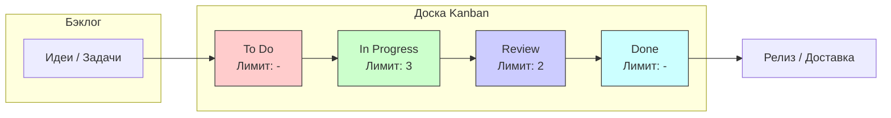

#project-management #agile #kanban #lean #workflow #visual-management #wip #continuous-improvement

---
## Kanban (Канбан)

### Определение
**Kanban (Канбан)** — это метод управления рабочими процессами, основанный на принципах бережливого производства (lean), изначально разработанный в Toyota в конце 1940-х годов как часть системы "точно в срок" (Just-In-Time) . В контексте разработки программного обеспечения Kanban предоставляет визуальную систему для управления задачами, помогая командам балансировать спрос с доступной мощностью и оптимизировать поток работы .

В отличие от [[Методология Waterfall|Waterfall]], Kanban не предписывает строгих временных интервалов (спринтов) и является непрерывным процессом. Он фокусируется на визуализации работы, ограничении количества одновременно выполняемых задач и постоянном улучшении.

### Зачем это знать [[iOS]]-разработчику?
Kanban широко используется в современных командах разработки, включая мобильные, по нескольким причинам:

1.  **Гибкость и адаптивность:** Позволяет быстро реагировать на изменения приоритетов, что критично в быстро меняющемся мире мобильных приложений.
2.  **Прозрачность процессов:** Доска Kanban делает видимым весь поток создания ценности — от идеи до релиза в App Store.
3.  **Выявление узких мест:** Лимиты WIP помогают быстро обнаружить, где именно застревает работа (например, в код-ревью или тестировании).
4.  **Снижение контекстного переключения:** Ограничивая количество задач, разработчики меньше отвлекаются и больше фокусируются.
5.  **Подходит для поддержки и операционных задач:** Идеален для команд, которые занимаются не только разработкой новых фич, но и поддержкой, баг-фиксами и инцидентами, где невозможно жесткое планирование спринта.

---

### Основные принципы и практики Kanban

Метод Kanban базируется на нескольких ключевых принципах и практиках, которые делают его эффективным.

#### 1. Визуализируйте рабочий процесс (Visualize the Workflow)
Самый известный аспект Kanban — доска Kanban (Kanban Board). Доска визуализирует этапы (столбцы), через которые проходит задача: от "Сделать" (To Do) до "Сделано" (Done). Каждая задача представлена карточкой. Это дает мгновенное понимание статуса всех задач .

#### 2. Ограничьте работу в процессе (Limit Work in Progress - WIP)
Устанавливаются жесткие лимиты на количество задач, которые могут одновременно находиться в каждом столбце. Например, в столбце "В разработке" может быть не более 3 задач. Это предотвращает перегрузку команды и заставляет завершать начатое, прежде чем браться за новое .

#### 3. Управляйте потоком (Manage Flow)
Команда непрерывно наблюдает за движением карточек по доске. Цель — сделать поток максимально плавным и быстрым, минимизируя время цикла (Cycle Time). Задержки и "бутылочные горлышки" становятся очевидными и требуют вмешательства .

#### 4. Сделайте политики процесса явными (Make Process Policies Explicit)
Правила перехода задач между этапами должны быть четко определены и известны всей команде. Например, что значит "Готово к тестированию"? Какие критерии должны быть выполнены? Это устраняет недопонимание .

#### 5. Внедряйте циклы обратной связи (Implement Feedback Loops)
Регулярные встречи (например, ежедневные стендапы, обзоры потока) помогают команде обсуждать проблемы, анализировать метрики и планировать улучшения .

#### 6. Улучшайте совместно, эволюционно (Improve Collaboratively, Evolve Experimentally)
Используя научный подход, команда выдвигает гипотезы по улучшению процесса, проверяет их и на основе данных принимает решения о дальнейших изменениях .

---

### Схема работы Kanban

**Объяснение процесса:**
1.  **Определение и визуализация:** Команда создает доску с колонками, отражающими их рабочий процесс (например, "Нужно обсудить", "В разработке", "Код-ревью", "Тестирование", "Готово к релизу").
2.  **"Тянущая" система (Pull System):** Работа не "толкается" в следующий этап. Разработчик "тянет" новую задачу из колонки "To Do" только тогда, когда у него есть свободные мощности (то есть текущая задача в колонке "In Progress" завершена, и лимит WIP позволяет взять новую).
3.  **Управление потоком:** Команда ежедневно смотрит на доску. Если в колонке "Review" скопилось 3 задачи при лимите 2, это сигнал, что код-ревью стало узким местом. Команда обсуждает, как это исправить (например, выделить больше времени на ревью).
4.  **Обратная связь:** На основе данных о времени цикла команда может прогнозировать, сколько времени займет выполнение похожих задач в будущем.

---

### Преимущества Kanban для iOS-команды

1.  **Гибкость и адаптивность:** Если дизайнер в пятницу вечером присылает правки для критичного экрана, эту задачу можно мгновенно добавить в доску с высоким приоритетом, не ломая план спринта.
2.  **Улучшение времени цикла:** Фокус на завершении задач сокращает время от начала работы до релиза. Это особенно важно для фиксов критических багов.
3.  **Прозрачность для всех:** Менеджер, тестировщик и разработчик видят одну и ту же картину. Тестировщик видит, какие задачи скоро поступят ему на проверку.
4.  **Снижение стресса:** Ограничение WIP защищает разработчиков от "многозадачности" и ощущения, что нужно делать все одновременно. Команда знает свой предел.
5.  **Непрерывное улучшение:** Регулярный анализ метрик (например, среднее время прохождения задачи) помогает находить и устранять неэффективности в процессе (например, долгий процесс сборки или ожидание дизайна).

### Недостатки Kanban

1.  **Отсутствие временных рамок:** Для новых команд без опыта самоорганизации отсутствие жестких дедлайнов (как в Scrum) может привести к потере фокуса и "растягиванию" задач .
2.  **Сложность прогнозирования на большие сроки:** Без спринтов сложнее сказать заказчику, какой именно набор функций будет готов через три месяца (хотя метрики, такие как Throughput, помогают в прогнозах).
3.  **Риск чрезмерного усложнения доски:** Можно создать слишком много колонок и swimlanes, что сделает доску непонятной и трудноуправляемой .
4.  **Требует дисциплины:** Для эффективной работы все члены команды должны строго соблюдать лимиты WIP и вовремя обновлять статус задач.

---

### Kanban vs Scrum

Сравнение Kanban с самым популярным Agile-фреймворком поможет лучше понять его место.

| Характеристика | Kanban | Scrum |
|---|---|---|
| **Ритм** | Непрерывный поток | Итеративный (спринты фиксированной длины, обычно 1-4 недели) |
| **Роли** | Нет предписанных ролей (можно сохранить существующие) | Четкие роли: Product Owner, Scrum Master, Development Team |
| **Планирование** | Непрерывное, по мере необходимости (replenishment) | В начале каждого спринта (Sprint Planning) |
| **Изменения** | Можно добавлять новые задачи в любой момент | Бэклог спринта замораживается на время спринта |
| **Основная метрика** | Время цикла (Cycle Time), Пропускная способность (Throughput) | Velocity (скорость команды в спринте) |
| **Основной принцип** | Ограничение WIP для оптимизации потока | Обязательства команды на спринт и инспекция/адаптация |
| **Доска** | Сбрасывается после завершения задачи (непрерывна) | Сбрасывается в конце каждого спринта |
| **Когда применять** | Поддержка, операции, DevOps, проекты с высоким уровнем неопределенности и приоритетными изменениями | Проекты, где команда может взять обязательства на спринт и нужна регулярная поставка инкремента продукта |

### Kanban в iOS: Пример использования

Представим команду поддержки и доработки существующего [[iOS]]-приложения.

-   **Доска:** Колонки: "Бэклог", "Анализ (UX/Требования)" (WIP 2), "Разработка (iOS)" (WIP 3), "Код-ревью" (WIP 2), "Тестирование (QA)" (WIP 2), "Готово к релизу", "Сделано".
-   **Сценарий:** Приходит критический баг, из-за которого приложение падает при запуске на новой iOS.
    1.  Баг-репорт попадает в колонку "Бэклог" с наивысшим приоритетом.
    2.  Так как лимит в колонке "Анализ" позволяет, аналитик берет его, быстро подтверждает проблему и описывает требования к фиксу.
    3.  iOS-разработчик, видя, что в его колонке "Разработка" есть свободное место (WIP 3, а сейчас 2 задачи), "тянет" этот баг к себе.
    4.  Он пишет фикс и перемещает задачу в "Код-ревью".
    5.  Другой разработчик видит задачу в ревью (лимит позволяет) и проводит ревью.
    6.  Задача переходит в "Тестирование". QA-инженер тестирует фикс.
    7.  После успешного тестирования задача попадает в "Готово к релизу". В конце дня команда собирает все задачи из этой колонки и выпускает сборку в TestFlight, а затем, при необходимости, в App Store.

В этом процессе ни один этап не был перегружен, задача прошла быстро, и команда видела ее статус на всех этапах.

### Итог
**Kanban** — это мощный, гибкий и визуальный метод управления рабочим процессом. Для iOS-команд он особенно ценен своей способностью адаптироваться к меняющимся приоритетам, выявлять узкие места в процессе (например, долгое код-ревью или ожидание дизайна) и делать прозрачным поток создания ценности. В отличие от Waterfall, он итеративен, а в отличие от Scrum, не требует жестких временных рамок, фокусируясь на непрерывном улучшении и оптимизации потока.