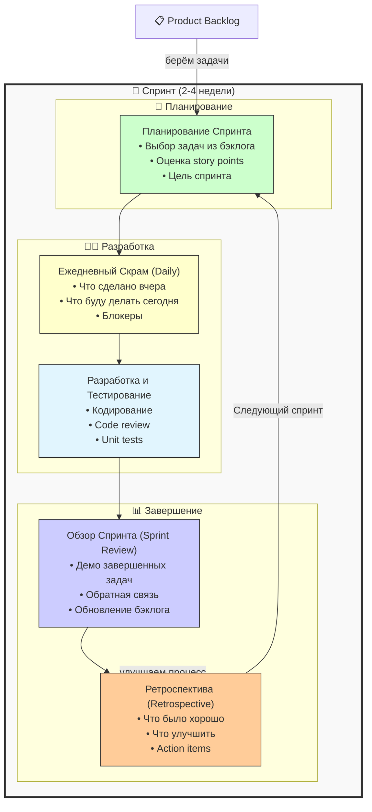

#project-management #agile #scrum #sprint #product-owner #scrum-master #development-team #backlog

---
## Scrum (Скрам)

### Определение
**Scrum** — это легкий (lightweight) фреймворк для управления сложными проектами, который помогает командам работать совместно и итеративно поставлять продукт с максимальной ценностью. Он основан на принципах эмпирического контроля процесса, что означает прозрачность, проверку и адаптацию . Scrum структурирует работу в фиксированные временные интервалы, называемые спринтами (Sprints), в конце которых команда создает готовый к использованию инкремент продукта.

В отличие от [[Методология Waterfall|Waterfall]], Scrum является итеративным и инкрементальным, позволяя получать обратную связь на ранних этапах и адаптироваться к изменениям. В отличие от Kanban, Scrum предписывает строгие роли, события и артефакты, обеспечивая четкий каркас для работы команды .

### Зачем это знать [[iOS]]-разработчику?
Scrum является одним из самых популярных фреймворков [[Методология Agile|Agile]] в IT-индустрии, и знание его принципов критически важно для эффективной работы в команде:

1.  **Структурированная работа:** Спринты дают четкий ритм работы, что помогает планировать задачи и управлять ожиданиями.
2.  **Роли и ответственность:** Понимание ролей (Product Owner, Scrum Master, разработчик) помогает четко определить свои обязанности и зоны ответственности других.
3.  **Прозрачность:** Регулярные события (ежедневные скрамы, обзоры спринта) делают прогресс команды прозрачным для всех заинтересованных сторон .
4.  **Непрерывное улучшение:** Ретроспективы спринта позволяют команде анализировать свои процессы и постоянно их улучшать .
5.  **Работа с требованиями:** Понимание бэклога продукта и процесса его приоритизации помогает разработчику всегда знать, над чем работать дальше и почему это важно .

---

### Основные роли в Scrum

Scrum определяет три ключевые роли, которые несут разную ответственность.

#### 1. Владелец Продукта (Product Owner)
-   **Кто это:** Представитель заинтересованных сторон (стейкхолдеров), "голос клиента".
-   **Обязанности:** Управление и приоритизация Бэклога Продукта (Product Backlog). Он отвечает за максимизацию ценности, которую команда доставляет. PO четко формулирует требования и отвечает на вопросы команды, но не указывает разработчикам, как технически выполнить задачу .
-   **В контексте iOS:** PO решает, какая фича (например, "темная тема" или "онбординг") важнее для пользователя и должна быть реализована в первую очередь.

#### 2. Скрам-мастер (Scrum Master)
-   **Кто это:** Слуга-лидер (servant-leader) для Scrum-команды.
-   **Обязанности:** Обеспечивает понимание и соблюдение теории, правил и практик Scrum всеми участниками. Помогает команде быть самоорганизующейся, устраняет препятствия, мешающие прогрессу, и облегчает проведение всех Scrum-событий .
-   **В контексте iOS:** Скрам-мастер может помочь команде договориться о новом процессе код-ревью, чтобы ускорить прохождение задач, или организовать встречу для решения проблемы с долгой сборкой проекта.

#### 3. Разработчики (Developers)
-   **Кто это:** Профессионалы, создающие инкремент продукта в каждом спринте. Это не только программисты, но и тестировщики, дизайнеры, аналитики, работающие в одной кросс-функциональной команде.
-   **Обязанности:** Самоорганизуются для выполнения работы, планируют спринт, отвечают за качество и создание "Готового" (Definition of Done) инкремента .
-   **В контексте iOS:** iOS-разработчик берет задачу из бэклога спринта, реализует ее, пишет юнит-тесты и участвует в код-ревью.

---

### Основные артефакты Scrum

1.  **Бэклог Продукта (Product Backlog):** Упорядоченный список всего, что может понадобиться в продукте. Это единый источник требований для любых изменений в продукте. Владелец Продукта постоянно его пересматривает и приоритизирует .
2.  **Бэклог Спринта (Sprint Backlog):** Набор элементов из Бэклога Продукта, выбранных для реализации в текущем спринте, плюс план по их доставке. Это видимый для команды прогноз того, какой функциональности будет в следующем инкременте .
3.  **Инкремент (Increment):** Сумма всех элементов Бэклога Продукта, завершенных в текущем спринте и всех предыдущих спринтах. На момент окончания спринта Инкремент должен находиться в пригодном для использования состоянии и соответствовать определению "Готово" (Definition of Done) .

---

### События (Церемонии) Scrum

Все события в Scrum имеют временные ограничения (time-boxed), чтобы минимизировать потребность в совещаниях без четкой цели.

#### 1. Планирование Спринта (Sprint Planning)
-   **Длительность:** Не более 8 часов для 4-недельного спринта.
-   **Участники:** Вся Scrum-команда.
-   **Цель:** Ответить на два вопроса: 1) Что может быть поставлено в результате Инкремента в предстоящем спринте? 2) Как будет выполнена работа, необходимая для доставки Инкремента? В результате определяется **Цель Спринта (Sprint Goal)** .

#### 2. Ежедневный Скрам (Daily Scrum)
-   **Длительность:** 15 минут.
-   **Участники:** Разработчики (могут присутствовать PO и SM, но не обязательно).
-   **Цель:** Спланировать работу на следующие 24 часа. Это не статус-митинг для начальства, а встреча команды для синхронизации и выявления препятствий. Каждый участник может ответить на три вопроса: Что я сделал вчера? Что сделаю сегодня? Что мне мешает? .

#### 3. Обзор Спринта (Sprint Review)
-   **Длительность:** Не более 4 часов для 4-недельного спринта.
-   **Участники:** Scrum-команда и приглашенные стейкхолдеры.
-   **Цель:** Продемонстрировать, что было сделано за спринт, и обсудить, что делать дальше. Команда показывает работающий инкремент продукта, а стейкхолдеры дают обратную связь. На основе этого может корректироваться Бэклог Продукта .

#### 4. Ретроспектива Спринта (Sprint Retrospective)
-   **Длительность:** Не более 3 часов для 4-недельного спринта.
-   **Участники:** Scrum-команда.
-   **Цель:** Проанализировать прошедший спринт с точки зрения процессов, взаимодействия и инструментов. Команда определяет, что пошло хорошо, что можно улучшить, и создает план улучшений для следующего спринта .

---

### Преимущества Scrum для [[iOS]]-команды

1.  **Быстрая обратная связь:** Каждые 2-4 недели стейкхолдеры видят работающий инкремент и могут скорректировать требования, что снижает риск разработки ненужного функционала .
2.  **Прозрачность:** Ежедневные скрамы и обзоры спринта делают прогресс видимым для всех.
3.  **Адаптивность:** Scrum построен вокруг идеи изменчивости требований. Команда готова реагировать на изменения в бизнесе или на рынке.
4.  **Самоорганизация и ответственность:** Разработчики сами планируют свою работу и берут на себя обязательства, что повышает вовлеченность и мотивацию.
5.  **Фокус на качестве:** Определение "Готово" (DoD) гарантирует, что каждая задача доведена до стандарта качества (например, написаны тесты, проведено ревью, задокументировано).

### Недостатки Scrum

1.  **Требовательность к дисциплине:** Scrum требует строгого соблюдения правил и временных ограничений. Нарушение ритма (например, отмена ежедневных скрамов) быстро разрушает фреймворк .
2.  **Сложность для распределенных команд:** Ежедневные встречи и тесное взаимодействие сложнее организовать, когда команда разбросана по разным часовым поясам .
3.  **Давление из-за фиксированной длины спринта:** Некоторым разработчикам может быть некомфортно работать в жестких временных рамках, особенно если оценки оказались неточными.
4.  **Риск "бюрократизации" событий:** Если встречи проводятся формально, без реальной цели, они становятся пустой тратой времени, на что часто жалуются противники Scrum .
5.  **Сложность внедрения:** Требует культурных изменений в организации и поддержки на всех уровнях.

---

### Scrum vs Kanban

| Характеристика | Scrum | Kanban |
|---|---|---|
| **Ритм** | Фиксированные спринты (time-boxed) | Непрерывный поток |
| **Роли** | Четко определены (PO, SM, Dev Team) | Не предписаны |
| **Изменения** | Бэклог спринта заморожен | Можно добавлять задачи в любой момент |
| **Основная метрика** | Velocity (скорость команды) | Cycle Time (время цикла), Throughput |
| **Основной принцип** | Обязательства на спринт и инспекция/адаптация | Ограничение WIP для оптимизации потока |
| **Доска** | Сбрасывается после каждого спринта | Непрерывна |
| **Когда применять** | Проекты с четкими целями и приоритетами на ближайший период | Поддержка, операции, проекты с высоким уровнем неопределенности и частыми сменами приоритетов |

### Scrum в iOS: Пример использования

Представим команду из 5 iOS-разработчиков, дизайнера, QA и PO, работающую над новым приложением для заметок.

-   **Спринт (2 недели):** Команда планирует спринт и берет в работу несколько фич: "Создание заметки", "Редактирование заметки", "Удаление заметки".
-   **Ежедневный скрам:** Каждый день в 10:00 команда собирается на 15 минут. Один разработчик говорит: "Я вчера закончил создание заметки, сегодня буду делать редактирование, меня блокирует то, что не готов дизайн экрана редактирования". Скрам-мастер записывает эту проблему, чтобы решить ее после встречи.
-   **Разработка:** Разработчики пишут код, делают коммиты, проводят код-ревью. В середине спринта PO понимает, что функция "Поиск" важнее "Удаления", но, так как бэклог спринта заморожен, эта задача пойдет только в следующий спринт.
-   **Обзор спринта:** В конце спринта команда демонстрирует работающий прототип, где можно создавать, редактировать и удалять заметки. Стейкхолдеры дают обратную связь: "А можно еще добавить возможность вставлять картинки в заметку?".
-   **Ретроспектива:** Команда обсуждает, что им не хватило времени на тестирование, потому что дизайн пришел с опозданием. Они договариваются в следующем спринте сместить фокус и начинать задачи с UI-компонентов, не требующих дизайна, чтобы не простаивать.

### Итог
**Scrum** — это мощный и структурированный фреймворк для управления сложной разработкой. Для iOS-команд он предоставляет четкий ритм (спринты), роли и события, которые помогают организовать работу, быстро получать обратную связь и постоянно улучшаться. Успех Scrum требует дисциплины, самоорганизации и готовности всей команды, включая бизнес-сторону, следовать его принципам.