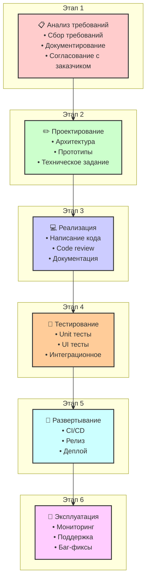

#project-management #sdlc #waterfall #methodology #development-process #agile-alternative

---
## Waterfall Model (Каскадная модель)

### Определение
**Waterfall Model (Каскадная модель)** — это классическая методология управления проектами и разработки программного обеспечения (SDLC), которая представляет процесс разработки как линейную, последовательную последовательность фаз. Каждая фаза должна быть полностью завершена до начала следующей, и результат каждой фазы служит входными данными для последующей. Прогресс рассматривается как поток, последовательно проходящий через фазы: анализ требований, проектирование, реализация, тестирование, развертывание и обслуживание .

Это одна из самых ранних и наименее итеративных методологий SDLC, изначально принятая в индустрии, когда не было широко признанных альтернатив для управления творческими, интеллектуальными процессами разработки .

### Зачем это знать [[iOS]]-разработчику?
Хотя современная iOS-разработка чаще всего ассоциируется с гибкими методологиями ([[Методология Agile|Agile]], [[Методология Scrum|Scrum]], [[Методология Kanban|Kanban]]), понимание Waterfall важно по нескольким причинам:

1.  **Работа в определенных отраслях:** В государственных контрактах, оборонной промышленности, крупном банковском секторе или медицинских устройствах Waterfall до сих пор требуется из-за строгой регламентации и необходимости исчерпывающей документации на ранних этапах .
2.  **Понимание эволюции методологий:** Waterfall — это фундамент, от которого отталкивались создатели гибких методологий. Понимание его недостатков помогает глубже осознать преимущества Agile.
3.  **Проекты с фиксированными требованиями:** Для небольших, четко определенных проектов с неизменными требованиями (например, внутреннее приложение для учета с жестко заданной формой) Waterfall может быть эффективен.
4.  **Работа с субподрядчиками:** В некоторых случаях интеграция с внешними системами может требовать строгой последовательности и предопределенных спецификаций, что соответствует каскадной модели.

---

### Основные принципы Waterfall

1.  **Последовательность фаз:** Фазы выполняются строго одна за другой. Возврат к предыдущей фазе возможен, но крайне затруднен и дорогостоящ .
2.  **Завершенность:** Каждая фаза считается завершенной только после создания полного набора документов или артефактов (например, документ с требованиями, дизайн-спецификация).
3.  **Документоцентричность:** Огромное внимание уделяется документации на каждом этапе. Это делается для сохранения знаний, облегчения передачи проекта между командами и обеспечения четкого понимания результатов .
4.  **Измеримые вехи:** Линейная структура предоставляет четкие и легко идентифицируемые вехи (milestones) — завершение фазы требований, завершение дизайна и т.д., что упрощает управление сроками с точки зрения менеджера .

---

### Фазы Waterfall Model

#### 1.  **Анализ требований (Requirements Analysis)**
Команда собирает и документирует все требования к будущей системе. Это включает интервью с заказчиком, анализ бизнес-процессов, изучение существующих систем. Результатом является детальный документ (SRS — Software Requirements Specification), который описывает, что система должна делать, но не как .

#### 2.  **Проектирование (System Design)**
На основе требований разрабатывается архитектура системы. Создаются спецификации оборудования, диаграммы потоков данных, проектируются структуры баз данных, макеты интерфейсов (UI/UX). Результат — детальный дизайн-документ, описывающий, как система будет работать .

#### 3.  **Реализация / Кодирование (Implementation)**
Разработчики пишут код в соответствии с дизайн-документом. Эта фаза часто занимает больше всего времени. В контексте iOS это написание классов на Swift, верстка экранов, интеграция с API.

#### 4.  **Тестирование (Testing)**
После завершения кодирования код передается тестировщикам. Они проверяют систему на соответствие требованиям, ищут ошибки (баги), проводят интеграционное, системное и, позже, пользовательское тестирование .

#### 5.  **Развертывание / Внедрение (Deployment)**
Готовый и протестированный продукт передается заказчику и вводится в эксплуатацию. Это может включать установку на серверы, обучение пользователей, миграцию данных .

#### 6.  **Эксплуатация и обслуживание (Maintenance)**
Самая длительная фаза. В процессе использования продукта могут обнаруживаться ошибки, требовать доработок или адаптации к изменяющимся условиям (например, новая версия iOS). Изменения вносятся, но они проходят через весь цикл заново (что на практике сложно) .

---

### Преимущества Waterfall

1.  **Простота и понятность:** Модель очень проста для понимания и управления. Четкие фазы и вехи упрощают планирование и отслеживание прогресса .
2.  **Дисциплина и структура:** Строгая последовательность дисциплинирует команду и заставляет тщательно прорабатывать каждый этап.
3.  **Качество документации:** Исчерпывающая документация облегчает передачу проекта новым членам команды или другой компании на поддержку .
4.  **Предсказуемость:** При четко определенных и неизменных требованиях, можно достаточно точно оценить сроки и бюджет .
5.  **Снижение рисков на поздних этапах:** Раннее выявление проблем с требованиями или архитектурой (на первых двух фазах) позволяет исправить их до начала кодирования, что потенциально снижает затраты .

### Недостатки Waterfall

1.  **Негибкость к изменениям:** Главный недостаток. Если требование меняется после того, как фаза анализа завершена, вернуться назад и внести изменение крайне сложно и дорого (требуется перепроектирование, переписывание кода и повторное тестирование) .
2.  **Поздняя обратная связь:** Заказчик видит работающий продукт только на финальных стадиях (тестирование или развертывание). Если он не соответствует ожиданиям, исправления обходятся очень дорого .
3.  **Риск "заморозки" требований:** Чтобы избежать изменений, требования часто "замораживают" в самом начале, что может привести к созданию продукта, который уже устарел к моменту выхода .
4.  **Нереалистичность для сложных проектов:** Для долгосрочных и сложных проектов практически невозможно идеально сформулировать все требования в начале .
5.  **Блокировка команды:** Пока фаза не завершена, участники следующей фазы (например, тестировщики во время кодирования) могут простаивать.

---

### Waterfall в контексте [[iOS]]-разработки: Пример

Представим, что государственная организация заказывает iOS-приложение для внутреннего учета с жестко определенными формами и отчетами, требования к которому не могут измениться в течение года.

**Как это выглядит по Waterfall:**

1.  **Анализ требований:** Аналитики несколько месяцев изучают законодательство, проводят десятки встреч и пишут 500-страничный документ с описанием каждой кнопки и поля ввода. Документ утверждается и подписывается.
2.  **Проектирование:** Архитекторы создают детальную схему базы данных, диаграммы классов на UML, проектируют навигацию между 50 экранами. Дизайнеры рисуют все экраны в Figma вплоть до пикселя, и они тоже утверждаются.
3.  **Разработка:** Три iOS-разработчика 6 месяцев пишут код строго по дизайну и спецификациям. Если они видят нестыковку, они не могут ее исправить без формального запроса на изменение (change request), что занимает недели.
4.  **Тестирование:** Тестировщики получают приложение и начинают проверять его по тому же 500-страничному документу. Находят 200 багов, которые уходят в фикс (снова через формальные процедуры).
5.  **Развертывание:** Приложение публикуется в App Store для внутреннего распространения через MDM. Пользователи начинают им пользоваться.
6.  **Обслуживание:** Через полгода выходит новая версия iOS, которая ломает часть логики. Это требует повторения всего цикла для выпуска обновления.

### Waterfall vs Agile

| Характеристика | Waterfall | Agile (Scrum/Kanban) |
|---|---|---|
| **Подход** | Линейный, последовательный | Итеративный, инкрементальный |
| **Требования** | Фиксируются в начале | Могут меняться на протяжении проекта |
| **Обратная связь** | В конце проекта | В конце каждой итерации (спринта) |
| **Документация** | Исчерпывающая, формальная | Минимально необходимая, "живая" |
| **Команда** | Роли строго разделены по фазам | Кросс-функциональная команда |
| **Заказчик** | Участвует в начале и в конце | Участвует на протяжении всего проекта |
| **Риски** | Высокие, обнаруживаются поздно | Снижаются благодаря раннему прототипированию |
| **Когда применять** | Проекты с неизменными требованиями, высокая критичность документации | Проекты с высокой неопределенностью, требующие быстрой адаптации |

### Итог
**Waterfall Model** — это исторически первая и наиболее структурированная методология разработки ПО. Ее главные черты — линейность и документоцентричность. Для iOS-разработчика знание Waterfall необходимо при работе в строго регламентированных отраслях или с проектами, где требования жестко фиксированы. Однако для подавляющего большинства современных мобильных проектов, где важны скорость выхода на рынок и адаптация к обратной связи, предпочтительны гибкие методологии, такие как Agile и его фреймворки (Scrum, Kanban).