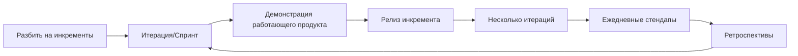

#agile #project_management #software_development #iterative #teamwork
## Описание

Agile разработка программного обеспечения — это обобщающий термин для подходов к разработке программного обеспечения, отражающих ценности и принципы, согласованные Альянсом Agile, группой из 17 практиков программного обеспечения в 2001 году, как задокументировано в их Манифесте Agile разработки программного обеспечения. Методология ценит индивидов и взаимодействия выше процессов и инструментов, работающее программное обеспечение выше всесторонней документации, сотрудничество с клиентом выше переговоров по контракту и реагирование на изменения выше следования плану.

Эти ценности основаны на 12 принципах, которые включают удовлетворение клиента через раннюю и непрерывную доставку ценного программного обеспечения, приветствие изменяющихся требований даже на поздних этапах разработки, частую доставку работающего программного обеспечения, тесное ежедневное сотрудничество между бизнес-людьми и разработчиками, построение проектов вокруг мотивированных индивидов, которым следует доверять, личный разговор как лучший способ коммуникации, работающее программное обеспечение как основной показатель прогресса, устойчивое развитие в постоянном темпе, постоянное внимание к техническому совершенству и хорошему дизайну, простоту, самоорганизующиеся команды и регулярные размышления о том, как стать более эффективными.

### Преимущества

- Скорость выхода на рынок и минимизация рисков через меньшие, инкрементальные релизы, снижая временные и стоимостные риски разработки продукта, не соответствующего требованиям пользователей.
- Эффективная и личная коммуникация, с наиболее эффективным методом — личным разговором, идеально поддерживаемым совместным размещением для лучшей идентичности команды и коммуникации.
- Очень короткие циклы обратной связи и адаптации, такие как ежедневные стендапы, позволяющие командам просматривать прогресс и быстро адаптировать подходы.
- Фокус на качестве через практики, такие как непрерывная интеграция, автоматизированное юнит-тестирование, парное программирование и разработка, управляемая тестами, обеспечивая качество с самого начала.

### Недостатки

- Эмпирические доказательства эффективности agile методов ограничены и менее убедительны, с большой зависимостью от анекдотических свидетельств.
- Потенциальные неэффективности в крупных организациях и определенных типах разработки, с трудностями в принятии для крупномасштабных, оффшорных и распределенных команд.
- Общие ловушки включают отсутствие общего дизайна продукта, добавление историй в итерацию в процессе, недостаточное обучение и отсутствие поддержки спонсора, что может привести к неудачным реализациям.
- Риск выгорания разработчиков из-за фокусированного темпа и непрерывного характера практик agile.

## Схема работы

Рабочий процесс Agile разработки программного обеспечения подчеркивает итеративную и инкрементальную разработку:

1. Разбить работу по разработке продукта на небольшие инкременты с минимальным предварительным планированием и дизайном.
2. Проводить итерации (или спринты), обычно длительностью от одной до четырех недель, включающие кросс-функциональные команды в планирование, анализ, дизайн, кодирование, юнит-тестирование и приемочное тестирование.
3. В конце каждой итерации демонстрировать работающий продукт заинтересованным сторонам для минимизации общего риска и быстрой адаптации к изменениям.
4. Выпускать меньшие инкременты на рынок, обеспечивая доступный релиз с минимальными багами в конце каждой итерации, даже если индивидуально не заслуживающий рыночного релиза.
5. Использовать несколько итераций по мере необходимости для релиза продукта или новых функций, с работающим программным обеспечением как основным показателем прогресса.
6. Включать ежедневные стендапы (например, 15 минут) для членов команды для обзора прогресса к целям, согласования адаптаций и откладывания детальных обсуждений и разрешения проблем после стендапа, если необходимо.
7. Регулярно размышлять об эффективности и корректировать практики соответственно, обеспечивая непрерывное улучшение через ретроспективы в конце итераций.

## Общие термины

- **Манифест Agile**: Документ, опубликованный в 2001 году Альянсом Agile, описывающий четыре основные ценности и 12 принципов для agile разработки программного обеспечения, подчеркивающий индивидов, работающее программное обеспечение, сотрудничество с клиентом и реагирование на изменения.
- **Итерация/Спринт**: Короткие временные рамки (таймбоксы), обычно длительностью от одной до четырех недель, где кросс-функциональная команда работает над всеми функциями разработки для производства инкремента работающего продукта.
- **Кросс-функциональная команда**: Группа людей с разными функциональными экспертизами, работающими к общей цели, включая роли от планирования до тестирования, для обеспечения всестороннего покрытия разработки.
- **Ежедневный стендап/Ежедневный скрам**: Краткая сессия (например, 15 минут), где члены команды просматривают прогресс, обсуждают завершенные и планируемые задачи и выявляют препятствия, часто стоя, чтобы сохранить краткость.
- **Бэклог продукта**: Приоритизированный список функциональности, которую должен содержать продукт, считающийся артефактом в фреймворках вроде Scrum, поддерживаемый владельцем продукта для непрерывных обновлений.
- **Scrum**: Agile фреймворк, фокусирующийся на управлении потоком работы через роли вроде владельца продукта и скрам-мастера, события вроде планирования спринта и артефакты вроде бэклога продукта.
- **Extreme Programming (XP)**: Agile метод, подчеркивающий практики вроде парного программирования, разработки, управляемой тестами, и непрерывной интеграции для улучшения качества и адаптивности.