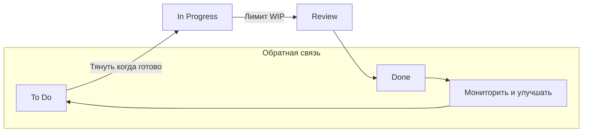

#kanban #agile #project_management #workflow #visual_management #continuous_delivery #task_tracking #iteration #teamwork
## Описание

Kanban — это lean-метод для управления и улучшения работы в человеческих системах, происходящий из lean-производства и Системы производства Toyota, особенно ее подхода к производству "точно в срок" с конца 1940-х годов. Он стремится балансировать спрос с доступной мощностью и улучшать обработку узких мест на уровне системы. В работе с знаниями и разработке программного обеспечения Kanban предоставляет визуальную систему управления процессами для помощи в принятии решений о том, что, когда и сколько производить. Он часто используется в сочетании с методами вроде Scrum.

### Принципы
Метод Kanban включает два основных практики: визуализацию работы и ограничение работы в процессе (WIP). Четыре дополнительные общие практики — это явное определение политик, управление потоком, внедрение циклов обратной связи и совместное улучшение. Практики Kanban включают определение и визуализацию рабочего процесса, активное управление элементами в рабочем процессе и улучшение рабочего процесса, стремясь создать эффективные, действенные и предсказуемые системы.

### Преимущества
- Визуализирует прогресс работы и процесс от начала до конца, обычно через доску Kanban, делая рабочий процесс и прогресс отдельных элементов ясными для участников и заинтересованных сторон.
- Балансирует спрос с мощностью, тянущим работу по мере разрешения мощности, а не толкающим работу в процесс.
- Ограничивает WIP для предотвращения перегрузки шагов, предоставляя немедленную обратную связь по проблемам рабочего процесса и позволяя непрерывное перепланирование.
- Использует swimlanes для организации работы в этапы (например, требования, разработка, тестирование, закрыто/завершено), обеспечивая ясность и фокус, особенно для тестовых активностей.

### Недостатки
- Не явно перечислены в источниках, но потенциальные проблемы могут включать чрезмерную зависимость от визуальных инструментов без решения underlying проблем процесса или трудности в масштабировании для сложных проектов.

## Схема работы

Рабочий процесс в Kanban управляется напрямую на доске Kanban:

1. **Определить и визуализировать рабочий процесс**: Создать доску Kanban, представляющую Определение рабочего процесса системы, включая отдельные единицы ценности (элементы работы), точки начала и завершения, определенные состояния, через которые проходят элементы работы, и явные политики для того, как элементы работы перемещаются через каждое состояние.
2. **Контролировать работу в процессе (WIP)**: Установить лимиты WIP для каждого шага разработки, обеспечивая, что больше элементов работы не может перейти в шаг, пока текущие элементы не завершены, предотвращая перегрузку и управляя потоком.
3. **Управлять потоком**: Использовать подколонки (например, "в процессе" и "готово") внутри шагов для управления потоком элементов работы, обеспечивая гладкие переходы между шагами, такими как подготовка пользовательских историй, разработка и приемка функций.
4. **Внедрять циклы обратной связи и улучшать совместно**: Непрерывно мониторить доску на визуальные и очевидные проблемы, перепланировать по мере необходимости и сотрудничать для улучшения рабочего процесса на основе наблюдаемых узких мест и обратной связи.

## Общие термины

- **Доска Kanban**: Визуальный инструмент, представляющий Определение рабочего процесса системы, показывающий типы элементов работы, активности рабочего процесса, явные политики и swimlanes, используемый для ясности прогресса и процесса для участников и заинтересованных сторон.
- **Элементы работы**: Отдельные единицы ценности, перемещающиеся через рабочий процесс, такие как функции или пользовательские истории, определенные с точками начала и завершения.
- **Работа в процессе (WIP)**: Элементы работы между точкой начала и завершения, контролируемые лимитами WIP для предотвращения перегрузки шагов.
- **Лимиты WIP**: Окруженные значения под заголовками колонок на доске Kanban, ограничивающие количество элементов работы в шаге разработки для управления потоком и предотвращения узких мест.
- **Swimlanes**: Строки, пересекающие несколько колонок на доске Kanban, используемые для группировки пользовательских историй по функциям или организации работы в этапы, такие как требования, разработка, тестирование и закрыто/завершено, обеспечивая ясность и фокус.
- **Явные политики**: Документированные правила, такие как правила завершения, внутри синих прямоугольников под шагами разработки на доске Kanban, определяющие, как элементы работы могут течь через каждое состояние.
- **Ожидание уровня сервиса (SLE)**: Прогноз того, сколько времени должно занять элемент работы для прохождения от начала до завершения, помогающий в планировании и установке ожиданий.
- **Управление потоком Kanban**: Практика управления движением элементов работы через шаги, используя подколонки, такие как "в процессе" и "готово", для обеспечения гладких переходов и предотвращения узких мест.

