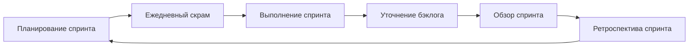

#scrum #agile #project_management #sprints #teamwork
## Описание

Scrum — это agile фреймворк для командного сотрудничества, обычно используемый в разработке программного обеспечения и других отраслях. Он включает разбиение работы на цели, которые должны быть завершены в рамках временных итераций, называемых спринтами, каждая из которых обычно длится не более одного месяца, с двумя неделями как распространенным вариантом. Scrum итеративен и инкрементален, позволяя непрерывную обратную связь и гибкость. Он требует от команд самоорганизации, поощряя физическое совместное размещение или тесное онлайн-сотрудничество и частую коммуникацию среди всех членов команды. Подход основан на понятии изменчивости требований, где заинтересованные стороны могут изменять требования по мере эволюции проекта, и он переносит полномочия по принятию решений на операционный уровень.

### Принципы

- Работа разделена на спринты, которые являются фиксированными периодами для достижения конкретных целей, обычно приводящими к функциональному результату или инкрементальному развитию продукта.
- Ежедневные скрамы, ограниченные 15 минутами, оценивают прогресс и решают проблемы без детального обсуждения.
- Обзоры спринта демонстрируют работу заинтересованным сторонам для обратной связи, а ретроспективы спринта выявляют уроки и улучшения для будущих спринтов.
- Команды самоорганизующиеся, с разработчиками, тянущими работу на основе приоритета и мощности, облегчаемыми скрам-мастером.
- Бэклог продукта, поддерживаемый владельцем продукта, перечисляет и приоритизирует требования продукта, такие как функции и исправления багов, упорядоченные по срочности.

### Преимущества

- Непрерывная обратная связь, гибкость для адаптации к изменяющимся требованиям и повышенная скорость и гибкость в разработке продукта через итеративные и инкрементальные процессы.

### Недостатки

- Некоторые утверждают, что события scrum, такие как ежедневные скрамы и обзоры спринта, могут вредить продуктивности и тратить время, которое могло бы быть лучше потрачено на продуктивные задачи.
- Scrum может создавать трудности для команд с частичной занятостью или географически удаленных, высоко специализированных членов, которые лучше работают независимо или в кликах, и проектов, неподходящих для инкрементального и тестового развития.

## Схема работы

1. **Планирование спринта**: Каждый спринт начинается с события планирования спринта, где определяется цель спринта, и приоритеты выбираются из бэклога продукта. Рекомендуемая максимальная длительность — восемь часов для четырехнедельного спринта.
2. **Ежедневный скрам**: Во время спринта разработчики проводят ежедневные скрамы, обычно стоя, длительностью менее 15 минут, для объявления прогресса к цели спринта и выявления препятствующих проблем. Расширенные обсуждения происходят в отдельных сессиях, если нужно, облегчаемые скрам-мастером.
3. **Выполнение спринта**: Члены команды работают над элементами бэклога спринта, самоорганизуясь, тянущими задачи на основе приоритета и мощности, стремясь достичь цели спринта с потенциально релизными результатами (инкрементами).
4. **Груминг или уточнение бэклога**: Члены команды пересматривают и приоритизируют бэклог продукта, разбивая большие задачи, уточняя критерии успеха и корректируя приоритеты, либо как отдельный этап перед новым спринтом, либо непрерывно.
5. **Обзор спринта**: В конце спринта проводится встреча обзора спринта, длительностью один час на неделю спринта, где демонстрируются завершенные результаты заинтересованным сторонам для обратной связи и обсуждения ожиданий и планов.
6. **Ретроспектива спринта**: Следует отдельная встреча, позволяющая членам команды внутренне анализировать сильные и слабые стороны спринта, выявлять области для будущих улучшений и планировать действия по непрерывному улучшению процесса.
7. **Планирование следующего спринта (если применимо)**: Если спринт прерван ненормально, проводится новое планирование спринта для обзора причины прерывания и соответствующего планирования.

## Общие термины

- **Владелец продукта**: Основной связной с заинтересованными сторонами, ответственный за коммуникацию задач и ожиданий, управление бэклогом продукта и максимизацию ценности, доставляемой командой. Они представляют заинтересованных сторон, голос клиента или комитет, и могут отменить спринт, если необходимо.
- **Разработчики**: Члены команды, включая исследователей, архитекторов, дизайнеров и программистов, которые организуют работу сами, облегчаемые скрам-мастером, и вносят вклад в разработку и поддержку продукта.
- **Скрам-мастер**: Облегчает теорию и практику scrum, коучинг и образование команд, с обязанностями, включая постановку целей, решение проблем, надзор, планирование, управление бэклогом и облегчение коммуникации, отличное от традиционных менеджеров проектов.
- **Спринт**: Фиксированный период, обычно от одной недели до одного месяца (обычно две недели), где члены команды работают над конкретной целью, приводящей к функциональному результату или инкрементальному развитию продукта.
- **Ежедневный скрам**: 15-минутная ежедневная встреча стоя во время спринта для объявления прогресса и проблем, облегчаемая скрам-мастером, с расширенными обсуждениями в отдельных сессиях, если нужно.
- **Обзор спринта**: Встреча в конце спринта для демонстрации завершенной работы заинтересованным сторонам, получения обратной связи и обсуждения ожиданий и планов, длительностью один час на неделю спринта.
- **Ретроспектива спринта**: Внутренняя встреча после спринта для анализа сильных сторон, слабостей и областей для улучшения, фокусируясь на непрерывном улучшении процесса.
- **Бэклог продукта**: Упорядоченный список требований продукта, таких как функции и исправления багов, поддерживаемый и приоритизированный владельцем продукта на основе риска, бизнес-ценности, зависимостей.