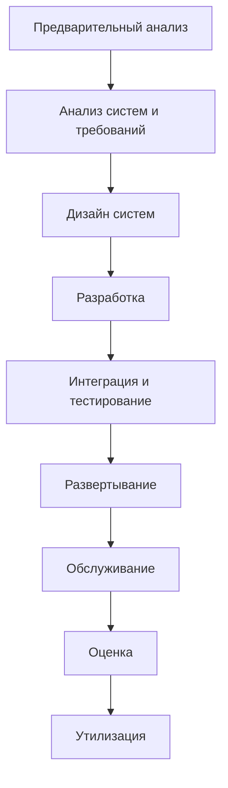

#waterfall #project_management #software_development #sequential #planning
## Описание

Модель Waterfall представляет собой процесс выполнения типичных фаз жизненного цикла разработки программного обеспечения (SDLC) в последовательном порядке, где каждая фаза завершается перед началом следующей, и результат каждой фазы определяет последующие фазы. Это одна из наименее итеративных и гибких методологий SDLC, с прогрессом, в основном текущим в одном направлении через фазы, такие как концепция, анализ требований, дизайн, строительство, тестирование, развертывание и обслуживание. Это самая ранняя методология SDLC, первоначально принятая, когда не было признанных альтернатив для творческой работы на основе знаний.

### Принципы

- Фазы организованы последовательно, каждая фаза зависит от завершения предыдущей.
- Уделяется внимание документации, такой как документы требований и дизайна, для обеспечения сохранения знаний.
- Модель прогрессирует линейно через дискретные, легко понятные фазы, предоставляя идентифицируемые вехи.
- Время, потраченное на ранних этапах цикла, таких как спецификация требований, может снизить затраты на поздних этапах за счет раннего выявления проблем.

### Преимущества

- Ранние инвестиции в анализ и дизайн могут снизить затраты на поздних этапах, поскольку проблемы, обнаруженные рано, дешевле исправлять (в 50-200 раз).
- Обеспечивает структурированный подход с легко идентифицируемыми вехами, что делает его легким для понимания и объяснения.
- Уделяет внимание документации, что помогает новым членам команды ознакомиться с проектом, если члены команды уходят.
- Симуляции могут использоваться в модели для тестирования и уточнения дизайнов, выявляя потенциальные проблемы перед переходом к следующей фазе.

### Недостатки

- Клиенты могут не знать точных требований до того, как увидят работающее программное обеспечение, что приводит к изменениям, увеличивающим затраты через перепроектирование, переразработку и повторное тестирование.
- Дизайнеры могут не предвидеть будущие трудности, и пересмотр дизайнов на начальном этапе может быть эффективнее, чем решение вновь обнаруженных ограничений позже.
- Может быть трудно поддерживать строгое разделение между анализом систем и программированием, поскольку реализация нетривиальных систем часто выявляет непредвиденные проблемы.
- Некоторые организации, такие как Министерство обороны США, выразили предпочтение против методологий типа Waterfall, предпочитая итеративную и инкрементальную разработку.

## Схема работы

Модель Waterfall описывает линейную последовательность шагов:

1. **Предварительный анализ**: Провести предварительный анализ для идентификации организационных целей, определения характера и объема проекта, обеспечения соответствия целям, рассмотрения альтернативных решений через интервью и анализ конкурентов, а также выполнения анализа затрат и выгод.
2. **Анализ систем, определение требований**: Разложить цели проекта на определенные функции и операции, собрать и интерпретировать факты, диагностировать проблемы, рекомендовать изменения, собрать требования конечных пользователей через обзор документов, интервью, наблюдение и опросы, проанализировать существующие системы для выявления плюсов и минусов, а также проанализировать предлагаемую систему для поиска решений и подготовки спецификаций.
3. **Дизайн систем**: Детализировать желаемые функции и операции, включая макеты экранов, бизнес-правила, диаграммы процессов, псевдокод и другие результаты.
4. **Разработка**: Написать код для реализации спроектированной системы.
5. **Интеграция и тестирование**: Собрать модули в тестовой среде, проверить на ошибки, баги и совместимость.
6. **Приемка, установка, развертывание**: Ввести систему в производство, что может включать обучение пользователей, развертывание оборудования и загрузку информации из предыдущей системы.
7. **Обслуживание**: Мониторить систему для оценки продолжающейся пригодности, вносить modest изменения и исправления по мере необходимости, а также обеспечивать постоянные обновления для поддержания качества.
8. **Оценка**: Обзор системы и процесса, оценивая, соответствует ли она требованиям, достигает ли целей проекта, удобна ли в использовании, надежна, правильно ли масштабирована и отказоустойчива, а также проверить сроки, расходы и приемку пользователей.
9. **Утилизация**: Разработать планы по прекращению использования системы и переходу к ее замене, перепрофилированию, архивированию, утилизации или уничтожению связанных информации и инфраструктуры при сохранении безопасности.

## Общие термины

- **Жизненный цикл разработки программного обеспечения (SDLC)**: Общий процесс разработки программного обеспечения, охватывающий фазы от концепции до обслуживания, который модель Waterfall организует последовательно.
- **Последовательный порядок**: Расположение фаз, где каждая должна быть завершена перед началом следующей, характерное для линейного прогресса модели Waterfall.
- **Анализ требований**: Фаза, где цели проекта разлагаются на определенные функции и операции, собираются и интерпретируются факты для диагностики проблем и рекомендаций изменений.
- **Дизайн систем**: Шаг, где детализируются желаемые функции и операции, включая результаты, такие как макеты экранов и диаграммы процессов, для руководства разработкой.
- **Строительство**: Фаза разработки, где пишется код для реализации спроектированной системы.
- **Тестирование**: Процесс сборки модулей, проверки на ошибки, баги и совместимость в тестовой среде.
- **Развертывание**: Фаза ввода системы в производство, включающая обучение пользователей, развертывание оборудования и миграцию данных из предыдущих систем.
- **Обслуживание**: Постоянный мониторинг и обновления для обеспечения эффективности и высокого качества системы, решение проблем по мере их возникновения.
- **Документация**: Комплексные записи, такие как документы требований и дизайна, подчеркиваемые в модели Waterfall для облегчения передачи знаний.