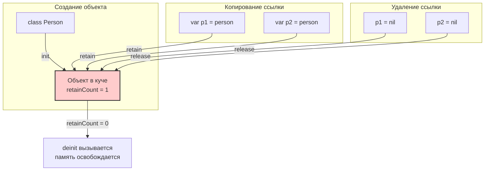

#memory #arc #retain-cycle #weak #unowned #swift #ios #memory-management

---

### Определение

**ARC (Automatic Reference Counting)** — это механизм автоматического управления памятью на этапе компиляции в [[Swift]] и [[Objective-C]]. В отличие от сборщика мусора (Garbage Collector), который работает во время выполнения, ARC вставляет вызовы [[retain]] / [[release]] непосредственно в скомпилированный код, что делает управление памятью детерминированным и предсказуемым.

ARC работает **только с [[reference type]]s** (классами, замыканиями). [[Value type]]s (структуры, перечисления) управляются копированием и не требуют подсчёта ссылок.

---

### Зачем это знать iOS-разработчику?

| Причина                            | Объяснение                                                                |
| ---------------------------------- | ------------------------------------------------------------------------- |
| **Предотвращение утечек памяти**   | Понимание ARC помогает избегать циклов сильных ссылок ([[retain cycle]]s) |
| **Оптимизация производительности** | Детерминированное освобождение памяти критично для мобильных устройств    |
| **Безопасность**                   | Правильное использование [[weak]] и [[unowned]] предотвращает crashes     |
| **Замыкания**                      | Самая частая причина утечек в [[iOS]] — захват [[self]] в замыканиях      |
| **Архитектура приложения**         | Понимание ARC влияет на проектирование отношений между объектами          |

---

### Как работает ARC



**Простой пример:**

```swift
class Person {
    let name: String
    init(name: String) {
        self.name = name
        print("\(name) создан")
    }
    deinit {
        print("\(name) уничтожен")
    }
}

var p1: Person? = Person(name: "Анна")   // retain count = 1
var p2 = p1                               // retain count = 2
p1 = nil                                  // retain count = 1
p2 = nil                                  // retain count = 0 → deinit вызван
// Вывод: Анна уничтожен
```

**Ключевые моменты:**
- При создании объекта через [[init]] его счётчик ссылок (retain count) становится 1.
- При присваивании ссылки на объект счётчик увеличивается (`retain`).
- При удалении ссылки (переменная выходит из области видимости или ей присваивают [[nil]]) счётчик уменьшается (`release`).
- Когда счётчик достигает 0, вызывается `deinit` и память освобождается.

---

### Как узнать количество ссылок на объект (retain count)

В Swift **нет прямого безопасного API** для получения retain count, но для отладки можно использовать методы Objective-C [[runtime]] (только для отладки, не для production!).

#### Метод 1: CFGetRetainCount (только для отладки)

```swift
import Foundation

class MyClass {
    let name: String
    init(name: String) { self.name = name }
}

let obj = MyClass(name: "Test")
let retainCount = CFGetRetainCount(obj)
print("Retain count: \(retainCount)")  // обычно 1 (или больше из-за внутренних ссылок)

var ref1 = obj
var ref2 = obj
print(CFGetRetainCount(obj))  // может показать 3 (obj + ref1 + ref2)
```

**Важное предупреждение:** `CFGetRetainCount` возвращает счётчик, который **не следует использовать в production-коде**! Он существует только для отладки и диагностики. Значение может включать внутренние ссылки ARC, поэтому оно не всегда равно тому, что вы ожидаете.

#### Метод 2: Inline withUnsafePointer (хак, только для отладки)

```swift
import Foundation

extension NSObject {
    func debugRetainCount() -> UInt {
        // ВНИМАНИЕ: Только для отладки! Не использовать в production!
        return CFGetRetainCount(self)
    }
}

class Person: NSObject {
    let name: String
    init(name: String) { self.name = name }
}

let person = Person(name: "Alice")
let ref1 = person
let ref2 = person

print(person.debugRetainCount())  // ≈3
```

#### Метод 3: Instruments и Memory Graph Debugger (рекомендуемый способ)

Вместо программного получения retain count используйте инструменты Xcode:
1. **Memory Graph Debugger** — визуально показывает все ссылки на объект
2. **Instruments (Allocations)** — отслеживает рост счётчиков
3. **Логирование deinit** — косвенный способ проверки

```swift
// Лучший способ проверить, что объект освобождается
class MyViewController: UIViewController {
    deinit {
        print("\(self) deinitialized ✅")
    }
}
```

---

### Три типа ссылок в ARC

| Тип ссылки | Синтаксис | Увеличивает retain count? | Зануляется при dealloc? | Когда использовать |
|---|---|---|---|---|
| **strong** | `var` / `let` | Да | Нет | По умолчанию — владеет объектом |
| **weak** | `weak var` | Нет | Да (становится `nil`) | Разрывает цикл, безопасно |
| **unowned** | `unowned let/var` | Нет | Нет | Когда уверен, что объект живёт дольше ссылки |

#### 1. **Strong (сильная ссылка)**

```swift
class Owner {
    var pet: Pet?
}

class Pet {
    var owner: Owner?  // сильная ссылка
}
```

#### 2. **Weak (слабая ссылка)**

```swift
class Pet {
    weak var owner: Owner?  // слабая ссылка — автоматически станет nil
}
```

#### 3. **Unowned (бесхозная ссылка)**

```swift
class Pet {
    unowned let owner: Owner  // гарантируется, что owner живёт дольше
    init(owner: Owner) {
        self.owner = owner
    }
}
```

---

### Классический Retain Cycle и его исправление

```swift
class Owner {
    var pet: Pet?
    deinit { print("Owner уничтожен") }
}

class Pet {
    var owner: Owner?  // цикл сильных ссылок!
    deinit { print("Pet уничтожен") }
}

var owner: Owner? = Owner()
var pet: Pet? = Pet()

owner?.pet = pet
pet?.owner = owner  // owner и pet теперь ссылаются друг на друга

owner = nil
pet = nil  // deinit НЕ вызывается — утечка памяти!
```

**Решение — weak или unowned:**

```swift
class Pet {
    weak var owner: Owner?  // слабая ссылка — цикл разорван
}
```

Или, если владелец гарантированно живёт дольше:

```swift
class Pet {
    unowned let owner: Owner
    init(owner: Owner) {
        self.owner = owner
    }
}
```

---

### Самая частая утечка — замыкания

```swift
class ViewController {
    var callback: (() -> Void)?
    
    func setup() {
        // ОПАСНО! Замыкание захватывает self, self держит callback
        callback = {
            self.doSomething()  // retain cycle!
        }
    }
    
    func doSomething() { }
}
```

**Исправление — capture list:**

```swift
callback = { [weak self] in
    self?.doSomething()  // безопасно
}

// или если уверены в жизненном цикле
callback = { [unowned self] in
    self.doSomething()  // рискованно, может упасть
}
```

**Множественный захват:**

```swift
callback = { [weak self, weak delegate] in
    guard let self = self else { return }
    delegate?.didFinish()
}
```

---

### Weak vs Unowned — детальное сравнение

| Критерий               | weak                                    | unowned                                        |
| ---------------------- | --------------------------------------- | ---------------------------------------------- |
| **Становится nil**     | Да                                      | Нет                                            |
| **Optional**           | Всегда optional                         | Может быть non-optional                        |
| **Безопасность**       | Высокая (проверка через [[if let]])     | Низкая (crash при обращении после [[dealloc]]) |
| **Производительность** | Чуть медленнее (нужна работа с runtime) | Быстрее                                        |
| **Когда использовать** | Делегаты, parent-child отношения        | Когда объект гарантированно живёт дольше       |

```swift
// weak — безопасно, но нужно разворачивать
class Child {
    weak var parent: Parent?
}

// unowned — быстро, но опасно
class Child {
    unowned let parent: Parent
    init(parent: Parent) {
        self.parent = parent
    }
}
```

**Когда использовать unowned:**
- В замыканиях, где `self` гарантированно существует (например, в анимациях внутри того же объекта).
- В отношениях, где parent всегда живёт дольше child (и это строго гарантировано архитектурой).

---

### ARC и коллекции

Коллекции (`Array`, `Dictionary`, `Set`) хранят **сильные ссылки** на свои элементы:

```swift
class Person {
    let name: String
    init(name: String) { self.name = name }
    deinit { print("\(name) уничтожен") }
}

var people: [Person] = []
let person = Person(name: "Анна")
people.append(person)  // retain count = 2 (person + people)
people.removeAll()      // retain count = 1
person = nil            // retain count = 0 → deinit
```

**Copy-on-Write для value types:**

```swift
var array1 = [1, 2, 3]
var array2 = array1       // разделяют память
array2.append(4)          // копирование происходит здесь
print(array1)             // [1, 2, 3]
```

---

### Практические паттерны

#### 1. **Delegate pattern**

```swift
protocol MyDelegate: AnyObject {
    func didSomething()
}

class MyClass {
    weak var delegate: MyDelegate?  // всегда weak
}
```

#### 2. **Observer pattern**

```swift
class Observer {
    var onChange: (() -> Void)?
}

class Subject {
    private var observers: [Observer] = []  // сильные ссылки
    
    func addObserver(_ observer: Observer) {
        observers.append(observer)
    }
}
```

#### 3. **Замыкания с множественным захватом**

```swift
class DataManager {
    func fetchData(completion: @escaping (Result<Data, Error>) -> Void) {
        // [weak self] не нужен, если self не используется
        apiClient.request { [weak self] result in
            guard let self = self else { return }
            self.process(result, completion: completion)
        }
    }
}
```

#### 4. **Синглтоны и ARC**

```swift
class Singleton {
    static let shared = Singleton()  // никогда не освободится
    private init() { }
}
```

---

### ARC vs Garbage Collector

| Характеристика | ARC | Garbage Collector (GC) |
|---|---|---|
| **Когда работает** | На этапе компиляции (вставка retain/release) | Во время выполнения |
| **Детерминизм** | Детерминированно (знаем, когда объект освободится) | Недетерминированно |
| **Производительность** | Низкий overhead, нет пауз | Возможны паузы на сборку |
| **Циклы ссылок** | Нужно разрывать вручную | Автоматически находит и собирает |
| **Память** | Освобождается сразу | Накопление до сборки |
| **Использование** | Swift, Objective-C | Java, C#, JavaScript |

**Почему Swift выбрал ARC:**
- Мобильные устройства чувствительны к паузам GC.
- Детерминированность важна для производительности.
- Более предсказуемое поведение в реальном времени.

---

### Инструменты для отладки утечек памяти

#### 1. **Xcode Memory Graph Debugger**
- Запустите приложение
- Нажмите на кнопку Memory Graph в панели Debug
- Ищите красные циклы

#### 2. **Instruments (Leaks)**
- Product → Profile → Leaks
- Запишите действия и ищите утечки

#### 3. **Debug Memory Graph**
```swift
// Добавьте в код для проверки
class ViewController: UIViewController {
    override func viewDidAppear(_ animated: Bool) {
        super.viewDidAppear(animated)
        // В Xcode: Debug → View Debugging → Capture View Hierarchy
        // Затем: Debug Memory Graph
    }
}
```

#### 4. **Logging deinit**
```swift
class MyClass {
    deinit {
        print("\(self) deinitialized ✅")
    }
}
```

#### 5. **CFGetRetainCount (только для отладки!)**

```swift
import Foundation

extension NSObject {
    /// ⚠️ ТОЛЬКО ДЛЯ ОТЛАДКИ! Не использовать в production!
    func debugRetainCount() -> UInt {
        return CFGetRetainCount(self)
    }
}

let obj = MyClass()
print("Retain count:", obj.debugRetainCount())
```

**Внимание:** `CFGetRetainCount`:
- Учитывает внутренние ссылки ARC
- Значение может быть выше ожидаемого
- Не должен использоваться в production
- Существует только для диагностики

---

### Лучшие практики ARC

1. **Всегда используйте weak для делегатов**
2. **В замыканиях всегда используйте capture list** — `[weak self]` по умолчанию
3. **Избегайте unowned, если не уверены на 100%** — лучше weak + `guard let`
4. **Проверяйте deinit** — добавляйте логи в сложных классах
5. **Используйте Memory Graph Debugger регулярно**
6. **Для value types не беспокойтесь** — они копируются
7. **В коллекциях будьте осторожны** — они держат сильные ссылки
8. **Тестируйте сценарии с выходом из экрана** — проверяйте, что все освобождается
9. **`CFGetRetainCount` — только для отладки, никогда не используйте в production**

---

### Короткое правило

> **ARC** — управление памятью через подсчёт ссылок на этапе компиляции.  
> **Strong** — владеет (по умолчанию).  
> **Weak** — наблюдает (зануляется).  
> **Unowned** — доверяет (не зануляется, опасно).  
> **Замыкания** — всегда `[weak self]`.  
> **deinit** — лучший способ проверить, что утечки нет.  
> **`CFGetRetainCount`** — только для отладки!

---

### Итог

**ARC** — это мощный и эффективный механизм управления памятью, который делает Swift безопасным и производительным языком. Главные принципы:

1. **Strong** — владеет объектом (по умолчанию)
2. **Weak** — наблюдает, зануляется при освобождении
3. **Unowned** — доверяет, не зануляется (рискованно)
4. **Замыкания** — главная причина утечек, всегда используйте `[weak self]`
5. **Циклы** — ответственность разработчика
6. **`CFGetRetainCount`** — существует, но предназначен **только для отладки**! Никогда не используйте его в production-коде.

Понимание ARC необходимо для написания надёжных iOS-приложений без утечек памяти.