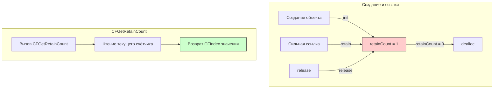

#memory #arc #debug #cf #retain-count #swift #objective-c

---

### Определение

**`CFGetRetainCount`** — это функция из [[Core Foundation]], которая возвращает **текущий счётчик удерживаний ([[retain count]])** указанного объекта Core Foundation или [[Objective-C]]. Она показывает, сколько сильных ссылок в данный момент указывает на объект в куче.

```swift
func CFGetRetainCount(_ cf: CFTypeRef!) -> CFIndex
```

> ⚠️ **ВAЖНО:** Эта функция предназначена **ТОЛЬКО ДЛЯ ОТЛАДКИ И ДИАГНОСТИКИ**. **Никогда не используйте её в production-коде!** Счётчик ссылок не является стабильным значением ([[ARC]] может оптимизировать его), и ваш код не должен на него полагаться.

---

### Зачем это знать iOS-разработчику?

| Сценарий | Применение |
|---|---|
| **Отладка утечек памяти** | Проверка предположений о времени жизни объектов |
| **Обучение ARC** | Понимание того, как работает подсчёт ссылок |
| **Диагностика циклических ссылок** | Помощь в обнаружении мест, где объект не освобождается |
| **Legacy Objective-C код** | Поддержка старого кода, использовавшего ручное управление памятью |

---

### Как это работает



---

### Базовые примеры

#### 1. **Простое получение retain count**

```swift
import Foundation

class MyClass {
    let id: Int
    init(id: Int) { self.id = id }
}

let obj = MyClass(id: 1)
let count = CFGetRetainCount(obj)
print("Retain count: \(count)")  
// Вывод может быть: 2 или больше (из-за системных оптимизаций)
```

#### 2. **Добавление и удаление ссылок**

```swift
import Foundation

class Person {
    let name: String
    init(name: String) { self.name = name }
}

var person1: Person? = Person(name: "Alice")
print("After init: \(CFGetRetainCount(person1!))")  // ~2

var person2 = person1
print("After second ref: \(CFGetRetainCount(person1!))")  // ~3

person1 = nil
print("After first nil: \(CFGetRetainCount(person2!))")  // ~2

person2 = nil
// Здесь объект освобождён, дальнейшие вызовы приведут к крашу
```

#### 3. **Работа с Objective-C объектами**

```swift
import Foundation

// NSString — Objective-C класс
let string: NSString = "Hello"
print("NSString retain count: \(CFGetRetainCount(string))")

// NSArray тоже Objective-C
let array: NSArray = [1, 2, 3]
print("NSArray retain count: \(CFGetRetainCount(array))")

// Swift String мостится к NSString
let swiftString = "World"
print("Swift String as NSString: \(CFGetRetainCount(swiftString as NSString))")
```

---

### Почему retain count не такой, как ожидается?

Значение `CFGetRetainCount` часто бывает **больше, чем вы ожидаете**, по нескольким причинам:

| Причина                     | Объяснение                                                         |
| --------------------------- | ------------------------------------------------------------------ |
| **Внутренние ссылки ARC**   | Компилятор может добавлять дополнительные [[retain]]s/[[release]]s |
| **Авторелизные пулы**       | Объекты могут быть добавлены в [[autorelease]] pool                |
| **Оптимизации компилятора** | ARC может объединять или откладывать операции                      |
| **Кэширование**             | Некоторые системные классы кэшируют объекты                        |
| **Мосты (bridging)**        | Приведение типов может добавлять ссылки                            |

```swift
class Test {
    let value: Int
    init(value: Int) { self.value = value }
}

let obj = Test(value: 42)
print("Raw object: \(CFGetRetainCount(obj))")  // Обычно 1

let array = [obj]
print("In array: \(CFGetRetainCount(obj))")    // Становится 2

let set = Set([obj])
print("In set: \(CFGetRetainCount(obj))")      // Становится 3
```

---

### CFGetRetainCount vs isKnownUniquelyReferenced

| Характеристика                 | `CFGetRetainCount`        | `isKnownUniquelyReferenced` |
| ------------------------------ | ------------------------- | --------------------------- |
| **Назначение**                 | Диагностика               | Реализация COW              |
| **Использование в production** | ❌ Никогда                 | ✅ Да                        |
| **Точность**                   | Высокая (но нестабильная) | Только true/false           |
| **Учитывает [[weak]] ссылки**  | Да (косвенно)             | Нет                         |
| **Требует [[inout]]**          | Нет                       | Да                          |
| **Для [[value type]]s**        | Нет (только классы)       | Нет (только классы)         |

```swift
class MyClass {}

var obj = MyClass()
var weakRef = obj
var unownedRef = obj

// Разное поведение
print(CFGetRetainCount(obj))           // Учитывает weak/unowned (косвенно)
print(isKnownUniquelyReferenced(&obj)) // Не учитывает weak/unowned (true)
```

---

### Отладка утечек памяти

#### 1. **Проверка освобождения объекта**

```swift
class Resource {
    let id: Int
    init(id: Int) { self.id = id }
    deinit { print("Resource \(id) deallocated") }
}

func testLeak() {
    var obj: Resource? = Resource(id: 1)
    print("Before: \(CFGetRetainCount(obj!))")
    
    // Какая-то операция, которая могла создать дополнительную ссылку
    processResource(obj!)
    
    obj = nil
    // Если retain count был > 1, deinit может не вызваться
}

func processResource(_ resource: Resource) {
    // Формируем замыкание, которое захватывает resource
    DispatchQueue.global().async {
        print("Processing resource \(resource.id)")
        Thread.sleep(forTimeInterval: 10)
        print("Done processing")
    }
}

testLeak()
// Resource 1 deallocated — НЕ вызовется, пока замыкание не выполнится
```

#### 2. **Поиск циклических ссылок**

```swift
class Parent {
    var child: Child?
    deinit { print("Parent deinit") }
}

class Child {
    var parent: Parent?  // Цикл: Parent -> Child и Child -> Parent
    deinit { print("Child deinit") }
}

var parent: Parent? = Parent()
var child: Child? = Child()

parent?.child = child
child?.parent = parent

print("Parent retain count: \(CFGetRetainCount(parent!))")  // ~2
print("Child retain count: \(CFGetRetainCount(child!))")   // ~2

parent = nil
child = nil
// deinit не вызывается — цикл сильных ссылок!

// Исправление: сделать child.parent weak
```

---

### Ограничения и опасности

| Ограничение                 | Пояснение                                             |
| --------------------------- | ----------------------------------------------------- |
| **Не для production**       | Счётчик ссылок может меняться по независящим причинам |
| **Нестабильность значений** | ARC оптимизирует retains/releases                     |
| **Только для объектов**     | Не работает с value types ([[struct]], [[enum]])      |
| **Не включает ожидание**    | В многопоточной среде может измениться в любой момент |
| **Краш для deallocated**    | Вызов для уже освобождённого объекта приведёт к крашу |

```swift
// ❌ ОПАСНО! Никогда так не делайте в реальном коде
class BadPractice {
    func shouldCache(object: AnyObject) -> Bool {
        // Никогда не полагайтесь на retain count для принятия решений!
        return CFGetRetainCount(object) > 1
    }
}

// ✅ Правильно: используйте isKnownUniquelyReferenced для COW
class GoodPractice {
    func shouldCopy<T: AnyObject>(_ object: inout T) -> Bool {
        return !isKnownUniquelyReferenced(&object)
    }
}
```

---

### Альтернативы в современном Swift

| Задача                    | Современная альтернатива                   |
| ------------------------- | ------------------------------------------ |
| **Реализация COW**        | `isKnownUniquelyReferenced`                |
| **Отладка памяти**        | Memory Graph Debugger, Instruments (Leaks) |
| **Проверка освобождения** | Логирование в [[deinit]]                   |
| **Поиск циклов**          | Xcode Memory Graph, `weak`/`unowned`       |

```swift
// Современный подход к отладке памяти
class Debuggable {
    let id: Int
    init(id: Int) { 
        self.id = id
        print("✅ \(id) created")
    }
    
    deinit {
        print("❌ \(id) deallocated")
    }
}

func testMemory() {
    var obj: Debuggable? = Debuggable(id: 1)
    // ... операции с obj ...
    obj = nil
    // Должны увидеть "❌ 1 deallocated"
}
```

---

### Исторический контекст (Objective-C MRR)

В эпоху Manual Retain-Release (MRR) `retainCount` был важным инструментом:

```objc
// Objective-C MRR (до ARC)
NSString *str = [[NSString alloc] initWithString:@"Hello"];
NSUInteger count = [str retainCount];  // 1

[str retain];
count = [str retainCount];  // 2

[str release];
count = [str retainCount];  // 1
```

С приходом ARC прямое использование `retainCount` стало **строго не рекомендуется**.

---

### Лучшие практики

1. **Используйте `CFGetRetainCount` ТОЛЬКО для отладки**
2. **Никогда не принимайте бизнес-решений на основе retain count**
3. **Включайте освобождение через `deinit` и Memory Graph Debugger**
4. **Для COW используйте `isKnownUniquelyReferenced`**
5. **Не вызывайте функцию после того, как объект мог быть освобождён**

```swift
// ✅ Правильно: только для отладки
func debugObject<T: AnyObject>(_ object: T) {
    #if DEBUG
    let count = CFGetRetainCount(object)
    print("Debug: Object retain count = \(count)")
    #endif
}

// ✅ Правильно: проверка освобождения
class TestObject {
    deinit {
        print("TestObject deallocated — memory OK")
    }
}
```

---

### Итог

**`CFGetRetainCount`** — это диагностический инструмент из Core Foundation:

| Характеристика | Значение |
|---|---|
| **Назначение** | Отладка и диагностика (не для production!) |
| **Тип возврата** | `CFIndex` (целое число) |
| **Работает с** | Core Foundation и Objective-C объектами |
| **Учитывает** | Сильные, слабые (косвенно), бесхозные ссылки |
| **Альтернативы** | `isKnownUniquelyReferenced`, `deinit`, Memory Graph |

**Главное правило:** Никогда не используйте `CFGetRetainCount` в production-коде. Для отладки утечек памяти используйте Xcode Memory Graph Debugger и логирование в `deinit`. Для реализации Copy-on-Write используйте `isKnownUniquelyReferenced`.