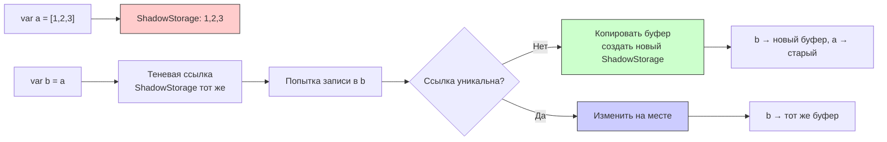

#memory #cos #copy-on-shadow #cow #optimization #swift #performance #memory-management

---
### Определение
**Copy-On-Shadow (COS)** — это техника ленивой оптимизации памяти, похожая на **[[Copy-On-Write]] (COW)**, но с более мягким подходом к копированию . Основная идея COS заключается в том, что при присваивании создается **теневая ссылка (shadow reference)** на общий буфер без копирования, а реальное копирование происходит только при первой записи через эту теневую ссылку .

В отличие от COW, COS не требует проверки уникальности (`isKnownUniquelyReferenced`) при каждом доступе, что снижает overhead в сценариях с частым чтением и редкой записью .

### Зачем это знать [[iOS]]-разработчику?
1.  **Производительность:** COS может быть эффективнее COW в сценариях с очень частым копированием и редкой модификацией .
2.  **Кастомные структуры:** Понимание COS позволяет реализовывать собственные оптимизированные коллекции .
3.  **Профилирование:** Знание обеих техник помогает интерпретировать результаты Instruments .
4.  **Большие данные:** Для больших массивов данных, которые часто копируются, COS может дать значительный выигрыш .
5.  **Встроенного COS нет:** В [[Swift]] нет встроенной реализации COS — это кастомная техника .

---

### Главная идея COS



**Ключевые отличия от COW:**
- При присваивании создается **теневая ссылка**, а не копия.
- Нет проверки `isKnownUniquelyReferenced` при каждом чтении.
- Копирование происходит только при **реальной записи** через теневую ссылку.
- Подходит для сценариев с частыми присваиваниями и редкими модификациями .

---

### Сравнение COW vs COS

| Характеристика               | [[Copy-On-Write]] (COW)                             | Copy-On-Shadow (COS)                                    |
| ---------------------------- | --------------------------------------------------- | ------------------------------------------------------- |
| **Когда копируется**         | При первом write, если есть другие ссылки           | Только при реальном изменении через shadow              |
| **Проверка уникальности**    | Да (`isKnownUniquelyReferenced`) на каждом write    | Нет — копирование ленивое                               |
| **Overhead на чтение**       | Есть (проверка уникальности)                        | Минимальный                                             |
| **Overhead на присваивание** | Почти нулевой                                       | Почти нулевой                                           |
| **Подходит для**             | Стандартные коллекции [[Swift]]                     | Кастомные типы с частыми присваиваниями и редкими write |
| **Встроенная поддержка**     | Да ([[Array]], [[Dictionary]], [[Set Collection]], [[String]]) | Нет (кастомная реализация)                              |
| **Сложность реализации**     | Простая (встроена)                                  | Средняя (ручная)                                        |

---

### Пример реализации COS в Swift

#### 1. **Базовый класс-хранилище**

```swift
final class ShadowStorage<T> {
    var buffer: [T]
    init(_ buffer: [T]) {
        self.buffer = buffer
    }
}
```

#### 2. **Структура с COS**

```swift
struct ShadowArray<T> {
    private var storage: ShadowStorage<T>
    
    init(_ elements: [T] = []) {
        storage = ShadowStorage(elements)
    }
    
    // Доступ по индексу
    subscript(index: Int) -> T {
        get {
            storage.buffer[index]  // без проверок
        }
        set {
            copyIfNeeded()
            storage.buffer[index] = newValue
        }
    }
    
    // Мутирующие методы
    mutating func append(_ element: T) {
        copyIfNeeded()
        storage.buffer.append(element)
    }
    
    mutating func remove(at index: Int) -> T {
        copyIfNeeded()
        return storage.buffer.remove(at: index)
    }
    
    // Non-mutating access
    var count: Int {
        storage.buffer.count
    }
    
    // COS логика
    private mutating func copyIfNeeded() {
        if !isKnownUniquelyReferenced(&storage) {
            storage = ShadowStorage(storage.buffer)  // копируем буфер
        }
    }
}

extension ShadowArray: CustomStringConvertible {
    var description: String {
        storage.buffer.description
    }
}
```

#### 3. **Использование**

```swift
var a = ShadowArray([1, 2, 3, 4, 5])
var b = a  // теневая ссылка — общего буфера

print(a[0])  // 1 — чтение без копирования
print(b[0])  // 1 — чтение без копирования

a[0] = 10    // копирование происходит только здесь
print(a[0])  // 10
print(b[0])  // 1 — b остался со старым буфером
```

---

### Реальный сценарий применения COS-подхода

#### 1. **Конфигурации с большими данными**

```swift
// Конфигурация, которая часто копируется, но редко меняется
struct ConfigSnapshot {
    private var storage: ShadowStorage<[String: Any]>
    
    init(_ dict: [String: Any]) {
        storage = ShadowStorage(dict)
    }
    
    subscript(key: String) -> Any? {
        get { storage.buffer[key] }
        set {
            copyIfNeeded()
            storage.buffer[key] = newValue
        }
    }
    
    private mutating func copyIfNeeded() {
        if !isKnownUniquelyReferenced(&storage) {
            storage = ShadowStorage(storage.buffer)
        }
    }
}

// Использование в системе снапшотов
class StateManager {
    private var snapshots: [ConfigSnapshot] = []
    private var currentSnapshot = ConfigSnapshot([:])
    
    func saveSnapshot() {
        snapshots.append(currentSnapshot)  // добавляем теневую ссылку
    }
    
    func updateSetting(key: String, value: Any) {
        currentSnapshot[key] = value  // копирование только при изменении
    }
}
```

#### 2. **История изменений (undo/redo)**

```swift
struct DocumentHistory<T> {
    private var storage: ShadowStorage<T>
    private var history: [ShadowStorage<T>] = []
    
    init(_ initial: T) {
        storage = ShadowStorage(initial)
    }
    
    mutating func commit() {
        // сохраняем ссылку на текущее состояние
        history.append(storage)
    }
    
    mutating func update(_ newValue: T) {
        copyIfNeeded()
        storage.buffer = newValue
    }
    
    private mutating func copyIfNeeded() {
        if !isKnownUniquelyReferenced(&storage) {
            storage = ShadowStorage(storage.buffer)
        }
    }
}
```

#### 3. **Разделяемые ресурсы в UI**

```swift
class SharedTheme {
    var colors: [String: UIColor]
    var fonts: [String: UIFont]
    
    init(colors: [String: UIColor], fonts: [String: UIFont]) {
        self.colors = colors
        self.fonts = fonts
    }
}

struct ThemeHandle {
    private var storage: ShadowStorage<SharedTheme>
    
    init(theme: SharedTheme) {
        storage = ShadowStorage(theme)
    }
    
    func getColor(_ name: String) -> UIColor? {
        storage.buffer.colors[name]  // чтение без копирования
    }
    
    mutating func setColor(_ name: String, color: UIColor) {
        if !isKnownUniquelyReferenced(&storage) {
            // копируем весь SharedTheme при первом изменении
            let newTheme = SharedTheme(
                colors: storage.buffer.colors,
                fonts: storage.buffer.fonts
            )
            storage = ShadowStorage(newTheme)
        }
        storage.buffer.colors[name] = color
    }
}
```

---

### Когда COS может быть полезнее COW

| Сценарий | COW | COS | Почему |
|----------|-----|-----|--------|
| **Очень много присваиваний** | + | ++ | COS избегает лишних проверок |
| **Чтение намного чаще записи** | + | ++ | COS не проверяет уникальность при чтении |
| **Коллекция большая (миллионы элементов)** | + | ++ | Экономия на проверках для каждого элемента |
| **Частые модификации** | ++ | + | COW эффективнее при частых изменениях |
| **Стандартные коллекции** | ++ | - | COW встроен и оптимизирован |
| **Многопоточность** | ++ | + | COW безопаснее по умолчанию |

#### Профилирование: когда COS действительно нужен

```swift
import Foundation

// Симуляция сценария с частым копированием
func testCOWOverhead() {
    let largeArray = Array(0..<1_000_000)
    
    // Много присваиваний
    measureTime("COW с частыми присваиваниями") {
        var copies: [[Int]] = []
        for _ in 0..<1000 {
            var copy = largeArray  // COW здесь
            copy[0] = 1            // копирование здесь
            copies.append(copy)
        }
    }
}

func testCOSOverhead() {
    let largeArray = ShadowArray(Array(0..<1_000_000))
    
    measureTime("COS с частыми присваиваниями") {
        var copies: [ShadowArray<Int>] = []
        for _ in 0..<1000 {
            var copy = largeArray  // теневая ссылка
            copy[0] = 1            // копирование здесь
            copies.append(copy)
        }
    }
}
```

---

### Преимущества и недостатки COS

#### Преимущества
1.  **Минимальный overhead на чтение** — нет проверки `isKnownUniquelyReferenced` .
2.  **Ленивое копирование** — только при реальной необходимости .
3.  **Подходит для копирования больших структур** с редкими изменениями .
4.  **Гибкость** — можно контролировать стратегию копирования .

#### Недостатки
1.  **Нет встроенной поддержки** — нужно реализовывать вручную .
2.  **Сложнее отладка** — теневое состояние может запутывать .
3.  **Риск утечек** при неправильном управлении ссылками .
4.  **Не подходит для частых модификаций** — overhead на копирование тот же, что и в COW .
5.  **Нет оптимизации от компилятора** .

---

### Итог — коротко и честно (2026)

- **COW** — стандарт Swift для [[Array]], [[Dictionary]], [[Set Collection]], [[String]]. Он уже очень хорошо оптимизирован .
- **COS** — более агрессивная ленивая оптимизация, которую можно реализовать вручную .
- **Встроенного COS в Swift нет** — это кастомная техника .
- Используй COS, когда профилирование показывает, что `isKnownUniquelyReferenced` съедает заметное время .
- В 99% случаев **хватит стандартного COW** — он уже очень хорошо оптимизирован .

**Короткое правило**:  
«COW — по умолчанию. COS — когда Instruments кричит, что COW слишком дорогой на чтение.»
