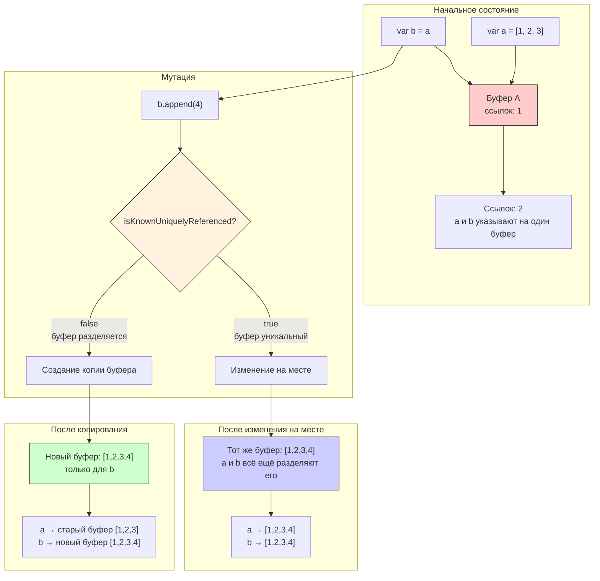

#memory #cow #copy-on-write #swift #performance #optimization #value-types

---
### Определение
**Copy-On-Write (COW)** — это техника оптимизации памяти, при которой несколько копий одной коллекции **делят один буфер памяти** до тех пор, пока одна из них не будет изменена. Копирование данных происходит **только при первой мутации** .

В Swift COW автоматически применяется ко всем встроенным коллекциям: [[Array]], [[Dictionary]], [[Set]], [[String]]. Это позволяет сохранять семантику [[value type]]s (копирование при присваивании) без потери производительности на копирование больших объемов данных, если они фактически не изменяются.

### Зачем это знать iOS-разработчику?
1.  **Производительность:** Понимание COW позволяет писать эффективный код, избегая неожиданных копирований .
2.  **Оптимизация:** Знание того, когда происходит копирование, помогает проектировать структуры данных .
3.  **Параллелизм:** COW безопасен для многопоточности, так как копирование происходит при мутации .
4.  **Кастомные типы:** Можно реализовать COW для своих value types, чтобы улучшить производительность .
5.  **Отладка:** Понимание COW помогает интерпретировать результаты профилирования в Instruments .

---

### Как работает COW



#### Последовательность шагов:

1.  **Инициализация:** `var a = [1, 2, 3]` — создается буфер в памяти.
2.  **Присваивание:** `var b = a` — новый массив `b` разделяет тот же буфер с `a`. **Копирования не происходит**.
3.  **Чтение:** `print(b[0])` — чтение из общего буфера, копирования нет.
4.  **Мутация:** `b.append(4)` — система проверяет, уникальна ли ссылка на буфер (`isKnownUniquelyReferenced`).
    -   Если на буфер есть другие ссылки (как в нашем случае), создается **новая копия** буфера для `b`.
    -   Если ссылка уникальна, изменение происходит на месте.
5.  **Результат:** `a` остается без изменений `[1, 2, 3]`, `b` теперь `[1, 2, 3, 4]`.

---

### Примеры работы COW

#### 1. **Базовый пример с [[Array]]**

```swift
var a = [1, 2, 3]       // создается буфер
var b = a               // b → тот же буфер (без копии!)
b.append(4)             // здесь копируется → теперь разные буферы

print(a)                // [1, 2, 3]
print(b)                // [1, 2, 3, 4]
```

#### 2. **Проверка идентичности буферов**

```swift
var x = [1, 2, 3]
var y = x

// Проверяем, что буфер общий (используем unsafe pointer для демонстрации)
x.withUnsafeBufferPointer { xBuffer in
    y.withUnsafeBufferPointer { yBuffer in
        print(xBuffer.baseAddress == yBuffer.baseAddress) // true
    }
}

y.append(4)

x.withUnsafeBufferPointer { xBuffer in
    y.withUnsafeBufferPointer { yBuffer in
        print(xBuffer.baseAddress == yBuffer.baseAddress) // false
    }
}
```

#### 3. **COW в функциях**

```swift
func processArray(_ array: [Int]) {
    var local = array  // копирования нет — общий буфер
    print(local.count) // чтение — копирования нет
    local.append(5)    // здесь происходит копирование
    print(local.count)
}

let original = [1, 2, 3, 4]
processArray(original) // оригинал не изменяется
```

---

### Реализация кастомного COW

#### 1. **Базовый класс для хранения (Box)**

```swift
final class Box<T> {
    var value: T
    init(_ value: T) {
        self.value = value
    }
}
```

#### 2. **Структура с COW**

```swift
struct MyArray<T> {
    private var box: Box<[T]>
    
    init(_ elements: [T] = []) {
        box = Box(elements)
    }
    
    // Доступ к элементам
    var count: Int {
        box.value.count
    }
    
    subscript(index: Int) -> T {
        get { box.value[index] }
        set {
            ensureUnique()
            box.value[index] = newValue
        }
    }
    
    // Мутирующие методы
    mutating func append(_ element: T) {
        ensureUnique()
        box.value.append(element)
    }
    
    mutating func remove(at index: Int) -> T {
        ensureUnique()
        return box.value.remove(at: index)
    }
    
    // COW логика
    private mutating func ensureUnique() {
        if !isKnownUniquelyReferenced(&box) {
            box = Box(box.value)  // копируем буфер
        }
    }
}

extension MyArray: CustomStringConvertible {
    var description: String {
        box.value.description
    }
}
```

#### 3. **Использование кастомного COW**

```swift
var arr1 = MyArray([1, 2, 3])
var arr2 = arr1  // буфер общий

print(arr1)  // [1, 2, 3]
print(arr2)  // [1, 2, 3]

arr2.append(4)  // копирование происходит здесь

print(arr1)  // [1, 2, 3]
print(arr2)  // [1, 2, 3, 4]
```

---

### Производительность COW

#### 1. **Измерение времени копирования**

```swift
import Foundation

func measureTime(_ title: String, block: () -> Void) {
    let start = CFAbsoluteTimeGetCurrent()
    block()
    let end = CFAbsoluteTimeGetCurrent()
    print("\(title): \(String(format: "%.4f", (end - start) * 1000)) мс")
}

let largeArray = Array(0..<1_000_000)

measureTime("Присваивание (COW)") {
    let copy = largeArray  // O(1) — нет копирования
    _ = copy.count
}

measureTime("Мутация (копирование)") {
    var copy = largeArray  // все еще без копирования
    copy.append(999_999)    // здесь копируется 1 млн элементов
}
```

#### 2. **COW vs Reference Types**

| Характеристика     | [[Value Type]] с COW | [[Reference Type]]  |
| ------------------ | -------------------- | ------------------- |
| **Присваивание**   | Общий буфер (O(1))   | Общая ссылка (O(1)) |
| **Первая мутация** | Копирование (O(n))   | Изменение на месте  |
| **Параллелизм**    | Безопасно (копия)    | Опасно (гонки)      |
| **Память**         | Эффективно           | Эффективно          |
| **Семантика**      | Value semantics      | Reference semantics |

---

### Где применяется COW в Swift

| Тип          | COW | Примечание                        |
| ------------ | --- | --------------------------------- |
| `Array`      | ✅   | Стандартная реализация            |
| `Dictionary` | ✅   | При мутации пар ключ-значение     |
| `Set`        | ✅   | Аналогично [[Array]]              |
| `String`     | ✅   | Оптимизация для строк             |
| `Data`       | ✅   | В [[Foundation]]                  |
| `Substring`  | ✅   | Делит буфер оригинальной строки   |
| `Slice`      | ✅   | Делит буфер оригинального массива |

#### Пример с Substring

```swift
let original = "Hello, World!"
let substring = original.prefix(5)  // "Hello" — делит буфер с original

print(substring)  // чтение — общий буфер

var mutableSubstring = substring
mutableSubstring.append("!!!")  // здесь копируется
```

---

### Продвинутые техники

#### 1. **isKnownUniquelyReferenced для диагностики**

```swift
class Storage {
    var data: [Int]
    init(_ data: [Int]) { self.data = data }
}

var storage = Storage([1, 2, 3])
print(isKnownUniquelyReferenced(&storage))  // true

var storage2 = storage
print(isKnownUniquelyReferenced(&storage))  // false (есть вторая ссылка)
```

#### 2. **Оптимизация с COW для сложных структур**

```swift
struct Drawing {
    private var box: Box<[Shape]>
    
    var shapes: [Shape] {
        get { box.value }
        set {
            if !isKnownUniquelyReferenced(&box) {
                box = Box(newValue)
            } else {
                box.value = newValue
            }
        }
    }
    
    mutating func addShape(_ shape: Shape) {
        if !isKnownUniquelyReferenced(&box) {
            box = Box(box.value)
        }
        box.value.append(shape)
    }
}
```

#### 3. **COW в многопоточной среде**

```swift
class ThreadSafeArray<T> {
    private var box: Box<[T]>
    private let queue = DispatchQueue(label: "sync.queue")
    
    init(_ elements: [T] = []) {
        box = Box(elements)
    }
    
    func append(_ element: T) {
        queue.sync {
            if !isKnownUniquelyReferenced(&box) {
                box = Box(box.value)
            }
            box.value.append(element)
        }
    }
}
```

---

### Лучшие практики

#### 1. **Используйте value types по умолчанию**

```swift
// Хорошо — COW обеспечит эффективность
struct Configuration {
    var settings: [String: String]
    var flags: Set<String>
}

// Для reference types убедитесь, что это действительно нужно
class SharedState {
    var data: [Int]
}
```

#### 2. **Избегайте лишних мутаций**

```swift
// Плохо — создает ненужные копии
var items = getItems()
items.sort()  // мутация
process(items)

// Хорошо — сортировка без мутации
let items = getItems()
let sorted = items.sorted()  // COW создаст копию только при сортировке
process(sorted)
```

#### 3. **Используйте copy-on-write для больших структур**

```swift
struct Document {
    private var box: Box<String>
    
    var content: String {
        get { box.value }
        set { box = Box(newValue) }  // всегда копируем при установке
    }
    
    mutating func append(_ text: String) {
        if !isKnownUniquelyReferenced(&box) {
            box = Box(box.value + text)
        } else {
            box.value.append(text)
        }
    }
}
```

#### 4. **Проверяйте в Instruments**

- Используйте Allocation instrument для отслеживания копирований
- Следите за [[retain]]/[[release]] операциями

### Итог
**Copy-On-Write** — это фундаментальная оптимизация в [[Swift]], которая позволяет:

1.  **Сохранять value semantics** при копировании.
2.  **Экономить память** за счет разделения буферов.
3.  **Обеспечивать производительность** при работе с большими коллекциями.
4.  **Избегать неожиданных копирований** в коде.

**Ключевые правила:**
- Присваивание и передача в функции не копируют данные.
- Копирование происходит только при мутации.
- Используйте `isKnownUniquelyReferenced` для кастомных реализаций.
- Swift автоматически оптимизирует коллекции с COW .

Понимание COW необходимо для написания эффективного и безопасного кода, особенно при работе с большими объемами данных .
