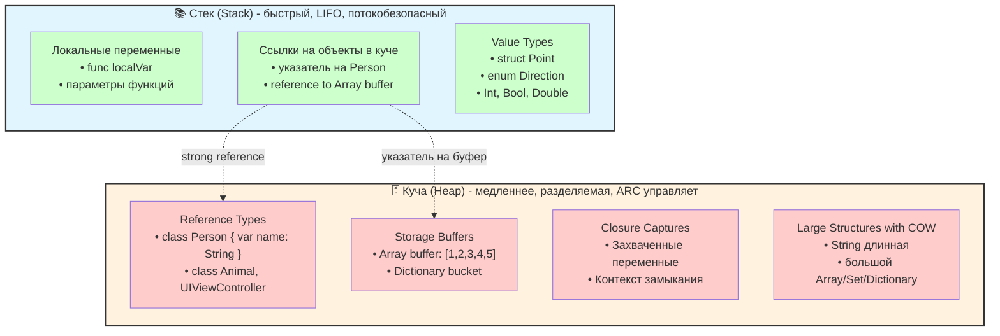
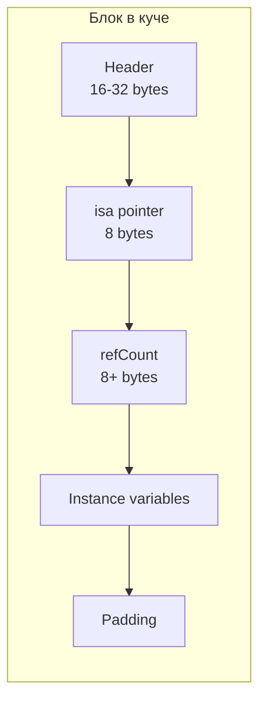
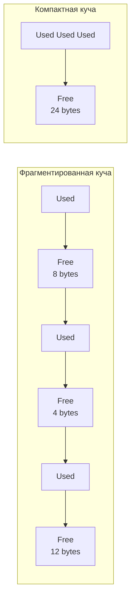
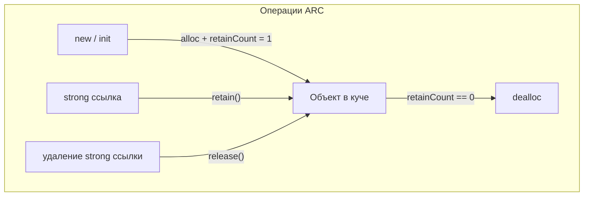

#memory #heap #arc #swift #ios #performance #memory-management

---
### Определение

**Куча (Heap)** — это область динамической памяти, где хранятся объекты с **непредсказуемым временем жизни** и **размером**, который может изменяться во время выполнения программы. В отличие от стека, куча не имеет строгого порядка выделения и освобождения памяти — объекты могут создаваться и уничтожаться в произвольном порядке.



---

### Как данные хранятся на куче: внутреннее устройство

Куча — это не просто "большой кусок памяти". Она имеет сложную внутреннюю структуру для эффективного выделения и освобождения блоков.

#### 1. **Общая схема кучи**

```
┌─────────────────────────────────────────────────────────────┐
│                     Куча (Heap)                              │
├───────────────┬───────────────┬───────────────┬─────────────┤
│   Metadata    │   Free Block  │   Used Block  │   Free Block│
│   (информация │   (свободный   │   (занятый    │   (свободный│
│    о куче)    │     блок)      │    объект)    │     блок)   │
└───────────────┴───────────────┴───────────────┴─────────────┘
```

#### 2. **Структура выделенного блока (на примере объекта класса)**

Каждый выделенный блок в куче содержит:

| Компонент                 | Размер      | Описание                                                         |
| ------------------------- | ----------- | ---------------------------------------------------------------- |
| **Header**                | 16-32 байта | Метаданные: размер блока, флаги, информация для ARC              |
| **isa pointer**           | 8 байт      | Указатель на класс объекта (для [[Swift]]/Obj-C объектов)        |
| **refCount (side table)** | 8+ байт     | Счётчик ссылок для [[ARC]] (может храниться inline или отдельно) |
| **Instance variables**    | переменный  | Фактические данные объекта (свойства)                            |
| **Padding**               | переменный  | Выравнивание до границы слова                                    |



#### 3. **Как Swift находит и выделяет память в куче**

При вызове [[init]] класса Swift:

1. Запрашивает у аллокатора кучи блок нужного размера
2. Аллокатор ищет свободный блок достаточного размера (используя алгоритм best-fit, first-fit и т.д.)
3. Отмечает блок как занятый
4. Возвращает указатель на начало блока
5. Инициализирует isa pointer, refCount и свойства

```swift
class Person {
    let name: String
    let age: Int
    init(name: String, age: Int) {
        self.name = name
        self.age = age
    }
}

let person = Person(name: "Alice", age: 30)
// 1. Выделение блока в куче (sizeof(Person) + header)
// 2. Инициализация isa -> Person
// 3. refCount = 1
// 4. Установка name и age
```

---

### Фрагментация кучи

Куча подвержена **фрагментации** — появлению множества маленьких свободных блоков, которые не могут быть использованы для больших выделений.



### Основные характеристики кучи

| Характеристика       | Описание                                                                                              |
| -------------------- | ----------------------------------------------------------------------------------------------------- |
| **Размещение**       | Динамическое (через init, [[alloc]] в Obj-C, ARC в Swift)                                             |
| **Время жизни**      | От момента создания до момента, когда ARC обнуляет счётчик ссылок                                     |
| **Порядок удаления** | Произвольный (нет строгого [[FILO]], как в стеке)                                                     |
| **Размер**           | Ограничен только доступной оперативной памятью процесса                                               |
| **Управление**       | Автоматическое (ARC) для [[class]], ручное — только в legacy Obj-C коде                               |
| **Типы данных**      | Экземпляры class, замыкания, объекты [[Objective-C]], большие [[Value Type]] ([[Copy-On-Write\|COW]]) |
| **Скорость доступа** | Медленнее стека (косвенный доступ через указатель)                                                    |

---

### Когда данные попадают в кучу

| Тип данных / конструкция                                       | Где хранится (по умолчанию) | Примечание                                     |
| -------------------------------------------------------------- | --------------------------- | ---------------------------------------------- |
| Экземпляры `class`                                             | Куча                        | Все объекты классов                            |
| Замыкания ([[closure]])                                        | Куча                        | Даже если захватывают value types              |
| [[Array]], [[Dictionary]], [[Set Collection\|Set]], [[String]] | Буфер в куче (COW)          | Сама структура — на стеке, содержимое — в куче |
| Большие struct (COW)                                           | Буфер в куче                | Маленькие [[struct]] — на стеке                |
| enum с associated value                                        | Куча (если есть payload)    | Простые [[enum]] — на стеке                    |

---

### Примеры кода

#### 1. Класс → всегда в куче

```swift
class User {
    var name = "Гость"
    deinit { print("User уничтожен") }
}

var user: User? = User()      // выделение в куче + retain count = 1
var copy = user                // retain count = 2
user = nil                     // retain count = 1
copy = nil                     // retain count = 0 → deinit → "User уничтожен"
```

#### 2. Array — структура на стеке, буфер в куче (COW)

```swift
var a = [1, 2, 3]              // структура на стеке, буфер [1,2,3] в куче
var b = a                      // копия структуры, тот же буфер
b.append(4)                    // COW: создаётся новый буфер только для b
print(a)                       // [1, 2, 3]
print(b)                       // [1, 2, 3, 4]
```

#### 3. Замыкание → всегда в куче

```swift
func makeClosure() -> () -> Void {
    var counter = 0
    return {
        counter += 1           // counter захвачен → замыкание в куче
        print(counter)
    }
}

let increment = makeClosure()
increment()  // 1
increment()  // 2
```

#### 4. Объект с несколькими ссылками (ARC управление)

```swift
class Node {
    var value: Int
    var next: Node?
    init(value: Int) { self.value = value }
    deinit { print("Node \(value) deallocated") }
}

var node1: Node? = Node(value: 1)  // alloc в куче, refCount = 1
var node2 = node1                    // refCount = 2
var node3 = node1                    // refCount = 3

node1 = nil                          // refCount = 2
node2 = nil                          // refCount = 1
node3 = nil                          // refCount = 0 → deinit
```

---

### Сравнение: Стек vs Куча

| Параметр | Стек (Stack) | Куча (Heap) |
|---|---|---|
| **Размер** | Фиксированный (маленький) | Почти неограниченный |
| **Выделение/освобождение** | Автоматическое (при входе/выходе) | Через ARC (retain/release) |
| **Скорость доступа** | Очень быстрая | Медленнее (косвенный доступ) |
| **Время жизни** | До конца scope | До обнуления retain count |
| **Типичные данные** | Локальные переменные, value types | Объекты class, замыкания, буферы COW |
| **Управление памятью** | Автоматическое | ARC (счётчик ссылок) |
| **Фрагментация** | Отсутствует | Может быть |
| **Потокобезопасность** | Каждый поток свой стек | Общая, требует синхронизации |

---

### Как ARC управляет памятью в куче



---

### Короткие рекомендации (2026)

| Рекомендация | Почему |
|---|---|
| Всё, что создаётся через `init` класса → **куча** + ARC | Ссылочная семантика |
| Маленькие `struct` / `enum` / Int / Double → **стек** | Value types, быстрые |
| Большие коллекции (`Array`, String и т.д.) → **структура на стеке + буфер в куче** | COW оптимизация |
| Замыкания → **всегда в куче**, даже если захватывают value types | Могут переиспользоваться |
| **deinit** вызывается **только** у объектов в куче | Только классы имеют deinit |

**Главное правило**:
> Если объект имеет `deinit` или может быть `weak` / `unowned` → он в куче.  
> Если это `struct` / `enum` / примитив → он в стеке (или inline в куче).

---

### Итог

**Куча (Heap)** в Swift:

| Характеристика | Значение |
|---|---|
| **Назначение** | Динамическое выделение памяти для объектов с непредсказуемым временем жизни |
| **Управление** | ARC (retain/release) |
| **Типы данных** | `class`, замыкания, буферы COW, большие value types |
| **Преимущества** | Гибкое время жизни, работа с большими данными |
| **Недостатки** | Медленнее стека, фрагментация, overhead ARC |
| **Ключевые слова** | `class`, `weak`, `unowned`, `deinit`, `retain`, `release` |

Понимание устройства кучи необходимо для:
- Оптимизации производительности (избегание лишних аллокаций в куче)
- Предотвращения утечек памяти (retain cycles)
- Выбора между `class` и `struct`
- Понимания работы ARC
