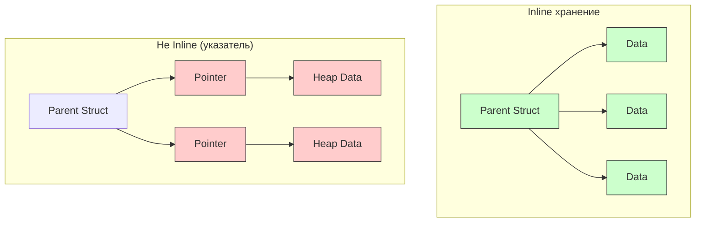
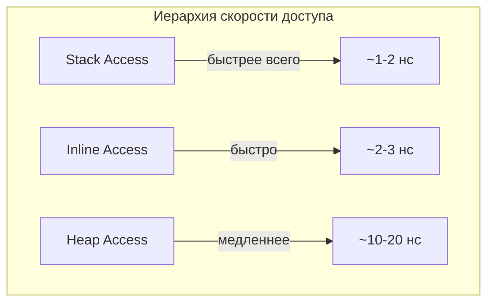

#swift #memory #inline #performance #stack #heap #value-types

---
### Определение

**Inline (встроенное хранение)** — это когда данные хранятся **не по указателю** в отдельном объекте на куче, а **непосредственно внутри** другой структуры, объекта или контейнера. Вместо того чтобы выделять отдельный блок памяти и ссылаться на него через указатель, значение встраивается прямо в родительский тип.



---

### Почему inline важен

| Преимущество                   | Объяснение                                                |
| ------------------------------ | --------------------------------------------------------- |
| **Меньше аллокаций на куче**   | Нет необходимости вызывать malloc/free                    |
| **Лучшая локальность данных**  | Данные находятся близко в памяти → [[CPU]] cache friendly |
| **Меньше косвенных обращений** | Нет pointer chasing (разыменования указателя)             |
| **Экономия памяти**            | Нет overhead на заголовки [[ARC]] и указатели             |
| **Быстрее доступ**             | Прямой доступ к памяти родительского объекта              |

**Пример разницы локальности:**
```
Inline (данные рядом):
┌────┬────┬────┬────┐
│ P1 │ P1 │ P2 │ P2 │  ← всё в одном кэш-блоке
└────┴────┴────┴────┘

Не Inline (данные разбросаны):
┌────┐     ┌────┐
│ P1 │────→│ P1 │  (где-то далеко)
└────┘     └────┘
```

---

### Основные случаи Inline

| Случай                                       | Где хранится                          | Пример кода                                    | Комментарий                    |
| -------------------------------------------- | ------------------------------------- | ---------------------------------------------- | ------------------------------ |
| **struct внутри struct**                     | Внутри памяти родительской структуры  | `struct Rect { var p1: Point; var p2: Point }` | Полностью inline               |
| **[[struct]] внутри [[class]]**              | Внутри памяти экземпляра класса       | `class Box { var point = Point(x:0,y:0) }`     | Inline внутри heap-объекта     |
| **Маленький struct в [[any]] [[Protocol]]**  | В value buffer existential-контейнера | `let p: any P = SmallStruct()`                 | ≤ 3 слова — inline, иначе Heap |
| **Маленькие элементы в [[Array]]**           | В contiguous буфере массива           | `let arr = [Point](repeating: …, count: 100)`  | Inline в одном буфере          |
| **Associated values в [[enum]] (маленькие)** | Внутри памяти enum                    | `enum Result { case success(Point) }`          | Inline, если помещается        |

---

### Примеры на практике

#### 1. **Полностью inline — struct внутри struct**

```swift
struct Point {
    var x: Int
    var y: Int
}

struct Rect {
    var topLeft: Point
    var bottomRight: Point
}

var r = Rect(
    topLeft: Point(x: 0, y: 0),
    bottomRight: Point(x: 10, y: 10)
)
// всё лежит в одном непрерывном блоке памяти
```

**Схема памяти Rect (16 + 16 = 32 байта):**
```
┌───────────────────────────────────────────────────────┐
│  Rect                                                 │
├───────────────┬───────────────┬───────────────┬───────┤
│ topLeft.x = 0 │ topLeft.y = 0 │ bottomRight.x │ = 10  │
│ topLeft.y = 0 │ bottomRight.x │ = 10          │ = 10  │
└───────────────┴───────────────┴───────────────┴───────┘
```

#### 2. **Inline внутри класса**

```swift
class Container {
    var point = Point(x: 5, y: 7)     // Point хранится inline внутри объекта Container
    var value = 42                     // тоже inline
}

let container = Container()
// Объект Container в куче, но его свойства Point и value — внутри блока класса
```

**Схема памяти Container:**
```
┌─────────────────────────────────────────────────────┐
│  Container объект в куче                            │
├───────────────┬───────────────┬─────────────────────┤
│ isa (8 bytes) │ point.x = 5   │ point.y = 7         │
│ point.y = 7   │ value = 42    │                     │
└───────────────┴───────────────┴─────────────────────┘
```

#### 3. **Inline в existential container (any Protocol)**

```swift
protocol Drawable {
    func draw()
}

// Маленький тип (16 байт) → помещается в inline buffer
struct SmallCircle: Drawable {
    let radius: Int       // 8 байт
    let x, y: Int         // 16 байт всего
    func draw() { print("○") }
}

// Большой тип (32 байта) → вытесняется на heap
struct LargeCircle: Drawable {
    let radius, x, y, z: Int  // 32 байта
    func draw() { print("●") }
}

let small: any Drawable = SmallCircle(radius: 10, x: 0, y: 0)
let large: any Drawable = LargeCircle(radius: 20, x: 0, y: 0, z: 0)

// small: значение inline в existential container (быстро)
// large: значение в куче, container хранит указатель (медленнее)
```

#### 4. **Inline в массиве**

```swift
struct Point {
    var x, y: Int  // 16 байт
}

// Массив из 1000 точек — все точки хранятся inline в одном буфере
let points = [Point](repeating: Point(x: 0, y: 0), count: 1000)
// Не 1000 отдельных объектов, а один непрерывный блок 16KB
```

**Схема памяти Array:**
```
┌─────────────────────────────────────────────────────┐
│  Array struct (на стеке)                            │
│  ├── pointer ──────┐                                │
│  ├── count         │                                │
│  └── capacity      │                                │
└────────────────────┼────────────────────────────────┘
                     ▼
┌─────────────────────────────────────────────────────┐
│  Heap buffer (16KB) — все точки inline              │
├───────────────┬───────────────┬───────────────┬─────┤
│ Point 0 (x,y) │ Point 1 (x,y) │ Point 2 (x,y) │ ... │
└───────────────┴───────────────┴───────────────┴─────┘
```

---

### Inline vs Heap vs Stack

| Тип хранения | Где физически | Пример | Скорость доступа | Управление памятью |
|---|---|---|---|---|
| **Inline** | Внутри родителя | `struct` внутри `class` / `Array` | Максимальная | Автоматическое |
| **Heap** | Отдельный объект (ARC) | `class`, замыкания, большие struct | Медленнее | ARC |
| **Stack** | Локальная переменная функции | `let x = 42`, маленькие struct | Самая быстрая | Автоматическое |



---

### Inline и Copy-on-Write (COW)

Для коллекций Swift (Array, Dictionary, String) используется inline + COW:

```swift
var a = [1, 2, 3]        // структура на стеке, буфер в куче (inline элементы)
var b = a                // копия структуры, тот же буфер
b.append(4)              // COW: создаётся новый буфер для b (новый inline)
```

---

### Как проверить, хранится ли тип Inline

```swift
// Размер типа — индикатор inline
struct Small {
    let a, b: Int        // 16 байт
}
print(MemoryLayout<Small>.size)  // 16

struct Large {
    let a, b, c, d: Int  // 32 байта
}
print(MemoryLayout<Large>.size)  // 32

// Existential container inline buffer size = 24 байта (3 слова)
protocol Test {}
struct Twelve: Test { let a, b: Int }      // 16 байт → inline
struct Thirty: Test { let a, b, c, d: Int } // 32 байта → heap
```

---

### Когда Inline НЕ используется

| Ситуация                              | Почему не inline                                                            |
| ------------------------------------- | --------------------------------------------------------------------------- |
| **Классы (class)**                    | Всегда в куче, ссылка — inline                                              |
| **Большие структуры в `any`**         | Не помещаются в 24-байтный inline buffer                                    |
| **Замыкания**                         | Всегда в куче                                                               |
| **Строки ([[String]])**               | Не inline из-за COW и оптимизаций (но маленькие строки могут быть inline)   |
| **Элементы словаря ([[Dictionary]])** | Хранятся в хеш-таблице, не inline (но пары ключ-значение могут быть inline) |
|                                       |                                                                             |

---

### Оптимизации: как добиться Inline

| Совет | Почему |
|---|---|
| **Делайте структуры ≤ 24 байт** | Для использования inline buffer в existential container |
| **Используйте `struct` вместо `class`** | Классы всегда в куче через указатель |
| **Вкладывайте структуры друг в друга** | Компилятор встраивает их |
| **Избегайте больших типов в `any`** | Вызывают heap allocation |
| **Используйте `ContiguousArray` вместо `Array`** | Гарантирует inline элементы |

---

### Итог — коротко

- **Inline** = данные лежат **внутри** родительской структуры/объекта
- **Преимущества**: быстрее доступ, меньше аллокаций, лучше кэш
- **Типичные места**:
  - struct внутри struct / class
  - Маленькие типы в `any Protocol` (≤ 24 байта)
  - Элементы в Array / ContiguousArray
- **Когда не inline**: большие struct в any, объекты class, замыкания

**Главное правило**:
> Если тип маленький и часто используется внутри других типов — компилятор старается держать его **inline**.  
> Это одна из причин, почему Swift такой быстрый.

---

### Дополнительно: Inline в Swift 6

Swift 6 усиливает inline оптимизации:
- Сужаются условия, когда existential container использует heap
- Улучшена встраиваемость маленьких структур
- `@inline(__always)` для форсирования инлайнинга (но осторожно)

```swift
@inline(__always)
func fastFunction() {
    // Код будет встроен везде, где вызывается
}
```