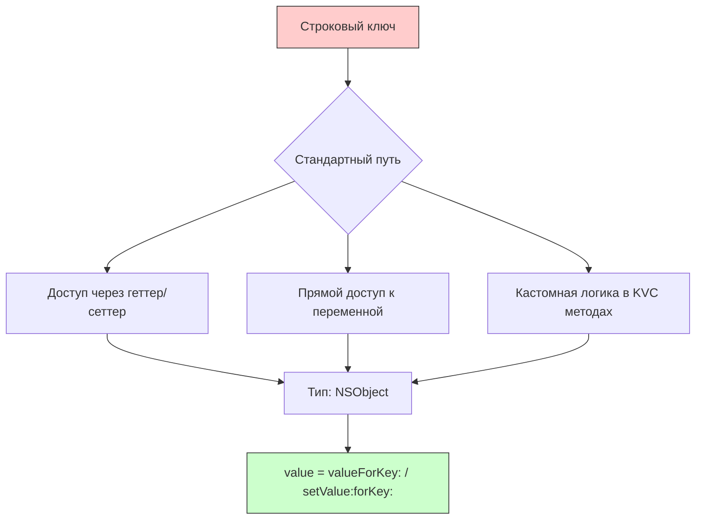

#objc #kvc #key-value-coding #runtime #objective-c #swift #foundation

---

### Определение

**Key-Value Coding (KVC)** — это механизм, позволяющий **получать и изменять значения свойств** объекта по их **строковым именам** (ключам) во время выполнения, без прямого вызова методов доступа (геттеров/сеттеров). KVC — фундаментальная технология, лежащая в основе других механизмов Apple: **[[KVO]]** (Key-Value Observing), **Cocoa Bindings**, **[[Core Data]]**.

В Swift KVC доступен только для классов, унаследованных от `NSObject` и помеченных атрибутом `@objc`.

---

### Зачем это знать iOS-разработчику?

| Сценарий                           | Применение                                  |
| ---------------------------------- | ------------------------------------------- |
| **Сериализация [[JSON]] → модель** | Установка свойств по ключам из словаря      |
| **Создание универсального кода**   | Обработка неизвестных свойств без рефлексии |
| **KVO (наблюдение за свойствами)** | Базовый механизм для наблюдения             |
| **Core Data**                      | [[NSManagedObject]] использует KVC          |
| **Cocoa Bindings (macOS)**         | Связывание UI с моделью                     |
| **Упрощение кода**                 | Обход множества однотипных вызовов          |

---

### Как это работает



**Базовый механизм:**
1. `setValue:forKey:` ищет метод `set<Key>:` (сеттер)
2. Если сеттер не найден, ищет переменную экземпляра `_<key>` или `<key>`
3. Если ничего не найдено, вызывает `setValue:forUndefinedKey:`

---

### Синтаксис

#### Основные методы

| Метод | Описание |
|---|---|
| **`value(forKey:)`** | Возвращает значение свойства по ключу |
| **`setValue(_:forKey:)`** | Устанавливает значение свойства по ключу |
| **`setValuesForKeys(_:)`** | Устанавливает несколько свойств из словаря |
| **`dictionaryWithValues(forKeys:)`** | Возвращает словарь значений для массива ключей |
| **`setValue(_:forUndefinedKey:)`** | Обработка несуществующего ключа |

---

### Примеры использования

#### 1. **Базовый пример в [[Objective-C]]**

```objc
// Objective-C
@interface Person : NSObject
@property (nonatomic, copy) NSString *name;
@property (nonatomic, assign) NSInteger age;
@end

@implementation Person
@end

// Использование
Person *person = [[Person alloc] init];
[person setValue:@"Alice" forKey:@"name"];
[person setValue:@25 forKey:@"age"];

NSString *name = [person valueForKey:@"name"];   // @"Alice"
NSInteger age = [[person valueForKey:@"age"] integerValue];  // 25
```

#### 2. **Базовый пример в [[Swift]]**

```swift
import Foundation

@objcMembers
class Person: NSObject {
    var name: String = ""
    var age: Int = 0
}

let person = Person()
person.setValue("Alice", forKey: "name")
person.setValue(25, forKey: "age")

let name = person.value(forKey: "name") as? String ?? ""  // "Alice"
let age = person.value(forKey: "age") as? Int ?? 0        // 25
```

#### 3. **Установка нескольких свойств из словаря**

```swift
@objcMembers
class User: NSObject {
    var firstName: String = ""
    var lastName: String = ""
    var email: String = ""
    var age: Int = 0
}

let user = User()
let dict: [String: Any] = [
    "firstName": "John",
    "lastName": "Doe",
    "email": "john@example.com",
    "age": 30
]

user.setValuesForKeys(dict)
print(user.firstName)  // John
print(user.lastName)   // Doe
```

#### 4. **Получение словаря значений**

```swift
let keys = ["firstName", "lastName", "email"]
let values = user.dictionaryWithValues(forKeys: keys)
print(values)
// ["firstName": "John", "lastName": "Doe", "email": "john@example.com"]
```

#### 5. **Обработка несуществующих ключей**

```swift
@objcMembers
class SafePerson: NSObject {
    var name: String = ""
    
    override func setValue(_ value: Any?, forUndefinedKey key: String) {
        print("⚠️ Unknown key: \(key)")
    }
    
    override func value(forUndefinedKey key: String) -> Any? {
        print("⚠️ Unknown key: \(key)")
        return nil
    }
}

let person = SafePerson()
person.setValue("Alice", forKey: "name")
person.setValue(25, forKey: "age")        // ⚠️ Unknown key: age
let age = person.value(forKey: "age")     // nil
```

---

### KVC и пути ключей (Key Paths)

KVC поддерживает **пути ключей** — точечную нотацию для доступа к вложенным свойствам.

```swift
@objcMembers
class Address: NSObject {
    var city: String = ""
    var street: String = ""
}

@objcMembers
class Person: NSObject {
    var name: String = ""
    var address: Address = Address()
}

let person = Person()
person.setValue("New York", forKeyPath: "address.city")
person.setValue("Broadway", forKeyPath: "address.street")

let city = person.value(forKeyPath: "address.city") as? String  // "New York"
```

---

### KVC в [[SwiftUI]] (наблюдение)

Хотя SwiftUI использует свой механизм наблюдения, KVC остаётся полезным для интеграции с [[UIKit]]/AppKit:

```swift
import SwiftUI
import Combine

@objcMembers
class LegacyViewModel: NSObject, ObservableObject {
    @Published var title: String = ""
    
    func updateFromKVC() {
        // Получение данных через KVC
        if let newTitle = value(forKey: "title") as? String {
            self.title = newTitle
        }
    }
}
```

---

### Производительность KVC

| Характеристика         | Оценка                                        |
| ---------------------- | --------------------------------------------- |
| **Скорость доступа**   | Медленнее прямого доступа (2-5x)              |
| **Overhead**           | Поиск метода/переменной через [[Runtime]]     |
| **Когда использовать** | Когда нужна гибкость, а не производительность |

```swift
// ❌ Медленно в цикле
for i in 0..<100000 {
    obj.setValue(i, forKey: "value")
}

// ✅ Быстро
for i in 0..<100000 {
    obj.value = i
}
```

---

### Ограничения KVC в Swift

| Ограничение                      | Пояснение                                    |
| -------------------------------- | -------------------------------------------- |
| **Только NSObject**              | Класс должен наследоваться от `NSObject`     |
| **@objc атрибут**                | Свойства должны быть доступны из Objective-C |
| **Value types не работают**      | [[struct]] и [[enum]] не поддерживают KVC    |
| **Нет безопасности типов**       | Ошибки проявляются во время выполнения       |
| **Нет поддержки Swift Generics** | Обобщённые типы не видны в KVC               |

---

### Альтернативы KVC в современном Swift

| Альтернатива | Преимущества |
|---|---|
| **`Codable`** | Безопасность типов, поддержка struct |
| **`Mirror` (Reflection)** | Swift-native рефлексия |
| **`@Published` + Combine** | Реактивное наблюдение |
| **`@Observable` (iOS 17+)** | Современное наблюдение от Apple |
| **`KeyPath` (типизированные)** | Безопасность типов для доступа по ключу |

#### Пример с Mirror:

```swift
struct Person {
    var name: String
    var age: Int
}

let person = Person(name: "Alice", age: 25)
let mirror = Mirror(reflecting: person)

for child in mirror.children {
    print("\(child.label ?? ""): \(child.value)")
}
// name: Alice
// age: 25
```

#### Пример с KeyPath (без KVC, но похоже):

```swift
struct Person {
    var name: String
    var age: Int
}

let person = Person(name: "Alice", age: 25)
let nameKeyPath = \Person.name
let name = person[keyPath: nameKeyPath]  // "Alice"
```

---

### Лучшие практики

| Рекомендация | Почему |
|---|---|
| **Используйте `Codable` для JSON → модель** | Безопаснее и быстрее |
| **Используйте `KeyPath` для типизированного доступа** | Безопасность типов |
| **Избегайте KVC в горячих циклах** | Медленно |
| **Переопределяйте `setValue:forUndefinedKey:`** | Для отладки и обработки ошибок |
| **Используйте `@objcMembers` для упрощения** | Чтобы не писать `@objc` у каждого свойства |

```swift
// ✅ Хорошо: Codable вместо KVC для JSON
struct User: Codable {
    let name: String
    let age: Int
}

// ❌ Плохо: KVC для парсинга
class LegacyUser: NSObject {
    @objc var name: String = ""
    @objc var age: Int = 0
    
    init(dict: [String: Any]) {
        super.init()
        setValuesForKeys(dict)
    }
}
```

---

### Короткий итог

| Характеристика | Значение |
|---|---|
| **Назначение** | Доступ к свойствам по строковым ключам |
| **Требования** | `NSObject` + `@objc` |
| **Скорость** | Медленнее прямого доступа |
| **Основное применение** | KVO, Core Data, сериализация |
| **Альтернативы** | `Codable`, `KeyPath`, `Mirror` |

**Главное правило:**
> Для новых Swift-проектов предпочитайте `Codable` и типизированные `KeyPath`. KVC используйте только для совместимости с Objective-C или при работе с KVO/Core Data.