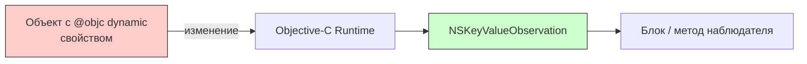
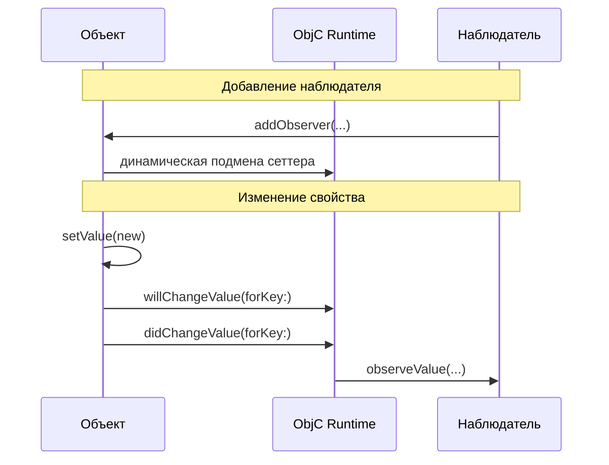

#objc #kvo #key-value-observing #runtime #objective-c #swift #combine #observation

---

### Определение

**Key-Value Observing (KVO)** — это механизм наблюдения за изменениями свойств объектов во время выполнения ([[Runtime]]). Позволяет автоматически реагировать на изменение `@objc dynamic` свойств, уведомляя наблюдателей о каждом изменении.

KVO — фундаментальная технология [[Objective-C]] runtime, лежащая в основе многих механизмов Apple: Cocoa Bindings, [[Core Data]], а также широко используется в [[UIKit]] для наблюдения за свойствами системных классов.



---

### Как это работает

1. **[[Swizzling]]**: При добавлении первого наблюдателя runtime динамически подменяет сеттер свойства
2. **Уведомление**: При изменении свойства runtime вызывает `willChangeValue(forKey:)` → изменяет значение → вызывает `didChangeValue(forKey:)`
3. **Доставка**: Все зарегистрированные наблюдатели получают уведомление



---

### Ключевые особенности (2026)

| Особенность                             | Описание                                        |
| --------------------------------------- | ----------------------------------------------- |
| **Требования к классу**                 | Только классы, наследующие [[NSObject]]         |
| **Требования к свойству**               | `@objc dynamic`                                 |
| **Основа**                              | Objective-C Runtime                             |
| **Поддержка нескольких наблюдателей**   | Да, на одно свойство                            |
| **Работа с value types**                | Нет — не работает с [[struct]], [[enum]]        |
| **Автоматическое удаление наблюдателя** | Да (при освобождении [[NSKeyValueObservation]]) |

---

### Основные методы и варианты использования

#### 1. **Классический KVO через `observe(_:options:changeHandler:)` (рекомендуемый)**

```swift
import Foundation

class Person: NSObject {
    @objc dynamic var name: String = "Anonymous"
    @objc dynamic var age: Int = 0
}

let person = Person()

// Наблюдение за name
let nameObservation = person.observe(\.name, options: [.old, .new]) { person, change in
    print("Name changed: \(change.oldValue ?? "nil") → \(change.newValue ?? "nil")")
}

// Наблюдение за age (только новое значение + начальное)
let ageObservation = person.observe(\.age, options: [.initial, .new]) { _, change in
    print("Age is now: \(change.newValue ?? 0)")
}

person.name = "Alice"    // → Name changed: Anonymous → Alice
person.age = 28          // → Age is now: 0  (initial)
                         // → Age is now: 28
```

#### 2. **Хранение наблюдателей (рекомендуемый паттерн)**

```swift
class ProfileViewController: UIViewController {
    private var observations: [NSKeyValueObservation] = []
    
    private let user = User()
    
    override func viewDidLoad() {
        super.viewDidLoad()
        
        observations.append(
            user.observe(\.name, options: [.new]) { [weak self] _, change in
                self?.updateNameLabel(change.newValue ?? "")
            }
        )
        
        observations.append(
            user.observe(\.isPremium, options: [.new]) { [weak self] _, change in
                self?.updatePremiumBadge(change.newValue ?? false)
            }
        )
    }
    
    deinit {
        observations.forEach { $0.invalidate() }
    }
}
```

#### 3. **KVO для [[UIKit]]-свойств (часто используется)**

```swift
class CustomView: UIView {
    private var observations: [NSKeyValueObservation] = []
    
    override func didMoveToSuperview() {
        super.didMoveToSuperview()
        
        observations.append(
            superview?.observe(\.backgroundColor, options: [.new]) { [weak self] _, change in
                guard let color = change.newValue as? UIColor else { return }
                self?.layer.borderColor = color.cgColor
            }
        )
    }
    
    deinit {
        observations.forEach { $0.invalidate() }
    }
}
```

#### 4. **KVO + [[Combine]] (мост между старым и новым)**

```swift
import Combine

class ViewModel {
    @Published var counter = 0
    private var cancellables = Set<AnyCancellable>()
    
    init() {
        // Старый KVO → Combine
        let obj = LegacyObject()
        obj.publisher(for: \.value, options: [.new])
            .sink { [weak self] newValue in
                self?.counter = newValue
            }
            .store(in: &cancellables)
    }
}
```

#### 5. **KVO для нескольких свойств сразу (KeyPath)**

```swift
class Settings: NSObject {
    @objc dynamic var theme: String = "light"
    @objc dynamic var fontSize: CGFloat = 17.0
}

let settings = Settings()

let observation = settings.observe(\.theme, \.fontSize) { settings, _ in
    print("Theme: \(settings.theme), Font: \(settings.fontSize)")
}

settings.theme = "dark"     // сработает
settings.fontSize = 19      // сработает
```

#### 6. **KVO + Computed свойства (через @objc dynamic)**

```swift
class Calculator: NSObject {
    @objc dynamic var a: Double = 0
    @objc dynamic var b: Double = 0
    
    @objc dynamic var sum: Double {
        a + b
    }
}

let calc = Calculator()

calc.observe(\.sum) { calc, _ in
    print("Sum changed to: \(calc.sum)")
}

calc.a = 5      // → Sum changed to: 5
calc.b = 7      // → Sum changed to: 12
```

---

### Опции наблюдения

| Опция | Описание |
|---|---|
| **`.new`** | Новое значение свойства |
| **`.old`** | Старое значение свойства |
| **`.initial`** | Немедленно вызвать обработчик с текущим значением |
| **`.prior`** | Вызвать обработчик до изменения (`willChange`) и после (`didChange`) |

```swift
observation = person.observe(\.name, options: [.old, .new, .initial]) { _, change in
    print("Old: \(change.oldValue ?? "nil"), New: \(change.newValue ?? "nil")")
}
// Сразу: Old: nil, New: Anonymous
```

---

### Наблюдение за свойствами, не поддерживающими KVO

Некоторые свойства системных классов не поддерживают KVO. В таких случаях можно использовать `observe(_:options:changeHandler:)`, но оно может не сработать.

```swift
// ✅ Работает
let observation = textField.observe(\.text, options: [.new]) { _, _ in }

// ❌ Может не работать
let observation = label.observe(\.alpha, options: [.new]) { _, _ in }
```

---

### Старый (deprecated) способ KVO

В старом коде можно встретить классический Objective-C стиль:

```objc
// Objective-C стиль (устаревший, не рекомендуется)
[person addObserver:self forKeyPath:@"name" options:NSKeyValueObservingOptionNew context:nil];

- (void)observeValueForKeyPath:(NSString *)keyPath ofObject:(id)object change:(NSDictionary *)change context:(void *)context {
    // Обработка
}
```

```swift
// Swift с @objc (устаревший, не рекомендуется)
class Observer: NSObject {
    func setup() {
        person.addObserver(self, forKeyPath: "name", options: [.new], context: nil)
    }
    
    override func observeValue(forKeyPath keyPath: String?, of object: Any?, change: [NSKeyValueChangeKey : Any]?, context: UnsafeMutableRawPointer?) {
        // Обработка всех изменений в одном месте
    }
    
    deinit {
        person.removeObserver(self, forKeyPath: "name")
    }
}
```

---

### KVO и [[SwiftUI]]

В SwiftUI предпочтительнее использовать его собственные механизмы наблюдения, но KVO может быть полезен для интеграции с UIKit:

```swift
import SwiftUI

struct ContentView: View {
    @State private var text = ""
    
    var body: some View {
        Text(text)
            .onAppear {
                let obj = LegacyObject()
                let observation = obj.observe(\.title) { _, change in
                    DispatchQueue.main.async {
                        text = change.newValue ?? ""
                    }
                }
                // Храните observation где-то
            }
    }
}
```

---

### Когда использовать KVO в 2026 году

| Ситуация | Рекомендация | Альтернатива (современная) |
|---|---|---|
| **Работа с legacy UIKit-кодом** | KVO всё ещё актуален | Combine / @Published |
| **Наблюдение за свойствами NSObject-классов** | KVO — единственный нативный способ | — |
| **Динамическое связывание UIKit → ViewModel** | KVO + Combine | SwiftUI + @ObservedObject |
| **Поддержка старых проектов** | KVO | Миграция на Combine |
| **Новый UIKit-проект** | Combine / @Published | SwiftUI |
| **Чистый SwiftUI проект** | ❌ не нужен | `@State`, `@ObservedObject`, `@Observable` (iOS 17+) |

---

### Плюсы и минусы KVO (2026)

| Плюсы | Минусы |
|---|---|
| Работает с любым NSObject и `@objc dynamic` | Требует `NSObject` + `@objc dynamic` |
| Поддерживает старый UIKit-код | Легко забыть `invalidate()` → утечка памяти |
| Мощные опции: `.initial`, `.prior`, `.old`, `.new` | Медленнее Combine / SwiftUI |
| Несколько наблюдателей на одно свойство | Нет встроенной поддержки async / await |
| | Не работает со структурами и перечислениями |

---

### Современные альтернативы KVO

| Технология | Платформа | Преимущества |
|---|---|---|
| **Combine (`@Published`)** | iOS 13+ | Типобезопасность, реактивность |
| **SwiftUI (`@State`, `@ObservedObject`)** | iOS 13+ | Декларативный, автоматический |
| **Swift Observation (`@Observable`)** | iOS 17+ | Максимальная производительность |
| **RxSwift** | iOS 8+ | Реактивный, кроссплатформа |

```swift
// ✅ Современная альтернатива: Combine
class ViewModel: ObservableObject {
    @Published var name: String = ""
}

class Observer {
    private var cancellables = Set<AnyCancellable>()
    
    func observe(_ viewModel: ViewModel) {
        viewModel.$name
            .sink { newName in
                print("Name changed to: \(newName)")
            }
            .store(in: &cancellables)
    }
}
```

---

### Лучшие практики

| Рекомендация | Почему |
|---|---|
| **Всегда храните `NSKeyValueObservation`** | Автоматическое управление памятью |
| **Используйте `[weak self]` в замыканиях** | Предотвращает retain cycles |
| **Не смешивайте старый и новый стиль KVO** | Путаница в управлении памятью |
| **Используйте Combine или @Observable для новых проектов** | Быстрее, безопаснее, современнее |
| **Не используйте KVO для свойств, которые меняются очень часто** | Overhead может быть заметным |

---

### Короткий итог

| Характеристика | Значение |
|---|---|
| **Назначение** | Наблюдение за изменениями свойств в runtime |
| **Требования** | `NSObject` + `@objc dynamic` |
| **Основное применение** | UIKit, legacy-код, KVO-совместимые свойства |
| **Альтернативы** | Combine, SwiftUI, Swift Observation |
| **Рекомендация 2026** | Только для поддержки старого кода или UIKit |

**Главное правило:**
> В 2026 году используй KVO **только** если работаешь с legacy UIKit или NSObject-подклассами без возможности миграции. Для нового кода предпочитай **Combine**, **@Published** и **SwiftUI @State / @ObservedObject / @EnvironmentObject**.