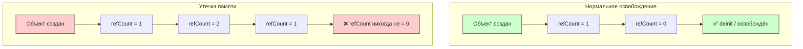

#memory #leak #retain-cycle #weak #unowned #arc #performance #debugging

---
### Определение

**Утечка памяти (Memory Leak)** — ситуация, когда объект остаётся в памяти, хотя больше **не нужен** и на него **нет активных ссылок**, которые могли бы его использовать. В результате приложение постепенно потребляет всё больше памяти → замедление → краш (jetsam) или memory pressure.



---

### Основные причины утечек в [[Swift]] (2026)

| Причина                                    | Как возникает                                     | Как проявляется                     | Частота в iOS-приложениях |
| ------------------------------------------ | ------------------------------------------------- | ----------------------------------- | ------------------------- |
| **Цикл сильных ссылок ([[retain cycle]])** | Два+ объекта сильно ссылаются друг на друга       | [[retain count]] никогда не = 0     | ★★★★★ (самая частая)      |
| **Замыкание захватывает [[self]] сильно**  | `{ self.doSomething() }` без `[weak self]`        | Контроллер/объект живёт вечно       | ★★★★☆                     |
| **Делегат / datasource сильный**           | `delegate` или `dataSource` — strong по умолчанию | Контроллер не умирает после dismiss | ★★★☆☆                     |
| **NS[[NotificationCenter]] без remove**    | Не отписались в `deinit`                          | Объект продолжает получать события  | ★★☆☆☆                     |
| **[[Timer]] / [[CADisplayLink]] сильный**  | `timer = Timer.scheduledTimer…` без `[weak self]` | Таймер держит объект вечно          | ★★☆☆☆                     |
| **Статические / глобальные ссылки**        | `static var cache = MyObject()`                   | Объект живёт до конца приложения    | ★☆☆☆☆                     |

---

### 1. Цикл сильных ссылок (retain cycle)

```swift
class Parent {
    var child: Child?
    deinit { print("Parent deinit") }
}

class Child {
    var parent: Parent?  // ← сильная ссылка на Parent
    deinit { print("Child deinit") }
}

var parent: Parent? = Parent()
var child: Child? = Child()

parent?.child = child
child?.parent = parent

parent = nil
child = nil
// ❌ deinit не вызывается — утечка!
```

**Исправление:**
```swift
class Child {
    weak var parent: Parent?  // ← слабая ссылка
    deinit { print("Child deinit") }
}
```

---

### 2. Замыкание захватывает self сильно

```swift
class ViewController: UIViewController {
    var onButtonTap: (() -> Void)?
    
    override func viewDidLoad() {
        super.viewDidLoad()
        
        // ❌ Опасно! Замыкание сильно захватывает self
        onButtonTap = {
            self.doSomething()
        }
    }
    
    func doSomething() { }
    deinit { print("ViewController deinit") }
}
// Контроллер никогда не освободится!
```

**Исправление:**
```swift
onButtonTap = { [weak self] in
    self?.doSomething()
}

// или с guard
onButtonTap = { [weak self] in
    guard let self = self else { return }
    self.doSomething()
}
```

---

### 3. Сильный делегат / datasource

```swift
// ❌ Плохо: сильный делегат
class DataLoader {
    var delegate: DataLoaderDelegate?  // strong по умолчанию
}

class ViewController: UIViewController, DataLoaderDelegate {
    let loader = DataLoader()
    
    override func viewDidLoad() {
        super.viewDidLoad()
        loader.delegate = self  // retain cycle!
    }
}
```

**Исправление:**
```swift
protocol DataLoaderDelegate: AnyObject {
    func didLoadData()
}

class DataLoader {
    weak var delegate: DataLoaderDelegate?  // weak
}
```

---

### 4. NSNotificationCenter без removeObserver

```swift
class ViewController: UIViewController {
    override func viewDidLoad() {
        super.viewDidLoad()
        
        // ❌ Подписка без отписки
        NotificationCenter.default.addObserver(
            self,
            selector: #selector(handleNotification),
            name: .someNotification,
            object: nil
        )
    }
    
    @objc func handleNotification() { }
    
    // ❌ Нет deinit с removeObserver → утечка
}
```

**Исправление:**
```swift
deinit {
    NotificationCenter.default.removeObserver(self)
}

// Или с блоком (без removeObserver)
var observer: NSObjectProtocol?
observer = NotificationCenter.default.addObserver(
    forName: .someNotification,
    object: nil,
    queue: .main
) { [weak self] _ in
    self?.handleNotification()
}

deinit {
    if let observer = observer {
        NotificationCenter.default.removeObserver(observer)
    }
}
```

---

### 5. Timer / CADisplayLink 

```swift
class ViewController: UIViewController {
    var timer: Timer?
    
    override func viewDidLoad() {
        super.viewDidLoad()
        
        // ❌ Таймер сильно держит self
        timer = Timer.scheduledTimer(withTimeInterval: 1.0, repeats: true) { timer in
            self.updateUI()
        }
    }
    
    func updateUI() { }
    
    // ❌ Нет invalidate → утечка
}
```

**Исправление:**
```swift
timer = Timer.scheduledTimer(withTimeInterval: 1.0, repeats: true) { [weak self] _ in
    self?.updateUI()
}

deinit {
    timer?.invalidate()
}
```

---

### Как обнаружить утечки (основные инструменты)

| Инструмент                    | Что показывает                          | Когда использовать              | Как запускать                         |
| ----------------------------- | --------------------------------------- | ------------------------------- | ------------------------------------- |
| **Instruments → Leaks**       | Реальные утечки (объекты без ссылок)    | Всегда после тестирования       | Xcode → Product → Profile → Leaks     |
| **Instruments → Allocations** | Рост памяти + живые объекты             | Поиск пиков и утечек            | Allocations template                  |
| **Memory Graph Debugger**     | Циклы сильных ссылок (граф объектов)    | Когда подозреваешь retain cycle | Debug → Memory Graph (иконка в Xcode) |
| **Xcode → View Memory Graph** | То же, но в реальном времени            | Быстрая проверка контроллеров   | Debug navigator → Memory              |
| **MLeaksFinder** (сторонний)  | Автоматически ловит утечки контроллеров | Быстрый тест навигации          | [[CocoaPods]] / [[SPM]]               |

---

### Использование Memory Graph Debugger

1. Запустите приложение в [[Xcode]]
2. Перейдите на экран, который нужно проверить
3. Нажмите на кнопку **Debug Memory Graph** (иконка с тремя квадратами)
4. В левой панели найдите объект, который должен был освободиться
5. Выберите его → справа увидите граф ссылок
6. Красные связи — retain cycles

```swift
// Хорошая практика: проверка deinit
class MyViewController: UIViewController {
    deinit {
        print("🗑 \(type(of: self)) deinitialized")
    }
}
```

---

### Как предотвратить утечки (чек-лист 2026)

1. **Замыкания** — всегда `[weak self]` по умолчанию
```swift
someAsync { [weak self] in
    self?.updateUI()
}
```

2. **Делегаты / datasource / observers** — делай `weak`
```swift
weak var delegate: SomeDelegate?
NotificationCenter.default.removeObserver(self) в deinit
```

3. **Parent → Child** — сильная ссылка от родителя к ребёнку
   **Child → Parent** — weak или unowned
```swift
class Child {
    weak var parent: Parent?
}
```

4. **Timer / CADisplayLink / repeating closures**
   Всегда `[weak self]` или invalidate в deinit

5. **Статические / глобальные объекты**
   Используй `weak` или очищай вручную

6. **Проверяй в deinit**
```swift
deinit {
    print("🗑 \(type(of: self)) deinit")
}
```
Если `deinit` не вызывается — почти всегда retain cycle.

---

### Типичные сценарии и их решения

| Сценарий                                              | Проблема                          | Решение                      |
| ----------------------------------------------------- | --------------------------------- | ---------------------------- |
| **Замыкание в свойстве класса**                       | `{ self.doSomething() }`          | `[weak self] in`             |
| **Два класса ссылаются друг на друга**                | `a.b = b; b.a = a`                | `weak` на одну из сторон     |
| **Таймер с повторением**                              | Таймер держит target              | `[weak self]` + `invalidate` |
| **[[NotificationCenter]]**                            | Объект не отписался               | `removeObserver` в `deinit`  |
| **[[UIView]] с блоком анимации**                      | Обычно безопасно (не сохраняется) | Но `[weak self]` не помешает |
| **[[DispatchQueue]].[[async]] после закрытия экрана** | Замыкание держит контроллер       | `[weak self]`                |

---

### Короткий чек-лист перед релизом

- [ ] Все замыкания внутри классов → `[weak self]` или `[unowned self]`
- [ ] Все делегаты / datasource → `weak`
- [ ] Все NotificationCenter observers → remove в `deinit`
- [ ] Все таймеры / display link → invalidate в `deinit`
- [ ] Прогоняй **Memory Graph Debugger** после навигации по экранам
- [ ] Запусти **Leaks** в Instruments на 10–15 минут активного использования
- [ ] Добавь `deinit` с логами в сложные классы

---

### Золотое правило Swift 2026

> «Если объект живёт дольше, чем должен — 99% случаев это retain cycle через замыкание или делегат.  
> Пиши `[weak self]` по умолчанию — это бесплатно и спасает от 95% утечек.»

---

### Итог

**Утечка памяти** — одна из самых частых проблем в iOS-приложениях:

| Причина                | Решение                     |
| ---------------------- | --------------------------- |
| **Retain cycle**       | [[weak]] / [[unowned]]      |
| **Замыкание**          | `[weak self]`               |
| **Делегат**            | `weak var delegate`         |
| **NotificationCenter** | `removeObserver` в `deinit` |
| **Timer**              | `invalidate` в `deinit`     |

**Лучшая защита:**
- `[weak self]` по умолчанию во всех замыканиях
- `weak` для всех делегатов
- `deinit` с логами для отладки
- Регулярный прогон Memory Graph Debugger и Instruments Leaks

Понимание утечек памяти — обязательный навык для каждого iOS-разработчика.