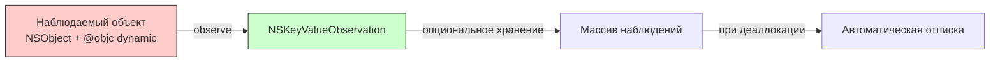
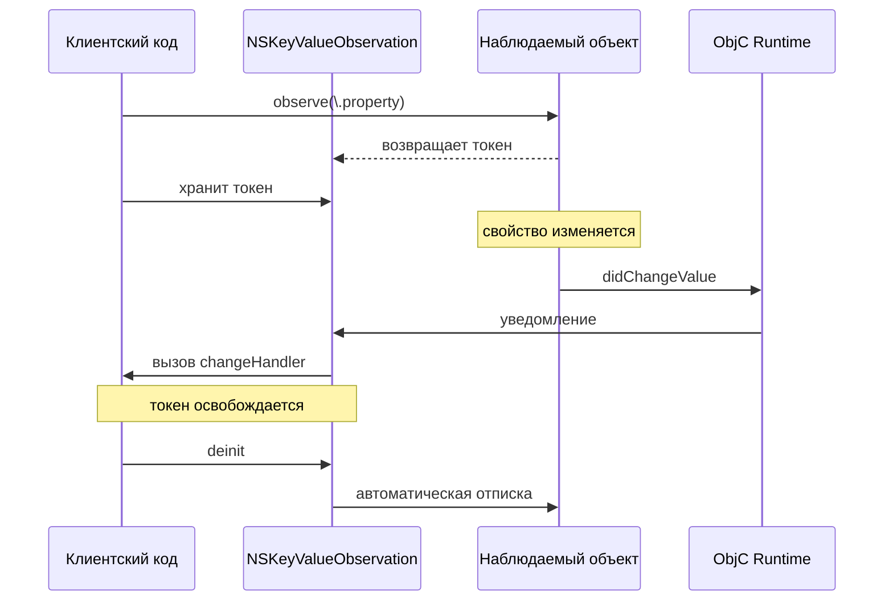

#objc #kvo #key-value-observing #nskeyvalueobservation #swift #memory-management

---
### Определение

**`NSKeyValueObservation`** — это объект-токен, который представляет собой **подписку на наблюдение за свойством** в [[KVO]] (Key-Value Observing). Он возвращается при вызове метода `observe(_:options:changeHandler:)` и управляет жизненным циклом наблюдения.

Главная особенность: **токен автоматически отписывается** от наблюдения при своей деаллокации. Это делает наблюдение безопасным и удобным — не нужно вручную вызывать `removeObserver`.

```swift
let observation = object.observe(\.property, options: [.new]) { object, change in
    print("Property changed: \(change.newValue ?? "nil")")
}
// observation хранит подписку, при освобождении observation → автоматическая отписка
```

---

### Зачем это знать iOS-разработчику?

| Сценарий                          | Применение                                                      |
| --------------------------------- | --------------------------------------------------------------- |
| **Безопасное наблюдение**         | Автоматическая отписка при освобождении токена                  |
| **Современный [[Swift]] [[API]]** | Замена устаревшего `addObserver`/`removeObserver`               |
| **[[UIKit]] интеграция**          | Наблюдение за свойствами [[UIView]], [[UIViewController]] и др. |
| **[[Combine]] мост**              | Преобразование KVO в Combine Publisher                          |
| **Legacy код**                    | Понимание старого и нового стиля KVO                            |

---

### Как это работает





---

### Создание наблюдения

#### 1. **Базовое создание**

```swift
import Foundation

class Person: NSObject {
    @objc dynamic var name: String = ""
    @objc dynamic var age: Int = 0
}

let person = Person()

// Создание наблюдения (токен)
let observation = person.observe(\.name, options: [.new, .old]) { person, change in
    print("Name changed from \(change.oldValue ?? "nil") to \(change.newValue ?? "nil")")
}

person.name = "Alice"  // → Name changed from nil to Alice
```

#### 2. **Наблюдение с опциями**

```swift
// Только новое значение
let observation1 = person.observe(\.age, options: [.new]) { _, change in
    print("New age: \(change.newValue ?? 0)")
}

// С начальным значением
let observation2 = person.observe(\.age, options: [.initial, .new]) { _, change in
    print("Age: \(change.newValue ?? 0)")  // Вызовется сразу с текущим значением
}

// Старое и новое
let observation3 = person.observe(\.name, options: [.old, .new]) { _, change in
    print("Old: \(change.oldValue ?? ""), New: \(change.newValue ?? "")")
}
```

---

### Хранение наблюдений (важно!)

Токен **должен быть сохранён**, иначе наблюдение прекратится немедленно.

```swift
// ❌ Плохо: наблюдение будет сразу отменено
person.observe(\.name, options: [.new]) { _, _ in
    print("Name changed")
}

// ✅ Хорошо: храним токен
let observation = person.observe(\.name, options: [.new]) { _, _ in
    print("Name changed")
}
// Пока observation в памяти, наблюдение активно
```

#### Паттерн хранения нескольких наблюдений

```swift
class ViewController: UIViewController {
    // Массив для хранения всех наблюдений
    private var observations: [NSKeyValueObservation] = []
    
    private let person = Person()
    
    override func viewDidLoad() {
        super.viewDidLoad()
        
        observations.append(
            person.observe(\.name, options: [.new]) { [weak self] _, change in
                self?.updateNameLabel(change.newValue ?? "")
            }
        )
        
        observations.append(
            person.observe(\.age, options: [.new]) { [weak self] _, change in
                self?.updateAgeLabel(change.newValue ?? 0)
            }
        )
    }
    
    // При освобождении контроллера все наблюдения автоматически отпишутся
}
```

---

### Управление жизненным циклом

#### Автоматическая отписка (деинициализация токена)

```swift
class Observer {
    var observation: NSKeyValueObservation?
    
    func startObserving(person: Person) {
        observation = person.observe(\.name, options: [.new]) { _, change in
            print("Name: \(change.newValue ?? "")")
        }
    }
}

var observer: Observer? = Observer()
observer?.startObserving(person: person)
// Наблюдение активно

observer = nil
// observation деинициализируется → автоматическая отписка
```

#### Ручная отписка

```swift
observation.invalidate()  // Немедленная отписка
observation = nil         // То же самое, через деинициализатор
```

---

### Работа с change handler

#### Тип change: `NSKeyValueObservedChange<Value>`

```swift
let observation = person.observe(\.name, options: [.old, .new, .prior]) { _, change in
    // Свойства change
    print(change.oldValue)     // Старое значение (опциональное)
    print(change.newValue)     // Новое значение (опциональное)
    print(change.isPrior)      // true — вызов до изменения (willChange)
    print(change.kind)         // .setting, .insertion, .removal и т.д.
    
    // Для коллекций доступны indexes
    // change.indexes
}
```

#### Пример с isPrior

```swift
let observation = person.observe(\.name, options: [.old, .new, .prior]) { _, change in
    if change.isPrior {
        print("Will change from \(change.oldValue ?? "nil")")
    } else {
        print("Did change to \(change.newValue ?? "nil")")
    }
}

person.name = "Alice"
// Will change from nil
// Did change to Alice
```

---

### Обработка ошибок (свойства без KVO)

Если свойство не поддерживает KVO, компилятор выдаст ошибку:

```swift
class Person: NSObject {
    // ❌ Без @objc dynamic — не поддерживает KVO
    var name: String = ""
}

let person = Person()
// Ошибка: Key path 'name' cannot be observed because 'name' is not @objc dynamic
let observation = person.observe(\.name, options: [.new]) { _, _ in }
```

---

### NSKeyValueObservation и [[Combine]]

Преобразование KVO в Combine Publisher:

```swift
import Combine

extension NSObject {
    func publisher<T>(for keyPath: KeyPath<Self, T>) -> AnyPublisher<T, Never> where T: Sendable {
        return Future { promise in
            let observation = self.observe(keyPath, options: [.new]) { _, change in
                if let value = change.newValue {
                    promise(.success(value))
                }
            }
            observation.invalidate()
        }
        .eraseToAnyPublisher()
    }
}

// Использование
let person = Person()
person.publisher(for: \.name)
    .sink { name in
        print("Name from Combine: \(name)")
    }
```

Или стандартный `.publisher` (iOS 13+):

```swift
import Combine

let observation = person.publisher(for: \.name)
    .sink { name in
        print("Name: \(name)")
    }
```

---

### KVO и [[SwiftUI]]

В SwiftUI KVO используется редко, но может быть полезен для интеграции с [[UIKit]]:

```swift
import SwiftUI

struct ContentView: View {
    @State private var text = ""
    
    var body: some View {
        Text(text)
            .onAppear {
                let person = Person()
                let observation = person.observe(\.name, options: [.new]) { _, change in
                    DispatchQueue.main.async {
                        text = change.newValue ?? ""
                    }
                }
                // Сохраните observation в State или в координаторе
            }
    }
}
```

---

### NSKeyValueObservation vs старая модель

| Характеристика | Старая модель (`addObserver`) | Новая модель (`NSKeyValueObservation`) |
|---|---|---|
| **Отписка** | Ручная (`removeObserver`) | Автоматическая (при деаллокации токена) |
| **Типобезопасность** | ❌ Нет (строковые ключи) | ✅ Да (KeyPath) |
| **Замыкание** | ❌ Нет (только отдельный метод) | ✅ Да |
| **Несколько наблюдателей** | Сложно управлять | Просто (массив токенов) |
| **Утечки памяти** | Часто | Редко |
| **Рекомендация** | ❌ Не использовать | ✅ Использовать |

---

### Лучшие практики

| Рекомендация                               | Почему                               |
| ------------------------------------------ | ------------------------------------ |
| **Всегда храните токен**                   | Иначе наблюдение прекратится         |
| **Используйте `[weak self]` в замыканиях** | Предотвращает [[retain cycle]]s      |
| **Группируйте наблюдения в массиве**       | Упрощает управление жизненным циклом |
| **Не вызывайте `invalidate()` в `deinit`** | Токен сам отпишется                  |
| **Используйте Combine для новых проектов** | Более современно и безопасно         |

```swift
// ✅ Правильно: хранение в массиве
class ViewController: UIViewController {
    private var observations: [NSKeyValueObservation] = []
    
    override func viewDidLoad() {
        super.viewDidLoad()
        observations.append(label.observe(\.text, options: [.new]) { [weak self] _, change in
            self?.updateUI()
        })
    }
}

// ❌ Неправильно: без хранения
func setupObservation() {
    // Наблюдение умрёт при выходе из функции
    label.observe(\.text, options: [.new]) { _, _ in }
}
```

---

### Короткий итог

| Характеристика | Значение |
|---|---|
| **Назначение** | Представление подписки на KVO-наблюдение |
| **Управление памятью** | Автоматическая отписка при деаллокации |
| **Создание** | `object.observe(\.property, options:handler:)` |
| **Обязательное хранение** | Да (иначе наблюдение прекратится) |
| **Альтернативы** | Combine (`@Published`), SwiftUI, Swift Observation |

**Главное правило:**
> `NSKeyValueObservation` — это современный, типобезопасный и безопасный способ работы с KVO в Swift. Всегда используйте его вместо устаревшего `addObserver`/`removeObserver`. Храните токены в массиве или отдельных свойствах — токен сам управляет отпиской при своей деаллокации.