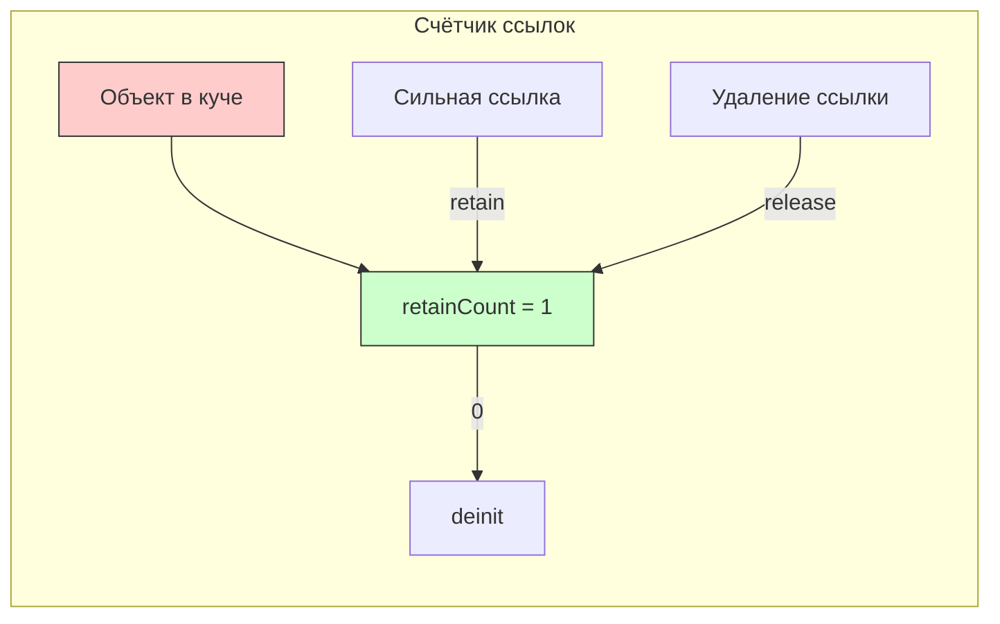

#memory #reference-counting #arc #retain-count #swift #ios #memory-management

---
### Определение

**Счётчик ссылок (Reference Counting)** — это механизм управления памятью, который отслеживает, сколько **сильных ссылок** (strong references) указывает на объект. Когда счётчик достигает **0**, объект автоматически освобождается из памяти.

Swift использует **автоматический счётчик ссылок** — **[[ARC]] (Automatic Reference Counting)**. ARC полностью **детерминирован**, работает на этапе компиляции и **не имеет** сборщика мусора (GC), как Java, C# или Go.



---

### Как работает счётчик ссылок (пошагово)

| Действие | retain count | Результат |
|---|---|---|
| Создание объекта | 0 → 1 | Память выделена, объект жив |
| Добавление сильной ссылки | +1 | Новый владелец |
| Удаление сильной ссылки | -1 | Один владелец ушёл |
| retain count становится 0 | → deinit | Объект освобождён |

```swift
class User {
    let name: String
    init(name: String) { self.name = name }
    deinit { print("\(name) уничтожен") }
}

var user: User? = User(name: "Анна")   // RC = 1
var copy = user                        // RC = 2
user = nil                             // RC = 1
copy = nil                             // RC = 0 → deinit → "Анна уничтожен"
```

---

### Как проверить счётчик ссылок (только для отладки!)

```swift
import Foundation

class MyClass {}
let obj = MyClass()
let count = CFGetRetainCount(obj)
print("Retain count: \(count)")  // ⚠️ Только для отладки! Не использовать в production!
```

> **Важно:** `CFGetRetainCount` учитывает внутренние оптимизации ARC и может возвращать неожиданные значения. Используйте только для отладки, никогда в production-коде.

---

### Три вида ссылок в ARC

| Вид ссылки      | Синтаксис                        | Влияет на retain count? | Зануляется при dealloc? | Когда использовать                              |
| --------------- | -------------------------------- | ----------------------- | ----------------------- | ----------------------------------------------- |
| **[[strong]]**  | [[var]] / [[let]] (по умолчанию) | Да                      | Нет                     | Обычные свойства, владение объектом             |
| **[[weak]]**    | `weak var`                       | Нет                     | Да (становится [[nil]]) | Разрыв цикла, делегаты, datasource              |
| **[[unowned]]** | `unowned let/var`                | Нет                     | Нет                     | Когда объект гарантированно живёт дольше ссылки |

#### Пример strong
```swift
class Owner {
    var pet: Pet?  // strong — увеличивает RC
}
```

#### Пример weak
```swift
class Pet {
    weak var owner: Owner?  // не увеличивает RC, автоматически станет nil
}
```

#### Пример unowned
```swift
class Pet {
    unowned let owner: Owner  // не увеличивает RC, но не Optional
    init(owner: Owner) {
        self.owner = owner
    }
}
```

---

### Самая частая причина утечек — цикл сильных ссылок

```swift
class Parent {
    var child: Child?
    deinit { print("Parent deinit") }
}

class Child {
    var parent: Parent?          // ← сильная ссылка → цикл!
    deinit { print("Child deinit") }
}

let p = Parent()
let c = Child()
p.child = c
c.parent = p
// p и c никогда не освободятся → retain count никогда не станет 0 → утечка памяти
```

#### Как избежать цикла: weak

```swift
class Child {
    weak var parent: Parent?     // слабая ссылка — цикл разорван
}
```

#### Как избежать цикла: unowned (если точно уверены)

```swift
class Child {
    unowned let parent: Parent   // не увеличивает RC, но крашнет при обращении к мёртвому
    init(parent: Parent) {
        self.parent = parent
    }
}
```

---

### Счётчик ссылок и замыкания

Замыкания захватывают переменные сильно по умолчанию:

```swift
class ViewController {
    var onTap: (() -> Void)?
    
    func setup() {
        // ❌ Замыкание сильно захватывает self → retain cycle
        onTap = {
            self.doSomething()
        }
    }
    
    func doSomething() { }
}
```

**Исправление:**
```swift
onTap = { [weak self] in
    self?.doSomething()
}
```

---

### Счётчик ссылок и таймеры

```swift
class TimerController {
    var timer: Timer?
    
    func start() {
        // ❌ Таймер сильно держит self
        timer = Timer.scheduledTimer(withTimeInterval: 1, repeats: true) { _ in
            self.tick()
        }
    }
    
    func tick() { }
}
```

**Исправление:**
```swift
timer = Timer.scheduledTimer(withTimeInterval: 1, repeats: true) { [weak self] _ in
    self?.tick()
}
```

---

### Ключевые факты ARC (2026)

| Факт                                       | Пояснение                                                                                       |
| ------------------------------------------ | ----------------------------------------------------------------------------------------------- |
| **Работает только с [[reference type]]s**  | [[class]], замыкания, [[Objective-C]] объекты                                                   |
| **Value types не используют ARC**          | [[struct]], [[enum]], [[Array]], [[Dictionary]], [[String]] — используют [[Copy-On-Write\|COW]] |
| **[[deinit]] вызывается детерминированно** | Сразу после того, как retain count = 0                                                          |
| **Нет GC (Garbage Collector)**             | Нет пауз, нет поиска живых объектов                                                             |
| **ARC не разрывает циклы автоматически**   | Ответственность разработчика                                                                    |
| **`weak` безопаснее `unowned`**            | `unowned` может вызвать crash                                                                   |

---

### Что НЕ использует счётчик ссылок ([[Value Type]]s)

```swift
struct Point {
    var x, y: Int
}

var p1 = Point(x: 1, y: 2)
var p2 = p1  // копия, не retain/release

enum Status {
    case active, inactive
}

var s1 = Status.active
var s2 = s1  // копия, не retain/release
```

---

### Инструменты для отладки счётчика ссылок

| Инструмент                    | Назначение                                   |
| ----------------------------- | -------------------------------------------- |
| **Memory Graph Debugger**     | Визуализация ссылок, поиск [[retain cycle]]s |
| **Instruments → Leaks**       | Обнаружение утечек памяти                    |
| **Instruments → Allocations** | Отслеживание роста памяти                    |
| **[[CFGetRetainCount]]**      | Только для отладки (не в production!)        |
| **Логи в `deinit`**           | Проверка, вызывается ли деинициализатор      |

```swift
class Debuggable {
    deinit {
        print("✅ \(self) deinitialized")
    }
}
```

---

### Короткий чек-лист (чтобы не было утечек)

- [ ] В замыканиях внутри классов → **всегда** `[weak self]` (по умолчанию)
- [ ] Делегаты, datasource, observers → **всегда** `weak var`
- [ ] Таймеры, CADisplayLink, Notification → `invalidate` / `removeObserver` в `deinit`
- [ ] `deinit` с логом → проверяй, вызывается ли он
- [ ] Используй **Memory Graph Debugger** и **Instruments → Leaks** после навигации по экранам
- [ ] `unowned` — только если ты **точно** знаешь, что объект не умрёт раньше

---

### Золотое правило Swift

> **«Внутри класса, в замыканиях и при ссылках на владельца — пиши `[weak self]` или `weak var`.  
> `unowned` — только если ты **точно** знаешь, что объект не умрёт раньше.»**

---

### Итог

**Счётчик ссылок (Reference Counting)** — это детерминированный механизм управления памятью, используемый Swift через ARC:

| Характеристика | Значение |
|---|---|
| **Управление** | Автоматическое (ARC на этапе компиляции) |
| **Работает с** | Class, замыкания, NSObject |
| **Не работает с** | Struct, enum, Array, Dictionary, String |
| **Когда объект удаляется** | Когда retain count = 0 |
| **Главная проблема** | Retain cycles (циклы сильных ссылок) |
| **Решение** | `weak` / `unowned` |

Понимание счётчика ссылок необходимо для предотвращения утечек памяти и написания надёжного Swift-кода.