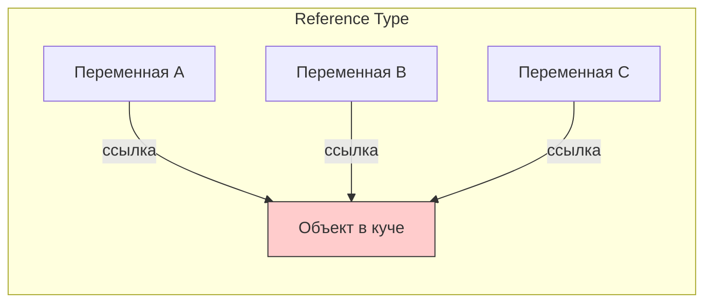
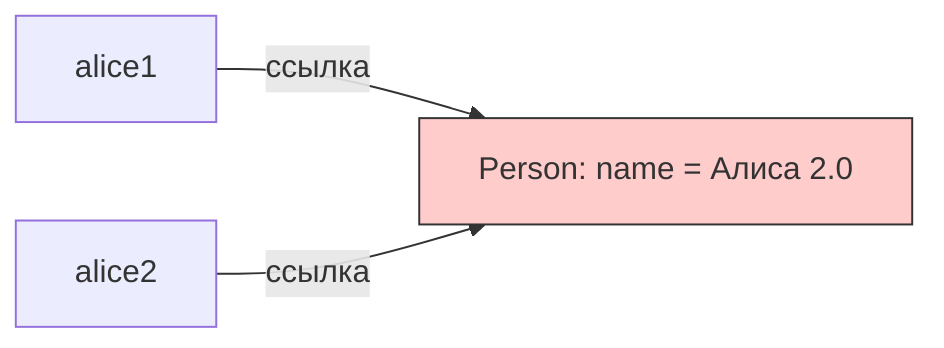

#swift #reference-type #class #memory #arc #ios #value-type

---

### Определение

**Ссылочный тип (Reference Type)** — это тип данных, экземпляры которого передаются **по ссылке**, а не по значению. При присваивании или передаче в функцию копируется **указатель** на объект в памяти, а не сами данные. Все переменные, указывающие на один объект, разделяют его состояние.



---

### Основные ссылочные типы в Swift

| Тип данных                  | Является ссылочным? | Хранится в памяти | Управление памятью | Пример                    |
| --------------------------- | ------------------- | ----------------- | ------------------ | ------------------------- |
| **[[class]]**               | Да                  | Куча ([[Heap]])   | [[ARC]]            | `class Person {}`         |
| **[[actor]]**               | Да                  | Куча              | ARC                | `actor Counter {}`        |
| **Замыкания ([[closure]])** | Да                  | Куча              | ARC                | `{ [weak self] in … }`    |
| **[[AnyObject]]**           | Да                  | Куча              | ARC                | протоколы с `AnyObject`   |
| **[[NSObject]]-подклассы**  | Да                  | Куча              | ARC                | `class MyView: UIView {}` |

---

### Ключевые свойства ссылочных типов

| Свойство                        | Описание                                                         |
| ------------------------------- | ---------------------------------------------------------------- |
| **Общая идентичность**          | Несколько переменных могут указывать на **один и тот же** объект |
| **Изменение через одну ссылку** | Видно через все остальные ссылки                                 |
| **Сравнение по идентичности**   | Оператор `===` (не `==`)                                         |
| **Управление памятью**          | Через **ARC** (счётчик ссылок)                                   |
| **Наследование**                | Поддерживается (классы)                                          |
| **[[deinit]]**                  | Есть (классы и actor)                                            |
| **[[weak]] / [[unowned]]**      | Поддерживается                                                   |
| **Потенциальные проблемы**      | [[Retain cycle]]s, [[data race]]s                                |

---

### Пример поведения

```swift
class Person {
    var name: String
    init(name: String) { self.name = name }
}

var alice1 = Person(name: "Алиса")
var alice2 = alice1           // копируется ссылка (не данные!)
alice2.name = "Алиса 2.0"

print(alice1.name)            // "Алиса 2.0"
print(alice2 === alice1)      // true — одна и та же сущность
```



---

### Reference Type vs Value Type

| Характеристика                 | Reference Type (class)             | Value Type (struct, enum)        |
| ------------------------------ | ---------------------------------- | -------------------------------- |
| **Присваивание / передача**    | Копируется ссылка                  | Копируется значение              |
| **Изменение одной переменной** | Влияет на все ссылки               | Не влияет на другие копии        |
| **Сравнение**                  | `===` (по идентичности)            | `==` (по значению)               |
| **Наследование**               | Да                                 | Нет                              |
| **deinit**                     | Есть                               | Нет                              |
| **weak / unowned**             | Поддерживается                     | Не поддерживается                |
| **Циклы ссылок**               | Возможны → утечки                  | Невозможны                       |
| **Производительность**         | Доступ через указатель (медленнее) | Часто быстрее (стек, [[inline]]) |
| **Хранение**                   | Всегда куча (heap)                 | Стек (или inline в куче)         |

---

### Class — основной ссылочный тип

```swift
class User {
    let id: UUID
    var name: String
    var email: String
    
    init(id: UUID, name: String, email: String) {
        self.id = id
        self.name = name
        self.email = email
    }
    
    deinit {
        print("User \(name) deallocated")
    }
}

let user1 = User(id: UUID(), name: "Alice", email: "alice@example.com")
let user2 = user1  // ссылка на тот же объект

user2.name = "Bob"
print(user1.name)  // "Bob" — изменилось!
```

---

### Actor — ссылочный тип для безопасной многопоточности

```swift
actor Counter {
    private var value = 0
    
    func increment() {
        value += 1  // безопасно внутри actor
    }
    
    func getValue() -> Int {
        return value
    }
}

let counter = Counter()

Task {
    await counter.increment()
    let value = await counter.getValue()
    print(value)  // 1
}
```

---

### Замыкания — ссылочный тип

```swift
func makeCounter() -> () -> Int {
    var count = 0
    return {
        count += 1
        return count
    }
}

let counter1 = makeCounter()
let counter2 = counter1  // counter2 — ссылка на то же замыкание

print(counter1())  // 1
print(counter2())  // 2 (общее состояние!)
```

---

### Сравнение ссылок: === vs ==

```swift
class Person {
    var name: String
    init(name: String) { self.name = name }
}

let p1 = Person(name: "Alice")
let p2 = Person(name: "Alice")
let p3 = p1

print(p1 == p2)  // false — нужно реализовать Equatable
print(p1 === p2) // false — разные объекты
print(p1 === p3) // true  — один и тот же объект
```

---

### Reference Type и управление памятью (ARC)

```swift
class MyClass {
    let id: Int
    init(id: Int) { self.id = id }
    deinit { print("MyClass \(id) deallocated") }
}

var obj1: MyClass? = MyClass(id: 1)  // retain count = 1
var obj2 = obj1                       // retain count = 2
obj1 = nil                            // retain count = 1
obj2 = nil                            // retain count = 0 → deinit
```

---

### Реальные сценарии в iOS (2026)

| Сценарий                                 | Использовать reference type?      | Почему                           |
| ---------------------------------------- | --------------------------------- | -------------------------------- |
| **[[UIViewController]]**                 | ✅ Да                              | [[UIKit]] требует class          |
| **[[UIView]]**                           | ✅ Да                              | UIKit требует class              |
| **Сервис (NetworkService, UserManager)** | ✅ Да                              | Один экземпляр на всё приложение |
| **Делегат**                              | ✅ Да                              | Для обратных вызовов (но `weak`) |
| **Shared state (кеш, настройки)**        | ✅ Да                              | Один источник истины             |
| **Модель данных**                        | ❌ Нет — [[struct]]                | Безопаснее, легче                |
| **Конфигурация**                         | ❌ Нет — struct                    | Immutable                        |
| **Передача между задачами**              | ⚠️ Осторожно — actor или Sendable | Иначе data races                 |

---

### Проблемы ссылочных типов и их решения

| Проблема                            | Решение                                      |
| ----------------------------------- | -------------------------------------------- |
| **Retain cycle (утечка памяти)**    | `weak`, `unowned`, `[weak self]`             |
| **Data race (многопоточность)**     | [[actor]], [[@MainActor]], [[Sendable]]      |
| **Неожиданное изменение состояния** | Перейти на [[struct]] (value semantics)      |
| **Сложность тестирования**          | Использовать dependency injection, протоколы |

---

### Когда использовать Reference Type

| Сценарий | Использовать? |
|---|---|
| **Нужна общая изменяемая сущность** | ✅ Да |
| **Необходимо наследование** | ✅ Да |
| **Требуется deinit** | ✅ Да |
| **Идентичность объекта важна** | ✅ Да |
| **UI компоненты (UIKit)** | ✅ Да |
| **Сервисы и менеджеры** | ✅ Да |
| **Модели данных** | ❌ Используй struct |
| **Конфигурации** | ❌ Используй struct |

---

### Лучшие практики

1. **Используй `final` для классов, которые не предназначены для наследования**
```swift
final class Service { ... }
```

2. **Делегаты всегда `weak`**
```swift
weak var delegate: MyDelegate?
```

3. **В замыканиях всегда `[weak self]`**
```swift
someAsync { [weak self] in
    self?.update()
}
```

4. **Для shared mutable state используй `actor`**
```swift
actor Cache { ... }
```

5. **Документируй reference semantics**
```swift
/// Внимание: это класс (reference semantics) — изменения через одну ссылку видны всем.
class SharedData { ... }
```

---

### Короткий итог

- **Reference Type** = [[class]], [[actor]], замыкания → общая сущность в памяти
- **Value Type** = [[struct]], [[enum]], [[tuple]] → независимые копии
- **Правило Apple**: используй struct по умолчанию. class — только если нужна общая идентичность, наследование или [[deinit]]

**Главный совет**:
> «Если изменение через одну переменную должно влиять на другие — используй `class`.  
> Если каждая копия должна быть независимой — используй `struct`.  
> Для многопоточного shared state — используй `actor`.»