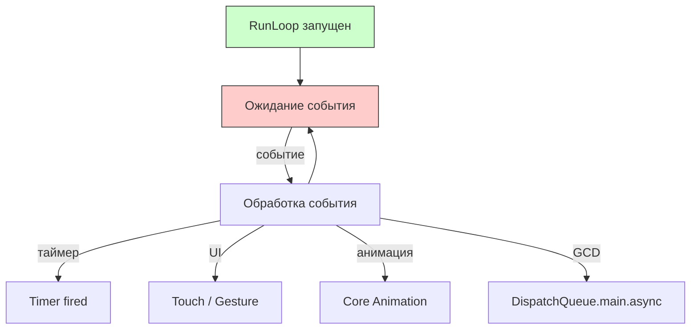
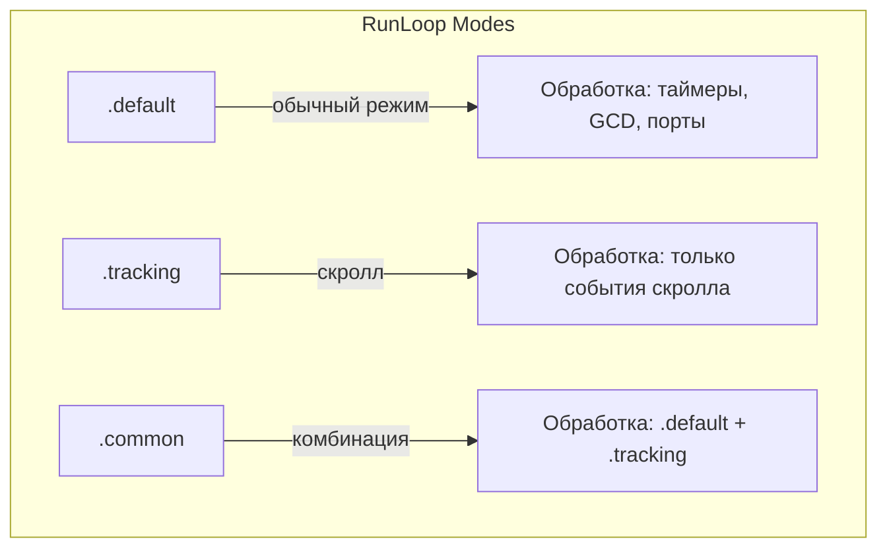
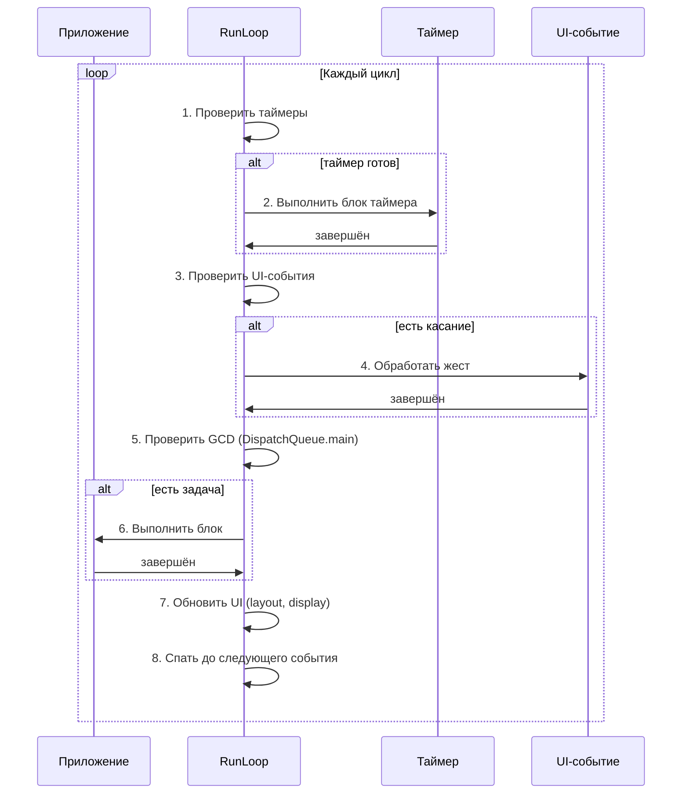

#runloop #ios #multithreading #timer #events #performance #swift

---
### Определение

**RunLoop** — это **цикл обработки событий** (event loop), который лежит в основе практически всей асинхронной и событийной модели [[iOS]]/macOS. Это инфраструктурный механизм, который постоянно работает в фоне, ожидая события (таймер, нажатие, сетевой ответ), и когда событие происходит — обрабатывает его, а затем снова переходит в ожидание.

Каждый поток ([[thread]]) в приложении имеет **свой собственный** RunLoop, но самый важный — **RunLoop главного потока** (main run loop). Именно он отвечает за:

- обработку **всех UI-событий** (касания, жесты, клавиатура, ротация экрана)
- запуск **анимаций** ([[Core Animation]])
- срабатывание **таймеров** (Timer, [[CADisplayLink]])
- выполнение `DispatchQueue.main.async`
- работу **авто-обновления** UI (layout, draw)

Без активного RunLoop главного потока приложение **замрёт**: экран не будет обновляться, кнопки не будут реагировать, анимации остановятся.



---

### Главные факты о RunLoop (2025–2026 актуально)

| Факт | Подробности | Почему важно знать |
|---|---|---|
| **Каждый поток имеет свой RunLoop** | `RunLoop.current` — текущий поток, `RunLoop.main` — главный поток | Фоновые таймеры работают только если RunLoop запущен |
| **Главный RunLoop всегда запущен** | iOS автоматически запускает его при старте приложения | В обычном приложении не нужно запускать вручную |
| **RunLoop не работает в фоновых потоках** | Если создать `Thread` вручную — RunLoop нужно запускать явно (`run()`, `run(mode:before:)`) | Частая причина «таймер не срабатывает в фоне» |
| **RunLoop работает в режимах (modes)** | `.default`, `.common`, `.tracking`, `.eventTracking` и кастомные | Таймеры добавляют в конкретный mode |
| **RunLoop не бесконечный в фоне** | После `UIApplicationDidEnterBackground` главный RunLoop приостанавливается | Фоновые задачи — через Background Tasks или `beginBackgroundTask` |

---

### Основные режимы RunLoop (Modes)

RunLoop может работать в разных **режимах (modes)**. Каждый режим — это набор источников событий, которые активны в данный момент.



| Режим                                 | Когда активен                                                               | Что обрабатывает                                  | Самый частый сценарий использования  |
| ------------------------------------- | --------------------------------------------------------------------------- | ------------------------------------------------- | ------------------------------------ |
| **`.default`**                        | Обычное состояние приложения                                                | Всё, кроме трекинга (скролл)                      | Большинство таймеров и источников    |
| **`.common`** (iOS 10+)               | Объединяет `.default` + `.tracking` + другие моды                           | Таймеры, которые должны работать во время скролла | **Самый популярный** для UI-таймеров |
| **`.tracking`**                       | Когда пользователь скроллит ([[UIScrollView]], [[UICollectionView]] и т.д.) | Только события трекинга                           | Редко добавляют вручную              |
| **`.eventTracking`**                  | Обработка событий ввода (touch, mouse, keyboard)                            | Редко используется напрямую                       | —                                    |
| **`.modalPanel`** / **`.UITracking`** | Во время показа модальных окон, алертов                                     | —                                                 | —                                    |

**Самое частое правило 2026**:
> 99% всех таймеров в UI добавляют в **`.common`** режим, чтобы они продолжали тикать во время скролла.

```swift
// ✅ Правильно — таймер будет работать во время скролла
let timer = Timer(timeInterval: 1.0, repeats: true) { _ in
    print("Тик")
}
RunLoop.current.add(timer, forMode: .common)

// ⚠️ Осторожно — таймер остановится при скролле
Timer.scheduledTimer(withTimeInterval: 1.0, repeats: true) { _ in
    print("Тик")
}  // Добавляется в .default по умолчанию
```

---

### Как работает RunLoop



---

### Самые частые реальные сценарии использования RunLoop

#### Сценарий 1 — Таймер, который должен работать во время скролла

```swift
// ❌ НЕПРАВИЛЬНО (таймер остановится при скролле)
Timer.scheduledTimer(withTimeInterval: 1.0, repeats: true) { _ in
    updateProgress()
}

// ✅ ПРАВИЛЬНО (работает всегда)
let timer = Timer(timeInterval: 1.0, repeats: true) { _ in
    updateProgress()
}
RunLoop.current.add(timer, forMode: .common)
```

#### Сценарий 2 — Запуск RunLoop в фоновом потоке (очень важно!)

```swift
let backgroundQueue = DispatchQueue(label: "com.example.background", qos: .background)

// ❌ Таймер не сработает — RunLoop фонового потока не запущен
backgroundQueue.async {
    let timer = Timer.scheduledTimer(withTimeInterval: 1.0, repeats: true) { _ in
        print("Это не напечатается!")
    }
    // RunLoop.current не запущен → таймер не сработает
}

// ✅ Правильно — запускаем RunLoop вручную
backgroundQueue.async {
    let timer = Timer.scheduledTimer(withTimeInterval: 1.0, repeats: true) { _ in
        print("Таймер сработал в фоне!")
    }
    
    // Добавляем источник, чтобы RunLoop не завершился сразу
    RunLoop.current.add(timer, forMode: .default)
    
    // Запускаем цикл
    RunLoop.current.run()
}
```

#### Сценарий 3 — Выполнение кода после текущего RunLoop-цикла

```swift
// Аналог DispatchQueue.main.async, но точнее контролирует момент
RunLoop.main.perform {
    // Выполнится в следующем проходе RunLoop (после текущих событий)
    updateUIAfterCurrentEvents()
}
```

#### Сценарий 4 — Остановка таймеров при уходе в фон

```swift
class ViewController: UIViewController {
    var timer: Timer?
    
    override func viewDidLoad() {
        super.viewDidLoad()
        
        timer = Timer(timeInterval: 1.0, repeats: true) { _ in
            self.updateUI()
        }
        RunLoop.current.add(timer!, forMode: .common)
        
        NotificationCenter.default.addObserver(
            forName: UIApplication.didEnterBackgroundNotification,
            object: nil,
            queue: .main
        ) { [weak self] _ in
            // Таймеры остановятся автоматически, но если нужно — инвалидируем
            self?.timer?.invalidate()
        }
    }
}
```

---

### RunLoop и GCD

| Механизм | Взаимодействие с RunLoop |
|---|---|
| **DispatchQueue.main.async** | Добавляет задачу в RunLoop главного потока |
| **DispatchQueue.global().async** | Не использует RunLoop (работает через GCD) |
| **DispatchSource.timer** | Не требует RunLoop (работает через GCD) |
| **Timer** | Требует RunLoop для работы |

```swift
// GCD Timer (не требует RunLoop)
let timer = DispatchSource.makeTimerSource(queue: DispatchQueue.global())
timer.setEventHandler {
    print("GCD Timer fired")
}
timer.schedule(deadline: .now(), repeating: 1.0)
timer.resume()

// Timer Foundation (требует RunLoop)
let foundationTimer = Timer.scheduledTimer(withTimeInterval: 1.0, repeats: true) { _ in
    print("Foundation Timer fired")
}
```

---

### Лучшие практики работы с RunLoop в 2026 году

| Практика | Почему |
|---|---|
| **Никогда не блокируйте главный RunLoop** | Долгие вычисления → DispatchQueue.global() |
| **Добавляйте таймеры в `.common`** | Это стандарт для UI-таймеров |
| **Не создавайте бесконечные циклы в главном потоке** | `while true { runLoop.run() }` — это уже сделано системой |
| **Для фоновых потоков — явно запускайте `RunLoop.current.run()`** | И добавляйте хотя бы один источник (таймер, порт, observer) |
| **Для Swift Concurrency (async/await, actor) — RunLoop почти не нужен** | Используйте Task и MainActor |
| **Для SwiftUI — RunLoop скрыт под капотом** | Используйте `.onReceive`, `.task`, `.onAppear` |
| **Документируйте** | Пишите комментарий «RunLoop.current.add(timer, forMode: .common) — таймер продолжает работать во время скролла» |

---

### RunLoop и Swift Concurrency

Swift Concurrency (async/await, Task, Actor) значительно уменьшает необходимость прямого использования RunLoop:

```swift
// ✅ Вместо таймера с RunLoop
Task {
    while !Task.isCancelled {
        try await Task.sleep(for: .seconds(1))
        await MainActor.run {
            updateUI()
        }
    }
}

// ✅ Вместо RunLoop.main.perform
await MainActor.run {
    updateUIAfterCurrentEvents()
}

// ✅ Вместо фонового RunLoop
Task.detached(priority: .background) {
    while !Task.isCancelled {
        try await Task.sleep(for: .seconds(1))
        print("Background task")
    }
}
```

---

### Короткий итог 2026

> RunLoop — это **цикл обработки событий** каждого потока, который ждёт и выполняет таймеры, жесты, анимации, сетевые ответы и т.д.

В 2026 году:
- главный RunLoop **всегда запущен** и управляет UI
- таймеры для UI добавляют в **`.common`** режим
- фоновые потоки требуют явного запуска `RunLoop.current.run()`
- в современном коде (Swift Concurrency, SwiftUI) RunLoop используется редко — его заменили `Task`, `MainActor`, `.onReceive`

**Главное правило:**
> RunLoop — это **фундаментальный** механизм, который нужно понимать, чтобы не писать код, который «не срабатывает в фоне» или «тормозит при скролле». Но в новой разработке предпочитайте Swift Concurrency.