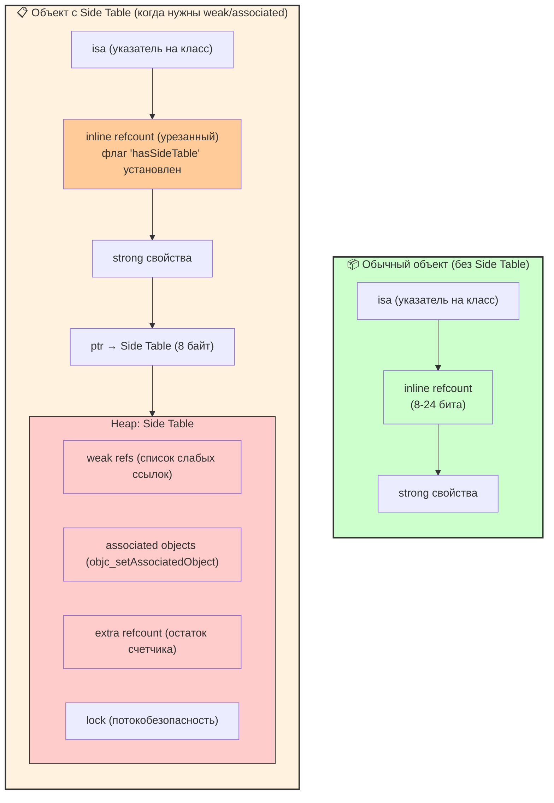
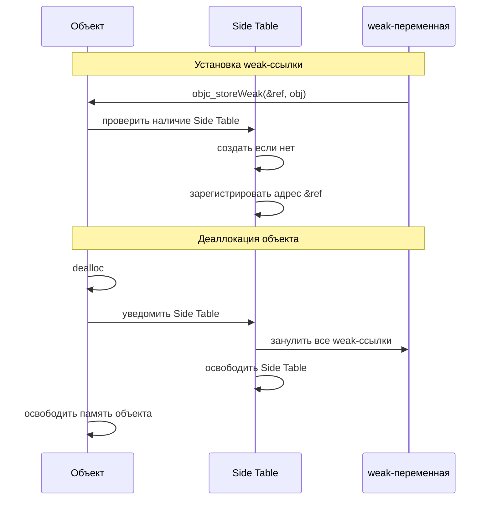

#memory #side-table #weak #objective-c #runtime #arc #ios

---

### Определение

**Side Table** — это **вспомогательная структура**, которую Objective-C [[Runtime]] создаёт для объекта **только при необходимости** хранить дополнительную информацию, которая не помещается в основной объект (или требует отдельной логики). Это механизм ленивого выделения дополнительной памяти, которая не нужна большинству объектов.

Side Table — ключевая часть реализации **[[weak]]-ссылок** и **associated objects** в [[Objective-C]] Runtime, который также используется Swift при работе с [[NSObject]]-подклассами и Objective-C совместимостью.



---

### Когда и зачем создаётся Side Table

Side Table появляется **не всегда** и **не сразу**. Она создаётся **лениво** в следующих случаях:

| Ситуация | Side Table создаётся? | Почему нужен Side Table | Пример кода / сценарий |
|---|---|---|---|
| **Только strong-ссылки** | ❌ | — | `var child: Child?` |
| **Первый weak-указатель** | ✅ | Хранит список всех weak-ссылок на объект | `weak var delegate` |
| **Первый associated object** | ✅ | Хранит ассоциативные объекты (`objc_setAssociatedObject`) | `objc_setAssociatedObject` |
| **Переполнение refcount (очень редко)** | ✅ | Дополнительные биты для refcount > 2³¹–1 | Почти никогда в реальной жизни |
| **Swift Runtime extra metadata** | ✅ (в редких случаях) | Хранение extra refcount, pinning, etc. | Swift 5.9+ internals |

---

### Упрощённая схема памяти объекта

#### Без Side Table (обычный объект)

```text
┌─────────────────────────────────────┐
│ isa pointer (тип + метаданные)      │  ← 8 байт
├─────────────────────────────────────┤
│ inline refcount (обычно 32/64 бита) │  ← 4/8 байт
├─────────────────────────────────────┤
│ strong свойства                     │  ← переменный размер
└─────────────────────────────────────┘
```

#### С Side Table (после первого weak / associated)

```text
Объект в куче:
┌──────────────────────────────────────┐
│ isa pointer                          │
├──────────────────────────────────────┤
│ inline refcount (только базовые биты)│
├──────────────────────────────────────┤
│ strong свойства                      │
├──────────────────────────────────────┤
│ pointer → Side Table ──────────────┐ │
└──────────────────────────────────────┘
                                      │
                                      ▼
                          ┌──────────────────────────────┐
                          │ Side Table (отдельный объект)│
                          ├──────────────────────────────┤
                          │ - Список weak-ссылок         │
                          │ - Associated objects         │
                          │ - Extra refcount             │
                          │ - (Другие метаданные)        │
                          └──────────────────────────────┘
```

---

### Как работает weak под капотом

Когда ты пишешь в Swift:

```swift
weak var owner: Owner?
```

Компилятор вставляет вызовы Objective-C Runtime:

```objc
// При установке
objc_storeWeak(&self.owner, owner);

// При чтении
objc_loadWeak(&self.owner);
```

#### objc_storeWeak (установка weak-ссылки) делает:
1. Если у объекта ещё нет Side Table → **создаёт её**
2. Регистрирует адрес поля `&self.owner` в списке weak-ссылок Side Table
3. Не увеличивает retain count

#### objc_loadWeak (чтение weak-ссылки) делает:
1. Идёт по адресу объекта → смотрит, есть ли Side Table
2. Если есть → проверяет, жив ли объект
3. Если жив → возвращает указатель
4. Если мёртв → возвращает `nil`

#### При dealloc объекта:
1. Объект начинает процесс деаллокации
2. Если есть Side Table → обходит все зарегистрированные weak-ссылки
3. Зануляет каждую из них (устанавливает в `nil`)
4. Освобождает Side Table
5. Освобождает сам объект



---

### Почему weak дороже strong / unowned

| Операция | strong / unowned | weak | Почему weak медленнее |
|---|---|---|---|
| **Запись** | 1 retain / ничего | objc_storeWeak (hash + регистрация) | Создание/поиск Side Table |
| **Чтение** | 1 load | objc_loadWeak (проверка + load) | Проверка lifetime + atomic |
| **При dealloc** | ничего | Обход всех weak refs → зануление | Может быть много weak |

```swift
// Пример измерения производительности
func benchmarkWeak() {
    let start = CFAbsoluteTimeGetCurrent()
    for _ in 0..<1_000_000 {
        weak var weakSelf = self
        let _ = weakSelf
    }
    let end = CFAbsoluteTimeGetCurrent()
    print("Weak: \(end - start) sec")
}

func benchmarkStrong() {
    let start = CFAbsoluteTimeGetCurrent()
    for _ in 0..<1_000_000 {
        let strongSelf = self
        let _ = strongSelf
    }
    let end = CFAbsoluteTimeGetCurrent()
    print("Strong: \(end - start) sec")
}
// Weak примерно в 2-5 раз медленнее Strong
```

---

### Side Table и associated objects

Objective-C Runtime позволяет добавлять свойства к объектам динамически:

```objc
// Objective-C
objc_setAssociatedObject(obj, &key, value, OBJC_ASSOCIATION_RETAIN_NONATOMIC);
```

Swift не имеет встроенного аналога, но может использовать Objective-C Runtime:

```swift
import ObjectiveC

extension UIView {
    private static var customKey: UInt8 = 0
    
    var customProperty: String? {
        get {
            return objc_getAssociatedObject(self, &Self.customKey) as? String
        }
        set {
            objc_setAssociatedObject(self, &Self.customKey, newValue, .OBJC_ASSOCIATION_RETAIN_NONATOMIC)
        }
    }
}
```

При первом вызове `objc_setAssociatedObject` Runtime создаёт Side Table для объекта, где хранит все associated objects.

---

### Самый частый сценарий создания Side Table в iOS-приложениях

```swift
class ViewController: UIViewController {
    weak var delegate: SomeDelegate?          // ← первый weak → Side Table создаётся
    var dataSource: DataSource?               // strong — не влияет
}
```

```swift
timer = Timer.scheduledTimer(...) { [weak self] _ in
    self?.updateUI()                          // weak self → Side Table для self
}
```

```swift
extension UIButton {
    private static var tapKey: UInt8 = 0
    
    var tapHandler: (() -> Void)? {
        get { objc_getAssociatedObject(self, &Self.tapKey) as? () -> Void }
        set { objc_setAssociatedObject(self, &Self.tapKey, newValue, .OBJC_ASSOCIATION_RETAIN_NONATOMIC) }
    }
}
// При установке tapHandler → создаётся Side Table
```

---

### Сравнение: weak vs unowned vs strong

| Характеристика | strong | weak | unowned |
|---|---|---|---|
| **Создаёт Side Table** | Нет | Да (при первом weak) | Нет |
| **Увеличивает retain count** | Да | Нет | Нет |
| **Становится nil** | Нет | Да | Нет |
| **Безопасность** | Высокая (риск циклов) | Высокая | Низкая (crash при обращении) |
| **Производительность** | Высокая | Средняя | Высокая |
| **Когда использовать** | Владение объектом | Разрыв циклов, делегаты | Когда объект гарантированно живёт дольше |

---

### Оптимизации: как избежать Side Table

| Паттерн | Описание | Пример |
|---|---|---|
| **Используйте `unowned` вместо `weak`** | Если гарантирован цикл жизни | `child.parent = parent` |
| **Используйте `lazy var` + `unowned`** | После инициализации | `lazy var delegate = ...` |
| **Используйте `[unowned self]` в замыканиях** | Если self точно живёт | `animation = { [unowned self] in ... }` |
| **Используйте associated objects редко** | Только когда действительно нужно | `objc_setAssociatedObject` |

```swift
// ✅ Оптимально: weak нет, Side Table не создаётся
class Parent {
    lazy var child: Child = {
        let c = Child()
        c.parent = self
        return c
    }()
}

class Child {
    unowned var parent: Parent  // unowned (нет Side Table)
}
```

---

### Короткий итог (2026)

| Утверждение | Пояснение |
|---|---|
| **Side Table — не обязательная структура** | Создаётся только при необходимости |
| **Создаётся лениво** | При первом weak или associated object |
| **weak — главный потребитель Side Table** | Хранит список weak-ссылок |
| **unowned и strong — не создают Side Table** | Быстрее и экономичнее |
| **Associated objects тоже требуют Side Table** | Для хранения динамических свойств |
| **lazy var + unowned — идеальный паттерн** | Нет Side Table, высокая скорость |

**Главное правило**:
> «Side Table появляется только при первом weak или associated object.  
> Хочешь избежать Side Table → используй unowned там, где lifetime гарантирован (parent → child, lazy после init).  
> Хочешь безопасность → weak (и мирись с небольшим overhead).»