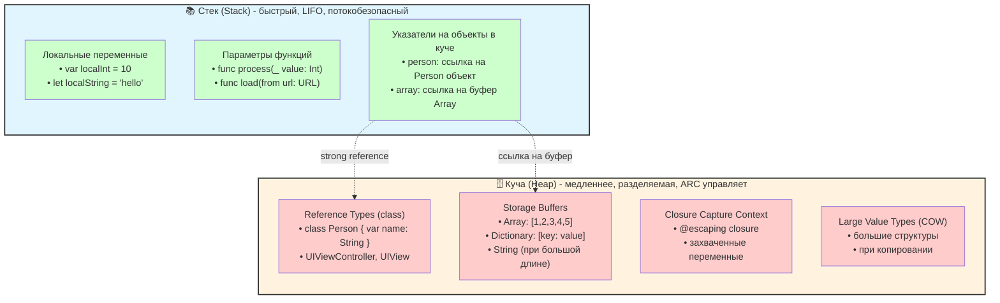
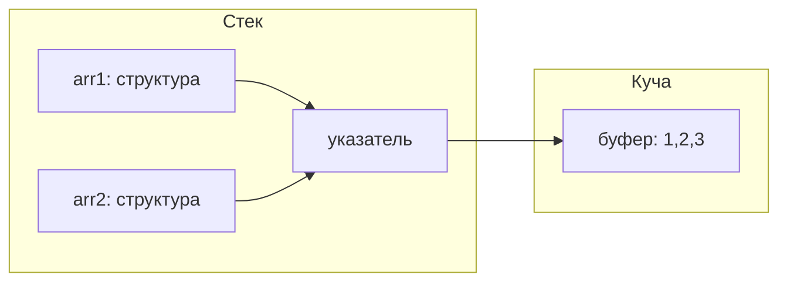
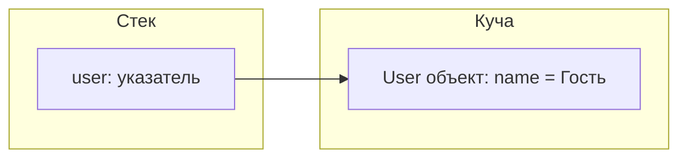

#memory #stack #heap #swift #performance #arc #ios

---
### Определение

**Стек** и **куча** — две основные области памяти, используемые в Swift (и почти во всех современных языках). Стек предназначен для быстрых, короткоживущих данных, а куча — для долгоживущих объектов с динамическим временем жизни.



---

### Сравнительная таблица: Стек vs Куча

| Характеристика         | Стек (Stack)                                               | Куча (Heap)                                                            |
| ---------------------- | ---------------------------------------------------------- | ---------------------------------------------------------------------- |
| **Управление**         | Полностью автоматическое (LIFO)                            | Автоматическое через **[[ARC]]** (для [[class]])                       |
| **Принцип работы**     | [[FILO]] / LIFO — последний вошёл, первый вышел            | Произвольный порядок выделения/освобождения                            |
| **Размер**             | Фиксированный, небольшой (обычно 1–8 МБ на [[iOS]])        | Почти неограничен (зависит от RAM устройства)                          |
| **Скорость доступа**   | Максимальная (прямой доступ)                               | Медленнее (косвенный доступ через указатель)                           |
| **Время жизни данных** | До конца scope (функции/блока)                             | До обнуления [[retain count]] (для class)                              |
| **Типичные данные**    | Локальные переменные, параметры, маленькие [[Value Type]]s | Экземпляры `class`, замыкания, буферы [[Copy-On-Write\|COW]]-коллекций |
| **Ошибки**             | Stack overflow (глубокая рекурсия)                         | Утечки памяти ([[retain cycle]]), memory pressure                      |
| **Фрагментация**       | Отсутствует                                                | Может быть                                                             |
| **Многопоточность**    | Каждый поток свой стек                                     | Общая, требует синхронизации                                           |

---

### Где что хранится в Swift

| Тип данных / конструкция                                           | Основное место хранения                     | Примечание                               |
| ------------------------------------------------------------------ | ------------------------------------------- | ---------------------------------------- |
| **Локальные переменные функции**                                   | Стек                                        | `let x = 42`, `var y = Point()`          |
| **Параметры функций**                                              | Стек                                        | `func f(a: Int)`                         |
| **Маленькие [[struct]] / [[enum]]**                                | Стек (inline)                               | Обычно до ~3–4 слов                      |
| **class (экземпляр)**                                              | Куча + указатель в стеке                    | `let obj = MyClass()`                    |
| **[[Array]], [[Dictionary]], [[Set Collection\|Set]], [[String]]** | Структура в стеке + буфер в куче (COW)      | Сама структура — стек, содержимое — куча |
| **Замыкания**                                                      | Куча                                        | Даже если захватывают value types        |
| **[[any Protocol]] (маленький тип)**                               | Стек (value buffer в existential container) | Если > 24 байта — куча                   |
| **Типы с Copy-on-Write**                                           | Буфер в куче, структура на стеке            | String, Array, Dictionary                |

---

### Примеры кода

#### 1. Всё на стеке

```swift
func example() {
    let a = 42                  // стек
    var point = Point(x: 10, y: 20)  // стек (inline)
    let tuple = (name: "Anna", age: 28)  // стек
    // Все переменные уничтожаются при выходе из функции
}
```

#### 2. Структура на стеке, буфер на куче (COW)

```swift
var arr1 = [1, 2, 3]     // структура в стеке, буфер [1,2,3] в куче
var arr2 = arr1          // копия структуры, тот же буфер
arr2.append(4)           // COW: новый буфер только для arr2
print(arr1)              // [1, 2, 3] (не изменился)
```



#### 3. Объект класса — куча

```swift
class User {
    var name = "Гость"
    deinit { print("User уничтожен") }
}

var user: User? = User()   // объект в куче, user — указатель в стеке
user = nil                 // retain count = 0 → deinit → освобождение кучи
```



#### 4. Замыкание — всегда в куче

```swift
func makeCounter() -> () -> Int {
    var count = 0
    return {
        count += 1
        return count
    }
}

let counter = makeCounter()  // замыкание в куче, захватывает count
print(counter())  // 1
print(counter())  // 2
```

---

### Почему стек быстрее кучи

| Фактор | Стек | Куча |
|---|---|---|
| **Доступ к данным** | Прямой доступ по фиксированному смещению | Косвенный доступ через указатель |
| **Количество инструкций CPU** | ~1 инструкция | ~2–3 инструкции + разыменование |
| **Cache locality** | Отличная (данные рядом в памяти) | Может быть плохая (данные разбросаны) |
| **Выделение памяти** | Перемещение указателя стека (~1 нс) | Поиск свободного блока + ARC (~50-100 нс) |

```swift
// Пример измерения производительности
func benchmarkStack() {
    let start = CFAbsoluteTimeGetCurrent()
    for _ in 0..<10_000_000 {
        var point = Point(x: 1, y: 2)  // стек
        point.x += 1
    }
    let end = CFAbsoluteTimeGetCurrent()
    print("Stack: \(end - start) sec")
}

func benchmarkHeap() {
    let start = CFAbsoluteTimeGetCurrent()
    for _ in 0..<10_000_000 {
        let obj = MyClass(value: 1)    // куча + ARC
        obj.value += 1
    }
    let end = CFAbsoluteTimeGetCurrent()
    print("Heap: \(end - start) sec")
}
// Stack обычно в 3-10 раз быстрее Heap
```

---

### Стек: детальное устройство

Стек растёт вниз (на большинстве архитектур):

```
Высокие адреса
┌─────────────────────────────────────┐
│   Фрейм функции C                   │
├─────────────────────────────────────┤
│   Фрейм функции B                   │
├─────────────────────────────────────┤
│   Фрейм функции A                   │
├─────────────────────────────────────┤
│   ...                               │
└─────────────────────────────────────┘
Низкие адреса (Stack Pointer)
```

Каждый фрейм содержит:
- Параметры функции
- Адрес возврата
- Локальные переменные
- Сохранённые регистры

---

### Куча: детальное устройство

Куча имеет более сложную структуру:

```text
┌─────────────────────────────────────┐
│   Header (метаданные кучи)          │
├─────────────────────────────────────┤
│   Free block 1                      │
├─────────────────────────────────────┤
│   Used block 1 (объект)             │
├─────────────────────────────────────┤
│   Used block 2 (объект)             │
├─────────────────────────────────────┤
│   Free block 2                      │
└─────────────────────────────────────┘
```

Каждый выделенный блок содержит:
- Заголовок (размер, флаги)
- isa pointer (для ObjC/Swift объектов)
- Данные объекта
- Выравнивание (padding)

---

### Copy-on-Write (COW) и куча

Коллекции Swift используют COW для оптимизации:

```swift
var a = [1, 2, 3, 4, 5]  // буфер в куче, refcount = 1
var b = a                 // refcount = 2 (буфер разделяется)
b.append(6)               // refcount = 1 для старого буфера? проверка уникальности
                          // создаётся новый буфер для b
```

---

### Практические советы (2026)

| Совет | Почему |
|---|---|
| **Маленькие value types (struct до ~3–4 слов)** → компилятор старается держать их inline в стеке | Быстрее, нет ARC overhead |
| **Глубокая рекурсия** → опасна (stack overflow), особенно на iOS с ограниченным стеком | Используйте итерацию вместо рекурсии |
| **Большие коллекции** — используй `reserveCapacity` заранее | Минимизирует realloc в куче |
| **Замыкания** → всегда в куче, даже если захватывают только value types | Учитывайте при оптимизации |
| **Предпочитай `struct` вместо `class`** для данных без идентичности | Стек vs куча |
| **Используй `final` для классов** | Улучшает диспетчеризацию |
| **Для многопоточности — используй `actor`** | Безопасный доступ к куче |

#### Инструменты для анализа

| Инструмент | Что показывает |
|---|---|
| **Instruments → Allocations** | Где растёт куча, какие объекты создаются |
| **Instruments → Leaks** | Утечки памяти в куче |
| **Memory Graph Debugger** | Кто держит объект в куче |
| **Xcode Memory Report** | Общее потребление памяти |

```swift
// Резервирование ёмкости для оптимизации
var array = [Int]()
array.reserveCapacity(10000)  // выделяем буфер заранее
for i in 0..<10000 {
    array.append(i)  // без лишних реаллокаций
}
```

---

### Короткое правило

> **Стек — для быстрых, короткоживущих, локальных данных.**  
> **Куча — для долгоживущих объектов с идентичностью (`class`) и больших буферов (COW).**  
> **Пиши `struct` по умолчанию — это и быстрее, и безопаснее.**

---

### Итог

**Стек и куча** в Swift:

| Аспект | Стек | Куча |
|---|---|---|
| **Скорость** | ★★★★★ | ★★★☆☆ |
| **Размер** | Малый (1-8 МБ) | Большой |
| **Время жизни** | До конца scope | До удаления последней ссылки |
| **Управление** | Автоматическое (LIFO) | ARC |
| **Типы данных** | Value types (struct, enum) | Reference types (class, closures) |
| **Ошибки** | Stack overflow | Memory leaks, retain cycles |

**Главное правило:**
> Если данные маленькие, короткоживущие и не требуют идентичности — используй `struct` (стек).  
> Если нужна идентичность, наследование или долгое время жизни — используй `class` (куча).  
> Всегда предпочитай `struct` по умолчанию — это даёт лучшую производительность и безопасность.