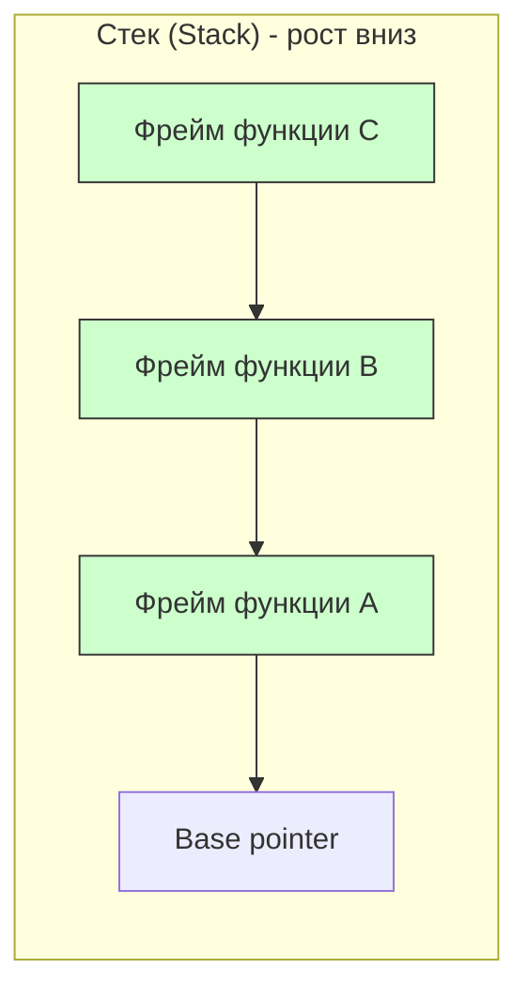

#memory #stack #swift #performance #value-types #ios #memory-management

---
### Определение

**Стек (Stack)** — это область памяти для **локальных переменных**, параметров функций и временных данных, управляемая автоматически системой по принципу **LIFO**/**[[FILO]]** (Last In, First Out — последним пришёл, первым ушёл). Каждый поток в приложении имеет свой собственный стек.



---

### Как данные хранятся на стеке: внутреннее устройство

Стек — это непрерывная область памяти, организованная как "массив" с указателем вершины. При каждом вызове функции создаётся **стековый фрейм (stack frame)**.

#### 1. **Структура стекового фрейма**

```
┌─────────────────────────────────────┐ ◄─── Высокие адреса
│                                     │
│  Параметры функции                   │
├─────────────────────────────────────┤
│  Адрес возврата (return address)    │
├─────────────────────────────────────┤
│  Previous frame pointer (RBP)       │
├─────────────────────────────────────┤
│  Локальные переменные                │
├─────────────────────────────────────┤
│  Temporary / spill variables        │
│                                     │
└─────────────────────────────────────┘ ◄─── Stack pointer (RSP)
```

#### 2. **Что содержится в стековом фрейме**

| Компонент                  | Описание                                                      |
| -------------------------- | ------------------------------------------------------------- |
| **Параметры функции**      | Переданные аргументы (для small types передаются по значению) |
| **Адрес возврата**         | Куда вернуться после выполнения функции                       |
| **Previous frame pointer** | Для восстановления предыдущего фрейма                         |
| **Локальные переменные**   | [[let]] и [[var]] внутри функции                              |
| **Temporary значения**     | Результаты промежуточных вычислений                           |
| **Spill variables**        | Значения, для которых не хватило регистров процессора         |

#### 3. **Динамическое размещение в стеке (alloca)**

Swift не поддерживает `alloca` напрямую, но концептуально:

```c
// C — выделение динамического массива в стеке
int size = 100;
int arr[size];  // VLA (Variable Length Array) на стеке
```

Swift для подобных случаев использует кучу.

#### 4. **Пример: что происходит в памяти**

```swift
func calculate(a: Int, b: Int) -> Int {
    let sum = a + b           // локальная переменная
    let product = a * b       // локальная переменная
    let result = sum + product // временное значение
    return result
}

let value = calculate(a: 5, b: 3)
```

**Схема стека при вызове `calculate(5, 3)`:**
```
┌─────────────────────────────────────┐ ◄─── Высокие адреса
│  a = 5                              │
├─────────────────────────────────────┤
│  b = 3                              │
├─────────────────────────────────────┤
│  return address                     │
├─────────────────────────────────────┤
│  previous frame pointer             │
├─────────────────────────────────────┤
│  sum = 8                            │
├─────────────────────────────────────┤
│  product = 15                       │
├─────────────────────────────────────┤
│  result = 23                        │
└─────────────────────────────────────┘ ◄─── Stack pointer
```

---

### Основные характеристики стека

| Характеристика         | Описание                                                                       |
| ---------------------- | ------------------------------------------------------------------------------ |
| **Размещение**         | Автоматическое при входе в функцию/scope                                       |
| **Порядок операций**   | LIFO — последний добавленный первым удаляется                                  |
| **Размер**             | Фиксированный на поток (обычно 1–8 МБ на iOS, зависит от устройства)           |
| **Время жизни данных** | До конца scope (функции, блока)                                                |
| **Скорость доступа**   | Самая высокая (прямой доступ по адресу)                                        |
| **Управление**         | Полностью автоматическое (компилятор + [[Runtime]])                            |
| **Типичные данные**    | Локальные переменные, параметры функций, [[Value Type]] ([[struct]], [[enum]]) |

---

### Когда данные попадают в стек

| Тип данных / конструкция        | Хранится в стеке?                                        | Примечание         |
| ------------------------------- | -------------------------------------------------------- | ------------------ |
| Локальные переменные функции    | Да                                                       | `let x = 42`       |
| Параметры функций               | Да                                                       | `func f(a: Int)`   |
| Маленькие [[struct]] / [[enum]] | Да                                                       | Inline в стеке     |
| [[Int]], [[Double]], [[Bool]]   | Да                                                       | Примитивы          |
| [[Array]], [[String]]           | Структура в стеке, буфер в куче ([[Copy-On-Write\|COW]]) | Только структура   |
| [[class]]                       | Нет (указатель в стеке, объект в куче)                   | [[Reference Type]] |

---

### Пример кода с детализацией

```swift
func calculateSum(a: Int, b: Int) -> Int {
    let temp = a + b          // a, b, temp — в стеке
    var result = temp * 2     // result — в стеке
    result += 10              // всё в стеке
    return result             // возврат копирует значение
}

// Вызов
let sum = calculateSum(a: 5, b: 7)  // параметры и локальные переменные в стеке
print(sum)                          // 34
```

**Что происходит под капотом**:
- При входе в `calculateSum` — выделяется **стековый фрейм** для параметров и локальных переменных
- При выходе из функции — фрейм автоматически уничтожается (все данные стека удаляются)

#### Более сложный пример: вложенные вызовы

```swift
func level3(x: Int) -> Int {
    let result = x * 2      // стек: result = 20
    return result
}

func level2(y: Int) -> Int {
    let z = y + 5           // стек: z = 15
    return level3(x: z)     // вызов level3 → новый фрейм на стеке
}

func level1(a: Int) -> Int {
    let b = a + 10          // стек: b = 15
    return level2(y: b)     // вызов level2 → новый фрейм на стеке
}

let result = level1(a: 5)   // result = 30
```

**Состояние стека во время выполнения `level3`:**
```
┌─────────────────────────────────────┐ ◄─── Высокие адреса
│  level1 frame: b = 15               │
├─────────────────────────────────────┤
│  level2 frame: z = 15               │
├─────────────────────────────────────┤
│  level3 frame: x = 15, result = 30  │ ◄─── Stack pointer
└─────────────────────────────────────┘
```

---

### Стек и Value Types (struct)

```swift
struct Point {
    var x: Int
    var y: Int
}

func movePoint() {
    let p1 = Point(x: 10, y: 20)   // вся структура в стеке
    var p2 = p1                     // копия в стеке
    p2.x = 30                       // меняется только копия
    print(p1.x)                     // 10 (не изменилось)
}
```

**Схема памяти:**
```
┌─────────────────────────────────────┐
│  p1.x = 10                          │
├─────────────────────────────────────┤
│  p1.y = 20                          │
├─────────────────────────────────────┤
│  p2.x = 30                          │
├─────────────────────────────────────┤
│  p2.y = 20                          │
└─────────────────────────────────────┘
```

---

### Переполнение стека (Stack Overflow)

```swift
// ❌ Бесконечная рекурсия → stack overflow
func infiniteRecursion() {
    infiniteRecursion()
}

// ❌ Глубокая рекурсия → stack overflow (на iOS ~50-100k вызовов)
func deepRecursion(n: Int) {
    guard n > 0 else { return }
    deepRecursion(n: n - 1)
}
deepRecursion(n: 100_000)  // EXC_BAD_ACCESS (stack overflow)
```

#### Как избежать переполнения:

| Техника | Пример |
|---|---|
| **Итерация вместо рекурсии** | Использовать циклы `for`, `while` |
| **Хвостовая рекурсия** | Swift оптимизирует в некоторых случаях |
| **Увеличение стека** | Не рекомендуется (размер стека фиксирован) |
| **Перенос в кучу** | Использовать `class` или структуры с COW |

```swift
// ✅ Итеративное решение — безопасно
func factorialIterative(_ n: Int) -> Int {
    var result = 1
    for i in 1...n {
        result *= i
    }
    return result
}
```

---

### Сравнение: Стек vs Куча

| Параметр | Стек (Stack) | Куча (Heap) |
|---|---|---|
| **Размер** | Фиксированный (маленький) | Почти неограниченный |
| **Выделение/освобождение** | Автоматическое (при входе/выходе) | Через ARC (retain/release) |
| **Скорость доступа** | Очень быстрая | Медленнее (косвенный доступ) |
| **Время жизни** | До конца scope | До обнуления retain count |
| **Типичные данные** | Локальные переменные, value types | Объекты `class`, замыкания, буферы COW |
| **Управление памятью** | Автоматическое | ARC (счётчик ссылок) |
| **Ошибки** | Stack overflow (рекурсия) | Утечки памяти (retain cycle) |
| **Фрагментация** | Отсутствует | Может быть |
| **Потокобезопасность** | Каждый поток свой стек | Общая, требует синхронизации |

---

### Практические советы (2026)

| Совет | Пояснение |
|---|---|
| **Маленькие value types** (struct до ~3–4 слов) → всегда старайся держать в стеке | Быстрее, нет ARC overhead |
| **Избегай глубокой рекурсии** — может вызвать stack overflow | Используй итерацию |
| **Большая рекурсия** → перепиши в итеративный стиль или используй хвостовую рекурсию | Swift оптимизирует в некоторых случаях |
| **Локальные коллекции** — структура в стеке, буфер в куче (COW) | Безопасно, эффективно |
| **Не пытайся управлять стеком вручную** — компилятор делает это лучше | `withUnsafePointer` только для специальных случаев |

---

### Короткий итог

- **Стек** — быстрый, автоматический, ограниченный по размеру
- Используется для **локальных данных** и **value types**
- **Куча** — для долгоживущих объектов (`class`) и больших буферов
- В Swift **value types** предпочитают стек — это одна из причин высокой производительности языка

**Главное правило**:
> «Если данные локальные и короткоживущие — они в стеке.  
> Если объект имеет идентичность и может жить долго — он в куче.»

---

### Итог

**Стек (Stack)** в Swift:

| Характеристика | Значение |
|---|---|
| **Назначение** | Хранение локальных переменных, параметров, временных данных |
| **Управление** | Полностью автоматическое (LIFO) |
| **Размер** | Фиксированный (~1-8 МБ на поток) |
| **Скорость** | Максимальная (прямой доступ) |
| **Типы данных** | Value types (struct, enum, примитивы), указатели |
| **Ошибки** | Stack overflow (глубокая рекурсия) |

Понимание работы стека необходимо для:
- Оптимизации производительности (выбор между `struct` и `class`)
- Предотвращения stack overflow при глубокой рекурсии
- Понимания разницы между value и reference types
- Написания эффективного кода на Swift