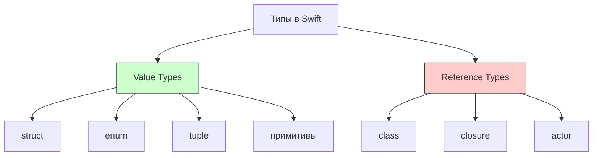
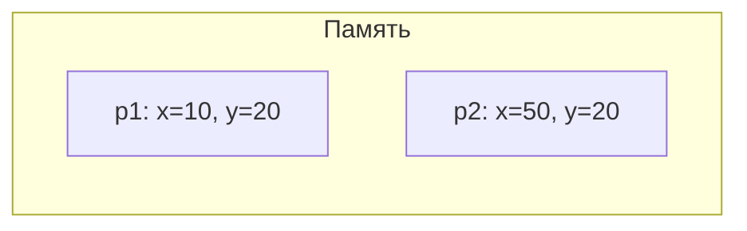
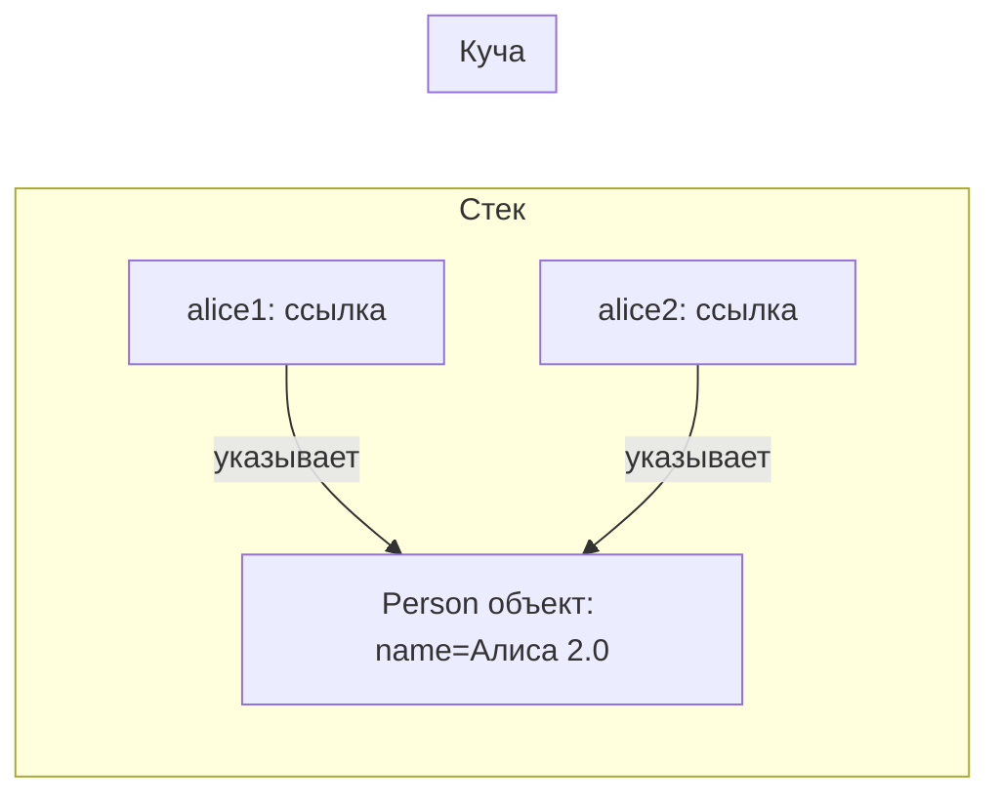
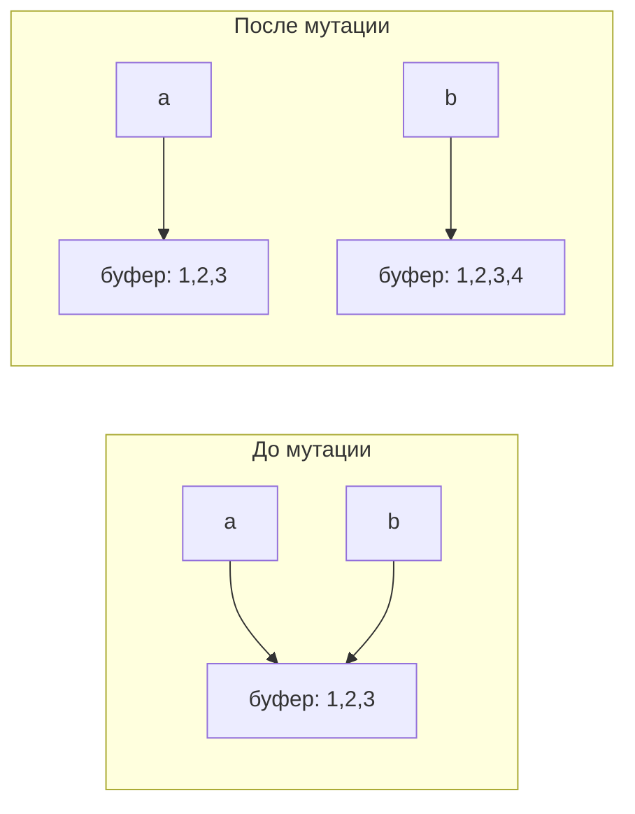

#swift #value-types #reference-types #struct #class #memory #performance

---
### Определение

В Swift все типы делятся на две большие группы по семантике и поведению при копировании/присваивании:

| Группа                  | Ключевые типы                                  | Семантика копирования | Где хранится (обычно)      | Поддерживает наследование? | Поддерживает [[weak]]/[[unowned]]? |
| ----------------------- | ---------------------------------------------- | --------------------- | -------------------------- | -------------------------- | ---------------------------------- |
| **Value Types**         | [[struct]], [[enum]], [[tuple]], все примитивы | Копируется значение   | Стек или [[inline]] в куче | Нет                        | Нет                                |
| **[[Reference Type]]s** | [[class]], замыкания ([[closure]])             | Копируется ссылка     | Куча ([[Heap]])            | Да                         | Да                                 |



---

### 1. Value Types (типы-значения)

**Копируется значение** — при присваивании или передаче в функцию создаётся **независимая копия**.

```swift
struct Point {
    var x: Int
    var y: Int
}

var p1 = Point(x: 10, y: 20)
var p2 = p1           // полноценная копия
p2.x = 50

print(p1.x)           // 10 — оригинал не изменился
print(p2.x)           // 50
```



#### Типичные value types в Swift

| Категория                  | Примеры                                                           |
| -------------------------- | ----------------------------------------------------------------- |
| **Примитивы**              | [[Int]], [[UInt]], [[Double]], [[Float]], [[Bool]], [[Character]] |
| **Коллекции (COW)**        | [[String]], [[Array]], [[Dictionary]], [[Set Collection\|Set]]    |
| **Пользовательские**       | [[struct]], [[enum]], [[tuple]]                                   |
| **Стандартная библиотека** | Все типы, не являющиеся классами                                  |
| **Foundation (value)**     | [[Date]], [[Data]], [[URL]], [[UUID]], [[Decimal]]                |
| **Core Graphics**          | [[CGPoint]], [[CGRect]], [[CGSize]]                               |

#### Преимущества value types

| Преимущество                  | Пояснение                                |
| ----------------------------- | ---------------------------------------- |
| **Независимые копии**         | Безопасно передавать и мутировать        |
| **Нет [[retain cycle]]**      | Не может быть утечек из-за циклов ссылок |
| **Стек / [[inline]]**         | Часто быстрее (нет косвенного доступа)   |
| **[[Copy-on-Write]]**         | Экономия памяти для больших коллекций    |
| **[[Sendable]] по умолчанию** | Безопасны в многопоточности              |

---

### 2. Reference Types (типы-ссылки)

**Копируется ссылка** — все переменные указывают на **один и тот же** объект в куче.

```swift
class Person {
    var name: String
    init(name: String) { self.name = name }
}

var alice1 = Person(name: "Алиса")
var alice2 = alice1           // та же ссылка
alice2.name = "Алиса 2.0"

print(alice1.name)            // "Алиса 2.0"
print(alice1 === alice2)      // true — один объект
```



#### Типичные reference types

| Категория              | Примеры                                     |
| ---------------------- | ------------------------------------------- |
| **Классы**             | Все [[class]]                               |
| **Замыкания**          | [[closure]]                                 |
| **Актёры**             | [[actor]]                                   |
| **Объекты Foundation** | [[NSObject]], [[NSArray]], [[NSDictionary]] |
| **UI компоненты**      | [[UIViewController]], [[UIView]]            |

#### Преимущества reference types

| Преимущество | Пояснение |
|---|---|
| **Общая изменяемая сущность** | Один объект — много владельцев |
| **Наследование** | Поддержка полиморфизма |
| **weak / unowned** | Возможность разрывать циклы ссылок |
| **deinit** | Очистка ресурсов при удалении |
| **Идентичность** | `===` для сравнения |

---

### 3. Сравнительная таблица

| Свойство | Value Types (struct, enum) | Reference Types (class) |
|---|---|---|
| **Копирование** | Значение полностью копируется | Копируется только ссылка |
| **Изменение одной копии** | Не влияет на другие | Влияет на все ссылки |
| **Сравнение** | По значению (`==`) | По идентичности (`===`) |
| **Наследование** | Нет | Да |
| **deinit** | Нет | Есть (вызывается при RC = 0) |
| **weak / unowned** | Нет | Есть |
| **Возможность retain cycle** | Нет | Да → утечки памяти |
| **Хранение (обычно)** | Стек / inline в куче | Куча |
| **Copy-on-Write** | Есть у коллекций | Нет |
| **Sendable по умолчанию** | Да | Нет (требуется явное указание) |

---

### 4. Copy-on-Write (COW) для коллекций

Коллекции Swift (Array, Dictionary, Set, String) — value types с COW:

```swift
var a = [1, 2, 3]      // структура на стеке, буфер в куче
var b = a               // b разделяет буфер с a (нет копирования!)
b.append(4)             // COW: создаётся новый буфер только для b

print(a)  // [1, 2, 3]
print(b)  // [1, 2, 3, 4]
```



---

### 5. Реальные сценарии в iOS (2026)

| Сценарий                            | Рекомендуемый тип | Почему                                    |
| ----------------------------------- | ----------------- | ----------------------------------------- |
| **Модели данных**                   | [[struct]]        | Независимые копии, безопасность           |
| **DTO (Data Transfer Objects)**     | struct            | Легковесные, [[Sendable]]                 |
| **Состояние экрана**                | struct            | [[Value semantic]]s для предсказуемости   |
| **ViewModel (не ObservableObject)** | struct            | Можно использовать с @State               |
| **Конфигурации**                    | struct            | Immutable по умолчанию                    |
| **UIViewController**                | [[class]]         | Требуется [[UIKit]] (reference semantics) |
| **UIView**                          | class             | Требуется UIKit                           |
| **Сервисы (NetworkService)**        | class / [[actor]] | Один экземпляр на всё приложение          |
| **Кэш**                             | class / actor     | Общая изменяемая сущность                 |
| **Делегаты**                        | class ([[weak]])  | [[Reference semantic]]s с weak            |

#### Пример выбора типа

```swift
// Value type — независимые копии
struct Message {
    let text: String
    let isFromMe: Bool
    let timestamp: Date
}

// Value type — состояние экрана
struct ProfileState {
    var user: User?
    var isLoading: Bool
    var errorMessage: String?
}

// Reference type — общий кэш изображений
class ImageCache {
    private var cache: [URL: UIImage] = [:]
    
    func image(for url: URL) -> UIImage? {
        cache[url]
    }
    
    func set(_ image: UIImage, for url: URL) {
        cache[url] = image
    }
}

// Actor — безопасный shared state в многопоточности
actor UserStorage {
    private var users: [UUID: User] = [:]
    
    func add(_ user: User) {
        users[user.id] = user
    }
    
    func get(id: UUID) -> User? {
        users[id]
    }
}
```

---

### 6. Value Types и Swift Concurrency

Value types автоматически соответствуют протоколу `Sendable`:

```swift
struct User: Sendable {  // автоматически Sendable
    let id: UUID
    let name: String
}

actor UserCache {
    private var cache: [UUID: User] = [:]  // безопасно
    
    func add(_ user: User) {
        cache[user.id] = user
    }
}
```

Reference types требуют явного указания:

```swift
final class ImageLoader: @unchecked Sendable {
    private let lock = NSLock()
    private var cache: [String: UIImage] = [:]
    
    func load(_ url: String) -> UIImage? {
        lock.lock()
        defer { lock.unlock() }
        return cache[url]
    }
}
```

---

### 7. Лучшие практики и правило Apple

#### Официальное правило Apple

> «Используйте структуры по умолчанию.  
> Переходите на классы только если вам действительно нужна:  
> • общая идентичность (identity)  
> • наследование  
> • `deinit` или наблюдение за жизненным циклом»

#### Дополнительные рекомендации (2026)

| Рекомендация | Почему |
|---|---|
| **Начинай с struct** | Value semantics безопаснее и предсказуемее |
| **Используй actor для shared mutable state** | Безопасная многопоточность |
| **Избегай class без необходимости** | Уменьшает риск retain cycles |
| **Для UI-компонентов используй class** | UIKit требует reference semantics |
| **Для сервисов используй actor или class с Sendable** | Один экземпляр на приложение |

---

### Короткое правило (2026)

> **Value types (struct, enum)** — безопасные, независимые, быстрые, без утечек.  
> **Reference types (class, actor)** — общие, изменяемые, с идентичностью, наследованием и жизненным циклом.  
> **Начинай с struct**. Переходи на class только если действительно нужна reference semantics.

---

### Итог

**Value Types vs Reference Types** в Swift:

| Аспект | Value Types | Reference Types |
|---|---|---|
| **Скорость** | ★★★★★ | ★★★☆☆ |
| **Безопасность** | ★★★★★ | ★★★☆☆ |
| **Гибкость** | ★★★☆☆ | ★★★★★ |
| **Управление памятью** | Автоматическое (стек) | ARC (куча) |
| **Многопоточность** | Безопасны по умолчанию | Требуют синхронизации |
| **Когда использовать** | По умолчанию | Когда нужна идентичность, наследование, deinit |

**Главное правило:**
> Используйте `struct` по умолчанию. `class` — только когда вам действительно нужна общая идентичность, наследование или `deinit`. Для многопоточного shared state используйте `actor`.