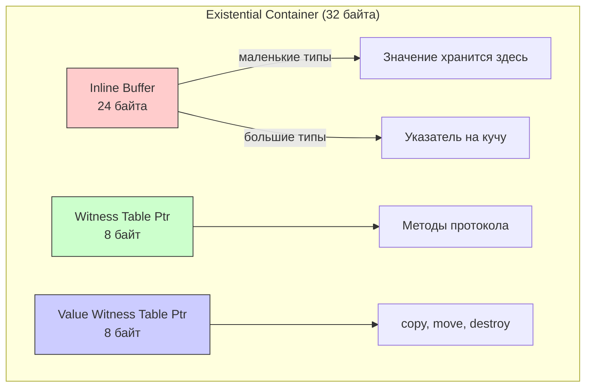
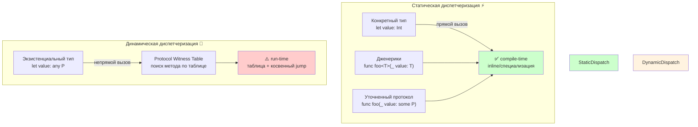

#existential-container #swift #type-erasure #any #some #opaque-types #performance #runtime #value-types #witness-table #swift-6 #box #boxing #abi #arc

---
### Определение

**Existential container (экзистенциальный контейнер)** — это структура данных времени выполнения ([[runtime]]), которую [[Swift]] создаёт для хранения значения типа, соответствующего протоколу, когда конкретный тип неизвестен на этапе компиляции. Контейнер "стирает" конкретный тип, сохраняя информацию, необходимую для:
- Доступа к значению (inline buffer или указатель на кучу)
- Вызова методов протокола (через [[witness table]])
- Управления жизненным циклом (копирование, уничтожение через value witness table)



---

### Зачем это знать iOS-разработчику?

| Уровень    | Понимание                                                                                          |
| ---------- | -------------------------------------------------------------------------------------------------- |
| **Junior** | Знать, почему `[any Animal]` работает, а `[Animal]` без `any` — нет                                |
| **Middle** | Понимать overhead existential container и когда он возникает                                       |
| **Senior** | Оптимизировать код: выбирать между [[any]], [[some]], [[generic]]s, создавать type-erased wrappers |

---

### Когда возникает existential container

| Сценарий | Пример | Возникает контейнер? |
|---|---|---|
| **Переменная с типом протокола** | `let a: any Animal = Dog()` | ✅ Да |
| **Массив протоколов** | `let arr: [any Animal] = [...]` | ✅ Да (для каждого элемента) |
| **Аргумент функции `any`** | `func f(_ a: any Animal)` | ✅ Да |
| **Возврат `any`** | `func f() -> any Animal` | ✅ Да |
| **Generic с `some`** | `func f<T: Animal>(_ a: T)` | ❌ Нет (статическая диспетчеризация) |
| **Opaque type `some`** | `func f() -> some Animal` | ❌ Нет (тип известен компилятору) |
| **Concrete type** | `let a: Dog = Dog()` | ❌ Нет |

---

### Структура existential container (на 64-bit)

| Компонент | Размер | Назначение |
|---|---|---|
| **Inline buffer** | 24 байта (3 слова) | Хранит значение, если оно ≤ 24 байт. Иначе — указатель на кучу |
| **Protocol Witness Table (PWT)** | 8 байт | Указатель на таблицу методов протокола для конкретного типа |
| **Value Witness Table (VWT)** | 8 байт | Указатель на таблицу управления жизненным циклом (copy, move, destroy) |

**Итого:** 32 байта (24 + 8 + 8)

---

### Value Witness Table (VWT) — управление памятью

VWT содержит функции, необходимые для работы с экземпляром как со значением:

```swift
struct ValueWitnessTable<T> {
    var initializeWithCopy: (UnsafeMutablePointer<T>, UnsafePointer<T>) -> Void
    var assignWithCopy: (UnsafeMutablePointer<T>, UnsafePointer<T>) -> Void
    var initializeWithTake: (UnsafeMutablePointer<T>, UnsafePointer<T>) -> Void
    var assignWithTake: (UnsafeMutablePointer<T>, UnsafePointer<T>) -> Void
    var destroy: (UnsafeMutablePointer<T>) -> Void
    // ... другие поля
}
```

Это позволяет контейнеру правильно копировать и уничтожать значения **не зная их конкретного типа**.

---

### Примеры

#### 1. **Базовое использование existential container**

```swift
protocol Animal {
    func makeSound()
}

struct Dog: Animal {
    let name: String
    func makeSound() { print("\(name): Гав!") }
}

struct Cat: Animal {
    let name: String
    func makeSound() { print("\(name): Мяу!") }
}

// Каждый элемент в массиве упакован в existential container
let pets: [any Animal] = [
    Dog(name: "Бобик"),
    Cat(name: "Мурка")
]

for pet in pets {
    pet.makeSound()  // Динамическая диспетчеризация через PWT
}
```

#### 2. **Inline buffer vs heap allocation**

```swift
protocol PointProtocol {
    var x: Double { get }
    var y: Double { get }
}

// Маленький тип (16 байт) → помещается в inline buffer
struct SmallPoint: PointProtocol {
    let x, y: Double  // 16 байт
}

// Большой тип (32 байта) → указатель на кучу
struct LargePoint: PointProtocol {
    let x, y, z, w: Double  // 32 байта
}

let small: any PointProtocol = SmallPoint(x: 1, y: 2)
let large: any PointProtocol = LargePoint(x: 1, y: 2, z: 3, w: 4)

// small хранится в inline buffer (быстро)
// large требует heap allocation (медленнее)
```

#### 3. **Передача в функцию**

```swift
func describe(_ animal: any Animal) {
    animal.makeSound()
}

describe(Dog(name: "Рекс"))  // Создаётся existential container
```

---

### Производительность и overhead

| Характеристика | `any Protocol` | `some Protocol` / Generic |
|---|---|---|
| **Диспетчеризация** | Динамическая (witness table) | Статическая (прямой вызов) |
| **Overhead на вызов** | ~5–20 нс | ~0 нс |
| **Копирование** | Копирует контейнер (32 б + возможный heap) | Копирует значение напрямую |
| **Heap allocation** | Для типов > 24 байт | Нет |
| **Инлайнинг** | Нет | Да (возможно) |
| **Специализация** | Нет | Да (компилятор может оптимизировать под конкретный тип) |

#### Бенчмарк: `any` vs `some`

```swift
protocol Compute {
    func value() -> Int
}

struct Small: Compute {
    let v: Int = 42
    func value() -> Int { v }
}

// any
func sumAny(items: [any Compute]) -> Int {
    var total = 0
    for item in items {
        total += item.value()  // witness table lookup на каждой итерации
    }
    return total
}

// generic (статическая диспетчеризация)
func sumGeneric<T: Compute>(items: [T]) -> Int {
    var total = 0
    for item in items {
        total += item.value()  // прямой вызов
    }
    return total
}

let array = Array(repeating: Small(), count: 1_000_000)

// sumAny: ~15-30 мс
// sumGeneric: ~5-10 мс
```

---

### `any` vs `some` vs Generic

| Аспект | `any Protocol` | `some Protocol` | Generic `<T: Protocol>` |
|---|---|---|---|
| **Хранение в массиве разных типов** | ✅ Да | ❌ Нет (должен быть один тип) | ❌ Нет (один тип) |
| **Скорость вызова** | Медленнее | Быстро | Быстро |
| **Heap allocation** | Для типов > 24 б | Нет | Нет |
| **Type erasure** | Да | Нет (opaque type) | Нет |
| **Когда использовать** | Разные типы в коллекции | Возврат скрытого типа | Параметры функций |

```swift
// any — разные типы
let animals: [any Animal] = [Dog(), Cat()]

// some — один конкретный тип (скрытый)
func makeAnimal() -> some Animal {
    return Dog()  // Тип зафиксирован, но скрыт
}

// generic — параметр функции
func process<T: Animal>(_ animal: T) {
    // Oдин тип T для всей функции
}
```

---

### Оптимизации и лучшие практики (2026)

| Техника | Применение |
|---|---|
| **Используйте `some` вместо `any` для возвращаемых типов** | Компилятор знает конкретный тип, контейнер не создаётся |
| **Для массивов разных типов — type-erased wrapper** | Один контейнер вместо одного на элемент |
| **Делайте типы ≤ 24 байт** | Значение хранится в inline buffer, без heap |
| **Используйте generics для параметров функций** | Статическая диспетчеризация, инлайнинг |
| **Swift 6 — явный `any`** | Компилятор предупреждает, где можно заменить `any` на `some` |

#### Type-erased wrapper (один контейнер на массив)

```swift
struct AnyAnimal: Animal {
    private let _makeSound: () -> Void
    
    init<T: Animal>(_ animal: T) {
        _makeSound = animal.makeSound
    }
    
    func makeSound() {
        _makeSound()
    }
}

let pets = [AnyAnimal(Dog()), AnyAnimal(Cat())]  // один уровень erasure
```

---

### Swift 6 и existential container

В Swift 6 усиливаются требования к явному указанию `any`:

```swift
// Swift 5.9 — может компилироваться, но с предупреждением
let animals: [Animal] = [Dog(), Cat()]

// Swift 6 — обязательно `any` для existential
let animals: [any Animal] = [Dog(), Cat()]

// Ошибка: протокол 'Animal' может использоваться только как constraint
// let animal: Animal = Dog()
let animal: any Animal = Dog()  // ✅
```

---

### Короткий итог 2026

| Уровень | Понимание |
|---|---|
| **Junior** | Existential container — "коробка", которая позволяет хранить разные типы в массиве через `any Protocol` |
| **Middle** | Структура: inline buffer (24 б) + PWT (8 б) + VWT (8 б). Возникает в `[any P]`, `func(x: any P)`. Overhead: динамическая диспетчеризация, возможный heap |
| **Senior** | Оптимизируй через `some` / generics / type-erased wrappers. Swift 6 требует явного `any`. Приоритет: generic > `some` > `any` |



**Ключевой вывод:** Используйте `any` только когда нужна коллекция разных типов. Для параметров функций и возвращаемых значений предпочитайте generics и `some`. Понимание existential container — признак перехода от Junior к Middle разработчику.