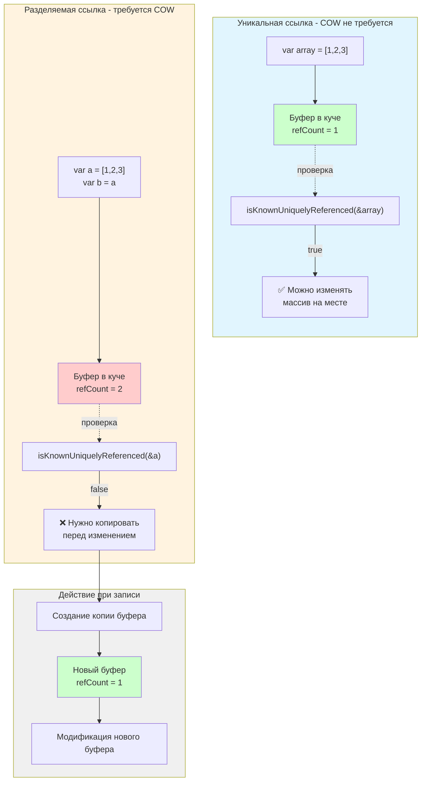

#swift #memory #cow #performance #reference-counting #arc

---

### Определение

**`isKnownUniquelyReferenced`** — это встроенная функция в [[Swift]], которая проверяет, существует ли **только одна сильная ссылка** на заданный экземпляр класса ([[reference type]]). Она возвращает `true`, если переданный объект имеет ровно одну сильную ссылку в текущий момент, и `false` в противном случае (включая слабые и бесхозные ссылки, которые не учитываются).

Эта функция является ключевым строительным блоком для реализации **[[Copy-on-Write]] (COW)** в пользовательских типах. Она позволяет безопасно определить, можно ли мутировать объект на месте или необходимо создать копию.

```swift
func isKnownUniquelyReferenced<T>(_ object: inout T) -> Bool where T : AnyObject
```

> **Важно:** Функция принимает объект **[[inout]]**. Это гарантирует, что за время проверки никто другой не изменит счётчик ссылок.

---

### Зачем это знать iOS-разработчику?

| Сценарий                           | Применение                                                    |
| ---------------------------------- | ------------------------------------------------------------- |
| **Реализация Copy-on-Write**       | Создание эффективных value types с внутренним буфером-классом |
| **Оптимизация производительности** | Предотвращение ненужных копирований больших структур данных   |
| **Диагностика памяти**             | Отладка неожиданных копирований в собственных типах           |
| **Понимание [[ARC]]**              | Глубокое понимание того, как работает управление памятью      |

---

### Как это работает



**Ключевые моменты:**
- Учитываются **только сильные ссылки** ([[weak]] и [[unowned]] не влияют на результат)
- Функция требует `inout` параметр для гарантии эксклюзивного доступа
- Возвращает `true` только если retain count == 1 (ровно одна сильная ссылка)

---

### Базовые примеры

#### 1. **Простейшая проверка уникальности**

```swift
class MyClass {
    var value = 0
}

var obj1 = MyClass()
print(isKnownUniquelyReferenced(&obj1))  // true (только одна ссылка)

var obj2 = obj1
print(isKnownUniquelyReferenced(&obj1))  // false (две сильные ссылки)

obj2 = MyClass()  // obj2 больше не указывает на obj1
print(isKnownUniquelyReferenced(&obj1))  // true (снова одна ссылка)
```

#### 2. **Weak и unowned не учитываются**

```swift
class MyClass {
    var value = 0
}

var obj1: MyClass? = MyClass()
weak var weakRef = obj1
unowned let unownedRef = obj1!

print(isKnownUniquelyReferenced(&obj1!))  
// true! (weak и unowned не считаются сильными ссылками)
```

#### 3. **Массивы и коллекции**

```swift
class Buffer {
    var data: [Int]
    init(_ data: [Int]) { self.data = data }
}

var buffer1 = Buffer([1, 2, 3])
print(isKnownUniquelyReferenced(&buffer1))  // true

var buffer2 = buffer1  // копируем ссылку
print(isKnownUniquelyReferenced(&buffer1))  // false

buffer2 = Buffer([4, 5, 6])  // переприсваиваем
print(isKnownUniquelyReferenced(&buffer1))  // true (снова уникальна)
```

---

### Реализация Copy-on-Write (COW)

Это основное практическое применение `isKnownUniquelyReferenced`:

#### 1. **Базовый шаблон COW**

```swift
final class Box<T> {
    var value: T
    init(_ value: T) {
        self.value = value
    }
}

struct CowArray<T> {
    private var storage: Box<[T]>
    
    init(_ elements: [T] = []) {
        storage = Box(elements)
    }
    
    // Проверка уникальности перед мутацией
    private mutating func ensureUnique() {
        if !isKnownUniquelyReferenced(&storage) {
            storage = Box(storage.value)  // создаём копию
        }
    }
    
    // Мутирующая операция
    mutating func append(_ element: T) {
        ensureUnique()
        storage.value.append(element)
    }
    
    // Не-мутирующая операция (копирования не будет)
    var count: Int {
        return storage.value.count
    }
}

var a = CowArray([1, 2, 3])
var b = a           // a и b разделяют один буфер (нет копирования!)
a.append(4)         // здесь происходит копирование, a теперь уникальна

print(a.count)      // 4
print(b.count)      // 3 (b остался неизменным)
```

#### 2. **Полноценная реализация COW массива**

```swift
final class CowStorage<T> {
    var elements: [T]
    init(_ elements: [T]) {
        self.elements = elements
    }
}

struct MyCowArray<T> {
    private var storage: CowStorage<T>
    
    // Инициализация
    init(_ elements: [T] = []) {
        storage = CowStorage(elements)
    }
    
    // Проверка уникальности
    private mutating func isUnique() -> Bool {
        return isKnownUniquelyReferenced(&storage)
    }
    
    private mutating func copyIfNeeded() {
        if !isUnique() {
            storage = CowStorage(storage.elements)
        }
    }
    
    // Доступ (без копирования)
    subscript(index: Int) -> T {
        get {
            storage.elements[index]
        }
        set {
            copyIfNeeded()
            storage.elements[index] = newValue
        }
    }
    
    // Мутация
    mutating func append(_ element: T) {
        copyIfNeeded()
        storage.elements.append(element)
    }
    
    mutating func remove(at index: Int) {
        copyIfNeeded()
        storage.elements.remove(at: index)
    }
    
    var count: Int { storage.elements.count }
    
    // Эффективная итерация (без COW проверок)
    func forEach(_ body: (T) -> Void) {
        storage.elements.forEach(body)
    }
}

// Использование
var array1 = MyCowArray([1, 2, 3, 4, 5])
var array2 = array1          // разделяют storage
array1.append(6)              // копирование происходит здесь

print(array1.count)           // 6
print(array2.count)           // 5
```

#### 3. **COW для строкового буфера**

```swift
final class StringBuffer {
    var content: String
    init(_ content: String) {
        self.content = content
    }
}

struct CowString {
    private var buffer: StringBuffer
    
    init(_ string: String = "") {
        buffer = StringBuffer(string)
    }
    
    private mutating func ensureUnique() {
        if !isKnownUniquelyReferenced(&buffer) {
            buffer = StringBuffer(buffer.content)
        }
    }
    
    mutating func append(_ text: String) {
        ensureUnique()
        buffer.content.append(text)
    }
    
    mutating func removeLast() {
        ensureUnique()
        buffer.content.removeLast()
    }
    
    var value: String {
        buffer.content
    }
    
    // Не-мутирующие операции (без COW)
    var count: Int { buffer.content.count }
    var isEmpty: Bool { buffer.content.isEmpty }
}

var str1 = CowString("Hello")
var str2 = str1              // разделяют буфер
str1.append(" World")        // копирование здесь

print(str1.value)  // "Hello World"
print(str2.value)  // "Hello"
```

---

### Диагностика копирований

```swift
class DebugBox<T> {
    var value: T
    var copyCount = 0
    
    init(_ value: T) {
        self.value = value
        print("📦 Box created")
    }
    
    func copy() -> DebugBox<T> {
        let newBox = DebugBox(value)
        newBox.copyCount = copyCount + 1
        print("📋 Box copied (#\(newBox.copyCount))")
        return newBox
    }
}

struct DebugCowArray<T> {
    private var storage: DebugBox<[T]>
    
    init(_ elements: [T] = []) {
        storage = DebugBox(elements)
    }
    
    private mutating func ensureUnique() {
        if !isKnownUniquelyReferenced(&storage) {
            storage = storage.copy()
        }
    }
    
    mutating func append(_ element: T) {
        ensureUnique()
        storage.value.append(element)
    }
    
    var count: Int { storage.value.count }
}

var a = DebugCowArray([1, 2, 3])
var b = a                   // разделяют — нет копирования
var c = a                   // разделяют — нет копирования
a.append(4)                 // 📋 Box copied (#1) — одно копирование для всех

print(a.count)  // 4
print(b.count)  // 3 (остался неизменным)
print(c.count)  // 3
```

---

### Ограничения и особенности

#### 1. **Только для reference types**

```swift
struct ValueType {}
var v = ValueType()
// ❌ Ошибка: isKnownUniquelyReferenced работает только с AnyObject
// isKnownUniquelyReferenced(&v)
```

#### 2. **Требует inout**

```swift
class MyClass {}
let obj = MyClass()
// ❌ Ошибка: нельзя передать let константу как inout
// isKnownUniquelyReferenced(&obj)

var mutableObj = MyClass()
isKnownUniquelyReferenced(&mutableObj)  // ✅ работает
```

#### 3. **Не учитывает замыкания ([[closure]] captures)**

```swift
class MyClass {
    var value = 0
}

var obj = MyClass()
let closure = { [obj] in
    print(obj.value)
}

print(isKnownUniquelyReferenced(&obj))  // false (closure держит ссылку)
```

#### 4. **Потокобезопасность**

`isKnownUniquelyReferenced` **не является атомарной** в многопоточной среде. Используйте её в сочетании с сериализованным доступом.

```swift
class ThreadSafeBox<T> {
    private var _value: T
    private let lock = NSLock()
    
    init(_ value: T) {
        _value = value
    }
    
    mutating func modify(_ block: (inout T) -> Void) {
        lock.lock()
        if !isKnownUniquelyReferenced(&self) {
            // Создаём копию
            _value = _value
        }
        block(&_value)
        lock.unlock()
    }
}
```

---

### Сравнение с ручным подсчётом ссылок

| Метод                           | Преимущества                                         | Недостатки                                             |
| ------------------------------- | ---------------------------------------------------- | ------------------------------------------------------ |
| **`isKnownUniquelyReferenced`** | Простой, безопасный, учитывает только сильные ссылки | Не работает с value types, требует inout               |
| **[[CFGetRetainCount]]**        | Низкоуровневый, точный                               | ❌ Не использовать в production, включает слабые ссылки |
| **Ручной подсчёт**              | Полный контроль                                      | Сложно, подвержен ошибкам                              |

---

### Лучшие практики

1. **Всегда используйте `isKnownUniquelyReferenced` для COW** в пользовательских типах
2. **Не полагайтесь на неё в многопоточной среде** без дополнительной синхронизации
3. **Не используйте для диагностики** — для отладки утечек есть Memory Graph Debugger
4. **Комбинируйте с `inout` для гарантии эксклюзивного доступа**

```swift
// ✅ Правильно: COW в кастомном типе
mutating func modify() {
    if !isKnownUniquelyReferenced(&storage) {
        storage = storage.copy()
    }
    storage.value.modify()
}

// ❌ Неправильно: без inout
func check(obj: MyClass) {
    // isKnownUniquelyReferenced(&obj) — не скомпилируется
}

// ✅ Правильно: с inout
func check(obj: inout MyClass) {
    let isUnique = isKnownUniquelyReferenced(&obj)
}
```

---

### Итог

**`isKnownUniquelyReferenced`** — это мощный инструмент для оптимизации памяти и реализации Copy-on-Write:

| Характеристика          | Значение                                                                     |
| ----------------------- | ---------------------------------------------------------------------------- |
| **Назначение**          | Проверка, есть ли у объекта только один сильный владелец                     |
| **Возвращает**          | `true` — объект можно мутировать на месте<br>`false` — нужно создавать копию |
| **Требования**          | `inout` параметр, reference type ([[AnyObject]])                             |
| **Основное применение** | Реализация COW в пользовательских типах                                      |
| **Учитывает**           | Только сильные ссылки (weak, unowned игнорируются)                           |

**Главное правило:** Используйте `isKnownUniquelyReferenced` для реализации эффективных value types с внутренним буфером-классом. Это основа Copy-on-Write в Swift, которая позволяет писать быстрый и безопасный код без лишних копирований.