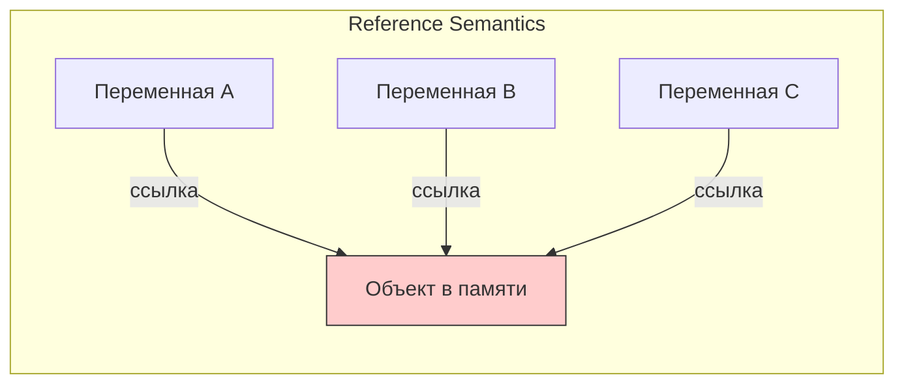
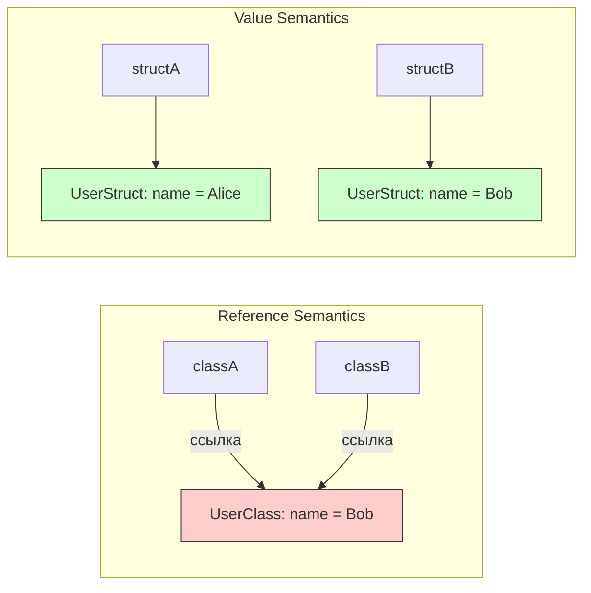
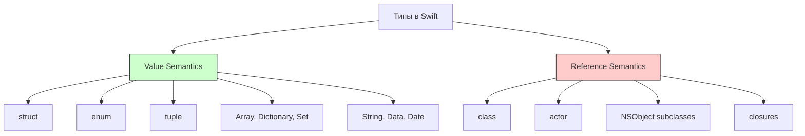

#swift #reference-semantics #value-semantics #class #actor #sendable #memory

---
### Определение

**Reference semantics (семантика ссылок)** в [[Swift]] — это способ, при котором **значение** передаётся **по ссылке** (reference), а не по значению (value). Это противоположность **value semantics**, которая является основой большинства Swift-типов ([[struct]], [[enum]]).

Когда объект с reference semantics присваивается новой переменной, копируется не сам объект, а **ссылка (указатель)** на него. Все переменные указывают на один и тот же объект в памяти, и изменение через любую из них видно всем остальным.

В 2026 году понимание reference semantics критически важно, особенно в контексте **Swift 6 strict concurrency**, **Sendable**, **actor** и **memory management**.



---

### Основные типы по семантике в Swift

| Семантика                 | Типы / Классы, которые её используют                                                                                                    | Копирование при присваивании                                  | Mutability                                | Sendable?                                   | Пример                                                                                          |
| ------------------------- | --------------------------------------------------------------------------------------------------------------------------------------- | ------------------------------------------------------------- | ----------------------------------------- | ------------------------------------------- | ----------------------------------------------------------------------------------------------- |
| **Value semantics**       | [[struct]], [[enum]], [[tuple]], [[Array]], [[Dictionary]], [[Set Collection\|Set]], [[String]], [[Data]], [[Date]], [[CGPoint]] и т.д. | Копируется полностью ([[Copy-On-Write\|COW]] — Copy-on-Write) | Изменение одной копии не влияет на другие | Да (если все свойства Sendable)             | `var a = [1,2]; var b = a; b.append(3); // a остаётся [1,2]`                                    |
| **Reference semantics**   | class, actor, AnyObject-типы, NSObject-подклассы                                                                                        | Копируется **ссылка** (указатель)                             | Изменение влияет на все ссылки            | Нет (если не помечен Sendable)              | `class User { var name = "" }; let a = User(); let b = a; b.name = "Bob"; // a.name тоже "Bob"` |
| **Existential container** | [[any Protocol]] (экзистенциальный тип)                                                                                                 | Копируется контейнер + боксинг                                | Зависит от типа внутри                    | Частично (Sendable, если протокол Sendable) | `let views: [any View]` — разные типы, но все боксятся                                          |

---

### Почему reference semantics опасны в Swift 6+

| Проблема                      | Описание                                                                         | Решение                              |
| ----------------------------- | -------------------------------------------------------------------------------- | ------------------------------------ |
| **[[Data race]]s**            | Если несколько задач одновременно мутируют объект по ссылке → undefined behavior | [[actor]] и [[Sendable]]             |
| **[[Retain cycle]]s**         | Сильные ссылки между объектами → утечки памяти                                   | [[weak]] / [[unowned]] / [weak self] |
| **Непредсказуемость**         | Изменение одной переменной влияет на все, кто держит ссылку                      | Предпочитать [[value type]]s         |
| **Трудности с тестированием** | Mutable shared state сложно мокать и изолировать                                 | Immutable по умолчанию               |

---

### Пример: reference vs value semantics

```swift
class UserClass {  // reference semantics
    var name = "Alice"
}

struct UserStruct {  // value semantics
    var name = "Alice"
}

// Reference semantics
var classA = UserClass()
var classB = classA
classB.name = "Bob"
print(classA.name)  // "Bob" — одна и та же ссылка

// Value semantics
var structA = UserStruct()
var structB = structA
structB.name = "Bob"
print(structA.name) // "Alice" — копия
```



---

### Как избежать проблем reference semantics в 2026

| Проблема | Решение в Swift 6+ | Пример |
|---|---|---|
| **Data race при мутации** | actor / @MainActor / Sendable | `actor UserCache { var users: [User] = [] }` |
| **Retain cycle** | weak / unowned / [weak self] | `weak var delegate: Delegate?` |
| **Shared mutable state** | Prefer value types (struct) + immutable по умолчанию | `struct User { let name: String }` |
| **Existential overhead (any Protocol)** | Prefer `some Protocol` или generics | `func makeView() -> some View` |
| **Unsafe reference (class)** | Mark as `final` / `Sendable` / `@unchecked Sendable` | `final class Logger: @unchecked Sendable { ... }` |

---

### Actor — Reference semantics с защитой от data races

```swift
actor BankAccount {
    private var balance: Double = 0
    
    func deposit(_ amount: Double) {
        balance += amount  // безопасно — внутри actor
    }
    
    func getBalance() -> Double {
        return balance
    }
}

let account = BankAccount()

// ❌ Нельзя вызвать извне напрямую (data race prevention)
// account.balance += 100

// ✅ Нужно через async
Task {
    await account.deposit(100)
    let balance = await account.getBalance()
    print(balance)
}
```

---

### Sendable и reference semantics

```swift
// ❌ Не Sendable — нельзя передавать между задачами
class MutableCounter {
    var value = 0
}

// ✅ Sendable — безопасно для передачи
final class SafeCounter: @unchecked Sendable {
    private let lock = NSLock()
    private var _value = 0
    
    var value: Int {
        get { lock.withLock { _value } }
        set { lock.withLock { _value = newValue } }
    }
}

// ✅ Или actor
actor ActorCounter {
    var value = 0
}
```

---

### Reference semantics в [[UIKit]]

UIKit построен на reference semantics:

```swift
class MyViewController: UIViewController {
    @IBOutlet weak var label: UILabel!
    
    func updateText() {
        label.text = "New Text"  // изменение через ссылку
    }
}

let vc1 = MyViewController()
let vc2 = vc1
vc2.updateText()  // vc1 тоже изменится
```

**Почему UIKit использует reference semantics:**
- Иерархия наследования ([[UIViewController]] → [[UIResponder]] → [[NSObject]])
- Shared state (один view controller в памяти)
- Objective-C совместимость

---

### Лучшие практики reference semantics в Swift 2026

| Практика | Почему |
|---|---|
| **Предпочитай value semantics (struct, enum) для большинства типов данных** | Безопаснее, предсказуемее, легче тестировать |
| **class — только когда нужна reference semantics** | Делегаты, view controllers, сервисы, shared state |
| **actor — для mutable shared state в concurrency** | Защита от data races |
| **final class — если класс не предназначен для наследования** | Экономия vtable, ускорение dispatch |
| **Sendable — обязательно для всех классов, передаваемых между задачами** | Безопасность в многопоточной среде |
| **@MainActor — для всего UI-related** | UIViewController, ViewModel |
| **Документируйте** — пиши комментарий «reference semantics — shared mutable state» |

---

### Иерархия семантик в Swift



---

### Когда использовать reference semantics

| Сценарий | Использовать reference semantics? | Почему |
|---|---|---|
| **UIViewController** | ✅ Да | UIKit требует class |
| **UIView** | ✅ Да | UIKit требует class |
| **Сервис (NetworkService, UserManager)** | ✅ Да | Один экземпляр на всё приложение |
| **Делегат** | ✅ Да | Для обратных вызовов |
| **Shared state (кеш, настройки)** | ✅ Да | Один источник истины |
| **Модель данных** | ❌ Нет — struct | Безопаснее, легче |
| **Конфигурация** | ❌ Нет — struct | Immutable |
| **Значение, которое передаётся между задачами** | ⚠️ Только с Sendable | Иначе data races |

---

### Короткий девиз 2026

> **Reference semantics** — это когда изменение одной переменной меняет все копии, потому что они указывают на один и тот же объект в памяти.  
> В 2026 году это **опасно** без actor / Sendable / weak.  
> Основное правило: используй class только когда тебе **действительно** нужна общая ссылка, во всём остальном — struct и value semantics.

---

### Итог

**Reference semantics** в Swift:

| Характеристика         | Значение                                        |
| ---------------------- | ----------------------------------------------- |
| **Передача**           | По ссылке (указатель)                           |
| **Изменение**          | Влияет на все ссылки                            |
| **Где используется**   | [[class]], actor, [[NSObject]], [[closure]]s    |
| **Память**             | Куча ([[heap]]) + [[ARC]]                       |
| **Безопасность**       | Нужен осторожный подход ([[weak]], [[unowned]]) |
| **Concurrency**        | [[actor]], [[Sendable]], [[@MainActor]]         |
| **Когда использовать** | UI-компоненты, сервисы, shared state            |

**Главное правило:**
> Предпочитай **value semantics** везде, где возможно. **Reference semantics** используй только когда действительно нужна общая изменяемая ссылка. В многопоточной среде обязательно защищай reference semantics через `actor` или `Sendable`.