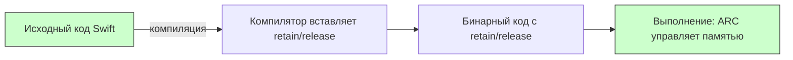

## release в Swift — Почему этого ключевого слова нет и как работает управление памятью

---
#swift #memory #arc #release #objective-c #ios #memory-management

---
### Определение

В **Swift** ключевое слово **`release`** **не используется** и **не существует** в языке. Управление памятью полностью автоматическое благодаря **[[ARC]] (Automatic Reference Counting)**. Компилятор самостоятельно вставляет вызовы `objc_release` в нужные места, и разработчик не имеет возможности (и не должен) вызывать `release` вручную.



---

### Swift vs Objective-C: сравнение управления памятью

| Аспект                       | Swift (с ARC)                      | Objective-C (MRR — Manual Retain-Release)           | Objective-C (с ARC)            |
| ---------------------------- | ---------------------------------- | --------------------------------------------------- | ------------------------------ |
| **Вызов `release`**          | **Никогда** не нужен               | Обязателен вручную                                  | Не нужен (как в [[Swift]])     |
| **Вызов [[retain]]**         | Не нужен                           | Обязателен вручную                                  | Не нужен                       |
| **[[autorelease]]**          | Не используется                    | Часто использовался                                 | Не нужен, но пулы всё ещё есть |
| **Управление памятью**       | Полностью автоматическое (ARC)     | Ручное                                              | Автоматическое (ARC)           |
| **Счётчик ссылок**           | Управляется компилятором           | Управляется разработчиком                           | Управляется компилятором       |
| **[[dealloc]] / [[deinit]]** | `deinit` — автоматический вызов    | `dealloc` — вызывается вручную после `release`      | `dealloc` — автоматический     |
| **Циклы ссылок**             | Разрываются [[weak]] / [[unowned]] | Разрываются `assign` / `weak` / `unsafe_unretained` | То же, что в Swift             |

---

### Примеры: как это выглядит в разных языках

#### Objective-C (MRR — ручное управление)

```objc
// ❌ Древний стиль (до 2011 года) — больше так не пишут
- (void)doSomething {
    NSString *str = [[NSString alloc] initWithString:@"Hello"];
    [str retain];        // ручной retain
    // ... используем str ...
    [str release];       // ручной release
    [str release];       // ещё один release (баланс с alloc)
}
```

#### Objective-C (ARC — современный стиль)

```objc
// ✅ Современный Objective-C с ARC (как в Swift)
- (void)doSomething {
    NSString *str = [[NSString alloc] initWithString:@"Hello"];
    // retain/release добавляются компилятором автоматически
    // [str retain] — не нужен
    // [str release] — не нужен
}
```

#### Swift (ARC)

```swift
// ✅ Swift — release не нужен и не существует
func doSomething() {
    let str = String("Hello")
    // retain/release добавляются компилятором автоматически
    // никакого release в коде нет
}
```

---

### Почему в Swift нет `release`?

ARC — это **compile-time механизм**. Компилятор сам вставляет вызовы `objc_retain` / `objc_release` / `objc_storeStrong` в нужных местах. Разработчик **не может** (и **не должен**) вызывать `release` вручную — это приведёт к **двойному освобождению** и крашу.

```swift
// ❌ Такой код не скомпилируется — release не существует в Swift
// obj.release()  // Error: 'release' is not a member of 'MyClass'
```

**Что делает компилятор вместо вас:**

```swift
// Исходный код
func example() {
    let obj = MyClass()
    use(obj)
}

// Компилятор добавляет (упрощённо):
// let obj = MyClass()
// objc_retain(obj)
// use(obj)
// objc_release(obj)
```

---

### Когда вы всё ещё можете увидеть `release` в 2026 году

| Сценарий                                 | Пример                | Примечание                            |
| ---------------------------------------- | --------------------- | ------------------------------------- |
| **Legacy [[Objective-C]] код (без ARC)** | `[obj release];`      | Код, не переведённый на ARC           |
| **[[Core Foundation]] объекты**          | `CFRelease(cfObject)` | CF объекты требуют ручного управления |
| **C/C++ код в проекте**                  | `free(ptr);`          | Низкоуровневое управление             |
| **Смешанные проекты с `-fno-objc-arc`**  | `[obj release];`      | Отключение ARC для отдельных файлов   |

#### Core Foundation пример (требует ручного управления)

```swift
import Foundation

// Core Foundation объекты требуют ручного управления
let cfString = CFStringCreateWithCString(nil, "Hello", kCFStringEncodingUTF8)!
print(cfString)
CFRelease(cfString)  // ✅ нужно вызывать CFRelease (не release)

// Swift объекты не требуют
let swiftString = "Hello"
// release не нужен и не существует
```

---

### Что используется в Swift вместо `release`

| Задача | Swift решение |
|---|---|
| **Автоматическое управление памятью** | ARC (делает всё сам) |
| **Разрыв цикла сильных ссылок** | `weak var`, `unowned let` |
| **Проверка освобождения объекта** | Лог в `deinit` |
| **Ручное управление для Core Foundation** | `CFRetain` / `CFRelease` |
| **Отладка утечек** | Memory Graph Debugger, Instruments Leaks |

---

### Ключевые правила для современного Swift (2026)

| Правило | Почему |
|---|---|
| **Никогда не вызывайте `release`, `retain`, `autorelease` в Swift-коде** | Эти методы не существуют в Swift |
| **Если видите такие вызовы в Swift — это ошибка** | Скорее всего, legacy или неправильный мост |
| **Используйте `weak` / `unowned` для разрыва циклов** | Единственный способ предотвратить retain cycles |
| **Проверяйте `deinit` с логами** | Если не вызывается → цикл сильных ссылок |
| **Для Core Foundation объектов (CF...) используйте `CFRelease` вручную** | Swift не управляет памятью CF объектов |
| **Не пытайтесь «оптимизировать» ARC вручную** | Компилятор делает это лучше |

```swift
// ✅ Правильно: лог в deinit для отладки
class MyViewController: UIViewController {
    deinit {
        print("🗑 \(type(of: self)) deinitialized")
    }
}

// ❌ Неправильно: попытка ручного управления (не скомпилируется)
// class BadClass {
//     func cleanup() {
//         self.release()  // Error!
//     }
// }
```

---

### Что делать, если объект не освобождается?

1. **Проверь `deinit`** — вызывается ли он?
2. **Используй Memory Graph Debugger** — найди retain cycle
3. **Проверь замыкания** — есть ли `[weak self]`?
4. **Проверь делегаты** — они `weak`?
5. **Проверь таймеры** — вызывается ли `invalidate`?

```swift
// Пример retain cycle и его решение
class BadViewModel {
    var onUpdate: (() -> Void)?
    
    func setup() {
        // ❌ Retain cycle
        onUpdate = {
            self.update()
        }
    }
    
    // ✅ Исправление
    func setupFixed() {
        onUpdate = { [weak self] in
            self?.update()
        }
    }
    
    func update() { }
}
```

---

### Короткий итог

- В **чистом Swift** — `release` **не существует** и **не нужен**
- ARC делает всё автоматически и **детерминированно**
- `release` встречается только в:
  - старом Objective-C коде (MRR)
  - Core Foundation (`CFRelease`)
  - смешанных проектах с `-fno-objc-arc`

**Главное правило**:
> «Если ты пишешь `release` в Swift-коде в 2026 году — ты, скорее всего, делаешь что-то не так.  
> Доверяй ARC, используй `weak` для разрыва циклов и проверяй `deinit`.»