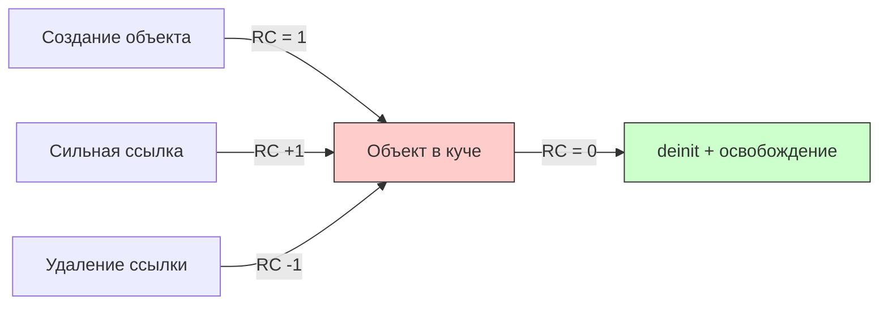
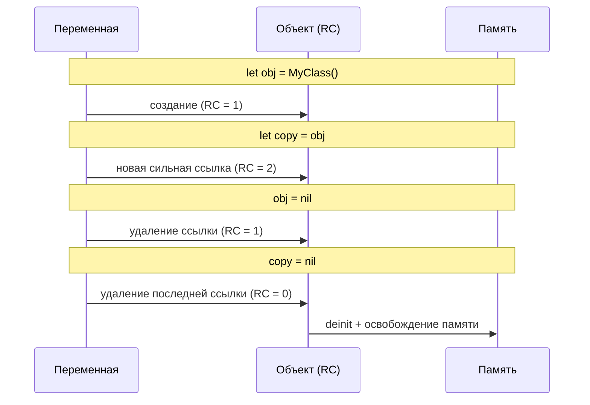

#memory #retain-count #arc #weak #unowned #swift #ios #memory-management

---

### Определение

**Счётчик удержания (retain count)** — это внутренний счётчик, который отслеживает количество **сильных ссылок** (strong references) на объект. Каждый объект в куче ([[heap]]) имеет такой счётчик. Когда счётчик достигает **0**, объект освобождается из памяти — вызывается [[deinit]] и память возвращается системе.



---

### Как работает счётчик удержания в разных эпохах

| Период / язык                        | Управление счётчиком удержания | Основной механизм                          | Нужно ли вручную вызывать retain/release? | Примечание                                            |
| ------------------------------------ | ------------------------------ | ------------------------------------------ | ----------------------------------------- | ----------------------------------------------------- |
| **[[Objective-C]] до [[ARC]] (MRR)** | Ручное                         | [[retain]] / [[release]] / [[autorelease]] | Да, обязательно                           | Очень легко допустить утечки или двойное освобождение |
| **Objective-C + ARC (с 2011)**       | Автоматическое                 | [[ARC]]                                    | Нет                                       | Компилятор вставляет вызовы сам                       |
| **Swift (с самого начала)**          | Автоматическое                 | ARC                                        | Нет, и **запрещено** вызывать вручную     | retain/release не существуют в языке                  |

---

### Как ARC управляет счётчиком в Swift

| Действие | Изменение retain count | Пример |
|---|---|---|
| Создание объекта | 0 → 1 | `let obj = MyClass()` |
| Новая сильная ссылка | +1 | `let copy = obj` |
| Удаление сильной ссылки (nil) | -1 | `obj = nil` |
| Выход из области видимости | -1 | `}` (конец функции) |
| **Retain count = 0** | → **deinit** | Память освобождена |

```swift
class User {
    let name: String
    init(name: String) { self.name = name }
    deinit { print("\(name) → deinit") }
}

var user: User? = User(name: "Анна")   // RC = 1
var copy = user                        // RC = 2
user = nil                             // RC = 1
copy = nil                             // RC = 0 → deinit → "Анна → deinit"
```

---

### Как проверить retain count (только для отладки!)

```swift
import Foundation

class MyClass {}
let obj = MyClass()
let count = CFGetRetainCount(obj)
print("Retain count: \(count)")  // ⚠️ Только для отладки! Не использовать в production!
```

> **Важно:** `CFGetRetainCount` учитывает внутренние оптимизации ARC и может возвращать неожиданные значения (например, 2 для только что созданного объекта). Используйте только для отладки, никогда в production-коде.

---

### Три вида ссылок и их влияние на retain count

| Вид ссылки      | Синтаксис                    | Влияет на retain count? | Зануляется при dealloc? | Самый частый сценарий использования    |
| --------------- | ---------------------------- | ----------------------- | ----------------------- | -------------------------------------- |
| **[[strong]]**  | `var` / `let` (по умолчанию) | Да                      | Нет                     | Обычные свойства, владение объектом    |
| **[[weak]]**    | `weak var`                   | Нет                     | Да (становится [[nil]]) | Разрыв цикла, делегаты, datasource     |
| **[[unowned]]** | `unowned let/var`            | Нет                     | Нет                     | Когда объект точно живёт дольше ссылки |

#### Пример strong
```swift
class Owner {
    var pet: Pet?  // strong — увеличивает RC
}
```

#### Пример weak
```swift
class Pet {
    weak var owner: Owner?  // не увеличивает RC, автоматически станет nil
}
```

#### Пример unowned
```swift
class Pet {
    unowned let owner: Owner  // не увеличивает RC, но не Optional
    init(owner: Owner) {
        self.owner = owner
    }
}
```

---

### Самые частые retain cycle (утечки памяти)

#### 1. Замыкание захватывает [[self]] сильно

```swift
class TimerController {
    var timer: Timer?
    
    func start() {
        // ❌ Замыкание сильно захватывает self → retain cycle
        timer = Timer.scheduledTimer(withTimeInterval: 1.0, repeats: true) { _ in
            self.tick()
        }
    }
    
    func tick() { }
    deinit { print("TimerController deinit") }  // никогда не вызовется
}
```

**Исправление:**
```swift
timer = Timer.scheduledTimer(withTimeInterval: 1.0, repeats: true) { [weak self] _ in
    self?.tick()
}
```

#### 2. Двусторонняя связь parent ↔ child

```swift
class Parent {
    var child: Child?
    deinit { print("Parent deinit") }
}

class Child {
    var parent: Parent?           // ← сильная ссылка → retain cycle!
    deinit { print("Child deinit") }
}

var parent: Parent? = Parent()
var child: Child? = Child()
parent?.child = child
child?.parent = parent

parent = nil
child = nil
// ❌ deinit не вызывается — утечка!
```

**Исправление:**
```swift
class Child {
    weak var parent: Parent?      // ✅ weak разрывает цикл
}
```

---

### Визуализация retain count



---

### Короткий чек-лист (чтобы не было утечек в 2026)

- [ ] Все замыкания внутри классов → **всегда** `[weak self]`
- [ ] Все делегаты, datasource, observers → **всегда** `weak var`
- [ ] Таймеры, [[CADisplayLink]], Notification → `invalidate` / `removeObserver` в `deinit`
- [ ] Parent → Child → strong
      Child → Parent → **weak** или **unowned**
- [ ] В `deinit` добавляй лог:
```swift
deinit { print("🗑 \(type(of: self)) deinit") }
```
Нет лога → почти всегда retain cycle
- [ ] После навигации по экранам → **Memory Graph Debugger** + **Instruments → Leaks**

---

### Итог — главное правило

> **Счётчик удержания в Swift управляется **автоматически** через ARC.  
> `retain` / `release` **не существуют** в языке.  
> Единственная причина утечек — **циклы сильных ссылок**.  
> Разрывай их с помощью `weak` (по умолчанию) или `unowned` (осторожно).  
> `[weak self]` в замыканиях — это твоя главная защита.**

---

### Дополнительно: retain count в Objective-C (для справки)

```objc
// Objective-C MRR (ручное управление) — больше так не пишут
- (void)manualRetainRelease {
    NSString *str = [[NSString alloc] initWithString:@"Hello"];
    [str retain];        // RC = 2
    [str retain];        // RC = 3
    [str release];       // RC = 2
    [str release];       // RC = 1
    [str release];       // RC = 0 → dealloc
}
```

В современном Swift (и Objective-C с ARC) такой код **не нужен** и **недопустим**.