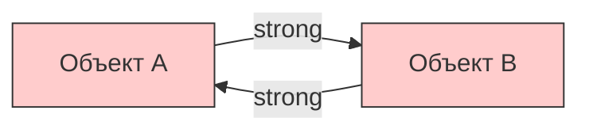
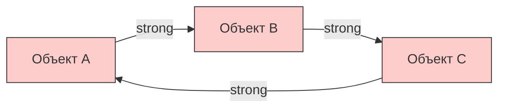
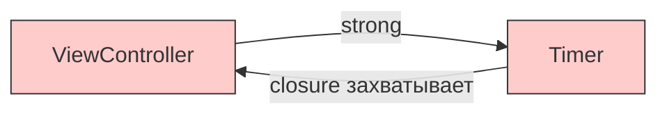
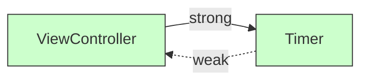
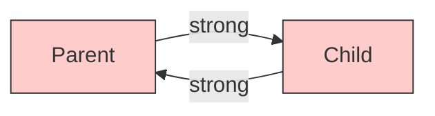
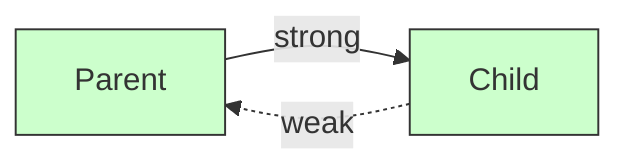

#memory #retain-cycle #weak #unowned #arc #swift #ios #memory-leak

---

### Определение

**Цикл ссылок (retain cycle)** — ситуация, когда два или более объекта **сильно** ([[strong]]) ссылаются друг на друга (или образуют замкнутую цепочку), из-за чего их **[[retain count]]** никогда не становится равным нулю. В результате **[[ARC]] не может освободить** эти объекты → **утечка памяти**.





---

### Самые частые причины циклов в iOS/Swift (2026)

| №   | Сценарий                                  | Как возникает цикл                                | Частота | Как проявляется                                      |
| --- | ----------------------------------------- | ------------------------------------------------- | ------- | ---------------------------------------------------- |
| 1   | **Замыкание захватывает self сильно**     | `{ self.do() }` без `[weak self]`                 | ★★★★★   | Контроллер живёт вечно                               |
| 2   | **Parent ↔ Child (двусторонняя связь)**   | `parent.child = child` и `child.parent = parent`  | ★★★★☆   | Экран/объект не умирает после dismiss                |
| 3   | **Делегат / dataSource сильный**          | `delegate` по умолчанию strong                    | ★★★☆☆   | Контроллер держит делегат, делегат держит контроллер |
| 4   | **[[NotificationCenter]] без отписки**    | Не вызван `removeObserver` в `deinit`             | ★★☆☆☆   | Объект получает события после dealloc                |
| 5   | **[[Timer]] / [[CADisplayLink]] сильный** | `timer = Timer.scheduledTimer…` без `[weak self]` | ★★☆☆☆   | Таймер продолжает тикать вечно                       |

---

### 1. Классический цикл через замыкание (самый частый)

```swift
class ViewController: UIViewController {
    var timer: Timer?
    
    override func viewDidLoad() {
        super.viewDidLoad()
        startTimer()
    }
    
    func startTimer() {
        // ❌ Замыкание сильно захватывает self → цикл!
        timer = Timer.scheduledTimer(withTimeInterval: 1.0, repeats: true) { _ in
            self.tick()
        }
    }
    
    func tick() {
        print("Тик")
    }
    
    deinit {
        timer?.invalidate()
        print("Controller уничтожен")   // никогда не вызовется
    }
}
```



**Как исправить:**

```swift
// ✅ Вариант 1 — weak self (рекомендуется всегда)
timer = Timer.scheduledTimer(withTimeInterval: 1.0, repeats: true) { [weak self] _ in
    self?.tick()
}

// ✅ Вариант 2 — сокращённый синтаксис (Swift 5.3+)
timer = Timer.scheduledTimer(withTimeInterval: 1.0, repeats: true) { [weak self] in
    self?.tick()
}

// ⚠️ Вариант 3 — unowned (только когда 100% уверен)
timer = Timer.scheduledTimer(withTimeInterval: 1.0, repeats: true) { [unowned self] in
    self.tick()
}
```



---

### 2. Parent ↔ Child (двусторонняя связь)

```swift
class Parent {
    var child: Child?
    deinit { print("Parent deinit") }
}

class Child {
    var parent: Parent?           // ← сильная ссылка → цикл!
    deinit { print("Child deinit") }
}

var parent: Parent? = Parent()
var child: Child? = Child()
parent?.child = child
child?.parent = parent

parent = nil
child = nil
// ❌ deinit не вызывается — утечка!
```



**Правильный вариант:**

```swift
class Child {
    weak var parent: Parent?      // ✅ безопасно
    // или
    unowned let parent: Parent    // ⚠️ если parent точно живёт дольше
}
```



---

### 3. Сильный делегат / dataSource

```swift
protocol DataLoaderDelegate: AnyObject {
    func didLoadData()
}

class DataLoader {
    var delegate: DataLoaderDelegate?  // ❌ strong по умолчанию
}

class ViewController: UIViewController, DataLoaderDelegate {
    let loader = DataLoader()
    
    override func viewDidLoad() {
        super.viewDidLoad()
        loader.delegate = self  // retain cycle!
    }
    
    func didLoadData() { }
    
    deinit { print("ViewController deinit") }  // никогда не вызовется
}
```

**Правильный вариант:**

```swift
class DataLoader {
    weak var delegate: DataLoaderDelegate?   // ✅ weak
}
```

---

### 4. NotificationCenter без отписки

```swift
class ViewController: UIViewController {
    override func viewDidLoad() {
        super.viewDidLoad()
        
        // ❌ Подписка без отписки → объект остаётся в памяти
        NotificationCenter.default.addObserver(
            self,
            selector: #selector(handleNotification),
            name: .someNotification,
            object: nil
        )
    }
    
    @objc func handleNotification() { }
    
    deinit { print("ViewController deinit") }  // никогда не вызовется
}
```

**Правильный вариант:**

```swift
deinit {
    NotificationCenter.default.removeObserver(self)
}

// Или с блоком
var observer: NSObjectProtocol?
observer = NotificationCenter.default.addObserver(
    forName: .someNotification,
    object: nil,
    queue: .main
) { [weak self] _ in
    self?.handleNotification()
}

deinit {
    if let observer = observer {
        NotificationCenter.default.removeObserver(observer)
    }
}
```

---

### 5. Timer / CADisplayLink сильный

```swift
class TimerController {
    var timer: Timer?
    
    func start() {
        // ❌ Таймер сильно держит self
        timer = Timer.scheduledTimer(withTimeInterval: 1.0, repeats: true) { _ in
            self.tick()
        }
    }
    
    func tick() { }
    
    deinit { print("TimerController deinit") }  // никогда не вызовется
}
```

**Правильный вариант:**

```swift
timer = Timer.scheduledTimer(withTimeInterval: 1.0, repeats: true) { [weak self] _ in
    self?.tick()
}

deinit {
    timer?.invalidate()
}
```

---

### Как обнаружить циклы ссылок

| Инструмент | Что показывает | Как использовать |
|---|---|---|
| **Memory Graph Debugger** | Визуальный граф ссылок | Debug Navigator → Memory Graph (иконка с тремя квадратами) |
| **Instruments → Leaks** | Объекты, утекшие из памяти | Product → Profile → Leaks |
| **Instruments → Allocations** | Рост памяти и живые объекты | Allocations template |
| **Логи в `deinit`** | Проверка, вызывается ли деинициализатор | `deinit { print("🗑 deinit") }` |

#### Использование Memory Graph Debugger

1. Запустите приложение в Xcode
2. Перейдите на экран, который нужно проверить
3. Нажмите **Debug Memory Graph** (иконка с тремя квадратами)
4. В левой панели найдите объект, который должен был освободиться
5. Выберите его → справа увидите граф ссылок
6. **Красные связи** — retain cycles

---

### Короткий чек-лист (чтобы не было утечек)

- [ ] Все замыкания внутри классов → **всегда** `[weak self]`
- [ ] Все делегаты, datasource, observers → **всегда** `weak var`
- [ ] Все таймеры, CADisplayLink → `[weak self]` + `invalidate` в `deinit`
- [ ] Parent → Child → strong, Child → Parent → **weak** или **unowned**
- [ ] В `deinit` ставь лог:
```swift
deinit { print("🗑 \(type(of: self)) deinit") }
```
Если лог не появляется → 99% retain cycle
- [ ] После навигации по экранам → **Memory Graph Debugger** + **Instruments → Leaks**

---

### Сравнение weak и unowned

| Характеристика | weak | unowned |
|---|---|---|
| **Становится nil** | ✅ Да | ❌ Нет |
| **Optional** | ✅ Всегда | ❌ Non-optional (если `let`) |
| **Безопасность** | ✅ Высокая | ⚠️ Низкая (crash при обращении к мёртвому) |
| **Производительность** | ⚠️ Чуть медленнее | ✅ Быстрее |
| **Когда использовать** | По умолчанию, делегаты | Когда объект гарантированно живёт дольше |

---

### Итог — золотые правила 2026

- **По умолчанию** — `[weak self]` в замыканиях
- **unowned** — только если уверен на 100% в жизненном цикле (обычно parent → child)
- **weak** — безопасно, но требует `?` или `guard let`
- **Никогда** не оставляй сильный захват `self` в замыканиях внутри классов
- **Всегда** проверяй `deinit` при разработке экранов/объектов с замыканиями

**Главное правило**:
> «Если объект живёт дольше, чем должен — почти всегда это **retain cycle** через замыкание или делегат.  
> Пиши `[weak self]` — это бесплатно и спасает от 95% утечек.»