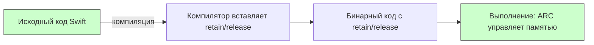

## retain в Swift — Почему этого ключевого слова нет и как работает управление памятью

---
#swift #memory #arc #retain #objective-c #ios #memory-management

---
### Определение

В **[[Swift]]** ключевое слово **`retain`** **не существует** и **никогда не используется**. Управление памятью полностью автоматическое благодаря **[[ARC]] (Automatic Reference Counting)**. Компилятор сам вставляет вызовы `objc_retain` в нужные места, и разработчик не имеет возможности (и не должен) вызывать `retain` вручную.



---

### Swift vs Objective-C: сравнение управления памятью

| Действие / концепция                  | Swift (с ARC)                                 | Objective-C (до ARC / MRR)             | Objective-C (с ARC)      |
| ------------------------------------- | --------------------------------------------- | -------------------------------------- | ------------------------ |
| **Увеличение счётчика ссылок**        | Автоматически при создании сильной ссылки     | `[obj retain]`                         | Автоматически            |
| **Уменьшение счётчика ссылок**        | Автоматически при [[nil]] или выходе из scope | `[obj release]`                        | Автоматически            |
| **Отложенное освобождение**           | Не нужно                                      | `[obj autorelease]`                    | `@autoreleasepool { … }` |
| **Вызов `retain` / [[release]]**      | **Запрещено** и **не компилируется**          | Обязательно вручную                    | Не нужно                 |
| **Счётчик ссылок ([[retain count]])** | Управляется компилятором                      | Управляется разработчиком              | Управляется компилятором |
| **Правила памяти**                    | [[weak]] / [[unowned]] для разрыва циклов     | `retain` / `release` / [[autorelease]] | То же, что в [[Swift]]   |

---

### Примеры: как это выглядит в разных языках

#### Objective-C (MRR — ручное управление, до 2011)

```objc
// ❌ Древний стиль — больше так не пишут
- (void)doSomething {
    NSString *str = [[NSString alloc] initWithString:@"Hello"];
    [str retain];        // ручной retain (счётчик +1)
    // ... используем str ...
    [str release];       // ручной release (счётчик -1)
    [str release];       // ещё один release (баланс с alloc)
}
```

#### Objective-C (ARC — современный стиль)

```objc
// ✅ Современный Objective-C с ARC (как в Swift)
- (void)doSomething {
    NSString *str = [[NSString alloc] initWithString:@"Hello"];
    // retain/release добавляются компилятором автоматически
    // [str retain] — не нужен
    // [str release] — не нужен
}
```

#### Swift (ARC)

```swift
// ✅ Swift — retain не нужен и не существует
func doSomething() {
    let str = String("Hello")
    // retain/release добавляются компилятором автоматически
    // никакого retain в коде нет
}
```

---

### Почему в Swift нет `retain` / `release`

ARC — это **compile-time механизм**: компилятор сам вставляет вызовы `objc_retain` / `objc_release` / `objc_storeStrong` в нужных местах. Разработчик **не имеет доступа** к этим функциям в обычном Swift-коде — это **низкоуровневый API** runtime.

Попытка вызвать `retain` / `release` вручную в Swift приведёт к **ошибке компиляции** или **двойному освобождению** (crash).

```swift
// ❌ Такой код не скомпилируется — retain не существует в Swift
// obj.retain()  // Error: 'retain' is not a member of 'MyClass'
```

**Что делает компилятор вместо вас:**

```swift
// Исходный код
func example() {
    let obj = MyClass()
    use(obj)
}

// Компилятор добавляет (упрощённо):
// let obj = MyClass()
// objc_retain(obj)
// use(obj)
// objc_release(obj)
```

---

### Когда вы всё ещё можете увидеть `retain` / `release` в 2026 году

| Сценарий | Пример | Примечание |
|---|---|---|
| **Legacy Objective-C код без ARC** | `[obj retain];` | Код, не переведённый на ARC |
| **Core Foundation объекты** | `CFRetain(cfObject)` | CF объекты требуют ручного управления |
| **Смешанные проекты с `-fno-objc-arc`** | `[obj retain];` | Отключение ARC для отдельных файлов |

#### Core Foundation пример (требует ручного управления)

```swift
import Foundation

// Core Foundation объекты требуют ручного управления
let cfString = CFStringCreateWithCString(nil, "Hello", kCFStringEncodingUTF8)!
CFRetain(cfString)   // ✅ нужно вызывать CFRetain (не retain)
print(cfString)
CFRelease(cfString)  // ✅ нужно вызывать CFRelease

// Swift объекты не требуют
let swiftString = "Hello"
// retain не нужен и не существует
```

---

### Что используется в Swift вместо `retain`

| Задача | Swift решение |
|---|---|
| **Автоматическое управление памятью** | ARC (делает всё сам) |
| **Разрыв цикла сильных ссылок** | `weak var`, `unowned let` |
| **Проверка освобождения объекта** | Лог в `deinit` |
| **Ручное управление для Core Foundation** | `CFRetain` / `CFRelease` |
| **Отладка утечек** | Memory Graph Debugger, Instruments Leaks |

---

### Сравнительная таблица: Swift (ARC) vs Objective-C (MRR)

| Операция | Swift (ARC) | Objective-C (MRR) |
|---|---|---|
| Создание объекта | `let obj = MyClass()` | `MyClass *obj = [[MyClass alloc] init];` |
| Увеличение RC | Автоматически (при присваивании) | `[obj retain];` |
| Уменьшение RC | Автоматически (при nil или выходе из scope) | `[obj release];` |
| Временное удержание | Не нужно | `[obj autorelease];` |
| Доступ к RC | `CFGetRetainCount(obj)` (только отладка) | `[obj retainCount];` |
| Освобождение | Автоматически | `[obj release];` в `dealloc` |

---

### Ключевые правила для современного Swift (2026)

| Правило | Почему |
|---|---|
| **Никогда не пишите `retain`, `release`, `autorelease` в Swift-коде** | Эти методы не существуют в Swift |
| **Если видите такие вызовы в Swift — это ошибка** | Скорее всего, legacy или неправильный мост |
| **Используйте `weak` / `unowned` для разрыва циклов** | Единственный способ предотвратить retain cycles |
| **Проверяйте `deinit` с логами** | Если не вызывается → цикл сильных ссылок |
| **Для Core Foundation объектов используйте `CFRetain` / `CFRelease` вручную** | Swift не управляет памятью CF объектов |
| **Не пытайтесь «оптимизировать» ARC вручную** | Компилятор делает это лучше |

```swift
// ✅ Правильно: лог в deinit для отладка
class MyViewController: UIViewController {
    deinit {
        print("🗑 \(type(of: self)) deinitialized")
    }
}

// ❌ Неправильно: попытка ручного управления (не скомпилируется)
// class BadClass {
//     func cleanup() {
//         self.retain()  // Error!
//     }
// }
```

---

### Что делать, если объект не освобождается?

1. **Проверь `deinit`** — вызывается ли он?
2. **Используй Memory Graph Debugger** — найди retain cycle
3. **Проверь замыкания** — есть ли `[weak self]`?
4. **Проверь делегаты** — они `weak`?
5. **Проверь таймеры** — вызывается ли `invalidate`?

```swift
// Пример retain cycle и его решение
class BadViewModel {
    var onUpdate: (() -> Void)?
    
    func setup() {
        // ❌ Retain cycle
        onUpdate = {
            self.update()
        }
    }
    
    // ✅ Исправление
    func setupFixed() {
        onUpdate = { [weak self] in
            self?.update()
        }
    }
    
    func update() { }
}
```

---

### Короткий итог

- В **чистом Swift** — `retain` / `release` **не существуют**
- ARC полностью заменяет их — компилятор делает всё сам
- `retain` / `release` встречаются только в:
  - старом Objective-C коде (MRR)
  - Core Foundation (`CFRetain` / `CFRelease`)
  - смешанных проектах с `-fno-objc-arc`

**Главное правило 2026**:
> «Если ты пишешь `retain` или `release` в Swift-коде — ты либо работаешь с legacy, либо с Core Foundation, либо делаешь ошибку.  
> Доверяй ARC, используй `weak` для разрыва циклов и проверяй `deinit`.»